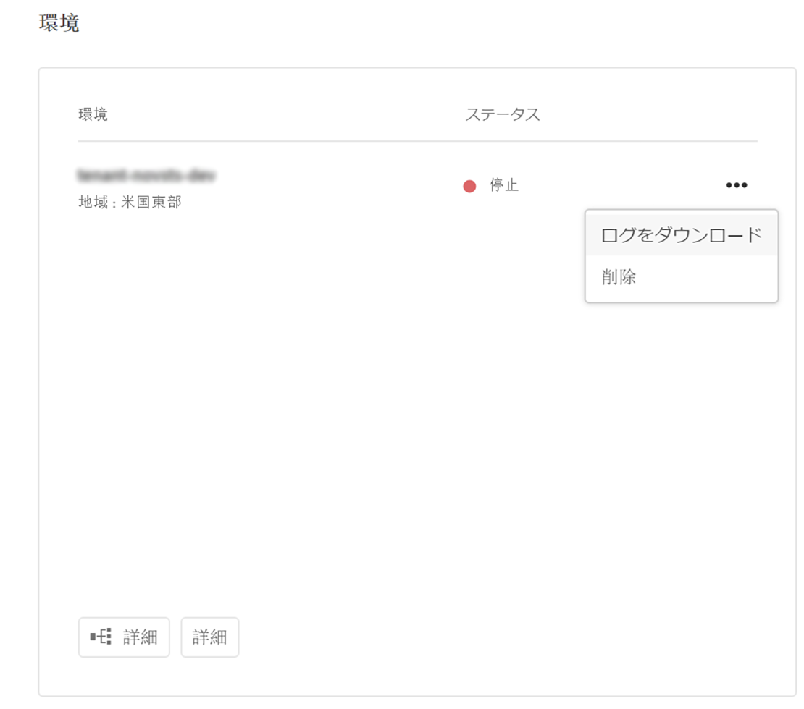

# ログへのアクセスと管理 {#manage-logs}

ユーザーは、環境カードを使用して、選択した環境で使用可能なログファイルのリストにアクセスできます。  ユーザーは、選択した環境で使用可能なログファイルのリストにアクセスできます。

これらのファイルは、概要ページからUIからダウンロードで **きます** 。



または、環境ペ **ージ** :


>[!N注]
>開いている場所に関係なく、同じダイアログが表示され、個々のログファイルをダウンロードできます。


## APIを使用したログ {#logs-thorugh-api}

UIからログをダウンロードする以外に、APIとコマンドラインインターフェイスからもログを使用できます。

例えば、特定の環境用のログファイルをダウンロードする場合、このコマンドは

```java
$ aio cloudmanager:download-logs --programId 5 1884 author aemerror
```

次のコマンドを使用すると、ログのテーリングが可能になります。

```java
$ aio cloudmanager:tail-log --programId 5 1884 author aemerror
```

環境ID（この場合1884）と使用可能なサービスまたはログ名のオプションを取得するには、次を使用します。

```java
$ aio cloudmanager:list-environments
Environment Id Name                     Type  Description                          
1884           FoundationInternal_dev   dev   Foundation Internal Dev environment  
1884           FoundationInternal_stage stage Foundation Internal STAGE environment
1884           FoundationInternal_prod  prod  Foundation Internal Prod environment
 
 
$ aio cloudmanager:list-available-log-options 1884
Environment Id Service    Name         
1884           author     aemerror     
1884           author     aemrequest   
1884           author     aemaccess    
1884           publish    aemerror     
1884           publish    aemrequest   
1884           publish    aemaccess    
1884           dispatcher httpderror   
1884           dispatcher aemdispatcher
1884           dispatcher httpdaccess
```

>[!N注]
>ログダ **ウンロードは** 、UIとAPIの両方から利用できますが、ロ **グテーリングは** API/CLIのみです。
