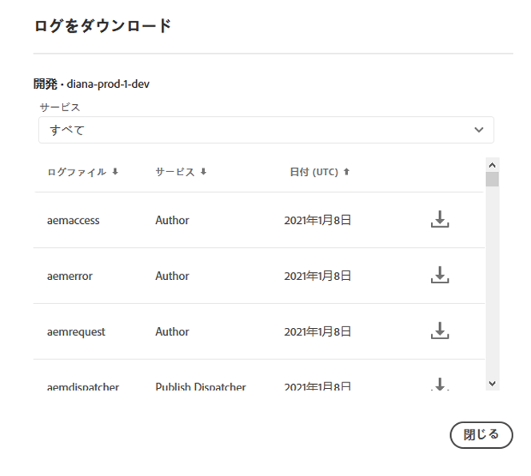

# ログへのアクセスと管理 {#manage-logs}

ユーザーは、環境カードを使用して、選択した環境の使用可能なログファイルのリストにアクセスできます。ユーザーは、選択した環境の使用可能なログファイルのリストにアクセスできます。

これらのファイルは、UI の&#x200B;**概要**&#x200B;ページからダウンロードできます。


また、**環境**&#x200B;ページからもダウンロードできます。


>[!NOTE]
>開く場所によらず、同じダイアログが表示され、個々のログファイルをダウンロードできます。



## プレビューサービス{#download-preview-service}のログのダウンロード

ユーザーは、プレビューサービスのログをダウンロードできます

1. Cloud Managerの&#x200B;**概要**&#x200B;ページから&#x200B;**環境**&#x200B;カードに移動します。

1. ...メニューから「ログをダウンロード」を選択します。

1. 「サービス」ドロップダウンオプションから、「**プレビュー**」または「**Dispatcherのプレビュー**」を選択し、ダウンロードアイコンをクリックします。

   >[!NOTE]
   >このアクションは、環境の詳細ページからも実行できます。

   


## API を介したログの入手 {#logs-through-api}

UI でログをダウンロードする以外に、API やコマンドラインインターフェイスを介してログを入手することもできます。

例えば、特定の環境のログファイルをダウンロードする場合は、次のようなコマンドになります。

```java
$ aio cloudmanager:download-logs --programId 5 1884 author aemerror
```

次のコマンドを使用すると、ログの追跡が可能になります。

```java
$ aio cloudmanager:tail-log --programId 5 1884 author aemerror
```

環境 ID（この例の場合は 1884）と使用可能なサービス名またはログ名のオプションを取得するには、次のコマンドを使用します。

```java
$ aio cloudmanager:list-environments
Environment Id Name                     Type  Description                          
1884           FoundationInternal_dev   dev   Foundation Internal Dev environment  
1884           FoundationInternal_stage stage Foundation Internal STAGE environment
1884           FoundationInternal_prod  prod  Foundation Internal Prod environment
 
 
$ aio cloudmanager:list-available-log-options 1884
Environment Id Service    Name         
1884           author     aemerror     
1884           author     aemrequest   
1884           author     aemaccess    
1884           publish    aemerror     
1884           publish    aemrequest   
1884           publish    aemaccess    
1884           dispatcher httpderror   
1884           dispatcher aemdispatcher
1884           dispatcher httpdaccess
```

>[!NOTE]
>**ログのダウンロードは** UI でも API でも可能ですが、**ログの追跡**&#x200B;は API または CLI でのみ可能です。

### その他のリソース {#resources}

Cloud Manager API と Adobe I/O CLI について詳しくは、次の追加のリソースを参照してください。

* [Cloud Manager API ドキュメント](https://www.adobe.io/apis/experiencecloud/cloud-manager/docs.html)
* [Adobe I/O CLI](https://github.com/adobe/aio-cli-plugin-cloudmanager)
