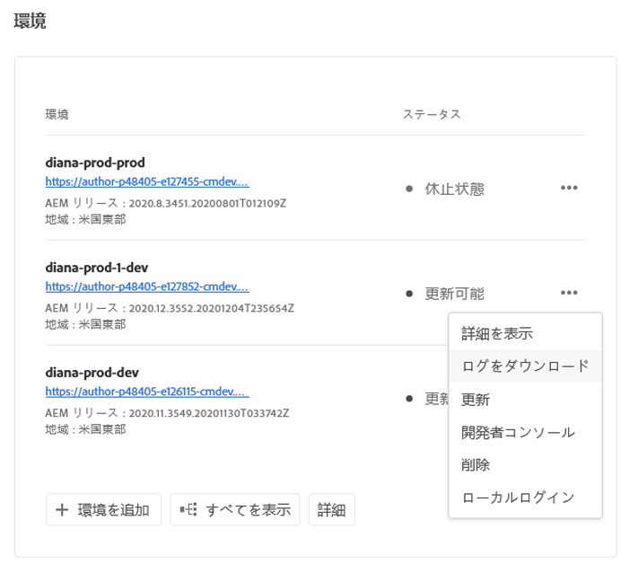
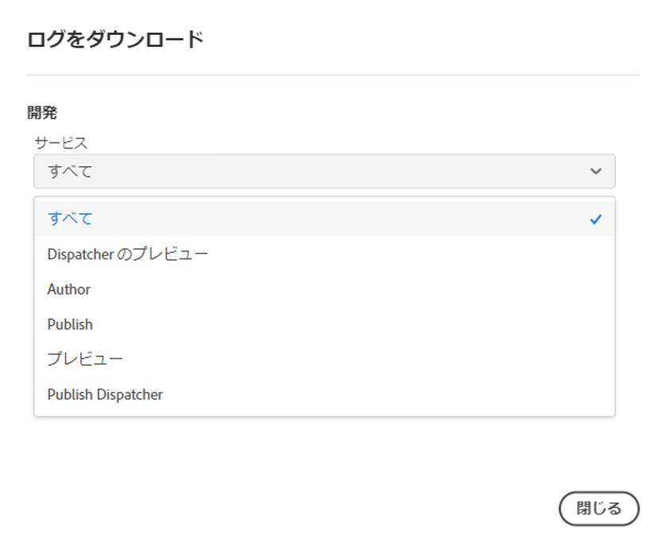
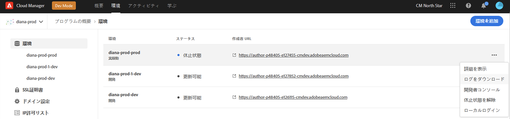

# ログへのアクセスと管理 {#manage-logs}

AEM as a Cloud Serviceで開発プロセスをサポートするためのログにアクセスし、管理する方法について説明します。

選択した環境で使用可能なログファイルのリストにアクセスするには、**概要** ページまたは&#x200B;**環境の詳細** ページの&#x200B;**環境** カードを使用します。

ログは 7 日間保持されます。

## ログのダウンロード {#download-logs}

1. [my.cloudmanager.adobe.com](https://my.cloudmanager.adobe.com/)でCloud Managerにログインし、適切な組織を選択します。

1. **[マイプログラム](/help/implementing/cloud-manager/navigation.md#my-programs)**&#x200B;コンソールで、プログラムを選択します。

1. **概要**&#x200B;ページから&#x200B;**環境**&#x200B;カードに移動します。

1. 省略記号メニューから「**ログをダウンロード**」を選択します。

   

1. **ログをダウンロード** ダイアログボックスで、ドロップダウンメニューから適切な&#x200B;**サービス**&#x200B;を選択します。

   

   環境で[追加のパブリッシュリージョン &#x200B;](/help/operations/additional-publish-regions.md)が有効になっている場合は、以下に示すように、各地域を選択し、そのログを個別にダウンロードできます。

   

1. サービスを選択したら、取得するログの隣にあるダウンロードアイコンをクリックします。

**環境**&#x200B;ページからもログにアクセスできます。



## API経由のログ {#logs-through-api}

ログは、ユーザーインターフェイスに加えて、APIとコマンドラインインターフェイスを通じて使用できます。

特定の環境のログファイルをダウンロードするには、次のようなコマンドを使用します。

```shell
$ aio cloudmanager:download-logs --programId 5 1884 author aemerror
```

また、コマンドラインインターフェイスを使用して、ログにすぐにアクセスすることもできます。

```shell
$ aio cloudmanager:tail-log --programId 5 1884 author aemerror
```

環境ID （この例では1884）と使用可能なサービスまたはログ名オプションを取得するには、次のコマンドを使用します。

```shell
$ aio cloudmanager:list-environments
Environment Id Name                     Type  Description                          
1884           FoundationInternal_dev   dev   Foundation Internal Dev environment  
1884           FoundationInternal_stage stage Foundation Internal STAGE environment
1884           FoundationInternal_prod  prod  Foundation Internal Prod environment
 
 
$ aio cloudmanager:list-available-log-options 1884
Environment Id Service    Name         
1884           author     aemerror     
1884           author     aemrequest   
1884           author     aemaccess    
1884           publish    aemerror     
1884           publish    aemrequest   
1884           publish    aemaccess    
1884           dispatcher httpderror   
1884           dispatcher aemdispatcher
1884           dispatcher httpdaccess
```

### その他のリソース {#resources}

>[!TIP]
>
>AEM as a Cloud Serviceのデバッグについて詳しくは、[このビデオリソース &#x200B;](https://app.frame.io/reviews/28cdf463-b7fc-443b-a54a-93cb7da6567e/dbf158f1-568b-4efc-8fbc-3b241561cbab)をご覧ください。

Cloud Manager APIとAdobe I/O CLIについて詳しくは、次の関連リソースを参照してください。

* [Cloud Manager API ドキュメント](https://developer.adobe.com/experience-cloud/cloud-manager/)
* [ADOBE I/O CLI](https://github.com/adobe/aio-cli-plugin-cloudmanager)

AEM as a Cloud Serviceのログファイルについて詳しくは、次の関連情報を参照してください。

* [Cloud 5 AEM ログファイル](https://experienceleague.adobe.com/en/docs/experience-manager-learn/cloud-service/expert-resources/cloud-5/cloud5-aem-log-files#)
* [ログを使用した AEM as a Cloud Service のデバッグ](https://experienceleague.adobe.com/en/docs/experience-manager-learn/cloud-service/debugging/debugging-aem-as-a-cloud-service/logs#)
