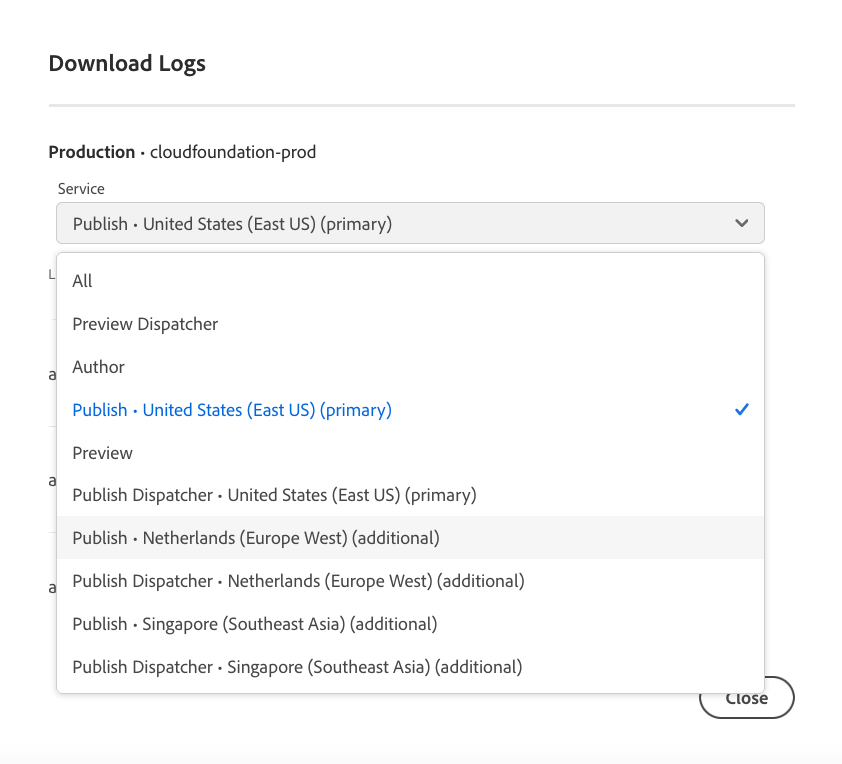

# ログへのアクセスと管理 {#manage-logs}

AEM as a Cloud Service での開発プロセスを支援するために、ログにアクセスして管理する方法について説明します。

**概要**&#x200B;ページまたは環境の詳細ページの&#x200B;**環境**&#x200B;カードを使用して、選択した環境で使用可能なログファイルのリストにアクセスできます。

ログは 7 日間保持されます。

## ログのダウンロード {#download-logs}

ログをダウンロードするには、次の手順を実行します。

1. [my.cloudmanager.adobe.com](https://my.cloudmanager.adobe.com/) で Cloud Manager にログインし、適切な組織を選択します。

1. **[マイプログラム](/help/implementing/cloud-manager/navigation.md#my-programs)**&#x200B;コンソールで、プログラムを選択します。

1. **概要**&#x200B;ページから&#x200B;**環境**&#x200B;カードに移動します。

1. 省略記号メニューから「**ログをダウンロード**」を選択します。

   

1. **ログをダウンロード**&#x200B;ダイアログで、ドロップダウンメニューから適切な&#x200B;**サービス**&#x200B;を選択します。

   

   [&#x200B; 追加の公開地域 &#x200B;](/help/operations/additional-publish-regions.md) が環境で有効になっている場合は、次に示すように、各地域を選択し、そのログを個別にダウンロードできます。

   

1. サービスを選択したら、取得するログの隣にあるダウンロードアイコンをクリックします。

**環境**&#x200B;ページからもログにアクセスできます。


## API を介したログ {#logs-through-api}

UI でログをダウンロードする以外に、API やコマンドラインインターフェイスを介してログを入手することもできます。

特定の環境のログファイルをダウンロードする場合のコマンドは、次のようになります。

```shell
$ aio cloudmanager:download-logs --programId 5 1884 author aemerror
```

また、コマンドラインインターフェイスを使用してログをテールすることもできます。

```shell
$ aio cloudmanager:tail-log --programId 5 1884 author aemerror
```

環境 ID（この例の場合は 1884）と使用可能なサービス名またはログ名のオプションを取得するには、次のコマンドを使用します。

```shell
$ aio cloudmanager:list-environments
Environment Id Name                     Type  Description                          
1884           FoundationInternal_dev   dev   Foundation Internal Dev environment  
1884           FoundationInternal_stage stage Foundation Internal STAGE environment
1884           FoundationInternal_prod  prod  Foundation Internal Prod environment
 
 
$ aio cloudmanager:list-available-log-options 1884
Environment Id Service    Name         
1884           author     aemerror     
1884           author     aemrequest   
1884           author     aemaccess    
1884           publish    aemerror     
1884           publish    aemrequest   
1884           publish    aemaccess    
1884           dispatcher httpderror   
1884           dispatcher aemdispatcher
1884           dispatcher httpdaccess
```

### その他のリソース {#resources}

>[!TIP]
>
>AEM as a Cloud Service のデバッグについて詳しくは、[このビデオリソース](https://app.frame.io/reviews/28cdf463-b7fc-443b-a54a-93cb7da6567e/dbf158f1-568b-4efc-8fbc-3b241561cbab)をご覧ください。

Cloud Manager API と Adobe I/O CLI について詳しくは、次の追加のリソースを参照してください。

* [Cloud Manager API ドキュメント](https://developer.adobe.com/experience-cloud/cloud-manager/)
* [Adobe I/O CLI](https://github.com/adobe/aio-cli-plugin-cloudmanager)

AEM as a Cloud Service のログファイルについて詳しくは、次のその他のリソースを参照してください。

* [Cloud 5 AEM ログファイル](https://experienceleague.adobe.com/ja/docs/experience-manager-learn/cloud-service/expert-resources/cloud-5/cloud5-aem-log-files#)
* [ログを使用した AEM as a Cloud Service のデバッグ](https://experienceleague.adobe.com/ja/docs/experience-manager-learn/cloud-service/debugging/debugging-aem-as-a-cloud-service/logs#)
