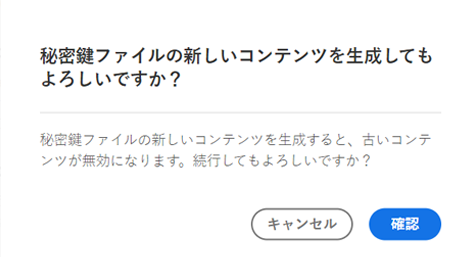
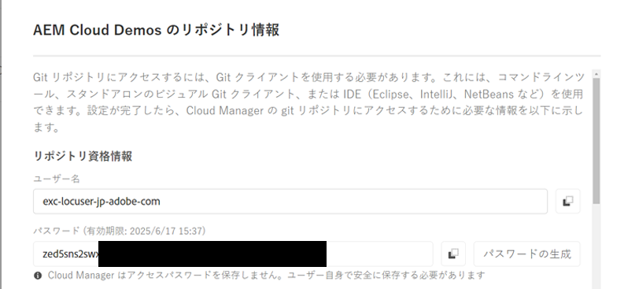

# リポジトリのアクセス情報 {#accessing-repos}

Cloud Manager でセルフサービスの Git アカウント管理を使用して、アドビが管理する Git リポジトリにアクセスして管理する方法について説明します。

## 概要ページからのリポジトリ情報へのアクセス {#overview-page}

Cloud Manager では、パイプラインカードの目立つ位置にある「**リポジトリ情報にアクセス**」ボタンを使用して、アドビが管理するリポジトリのリポジトリアクセス情報を簡単に取得できます。

1. [my.cloudmanager.adobe.com](https://my.cloudmanager.adobe.com/) で Cloud Manager にログインし、適切な組織とプログラムを選択します。

1. **プログラムの概要**&#x200B;ページから&#x200B;**パイプライン**&#x200B;カードに移動します。

   

1. 「**リポジトリ情報にアクセス**」ボタンをタップまたはクリックして、**リポジトリ情報**&#x200B;ダイアログを開き、次の情報を表示します。

   * Git ユーザー名。
   * Git パスワード。
   * Cloud Manager Git リポジトリへの URL。
   * リモートを Git リポジトリにすばやく追加し、コードをプッシュするためのビルド済み Git コマンド。

   

1. パスワードにアクセスするには、新しいパスワードを生成する必要があります。これを行うには、「**パスワードを生成**」ボタンをタップまたはクリックします。

1. **...してもよろしいですか？**&#x200B;と表示されるダイアログで「**パスワードを生成**」をタップまたはクリックして、パスワードの生成を確認します。

   

1. パスワードが生成され、「**パスワード**」フィールドにコピー用に表示されます。

   * パスワードを生成すると、以前のパスワードは無効になります。
   * Cloud Manager はパスワードを保存しません。このパスワードを安全に保存するのはユーザーの責任です。
   * Cloud Manager はパスワードを保存しないので、パスワードが失われた場合は、新しいパスワードを再生成する必要があります。

   

これらの資格情報を使用して、リポジトリのローカルコピーを複製し、そのローカルリポジトリで変更を加えることができます。変更できたら、Cloud Manager のリモートコードリポジトリにコードの変更をコミットして戻すことができます。

>[!NOTE]
>
>* 「**リポジトリ情報にアクセス**」オプションは、**開発者**&#x200B;または&#x200B;**デプロイメントマネージャー**&#x200B;の役割を持つユーザーに表示されます。
>* 「**リポジトリ情報にアクセス**」ボタンをクリックすると、アドビが管理するリポジトリのリポジトリアクセス情報のみが表示されます。[プライベートリポジトリ](private-repositories.md)に関するアクセス情報は、Cloud Manager では利用できません。

## リポジトリウィンドウからのリポジトリ情報へのアクセス {#repositories-window}

[**リポジトリ**&#x200B;ウィンドウのツールバーには、「**リポジトリ情報にアクセス**」ボタンもあります。](managing-repositories.md)アドビが管理するリポジトリへのアクセスに関する、同じ情報が表示されます。

## アクセスパスワードの失効 {#revoke-password}

アクセスパスワードはいつでも失効できます。これを行うには、[このリクエストに対するサポートチケットを作成](https://experienceleague.adobe.com/ja?support-solution=Experience+Manager&amp;support-tab=home#support)してください。

チケットは高い優先度で処理され、1 日以内に失効されます。
