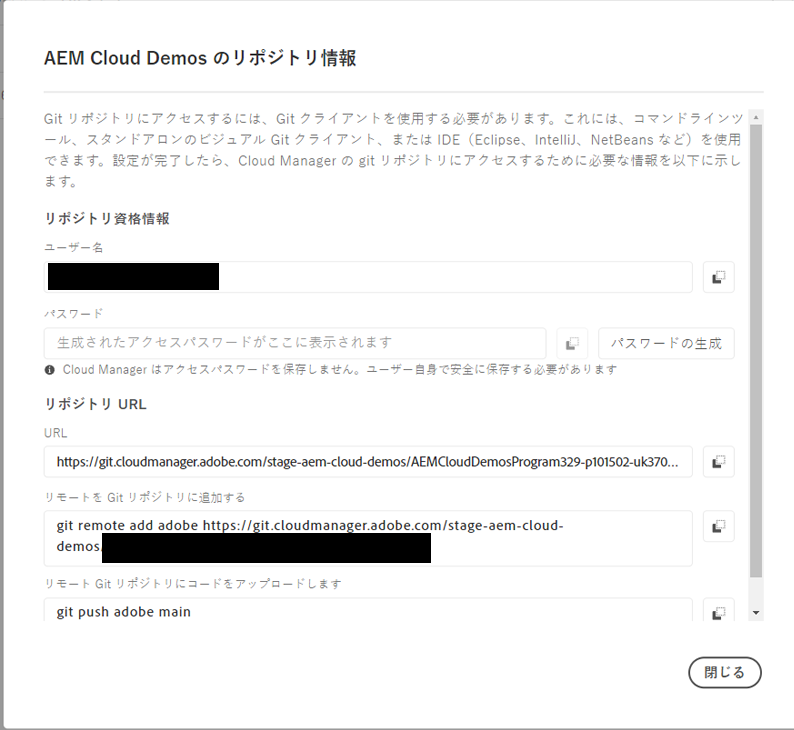
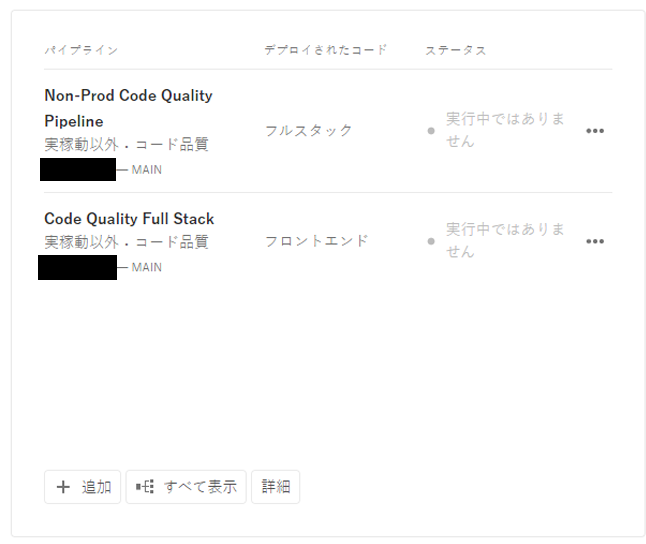
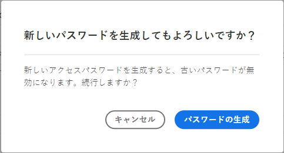

# リポジトリのアクセス情報 {#accessing-repos}

Cloud Manager からセルフサービスの Git アカウント管理を使用し、アドビが管理する Git リポジトリにアクセスして管理する方法について説明します。

## 概要ページからのリポジトリ情報へのアクセス {#overview-page}

Cloud Manager では、**パイプライン**&#x200B;カードの&#x200B;**リポジトリ情報にアクセス**&#x200B;を使用して、アドビが管理するリポジトリのリポジトリアクセス情報を簡単に取得できます。

**リポジトリ情報**&#x200B;ダイアログボックスでは、アドビが管理するリポジトリの次のアクセス情報を確認できます。

* Git ユーザー名。
* Git パスワード。
* Cloud Manager Git リポジトリへの URL。
* リモートを Git リポジトリにすばやく追加し、コードをプッシュするビルド済み Git コマンド。

[プライベートリポジトリ](private-repositories.md)に関するアクセス情報は、Cloud Manager では利用できません。

**リポジトリ情報にアクセス**&#x200B;機能は、**開発者**&#x200B;または&#x200B;**デプロイメントマネージャー**&#x200B;の役割を持つユーザーに表示されます。

**概要ページからリポジトリ情報にアクセスするには：**

1. [my.cloudmanager.adobe.com](https://my.cloudmanager.adobe.com/) で Cloud Manager にログインし、適切な組織とプログラムを選択します。

1. **プログラムの概要**&#x200B;ページの&#x200B;**パイプライン**&#x200B;カードの下にある「**リポジトリ情報にアクセス**」をクリックします。

   

1. パスワードにアクセスするには、新しいパスワードを生成する必要があります。**リポジトリ情報**&#x200B;ダイアログボックスで、「**パスワードを生成**」を選択します。

1. 確認ダイアログボックスで、「**パスワードを生成**」を選択します。

   

1. 「**パスワード**」フィールドの右側にあるをクリックして、パスワードをクリップボードにコピーします。

   * パスワードを生成すると、以前のパスワードは無効になります。
   * Cloud Manager では、パスワードを保存しません。パスワードを安全に保存するのは、ユーザーの責任です。
   * Cloud Manager ではパスワードを保存しないので、パスワードが失われた場合は、新しいパスワードを再生成する必要があります。

   

これらの資格情報を使用して、リポジトリのローカルコピーを複製し、そのローカルリポジトリで変更を加えることができます。変更できたら、Cloud Manager のリモートコードリポジトリにコードの変更をコミットして戻すことができます。

## リポジトリページからのリポジトリ情報へのアクセス {#repositories-window}

**リポジトリ情報にアクセス**&#x200B;機能は、[**リポジトリ**&#x200B;ページ](managing-repositories.md)からも使用できます。アドビが管理するリポジトリへのアクセスに関する同じ情報が表示されます。

## アクセスパスワードの失効 {#revoke-password}

アクセスパスワードはいつでも失効できます。

これを行うには、[このリクエストに対するサポートチケットを作成](https://experienceleague.adobe.com/ja?support-solution=Experience+Manager&support-tab=home#support)します。チケットは高い優先度で処理され、通常は 1 日以内に失効されます。
