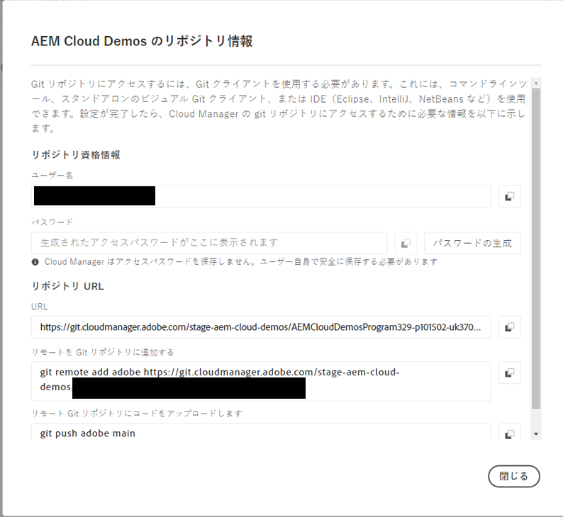
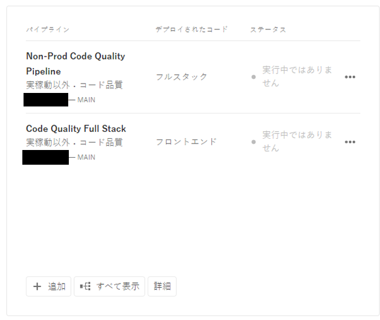
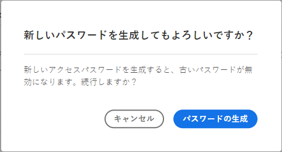

# リポジトリのアクセス情報 {#accessing-repos}

Cloud Manager からセルフサービスの Git アカウント管理を使用し、アドビが管理する Git リポジトリにアクセスして管理する方法について説明します。

## 概要ページからのリポジトリ情報へのアクセス {#overview-page}

Cloud Managerを使用すると、**パイプライン** カードから&#x200B;**リポジトリ情報**&#x200B;にアクセスして、Adobeが管理するリポジトリのリポジトリアクセス情報を取得できます。

**リポジトリ情報**&#x200B;ダイアログボックスでは、アドビが管理するリポジトリの次のアクセス情報を確認できます。

* Git ユーザー名。
* Git パスワード。
* Cloud Manager Git リポジトリへの URL。
* Git リポジトリにリモートを追加し、コードをプッシュするための事前構築済みのGit コマンド。

  

[プライベートリポジトリ](private-repositories.md)に関するアクセス情報は、Cloud Manager では利用できません。

**リポジトリ情報にアクセス**&#x200B;機能は、**開発者**&#x200B;または&#x200B;**デプロイメントマネージャー**&#x200B;の役割を持つユーザーに表示されます。

**概要ページからリポジトリ情報にアクセスするには：**

1. [my.cloudmanager.adobe.com](https://my.cloudmanager.adobe.com/) で Cloud Manager にログインし、適切な組織とプログラムを選択します。

1. **プログラムの概要**&#x200B;ページの&#x200B;**パイプライン**&#x200B;カードの下にある「**リポジトリ情報にアクセス**」をクリックします。

   

1. パスワードにアクセスするには、新しいパスワードを生成する必要があります。 **リポジトリ情報**&#x200B;ダイアログボックスで、「**パスワードを生成**」を選択します。

1. 確認ダイアログボックスで、「**パスワードを生成**」を選択します。

   

1. 「**パスワード**」フィールドの右側にあるをクリックして、パスワードをクリップボードにコピーします。

   * パスワードを生成すると、以前のパスワードは無効になります。
   * Cloud Manager では、パスワードを保存しません。 パスワードを安全に保存します。
   * Cloud Managerではパスワードが保存されないため、パスワードを置き忘れた場合は、新しいパスワードを生成する必要があります。

   

これらの資格情報を使用して、リポジトリのローカルコピーを複製し、そのローカルリポジトリで変更を加え、完了したら、コードの変更をCloud Managerのリモートコードリポジトリに戻すことができます。

## リポジトリページからのリポジトリ情報へのアクセス {#repositories-window}

**リポジトリ情報にアクセス**&#x200B;機能は、[**リポジトリ**&#x200B;ページ](managing-repositories.md)からも使用できます。 アドビが管理するリポジトリへのアクセスに関する同じ情報が表示されます。

## アクセスパスワードの失効 {#revoke-password}

アクセスパスワードはいつでも失効できます。

これを行うには、[このリクエストに対するサポートチケットを作成](https://experienceleague.adobe.com/ja?support-solution=Experience+Manager&support-tab=home#support)します。 チケットは優先的に処理され、パスワードは通常24時間以内に取り消されます。
