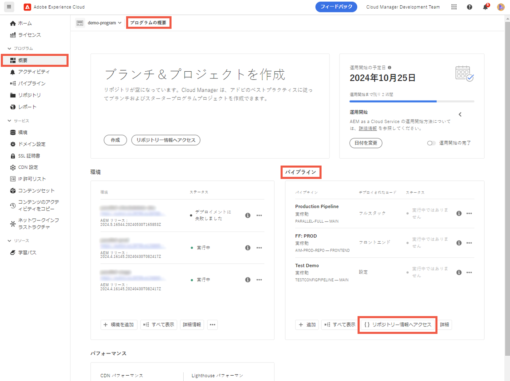

# リポジトリのアクセス情報 {#accessing-repos}

Cloud Manager でセルフサービスの Git アカウント管理を使用して、アドビが管理する Git リポジトリにアクセスして管理する方法について説明します。

## 概要ページからのリポジトリ情報へのアクセス {#overview-page}

Cloud Managerを使用すると、**パイプライン** カードから「リポジトリ情報にアクセス **を使用して、Adobeが管理するリポジトリのリポジトリアクセス情報を簡単に取得でき** す。

**リポジトリ情報** ダイアログボックスでは、Adobeが管理するリポジトリに対する次のアクセス情報を表示できます。

* Git ユーザー名。
* Git パスワード。
* Cloud Manager Git リポジトリへの URL。
* リモートを Git リポジトリにすばやく追加し、コードをプッシュするビルド済み Git コマンド。

[プライベートリポジトリ](private-repositories.md)に関するアクセス情報は、Cloud Manager では利用できません。

**リポジトリー情報にアクセス** 機能は、「開発者 **または** デプロイメントマネージャー **の役割を持つユーザーに表示** れます。

**概要ページからリポジトリ情報にアクセスするには：**

1. [my.cloudmanager.adobe.com](https://my.cloudmanager.adobe.com/) で Cloud Manager にログインし、適切な組織とプログラムを選択します。

1. **プログラムの概要** ページの **パイプライン** カードの下の「**リポジトリー情報へアクセス**」をクリックします。

   

1. パスワードにアクセスするには、新しいパスワードを生成する必要があります。**リポジトリ情報** ダイアログボックスで、「**パスワードを生成**」を選択します。

1. 確認ダイアログボックスで、「**パスワードを生成**」を選択します。

   

1. 「**パスワード**」フィールドの右側にある  をクリックして、パスワードをクリップボードにコピーします。

   * パスワードを生成すると、以前のパスワードは無効になります。
   * Cloud Managerはパスワードを保存しません。 パスワードを安全に保存するのはユーザーの責任です。
   * Cloud Managerはパスワードを保存しないので、パスワードを失った場合は、新しく再生成する必要があります。

   

これらの資格情報を使用して、リポジトリのローカルコピーを複製し、そのローカルリポジトリで変更を加えることができます。変更できたら、Cloud Manager のリモートコードリポジトリにコードの変更をコミットして戻すことができます。

## リポジトリーページからのリポジトリー情報へのアクセス {#repositories-window}

**リポジトリ情報にアクセス** 機能は、[**リポジトリ** ページ &#x200B;](managing-repositories.md) からも使用できます。 アドビが管理するリポジトリへのアクセスに関する同じ情報が表示されます。

## アクセスパスワードの失効 {#revoke-password}

アクセスパスワードはいつでも取り消すことができます。

それには、[&#x200B; このリクエストのサポートチケットを作成 &#x200B;](https://experienceleague.adobe.com/ja?support-solution=Experience+Manager&support-tab=home#support) します。 チケットは優先度が高く処理され、通常は 1 日以内に失効します。
