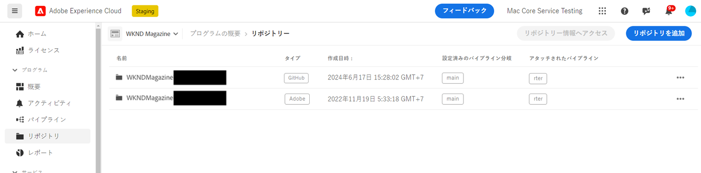
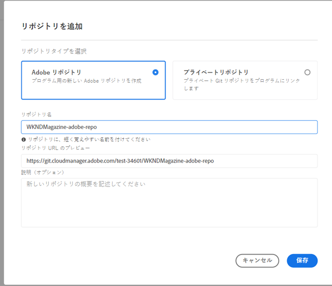

# Cloud Manager での Adobe リポジトリの追加 {#adobe-repositories}

Cloud Manager でアドビが管理するリポジトリを追加する方法について説明します。

**リポジトリ** ページでは、選択したプログラムにAdobeで管理されているリポジトリを追加できます。

**Cloud Manager に Adobe リポジトリを追加するには：**

1. [my.cloudmanager.adobe.com](https://my.cloudmanager.adobe.com/) で Cloud Manager にログインし、アドビが管理するリポジトリを追加する適切な組織とプログラムを選択します。

1. **プログラムの概要** ページのサイドメニューで、 **リポジトリ** タブをクリックします。

1. **リポジトリ**&#x200B;ページの右上付近にある「**リポジトリを追加**」をクリックします。

   

1. **リポジトリを追加**&#x200B;ダイアログボックスで、リポジトリタイプとして「**Adobe リポジトリ**」が選択されていることを確認します。

1. それぞれのテキストフィールドに、次を入力します。

   * **リポジトリ名** - 新しいリポジトリの表現名。
   * **リポジトリ URL プレビュー** - リポジトリインフラストラクチャが既にAdobeによって設定、統合、管理されているため、URL パスを入力したり、既存のパスを編集したりする必要はありません。
   * **説明（オプション）** - リポジトリの詳細な説明。

   

1. **保存**&#x200B;をクリックします。
新しいリポジトリは、**リポジトリ** ページのテーブルに表示されます。

これで、[CI/CD パイプライン](/help/implementing/cloud-manager/configuring-pipelines/introduction-ci-cd-pipelines.md)を関連付けることや、[**リポジトリ**&#x200B;ページ](managing-repositories.md)内で管理することができます。

>[!TIP]
>
>また、自分で管理する GitHub リポジトリを[プライベートリポジトリ](private-repositories.md)として追加することもできます。
