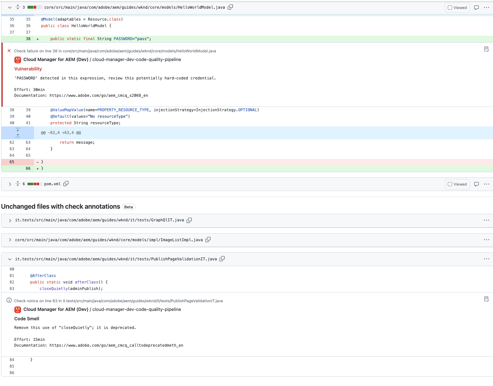

# GitHub チェック注釈 {#github-annotations}

GitHub チェックがプライベートリポジトリの PR に注釈を付けて、役立つフィードバックを提供する方法について説明します。

## 概要 {#overview}

Cloud Manager プログラムに[プライベートリポジトリ](private-repositories.md)を使用している場合は、プルリクエストのたびに GitHub でのチェックが自動的に実行されます。 これらのPRには、コードの問題をできるだけ早く理解するのに役立つ有用な情報が注釈されています。

[SonarQube](/help/implementing/cloud-manager/custom-code-quality-rules.md) によって検出された[コード品質](/help/implementing/cloud-manager/code-quality-testing.md)の問題が明確にリストされます。

イシューを含む正確なコード行が提供され、それを選択して関連するコードを表示できます。 これらの注釈には、プルリクエストの問題だけでなく、コードの問題も含まれます。

注釈付きの行はすべて、GitHub プルリクエストの「**変更済みファイル**」タブに集約されます。 未変更のプルリクエストファイルの注釈は、独自のセクションに表示されます。

## コード品質パイプライン {#code-quality-pipelines}

[ コード品質](/help/implementing/cloud-manager/code-quality-testing.md)の結果は、Cloud Managerが自動的に&#x200B;**チェック** タブの下部にトリガーするパイプラインにも表示されます。 プルリクエストチェックの&#x200B;**Details**&#x200B;からもアクセスできます。

また、問題を CSV 形式で視覚化することもできます。 このCSVを取得するには、[Cloud Managerでのパイプライン実行の詳細](/help/implementing/cloud-manager/configuring-pipelines/managing-pipelines.md#view-details)を表示します。
