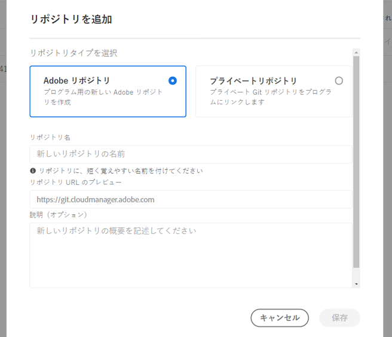
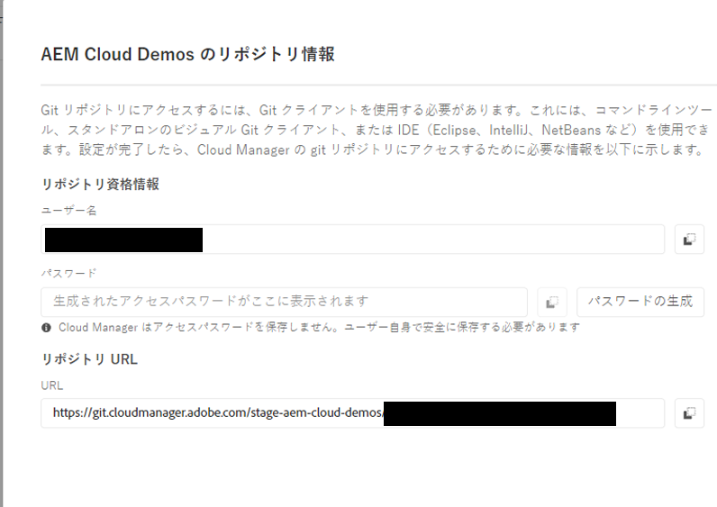
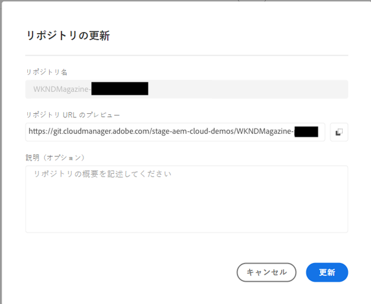
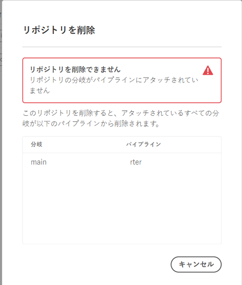

# Cloud Manager でのリポジトリの管理 {#managing-repos}

Cloud Manager で Git リポジトリを作成、表示および削除する方法について説明します。

## 概要 {#overview}

リポジトリは、Git を使用してプロジェクトのコードを保存および管理するために使用されます。Cloud Manager で作成するすべてのプログラムには、アドビが管理するリポジトリが作成されます。

アドビが管理する追加のリポジトリの作成や、独自のプライベートリポジトリの追加を選択できます。プログラムに関連付けられているすべてのリポジトリは、**リポジトリ**&#x200B;ウィンドウで表示できます。

Cloud Manager で作成されたリポジトリは、パイプラインの追加や編集の際にも選択できます。詳しくは、[CI／CD パイプライン](/help/implementing/cloud-manager/configuring-pipelines/introduction-ci-cd-pipelines.md)を参照してください。

どのパイプラインにも、単一のプライマリリポジトリまたはブランチがあります。[Git サブモジュールのサポート](git-submodules.md)を使用すると、ビルド時に多数のセカンダリブランチを含めることができます。

## リポジトリウィンドウ {#repositories-window}

1. [my.cloudmanager.adobe.com](https://my.cloudmanager.adobe.com/) で Cloud Manager にログインし、適切な組織とプログラムを選択します。

1. **プログラムの概要**&#x200B;ページで、「**リポジトリ**」タブをクリックして「**リポジトリ**」ページに切り替えます。

1. **リポジトリ**&#x200B;ウィンドウには、プログラムに関連付けられているすべてのリポジトリが表示されます。

   

**リポジトリ**&#x200B;ウィンドウには、リポジトリに関する次の詳細が表示されます。

* リポジトリのタイプ
   * **アドビ**&#x200B;は、アドビが管理するリポジトリを示します
   * **GitHub**&#x200B;は、ユーザーが管理するプライベート GitHub リポジトリを示します
* 作成日時
* リポジトリに関連付けられているパイプライン

ウィンドウでリポジトリを選択し、省略記号ボタンをクリックすると、選択したリポジトリに対してアクションを実行できます。

* **[ブランチを確認／プロジェクトを作成](#check-branches)**（Adobe リポジトリでのみ使用可能）
* **[リポジトリ URL をコピー](#copy-url)**
* **[表示と更新](#view-update)**
* **[削除](#delete)**

## リポジトリの追加 {#adding-repositories}

**リポジトリ**&#x200B;ウィンドウの「**リポジトリを追加**」ボタンをタップまたはクリックして、**リポジトリを追加**&#x200B;ウィザードを開始します。

Cloud Manager は、アドビが管理するリポジトリ（**Adobe リポジトリ**）と、独自に管理するリポジトリ（**プライベートリポジトリ**）の両方をサポートします。必須フィールドは、追加するリポジトリのタイプによって異なります。詳しくは、次のドキュメントを参照してください。

* [Cloud Manager での Adobe リポジトリの追加](adobe-repositories.md)
* [Cloud Manager でのプライベートリポジトリの追加](private-repositories.md)

>[!NOTE]
>
>* リポジトリを追加するには、**デプロイメントマネージャー**&#x200B;または&#x200B;**ビジネスオーナー**&#x200B;の役割が必要です。
>* 特定の企業または IMS 組織のすべてのプログラムで使用できるリポジトリは 300 個までです。

## リポジトリ情報へアクセス {#repo-info}

**リポジトリ**&#x200B;ウィンドウでリポジトリを表示する際に、ツールバーの「**リポジトリ情報へアクセス**」ボタンをタップまたはクリックすると、アドビが管理するリポジトリにプログラムでアクセスする方法の詳細を表示できます。

**リポジトリ情報**&#x200B;ウィンドウが開き、詳細が表示されます。リポジトリ情報へのアクセスについて詳しくは、[リポジトリ情報へのアクセス](accessing-repos.md)ドキュメントを参照してください。

## 分岐を確認 / プロジェクトを作成 {#check-branches}

**ブランチを確認／プロジェクトを作成**&#x200B;アクションでは、リポジトリの状態に応じて 2 つの機能を実行します。

* リポジトリを新しく作成する場合、アクションにより、[AEM プロジェクトアーキタイプ](https://experienceleague.adobe.com/ja/docs/experience-manager-core-components/using/developing/archetype/overview)に基づいてサンプルプロジェクトが作成されます。
* リポジトリにサンプルプロジェクトが既に作成されている場合は、リポジトリとこのブランチの状態を確認し、サンプルプロジェクトが既に存在するかどうかを報告します。

## リポジトリ URL を作成 {#copy-url}

**リポジトリ URL をコピー**&#x200B;アクションでは、**リポジトリ**&#x200B;ウィンドウで選択したリポジトリの URL をクリップボードにコピーし、他の場所で使用できます。

## 表示と更新 {#view-update}

**表示と更新**&#x200B;アクションでは、**リポジトリを更新**&#x200B;ダイアログを開きます。これを使用すると、**名前**&#x200B;と&#x200B;**リポジトリ URL のプレビュー**&#x200B;を表示し、リポジトリの&#x200B;**説明**&#x200B;を更新できます。

## 削除 {#delete}

**削除**&#x200B;アクションでは、プロジェクトからリポジトリを削除します。リポジトリがパイプラインに関連付けられている場合は、削除できません。

リポジトリを削除すると、次のようになります。

* 削除したリポジトリ名は、今後作成される可能性のある新しいリポジトリに使用できなくなります。
   * このような場合、「`Repository name should be unique within organization.`」というエラーメッセージが表示されます。
* 削除したリポジトリを Cloud Manager で使用不可にし、パイプラインにリンクできないようにします。
