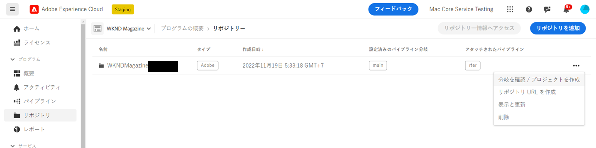
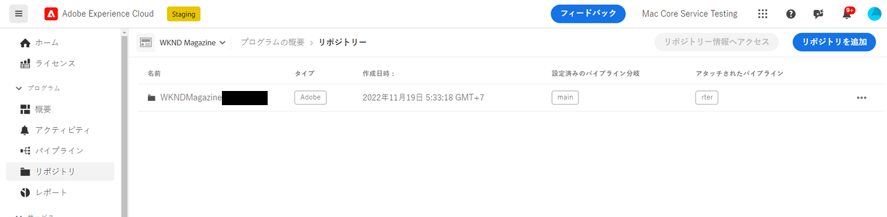
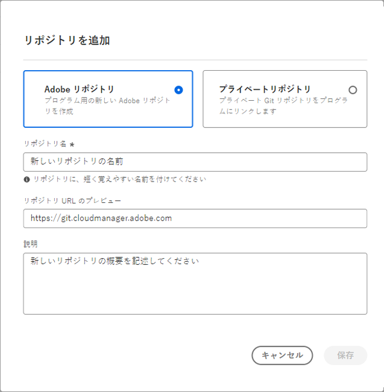
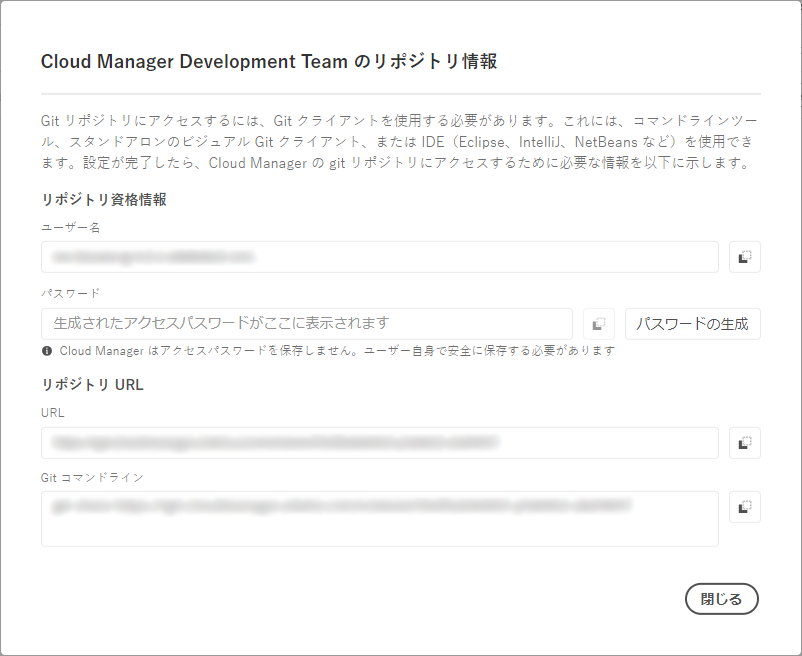
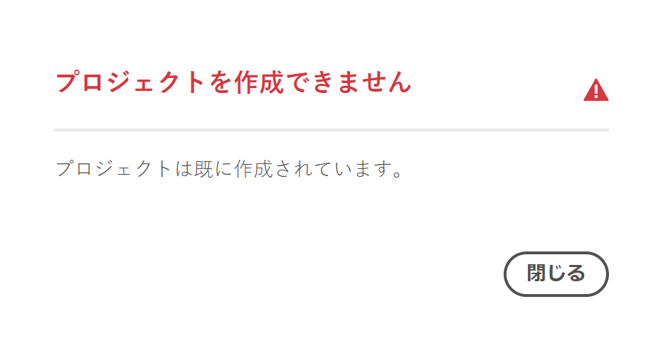
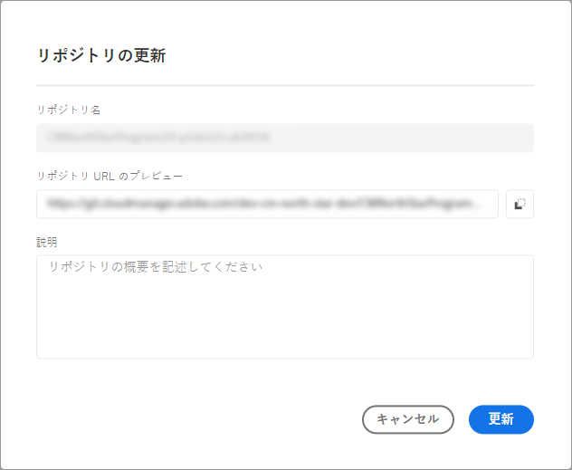
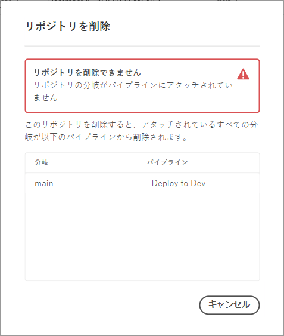

# Cloud Managerでのリポジトリの管理 {#managing-repos}

Cloud Manager で Git リポジトリを表示、追加および削除する方法について説明します。

## Cloud Manager でのリポジトリについて {#overview}

Cloud Manager のリポジトリは、Git を使用してプロジェクトのコードを保存および管理するために使用されます。追加する&#x200B;*プログラム*&#x200B;ごとに、アドビが管理するリポジトリが自動的に作成されます。

さらに、アドビが管理するリポジトリを作成したり、独自のプライベートリポジトリを追加したりできます。プログラムにリンクされているすべてのリポジトリは、**リポジトリ**&#x200B;ページで表示できます。

また、Cloud Manager 内で作成されたリポジトリは、パイプラインの追加や編集の際にも選択できます。パイプラインの設定について詳しくは、[CI/CD パイプライン](/help/implementing/cloud-manager/configuring-pipelines/introduction-ci-cd-pipelines.md)を参照してください。

各パイプラインはプライマリリポジトリまたは分岐にリンクされます。ただし、[Git サブモジュールのサポート](git-submodules.md)を使用すると、ビルドプロセス中に複数のセカンダリ分岐を含めることができます。

## リポジトリページの表示 {#repositories-window}

**リポジトリ**&#x200B;ページでは、選択したリポジトリの詳細を表示できます。この情報には、使用中のリポジトリのタイプが含まれます。リポジトリが **Adobe** としてマークされている場合は、アドビが管理するリポジトリであることを示します。**GitHub** としてラベル付けされている場合は、ユーザーが管理するプライベート GitHub リポジトリを参照します。また、このページには、リポジトリの作成日時や関連付けられているパイプラインなどの詳細が表示されます。

選択したリポジトリに対してアクションを実行するには、リポジトリをクリックし、 を使用してドロップダウンメニューを開きます。アドビが管理するリポジトリの場合は、**[分岐を確認／プロジェクトを作成](#check-branches)**&#x200B;できます。

*リポジトリページのドロップダウンメニュー。*

ドロップダウンメニューで使用可能なその他のアクションには、**[リポジトリ URL をコピー](#copy-url)**、**[表示と更新](#view-update)**、リポジトリを&#x200B;**[削除](#delete)**&#x200B;が含まれます。

**リポジトリページを表示するには：**

1. [my.cloudmanager.adobe.com](https://my.cloudmanager.adobe.com/) で Cloud Manager にログインし、適切な組織とプログラムを選択します。

1. **プログラムの概要**&#x200B;ページのサイドメニューで、「**リポジトリ**」をクリックします。

1. **リポジトリ**&#x200B;ページには、選択したプログラムに関連付けられているすべてのリポジトリが表示されます。

   
   *Cloud Manager のリポジトリページ。*

## リポジトリの追加 {#adding-repositories}

リポジトリを追加するには、**デプロイメントマネージャー**&#x200B;または&#x200B;**ビジネスオーナー**&#x200B;の役割が必要です。

**リポジトリ**&#x200B;ページの右上隅付近にある「**リポジトリを追加**」をクリックします。

*「リポジトリを追加」ダイアログボックス*

Cloud Manager は、アドビが管理するリポジトリ（**Adobe リポジトリ**）と自己管理リポジトリ（**プライベートリポジトリ**）の 2 つのタイプのリポジトリをサポートします。設定の必須フィールドは、追加するリポジトリのタイプによって異なります。詳しくは、次を参照してください。

* [Cloud Manager での Adobe リポジトリの追加](adobe-repositories.md)
* [Cloud Manager でのプライベートリポジトリの追加](private-repositories.md)

特定の企業または IMS 組織のすべてのプログラムで使用できるリポジトリは 300 個までです。

## リポジトリ情報へのアクセス {#repo-info}

**リポジトリ**&#x200B;ウィンドウでリポジトリを表示する際に、ツールバーの「**リポジトリ情報へアクセス**」ボタンをクリックすると、アドビが管理するリポジトリにプログラムでアクセスする方法の詳細を表示できます。

**リポジトリ情報**&#x200B;ウィンドウが開き、詳細が表示されます。リポジトリ情報へのアクセスについて詳しくは、[リポジトリ情報へのアクセス](/help/implementing/cloud-manager/managing-code/accessing-repos.md)を参照してください。

## 分岐を確認 / プロジェクトを作成 {#check-branches}

**AEM Cloud Manager** において、**分岐を確認／プロジェクトを作成**&#x200B;アクションは、リポジトリの現在の状態に応じて 2 つの目的を果たします。

* リポジトリが新しく作成されている場合、このアクションにより、[AEM プロジェクトアーキタイプ](https://experienceleague.adobe.com/ja/docs/experience-manager-core-components/using/developing/archetype/overview)を使用してサンプルプロジェクトが生成されます。
* リポジトリにサンプルプロジェクトが既に作成されている場合、アクションではリポジトリとその分岐のステータスを確認し、サンプルプロジェクトが既に存在するかどうかに関するフィードバックを提供します。

  

## リポジトリ URL を作成 {#copy-url}

**リポジトリ URL をコピー**&#x200B;アクションでは、**リポジトリ**&#x200B;ページで選択したリポジトリの URL を、他の場所で使用できるようクリップボードにコピーします。

## リポジトリの表示と更新 {#view-update}

**表示と更新**&#x200B;アクションでは、**リポジトリを更新**&#x200B;ダイアログボックスが開き、リポジトリの&#x200B;**名前**&#x200B;と&#x200B;**リポジトリ URL のプレビュー**&#x200B;を表示できます。また、リポジトリの&#x200B;**説明**&#x200B;を更新することもできます。

## リポジトリの削除 {#delete}

**削除**&#x200B;アクションでは、プロジェクトからリポジトリを削除します。リポジトリがパイプラインに関連付けられている場合は、削除できません。

リポジトリを削除すると、今後作成される新しいリポジトリにその名前を使用できなくなります。削除されたリポジトリと同じ名前を使用してリポジトリを追加しようとすると、次のエラーメッセージが表示されます。

`Repository name should be unique within organization.`

さらに、削除されたリポジトリは Cloud Manager で使用できなくなり、どのパイプラインにもリンクできなくなります。

