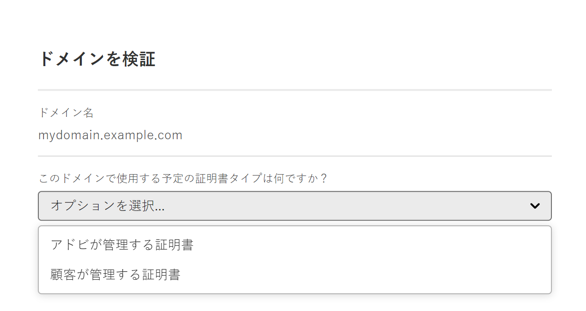
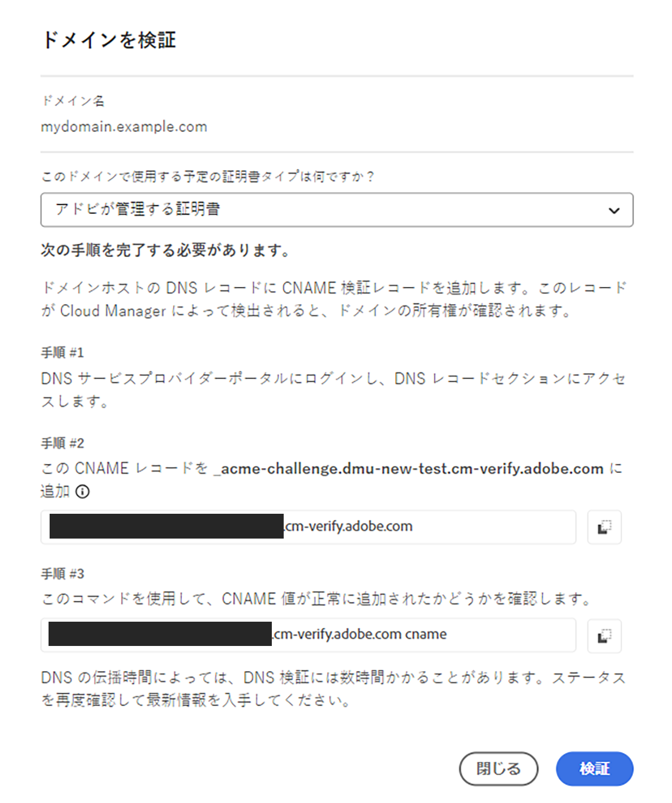
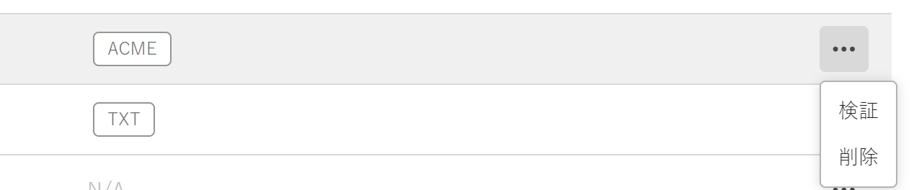

# SSL 証明書の追加

Cloud Manager セルフサービスツールを使用して、お客様が管理する SSL 証明書、またはAdobeが生成および管理する DV （ドメイン検証）証明書を追加する方法について説明します。


## SSL または DV 証明書の追加 {#adding-an-ssl-certificate}

証明書のプロビジョニングには数日かかる場合があります。そのため、Adobeでは、期限や公開日に先立って証明書を適切にプロビジョニングすることをお勧めします。

[SSL 証明書の管理の概要 **の** 証明書要件 ](/help/implementing/cloud-manager/managing-ssl-certifications/introduction.md#requirements) を確認し、追加する証明書がAEM as a Cloud Serviceでサポートされていることを確認してください。

このタスクを完了するには、ユーザーが **ビジネスオーナー** または **デプロイメントマネージャー** の役割のメンバーである必要があります。

>[!NOTE]
>
>DV （ドメイン検証）証明書をアップロードすることはできません。

**SSL または DV 証明書を追加するには：**

1. [my.cloudmanager.adobe.com](https://my.cloudmanager.adobe.com/) で Cloud Manager にログインし、適切な組織を選択します。

1. **[マイプログラム](/help/implementing/cloud-manager/navigation.md#my-programs)**&#x200B;コンソールで、プログラムを選択します。

1. **概要**&#x200B;ページから、**環境**&#x200B;画面に移動します。

1. 左側のナビゲーションパネルの&#x200B;**サービス**&#x200B;で、「**SSL 証明書**」をクリックします。次の画像に示すような左側のナビゲーションパネルが表示されない場合は、左上隅のハンバーガーアイコンをクリックする必要がある場合があります。

   

1. ページの右上隅付近にある「**SSL 証明書を追加**」をクリックします。

1. **SSL 証明書を追加** ダイアログボックスで、特定の使用例に応じて、次のいずれかの操作を行います。

   | ユースケース | 手順 |
   | --- | --- |
   | **Adobe管理証明書（DV）を追加する** | **Adobe管理証明書（DV）を追加するには：**<br> a.証明書の種類 **Adobe管理（DV）** を選択します。<br><br>b.**ドメインを選択** ドロップダウンリストで、DV 証明書に関連付けるドメインを 1 つ以上選択します。<br> 選択するドメインがありませんか？ その場合は、カスタムドメインを追加する必要があります。 [ カスタムドメインの追加 ](#add-custom-domain) を参照してください。 カスタムドメイン名の追加が完了したら、このトピックに戻って手順 1 から再度開始します。<br>d.手順 7 に進みます。 |
   | **顧客管理証明書（OV/EV）の追加** | **顧客管理証明書（OV/EV）を追加するには：**<br> a.証明書のタイプ **顧客管理（OV/EV）** を選択します。<br>b.**証明書名** フィールドに、証明書の名前を入力します。 このフィールドは情報提供のみを目的とし、証明書を簡単に参照するのに役立つ任意の名前を指定できます。<br>c.「**証明書**」、「**秘密鍵**」、「**証明書チェーン**」の各フィールドに、必要な値をそれぞれのフィールドに貼り付けます。<br><br> 値に検出されたエラーが表示されます。 証明書を保存する前に、すべてのエラーを解決する必要があります。 一般的なエラーのトラブルシューティングについて詳しくは、[ 証明書エラー ](#certificate-errors) を参照してください。<br>d.手順 7 に進みます。 |

<!--
    **Add an SSL certificate:**
    1. Select the certificate type **Customer managed (OV/EV)**.
    1. In **Certificate name** field, enter a name for your certificate. This field is for informational purposes only and can be any name that helps you reference your certificate easily.
    1. In the **Certificate**, **Private key**, and **Certificate chain** fields, paste the required values into their respective fields.

        
  
    Any detected errors in values are displayed. Before you can save your certificate, you must address all errors. See [Certificate errors](#certificate-errors) to learn more about troubleshooting common errors.

    **Add a DV certificate:**
    1. Select the certificate type **Adobe managed (DV)**.

        

    1. In the **Select domains** drop-down list, select one or more domains that you want associated with the DV certificate.

        No domains to select? If so, it means that you must add a custom domain. See [Add a custom domain](#add-custom-domain). When you are finished, resume the steps from the beginning again. -->

1. ダイアログボックスの右下隅にある「**保存**」をクリックします。

   証明書が正常に発行されると、前述の画像のように、緑色のチェックマークが表示されます

   

### カスタムドメインの追加 {#add-custom-domain}

Adobeが生成および管理するドメイン検証（DV）証明書を追加する前に、まずカスタムドメインを追加する必要があります。 手順は、「カスタムドメイン名の概要 [ および [ カスタムドメイン名の追加 ](/help/implementing/cloud-manager/custom-domain-names/introduction.md) で説明する手順とほぼ同じ ](/help/implementing/cloud-manager/custom-domain-names/add-custom-domain-name.md) す。 ただし、以下に説明するように、その機能はわずかに拡張されています。

1. カスタムドメイン名を追加する場合は、「**ドメインを検証** ダイアログボックスで、**Adobeが管理する証明書** を選択します。

   

1. **ドメインの検証** ダイアログボックスで、CNAME 検証レコードを DNS に追加します。

   

1. ドメインを作成したら、ドメインのリストの省略記号ボタンをクリックし、「**確認**」を選択してドメインを確認します。

   

1. タスク [DV 証明書の追加 ](#adding-an-ssl-certificate) を再開します。

### 証明書エラーのトラブルシューティング {#certificate-errors}

証明書が正しくインストールされていないか、Cloud Managerの要件を満たしていない場合は、特定のエラーが発生する場合があります。

+++

* **正しい証明書の順序**

  証明書のデプロイに失敗する原因として最もよくあるのは、中間証明書またはチェーン証明書の順序が正しくないことです。

  中間証明書ファイルの末尾は、ルート証明書またはルートに最も近い証明書である必要があります。これらは、`main/server` 証明書からルートへ降順である必要があります。

  中間ファイルの順序は、次のコマンドを使用して決定できます。

  ```shell
  openssl crl2pkcs7 -nocrl -certfile $CERT_FILE | openssl pkcs7 -print_certs -noout
  ```

  秘密鍵と `main/server` 証明書が一致することは、次のコマンドを使用して確認できます。

  ```shell
  openssl x509 -noout -modulus -in certificate.pem | openssl md5
  ```

  ```shell
  openssl rsa -noout -modulus -in ssl.key | openssl md5
  ```

  >[!NOTE]
  >
  >これらの 2 つのコマンドの出力は、完全に同じである必要があります。`main/server` 証明書と一致する秘密鍵が見つからない場合は、新しい CSR を生成するか、更新された証明書を SSL ベンダーに要求して、証明書を再入力する必要があります。

+++

+++

* **クライアント証明書の削除**

  証明書を追加する際に、次のようなエラーが表示される場合があります。

  ```text
  The Subject of an intermediate certificate must match the issuer in the previous certificate. The SKI of an intermediate certificate must match the AKI of the previous certificate.
  ```

  クライアント証明書が証明書チェーンに含まれた可能性があります。チェーンにクライアント証明書が含まれていないことを確認し、もう一度試してください。

+++

+++

* **証明書ポリシー**

  次のエラーが発生した場合は、証明書のポリシーを確認してください。

  ```text
  Certificate policy must conform with EV or OV, and not DV policy.
  ```

  埋め込まれている OID 値は通常、証明書ポリシーを識別します。テキストに証明書を出力し、OID を検索すると、証明書のポリシーが表示されます。

  次の例を参考にして、証明書の詳細をテキストとして出力できます。

  ```text
  openssl x509 -in 9178c0f58cb8fccc.pem -text
  certificate:
      Data:
         Version: 3 (0x2)
         Serial Number:
             91:78:c0:f5:8c:b8:fc:cc
         Signature Algorithm: sha256WithRSAEncryption
         Issuer: C = US, ST = Arizona, L = Scottsdale, O = "GoDaddy.com, Inc.", OU = http://certs.godaddy.com/repository/, CN = Go Daddy Secure Certificate Authority - G2
          Validity
              Not Before: Nov 10 22:55:36 2021 GMT
              Not After : Dec  6 15:35:06 2022 GMT
          Subject: C = US, ST = Colorado, L = Denver, O = Alexandra Alwin, CN = adobedigitalimpact.com
          Subject Public Key Info:
  ...
  ```

  テキスト内の OID パターンは、証明書のポリシータイプを定義します。

  | パターン | ポリシー | Cloud Manager で受け入れ可能 |
  |---|---|---|
  | `2.23.140.1.1` | EV | はい |
  | `2.23.140.1.2.2` | OV | はい |
  | `2.23.140.1.2.1` | DV | いいえ |

  証明書の出力テキストの OID パターンに対して `grep` を実行すると、証明書ポリシーを確認できます。

  ```shell
  # "EV Policy"
  openssl x509 -in certificate.pem -text grep "Policy: 2.23.140.1.1" -B5
  
  # "OV Policy"
  openssl x509 -in certificate.pem -text grep "Policy: 2.23.140.1.2.2" -B5
  
  # "DV Policy - Not Accepted"
  openssl x509 -in certificate.pem -text grep "Policy: 2.23.140.1.2.1" -B5
  ```

+++

+++

* **証明書の有効期限**

  Cloud Manager で想定している SSL 証明書の有効期間は現在の日付から少なくとも 90 日間です。証明書チェーンの有効期限を確認します。

+++

## 次の手順 {#next-steps}

これで、プロジェクトに作業用 SSL 証明書を追加しました。 この手順は、多くの場合、カスタムドメイン名を設定する最初の手順となります。

* カスタムドメイン名を設定するには、[ カスタムドメイン名の追加 ](/help/implementing/cloud-manager/custom-domain-names/add-custom-domain-name.md) を参照してください。
* Cloud Managerでの SSL 証明書の更新および管理について詳しくは、[SSL 証明書の管理 ](/help/implementing/cloud-manager/managing-ssl-certifications/managing-certificates.md) を参照してください。
