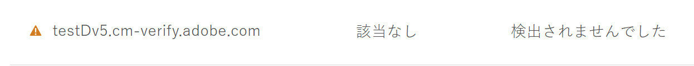
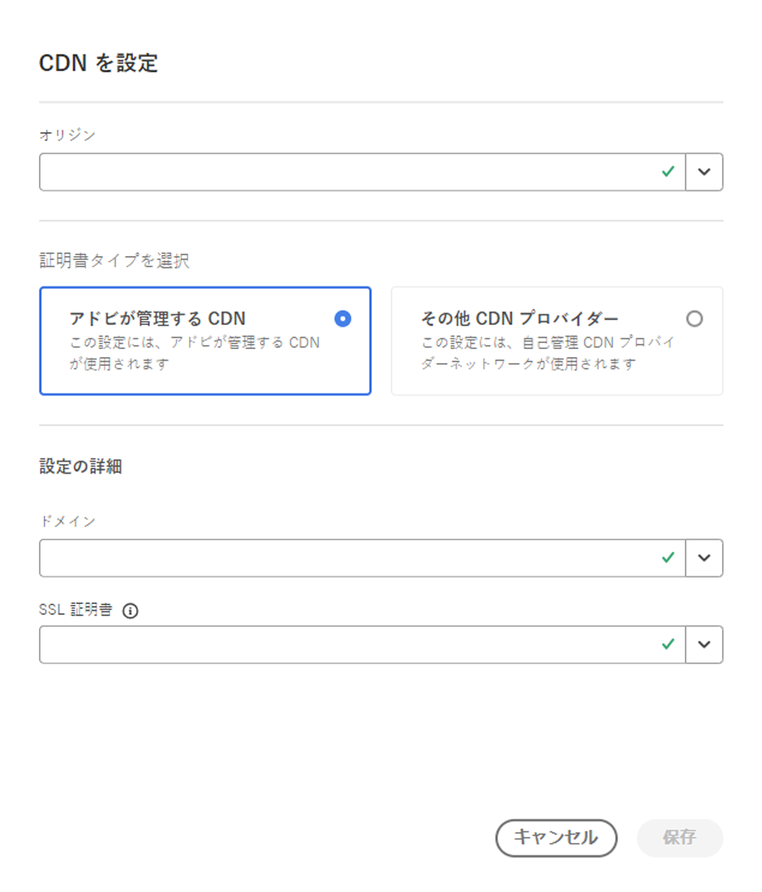

# ドメイン検証済み（DV）証明書 {#domain-validated-certificates}

Cloud Manager でドメイン検証済み（DV）証明書を管理する方法について説明します。

>[!NOTE]
>
>この機能は、[早期導入プログラム](/help/implementing/cloud-manager/release-notes/current.md#early-adoption)でのみ利用できます。

## はじめに {#introduction}

Cloud Manager では、ドメイン検証済み（DV）SSL 証明書をセルフサービスで生成および管理できます。これにより、オンラインビジネス用の安全な web サイトを作成するための、最も高速かつ簡単でコスト効率に優れたソリューションが実現します。

ドメイン検証済み証明書は[実稼動プログラムとサンドボックスプログラム](/help/implementing/cloud-manager/getting-access-to-aem-in-cloud/program-types.md)の両方で利用できます。

## カスタムドメインの追加 {#adding-domain}

ドメイン検証済み（DV）証明書を追加するには、まずカスタムドメインを設定する必要があります。このプロセスは、[カスタムドメイン名の概要ドキュメントで詳しく説明している内容とほとんど同じですが、](/help/implementing/cloud-manager/custom-domain-names/introduction.md)機能が少し拡張されています。

1. ドメインの検証時に、そのドメインでアドビが管理する証明書または自己管理証明書を使用するように選択できます。後で DV 証明書を追加するには、「**アドビが管理する証明書**」を選択します。

   

1. アドビが管理する証明書を使用するには、**ドメインを検証**&#x200B;ダイアログの説明に従って、DNS に CNAME レコードを追加する必要があります。

   

1. ドメインを作成したら、ドメインのリストで省略記号（...）ボタンをタップまたはクリックし、「**検証**」を選択してドメインを検証します。

   

## DV 証明書の追加 {#adding}

ドメインを正しく設定したら、DV 証明書を追加するには、SSL 証明書ウィンドウで「**SSL 証明書を追加**」ボタンをタップまたはクリックします。

1. 「**アドビが管理する（DV）**」オプションを選択します。
1. **ドメインを選択**&#x200B;ドロップダウンでドメイン名を指定します。
1. 「**保存**」をタップまたはクリックします。

証明書が正常に追加されると、**SSL 証明書**&#x200B;ウィンドウで証明書の名前に黄色の警告サインが表示され、証明書のステータスが保留中になります。

証明書が正常に発行されると、**SSL 証明書**&#x200B;ウィンドウで証明書の名前に緑色のチェックマークが付きます。

SSL 証明書の追加と SSL 証明書ウィンドウについて詳しくは、[SSL 証明書の追加](add-ssl-certificate.md)ドキュメントを参照してください。

## CDN 設定の追加 {#add-cdn}

Fastly CDN を使用して SSL でドメインを設定するには、この手順を完了する必要があります。

Cloud Manager を使用して CDN 設定を追加するには、次の手順に従います。

1. [my.cloudmanager.adobe.com](https://my.cloudmanager.adobe.com/) で Cloud Manager にログインし、適切な組織を選択します。

1. 「**CDN 設定**」タブを選択し、ツールバーの「**追加**」をクリックまたはタップします。

1. **CDN を設定**&#x200B;ダイアログで、必要な情報を入力します。

   * **接触チャネル**&#x200B;を選択します。次の選択肢があります。
      * Cloud Service 環境
      * Edge Delivery Services サイト
   * CDN タイプを選択します。
   * ドメインを選択します。
   * SSL 証明書を選択します。
      * アドビが管理する CDN の場合にのみ必要です。

   

>
>
>アドビが管理する CDN の場合、DV 証明書を使用する際は、ACME 検証済みのサイトのみが許可されます。
