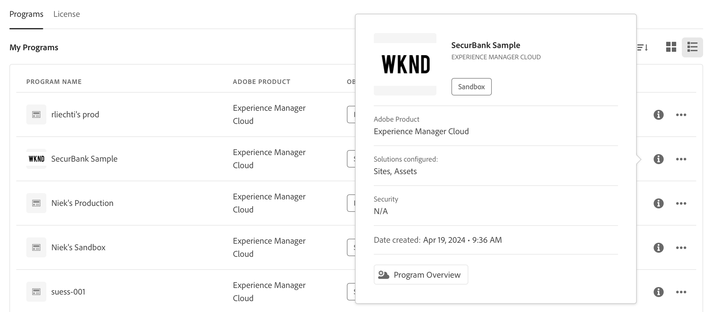

# Cloud Manager UI の操作 {#navigation}

Cloud Manager UI の整理方法と、プログラムと環境を管理する操作方法について説明します。

Cloud Manager UI は、主に次の 2 つのグラフィカルインターフェイスで構成されます。

* [マイプログラムコンソール](#my-programs-console)：すべてのプログラムを表示および管理できます。
* [プログラムの概要ウィンドウ](#program-overview)：個々のプログラムの詳細を確認して管理できます。

>[!TIP]
>
>また、Cloud Manager を使用して AEM as a Cloud Service を導入する方法の完全な概要について詳しくは、[オンボーディングドキュメントジャーニー](/help/journey-onboarding/overview.md)も参照してください。

## マイプログラムコンソール {#my-programs-console}

[my.cloudmanager.adobe.com](https://my.cloudmanager.adobe.com/) で Cloud Manager にログインし、適切な組織を選択すると、**マイプログラム**&#x200B;コンソールが表示されます。

マイプログラムコンソールには、選択した組織でアクセス権を持つすべてのプログラムの概要が表示されます。複数のパーツで構成されます。

1. [ツールバー](#toolbars-my-programs-toolbars)：組織の選択、アラート、アカウント設定を行います。
1. プログラムの現在のビューを切り替えることができるタブ。
   * **ホーム**&#x200B;ビュー（デフォルト）：すべてのプログラムの概要を表示する&#x200B;**マイプログラム**&#x200B;ビューを選択します。
   * **ライセンス**：[ライセンスダッシュボード](/help/implementing/cloud-manager/license-dashboard.md)にアクセスします。
   * タブはデフォルトでは閉じられていますが、[Cloud Manager ヘッダー](#cloud-manager-header)の  を使用して表示できます。
1. [統計とコールトゥアクション](#statistics)：最近のアクティビティの概要を確認します。
1. [**「マイプログラム」**&#x200B;セクション](#my-programs-section)：すべてのプログラムの概要を表示します。
1. [クイックリンク](#quick-links-section)：関連するリソースに簡単にアクセスします。

>[!TIP]
>
>プログラムについて詳しくは、[プログラムとプログラムタイプ](/help/implementing/cloud-manager/getting-access-to-aem-in-cloud/program-types.md)を参照してください。

### ツールバー {#my-programs-toolbars}

2 つのツールバーが重なり合っています。

#### Cloud Manager ヘッダー {#cloud-manager-header}

1 つ目は Cloud Manager ヘッダーで、Cloud Manager を操作する際に保持されます。Cloud Manager プログラム全体に適用される設定と情報にアクセスできるアンカーです。

1. （サイドメニューを表示または非表示）をクリックすると、個々のプログラムの特定の部分に移動できる様々なタブにアクセスできます。または、コンテキストに応じて[ライセンスダッシュボード](/help/implementing/cloud-manager/license-dashboard.md)と&#x200B;**[マイプログラム](#my-programs-console)**&#x200B;コンソールを切り替えることもできます。
1. Adobe Cloud Manager ボタンをクリックすると、Cloud Manager のどこにいても、Cloud Manager のマイプログラムコンソールに戻ります。
1. Cloud Manager に関するフィードバックをアドビに送信するには、「**フィードバック**」をクリックします。
1. 組織セレクターをクリックすると、現在ログインしている組織（この例では、Foundation 内部）が表示されます。Adobe ID が複数の組織に関連付けられている場合、別の組織に切り替えるには、クリックします。
1. （ソリューション切り替えボタン）をクリックすると、他の Experience Cloud ソリューションに素早くジャンプできます。
1.  をクリックすると、学習リソースやサポートリソースに素早くアクセスできます。
1. （[通知](/help/implementing/cloud-manager/notifications.md)）をクリックすると、通知やお知らせなどが表示されます。
1. ユーザー設定へのユーザーアクセスを表すアイコンをクリックします。ユーザー画像が設定されていない場合、アイコンがランダムに割り当てられます。

#### プログラムツールバー {#program-toolbar}

プログラムツールバーには、Cloud Manager プログラムとコンテキストに適したアクションを切り替えるリンクが表示されます。

1. **マイプログラム**&#x200B;セレクターでドロップダウンが開き、他のプログラムをすばやく選択したり、新しいプログラムの作成など、コンテキストに適したアクションを実行したりできます。
1. 「**はじめに**」リンクから、[オンボーディングドキュメントジャーニー](/help/journey-onboarding/overview.md)にアクセスして、Cloud Manager を使い始めることができます。
1. アクションボタンを使用すると、プログラムの追加など、コンテキストに適したアクションを実行できます。

### 統計とコールトゥアクション {#statistics}

統計とコールトゥアクションセクションでは、組織の集計データが提供されます。例えば、プログラムを正常に設定した場合、過去 90 日間のアクティビティの統計には、次の内容が表示されることがあります。

* [デプロイ](/help/implementing/cloud-manager/deploy-code.md)数
* 特定された[コード品質の問題](/help/implementing/cloud-manager/code-quality-testing.md)の数
* ビルド数

組織の設定を開始したばかりの場合は、次の手順やドキュメントのリソースに関するヒントが表示される場合があります。

### 「マイプログラム」セクション {#my-programs-section}

**マイプログラム**&#x200B;コンソールの主なコンテンツは、「**マイプログラム**」セクションのプログラムのリストです。

「**マイプログラム**」セクションには、各プログラムを表すカードが一覧表示されます。カードをクリックすると、**プログラムの概要**&#x200B;ページにアクセスしてプログラムの詳細を確認できます。

>[!NOTE]
>
>権限によっては、特定のプログラムを選択できない場合があります。

必要なプログラムをより簡単に見つけるには、並べ替えオプションを使用します。

* 並べ替え：
   * **作成日**（デフォルト）
   * **プログラム名**
   * **ステータス**
*  昇順（デフォルト）／ 降順
*  グリッド表示（デフォルト）
*  リスト表示

#### プログラムカード {#program-cards}

すべてのプログラムはカード（またはテーブルの行）で表され、プログラムの概要と、アクションを実行するクイックリンクを提供します。

* プログラムに関連付けられた画像（設定されている場合）。上記の画像は「WKND」です。
* プログラムに割り当てられた名前。上記の画像は、プログラム名として「SecurBank Sample」を示しています。
* サービスタイプ：
   * **Experience Manager Cloud** - AEM as a Cloud Service プログラム用
   * **Experience Manager** - [AMS（Adobe Managed Services）プログラム](https://experienceleague.adobe.com/ja/docs/experience-manager-cloud-manager/content/introduction)用
* [プログラムタイプ](/help/implementing/cloud-manager/getting-access-to-aem-in-cloud/program-types.md)：
   * サンドボックス
   * 実稼動
* ステータス。上記の画像では、ステータスはチェックマークが付いた準備完了です。
* 設定済みのソリューション。上記の画像では、Sites とAssets は設定済みのソリューションです。
* 作成日。

実稼動プログラムには、追加時に選択した次のような追加機能を示すバッジが付けられる可能性があります。

*  [HIPAA](/help/implementing/cloud-manager/getting-access-to-aem-in-cloud/creating-production-programs.md#security)

*  [WAF-DDOS 保護](/help/implementing/cloud-manager/getting-access-to-aem-in-cloud/creating-production-programs.md#security)

* [99.99% の SLA（サービスレベル契約）](/help/implementing/cloud-manager/getting-access-to-aem-in-cloud/creating-production-programs.md#sla)

また、情報アイコンを使用すると、プログラムに関する追加情報にすばやくアクセスできます（リスト表示で役立ちます）。

 アイコンを使用すると、プログラムに対して実行できる追加のアクションにアクセスできます。

* プログラムの特定の  [環境](/help/implementing/cloud-manager/manage-environments.md)に移動
*  [プログラムの概要](#program-overview) を開く
*  [プログラムを編集](/help/implementing/cloud-manager/getting-access-to-aem-in-cloud/editing-programs.md#editing)
*  [サンドボックスプログラムを削除](/help/implementing/cloud-manager/getting-access-to-aem-in-cloud/editing-programs.md#delete-sandbox-program)

>[!TIP]
>
>プログラムと、プログラムの追加と管理について詳しくは、次を参照してください。
>
>* [プログラムとプログラムタイプ](/help/implementing/cloud-manager/getting-access-to-aem-in-cloud/program-types.md)
>* [実稼動プログラムの作成](/help/implementing/cloud-manager/getting-access-to-aem-in-cloud/creating-production-programs.md)
>* [サンドボックスプログラムの作成](/help/implementing/cloud-manager/getting-access-to-aem-in-cloud/creating-sandbox-programs.md)

### 「クイックリンク」セクション {#quick-links-section}

「クイックリンク」セクションでは、一般的に使用される関連リソースにアクセスできます。

## プログラムの概要ページ {#program-overview}

**[マイプログラム](#my-programs-console)**&#x200B;コンソールでプログラムを選択すると、**プログラムの概要**&#x200B;ページに移動できます。

プログラムの概要では、Cloud Manager プログラムのすべての詳細にアクセスできます。**マイプログラム**&#x200B;コンソールと同様に、複数のパーツで構成されます。

1. [ツールバー](#program-overview-toolbar)：マイプログラムコンソールにすばやく戻ったり、プログラム内を移動したりできます。
1. [タブ](#program-tabs)：プログラムの様々な側面を切り替えることができます。
1. [コールトゥアクション](#cta)：プログラムの最後のアクションに基づきます。
1. [環境の概要](#environments)：プログラムの環境について。
1. [パイプラインの概要](#pipelines)：プログラムのパイプラインについて。
1. [パフォーマンスの概要](#performance)：プログラムのパフォーマンスについて。
1. [役立つリソース](#useful-resources)：リンク先が含まれます。

### ツールバー {#program-overview-toolbar}

プログラムの概要のツールバーは、[マイプログラムコンソール](#my-programs-toolbars)のツールバーと類似しています。ここでは違いのみを説明します。

#### Cloud Manager ヘッダー {#cloud-manager-header-2}

ページの左上隅に Adobe Cloud Manager ヘッダーがあります。 をクリックすると、ソフトウェアの他の領域へのタブのサイドメニューを表示または非表示にすることができます。

「Adobe Cloud Manager」をクリックして、ホームに戻ります。

#### プログラムツールバー {#program-toolbar-2}

プログラムツールバーを使用すると、他のプログラムにすばやく切り替えることができますが、プログラムの追加や編集など、コンテキストに適したアクションにもアクセスできます。

 を使用してタブを非表示にしている場合でも、ツールバーには常に現在開いているタブが表示されます。

### プログラムタブ {#program-tabs}

各プログラムには、多数のオプションとデータが関連付けられています。これらのオプションとデータはタブに集められ、プログラムの操作が簡単になります。タブを使用すると、次にアクセスできます。

**プログラム**

*  概要 - 現在のドキュメントに記載されているプログラムの概要
*  [アクティビティ](/help/implementing/cloud-manager/configuring-pipelines/managing-pipelines.md#activity) - プログラムのパイプライン実行の履歴
*  [パイプライン](/help/implementing/cloud-manager/configuring-pipelines/managing-pipelines.md#pipelines) - プログラムに対して設定されたすべてのパイプライン
*  [リポジトリ](/help/implementing/cloud-manager/managing-code/managing-repositories.md) - プログラムに対して設定されたすべてのリポジトリ
*  [レポート](/help/implementing/cloud-manager/sla-reporting.md) - SLA データなどの指標

**サービス**

*  [環境](/help/implementing/cloud-manager/manage-environments.md) - プログラムに対して設定されたすべての環境
*  [Edge Delivery サイト](/help/implementing/cloud-manager/edge-delivery/introduction-to-edge-delivery-services.md) - Edge Delivery サイトの管理
*  [ドメイン設定](/help/implementing/cloud-manager/custom-domain-names/introduction.md) - プログラムのカスタムドメイン名の管理
*  [SSL 証明書](/help/implementing/cloud-manager/managing-ssl-certifications/introduction-to-ssl-certificates.md) - プログラムの SSL 証明書の管理
* [ ドメインマッピング ](/help/implementing/cloud-manager/custom-domain-names/introduction.md) - ドメインマッピングの管理
*  [IP 許可リスト](/help/implementing/cloud-manager/ip-allow-lists/introduction.md) - 特定の IP アドレスの許可リストの定義
*  [コンテンツセット](/help/implementing/developing/tools/content-copy.md) - コピー目的に対して作成されたコンテンツのセット
*  [コンテンツをコピーアクティビティ](/help/implementing/developing/tools/content-copy.md) - コンテンツをコピーするアクティビティ
*  [ネットワークインフラストラクチャ](/help/security/configuring-advanced-networking.md) - プログラムの高度なネットワークオプションの管理

**リソース**

*  学習パス - Cloud Manager に関するその他の学習リソース

デフォルトでは、プログラムを開くと、「**概要**」タブが表示されます。現在のタブがハイライト表示されます。別のタブを選択すると、その詳細が表示されます。

[Cloud Manager ヘッダー](#cloud-manager-header-2)の左上隅にある  をクリックして、タブのサイドメニューを表示または非表示にします。

### コールトゥアクション {#cta}

「コールトゥアクション」セクションでは、プログラムのステータスに応じて役立つ情報を提供します。新しいプログラムの場合は、次の手順が提供されるほか、[プログラム作成時に設定](/help/implementing/cloud-manager/getting-access-to-aem-in-cloud/editing-programs.md)された公開日のリマインダーが表示される場合があります。

ライブプログラムの場合、最後のデプロイメントのステータスと、詳細および新しいデプロイメントを開始するためのリンクが表示されます。

### 環境カード {#environments}

**環境**&#x200B;カードには、環境の概要とクイックアクションへのリンクが表示されます。

**環境**&#x200B;カードには 3 つの環境のみ表示されます。 **すべてを表示** をクリックして、プログラムのすべての環境を表示します。

詳しくは、[環境の管理](/help/implementing/cloud-manager/manage-environments.md)も参照してください。

### パイプラインカード {#pipelines}

**パイプライン**&#x200B;カードには、パイプラインの概要とクイックアクションへのリンクが表示されます。

**パイプライン**&#x200B;カードには 3 つのパイプラインのみ表示されます。**すべてを表示** をクリックして、プログラムのすべてのパイプラインを表示します。

パイプラインの管理方法について詳しくは、[パイプラインの管理](/help/implementing/cloud-manager/configuring-pipelines/managing-pipelines.md)も参照してください。

### パフォーマンスカード {#performance}

**パフォーマンス**&#x200B;カードを使用すると、**[CDN ダッシュボード](/help/implementing/cloud-manager/cdn-performance.md)**&#x200B;の概要を確認できます。

### 役立つリソース {#useful-resources}

「**役立つリソース**」セクションには、Cloud Manager のその他の学習リソースへのリンクが含まれます。
