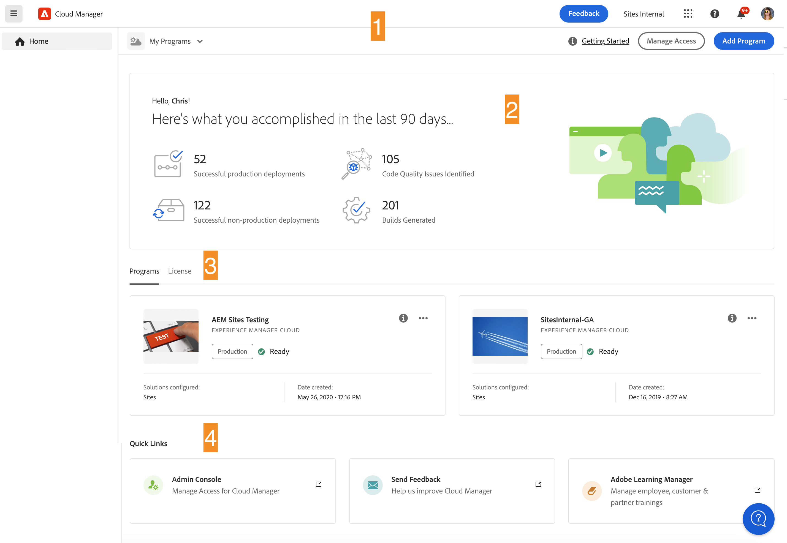
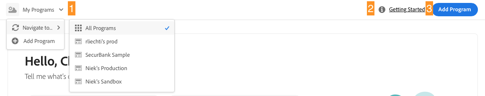
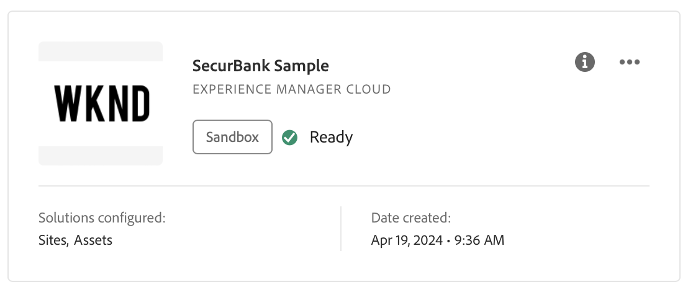
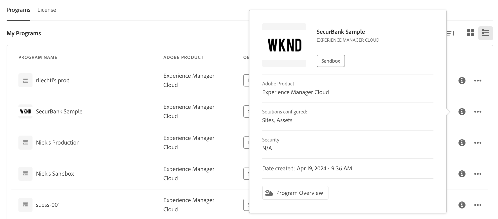
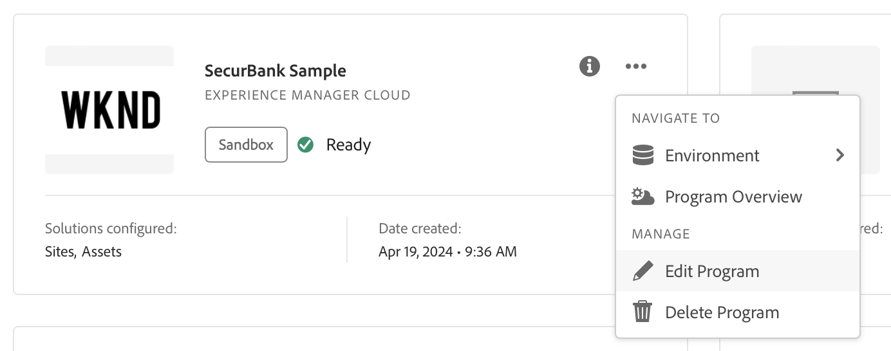
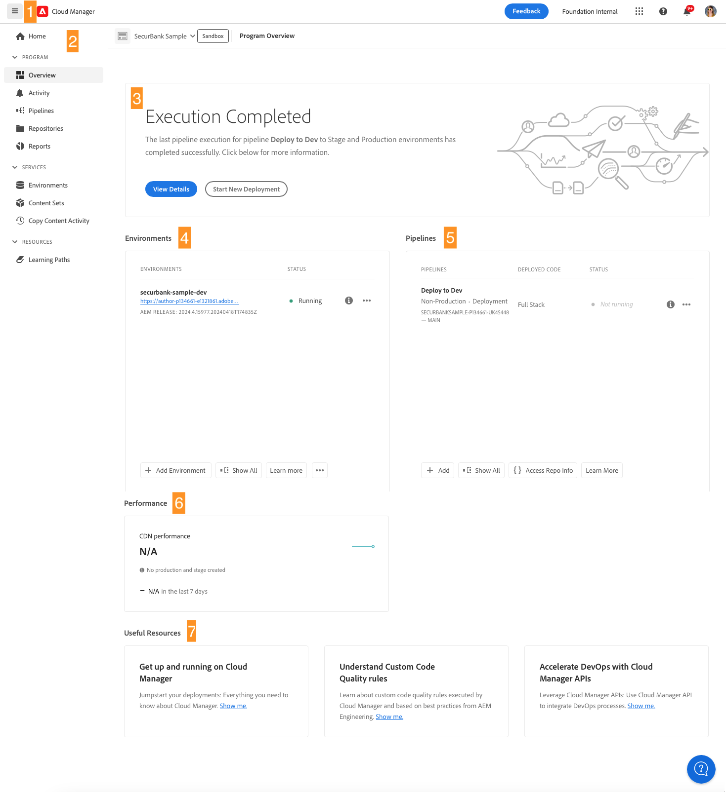
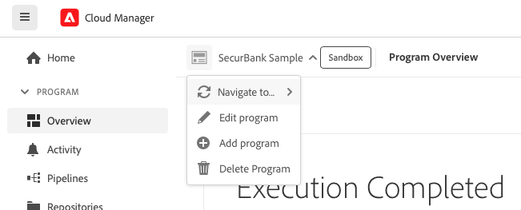

# Cloud Manager UI の操作 {#navigation}

Cloud Manager UI の整理方法と、プログラムと環境を管理する操作方法について説明します。

Cloud Manager UI は、主に次の 2 つのグラフィカルインターフェイスで構成されます。

* [マイプログラムコンソール](#my-programs-console)：すべてのプログラムを表示および管理できます。
* [プログラムの概要ウィンドウ](#program-overview)：個々のプログラムの詳細を確認して管理できます。

>[!TIP]
>
>Cloud Managerを使用してAEM as a Cloud Serviceをすばやく開始する方法の詳細については、[&#x200B; オンボーディングドキュメントのjourney](/help/journey-onboarding/overview.md)を参照してください。

## AEM の AI アシスタント

[前提条件の基準を満たした](/help/implementing/cloud-manager/ai-assistant-in-aem.md#get-access)お客様の組織内のユーザーは、AEM の AI アシスタントを使用できます。 [AEM の AI アシスタント](/help/implementing/cloud-manager/ai-assistant-in-aem.md)を参照してください。

## マイプログラムコンソール {#my-programs-console}

[my.cloudmanager.adobe.com](https://my.cloudmanager.adobe.com/)でCloud Managerにログインし、適切な組織を選択すると、**マイプログラム** コンソールに到達します。

マイプログラムコンソールには、選択した組織でアクセス権を持つすべてのプログラムの概要が表示されます。 それは次の部分で構成されています：

1. [ツールバー](#toolbars-my-programs-toolbars)：組織の選択、アラート、アカウント設定を行います。
1. プログラムの現在のビューを切り替えることができるタブ。
   * **ホーム**&#x200B;ビュー（デフォルト）：すべてのプログラムの概要を表示する&#x200B;**マイプログラム**&#x200B;ビューを選択します。
   * **ライセンス**：[ライセンスダッシュボード](/help/implementing/cloud-manager/license-dashboard.md)にアクセスします。
   * タブはデフォルトでは閉じられていますが、[Cloud Manager ヘッダー](#cloud-manager-header)の  を使用して表示できます。
1. [統計とコールトゥアクション](#statistics)：最近のアクティビティの概要を確認します。
1. [**「マイプログラム」**&#x200B;セクション](#my-programs-section)：すべてのプログラムの概要を表示します。
1. [クイックリンク](#quick-links-section)：関連するリソースに簡単にアクセスします。

>[!TIP]
>
>プログラムについて詳しくは、[プログラムとプログラムタイプ](/help/implementing/cloud-manager/getting-access-to-aem-in-cloud/program-types.md)を参照してください。

### ツールバー {#my-programs-toolbars}

2つの積み重ねツールバーがあります。

#### Experience Platformの上部ナビゲーションバー {#cloud-manager-header}

1つ目は、Experience Platformの上部ナビゲーションバーです。これは、Cloud Managerのナビゲーション中に永続的に表示されます。 Cloud Manager プログラム全体に適用される設定と情報にアクセスできるアンカーです。

*  （表示または非表示のサイドメニュー）を使用すると、個々のプログラムの特定の部分に移動できる様々なタブにアクセスできます。 または、コンテキストに応じて[ライセンスダッシュボード](/help/implementing/cloud-manager/license-dashboard.md)と&#x200B;**[マイプログラム](#my-programs-console)**&#x200B;コンソールを切り替えることもできます。
*  （[通知](/help/implementing/cloud-manager/notifications.md)）を使用すると、通知や通知などにアクセスできます。

Experience Platformの上部のナビゲーションバーについて詳しくは、[Adobe Experience Platform UI ガイド &#x200B;](https://experienceleague.adobe.com/en/docs/experience-platform/landing/platform-ui/ui-guide#top-navigation-bar)を参照してください。

#### プログラムツールバー {#program-toolbar}

プログラムツールバーには、Cloud Manager プログラムとコンテキストに適したアクションを切り替えるリンクが表示されます。

1. **マイプログラム**&#x200B;セレクターでドロップダウンが開き、他のプログラムをすばやく選択したり、新しいプログラムの作成など、コンテキストに適したアクションを実行したりできます。
1. **はじめに** リンクを使用すると、[&#x200B; オンボーディングドキュメントのジャーニー](/help/journey-onboarding/overview.md)にアクセスして、Cloud Managerをすばやく開始できます。
1. アクションボタンを使用すると、プログラムの追加など、コンテキストに適したアクションを実行できます。

### 統計とコールトゥアクション {#statistics}

「統計とcall-to-action」セクションには、組織の集計データが表示されます。 例えば、プログラムを正常に設定した場合、過去90日間のアクティビティの統計情報が表示されます。次の情報を含みます。

* [デプロイ](/help/implementing/cloud-manager/deploy-code.md)数
* 特定された[コード品質の問題](/help/implementing/cloud-manager/code-quality-testing.md)の数
* ビルド数

組織の設定を開始する場合は、次の手順やドキュメントリソースに関するヒントがあります。

### 「マイプログラム」セクション {#my-programs-section}

**マイプログラム**&#x200B;コンソールの主なコンテンツは、「**マイプログラム**」セクションのプログラムのリストです。

「**マイプログラム**」セクションには、各プログラムを表すカードが一覧表示されます。 カードをクリックすると、**プログラムの概要**&#x200B;ページにアクセスしてプログラムの詳細を確認できます。

>[!NOTE]
>
>権限によっては、特定のプログラムを選択できない場合があります。

必要なプログラムをより簡単に見つけるには、並べ替えオプションを使用します。

* 並べ替え：
   * **作成日**（デフォルト）
   * **プログラム名**
   * **ステータス**
*  昇順（デフォルト）／ 降順
*  グリッド表示（デフォルト）
*  リスト表示

#### プログラムカード {#program-cards}

すべてのプログラムはカード（またはテーブルの行）で表され、プログラムの概要と、アクションを実行するクイックリンクを提供します。

* プログラムに関連付けられた画像（設定されている場合）。 上記の画像は「WKND」です。
* プログラムに割り当てられた名前。 上記の画像は、プログラム名として「SecurBank Sample」を示しています。
* サービスタイプ：
   * **Experience Manager Cloud** - AEM as a Cloud Service プログラム用
   * **Experience Manager** - [AMS（Adobe Managed Services）プログラム](https://experienceleague.adobe.com/ja/docs/experience-manager-cloud-manager/content/introduction)用
* [プログラムタイプ](/help/implementing/cloud-manager/getting-access-to-aem-in-cloud/program-types.md)：
   * サンドボックス
   * 実稼動
* ステータス。 上記の画像では、ステータスはチェックマークが付いた準備完了です。
* 設定済みのソリューション。 上記の画像では、Sites とAssets は設定済みのソリューションです。
* 作成日。

実稼動プログラムには、追加した時点で選択した追加の機能（以下など）が表示されます。

*  [HIPAA](/help/implementing/cloud-manager/getting-access-to-aem-in-cloud/creating-production-programs.md#security)

*  [WAF-DDOS 保護](/help/implementing/cloud-manager/getting-access-to-aem-in-cloud/creating-production-programs.md#security)

* [99.99% の SLA（サービスレベル契約）](/help/implementing/cloud-manager/getting-access-to-aem-in-cloud/creating-production-programs.md#sla)

また、情報アイコンを使用すると、プログラムに関する追加情報にすばやくアクセスできます（リスト表示で役立ちます）。

 アイコンを使用すると、プログラムに対して実行できる追加のアクションにアクセスできます。

* プログラムの特定の  [環境](/help/implementing/cloud-manager/manage-environments.md)に移動
*  [プログラムの概要](#program-overview) を開く
*  [プログラムを編集](/help/implementing/cloud-manager/getting-access-to-aem-in-cloud/editing-programs.md#editing)
*  [サンドボックスプログラムを削除](/help/implementing/cloud-manager/getting-access-to-aem-in-cloud/editing-programs.md#delete-sandbox-program)

>[!TIP]
>
>プログラムと、プログラムの追加と管理について詳しくは、次を参照してください。
>
>* [プログラムとプログラムタイプ](/help/implementing/cloud-manager/getting-access-to-aem-in-cloud/program-types.md)
>* [実稼動プログラムの作成](/help/implementing/cloud-manager/getting-access-to-aem-in-cloud/creating-production-programs.md)
>* [サンドボックスプログラムの作成](/help/implementing/cloud-manager/getting-access-to-aem-in-cloud/creating-sandbox-programs.md)

### 「クイックリンク」セクション {#quick-links-section}

「クイックリンク」セクションでは、よく使用される関連リソースにアクセスできます。

## プログラムの概要ページ {#program-overview}

**[マイプログラム](#my-programs-console)**&#x200B;コンソールでプログラムを選択すると、**プログラムの概要**&#x200B;ページに移動できます。

プログラムの概要では、Cloud Manager プログラムのすべての詳細にアクセスできます。 **マイプログラム** コンソールと同様に、次の部分で構成されています。

1. [&#x200B; ツールバー](#program-overview-toolbar)を使用して、マイプログラムコンソールにすばやく戻り、プログラムを移動します。
1. [&#x200B; タブ &#x200B;](#program-tabs)を使用して、プログラムの様々な側面を切り替えます。
1. [コールトゥアクション](#cta)：プログラムの最後のアクションに基づきます。
1. プログラムの[環境の概要](#environments)。
1. プログラムのパイプライン [&#128279;](#pipelines)の概要。
1. プログラムのパフォーマンス [&#128279;](#performance)の概要。
1. [役に立つリソース &#x200B;](#useful-resources)へのリンク。

### ツールバー {#program-overview-toolbar}

プログラム概要のツールバーは、[&#x200B; マイプログラムコンソール &#x200B;](#my-programs-toolbars)のツールバーと似ています。 ここでは違いのみを説明します。

#### Cloud Manager ヘッダー {#cloud-manager-header-2}

ページの左上隅に Adobe Cloud Manager ヘッダーがあります。 をクリックすると、アプリケーションの他の領域にタブのサイドメニューを表示または非表示にできます。

「Adobe Cloud Manager」をクリックして、ホームページに戻ります。

#### プログラムツールバー {#program-toolbar-2}

プログラムツールバーには、他のプログラムにすばやく切り替えるためのアクセス権と、プログラムの追加や編集などのコンテキストに適したアクションへのアクセス権が表示されます。

してタブを非表示にした場合でも、ツールバーには常に現在のタブが表示されます。

### プログラムタブ {#program-tabs}

各プログラムには、多数のオプションとデータが関連付けられています。 これらのオプションとデータは、プログラムの操作を簡単にするためにタブに整理されています。 タブを使用すると、次にアクセスできます。

**プログラム**

*  概要 - 現在のドキュメントに記載されているプログラムの概要
*  [アクティビティ](/help/implementing/cloud-manager/configuring-pipelines/managing-pipelines.md#activity) - プログラムのパイプライン実行の履歴
*  [パイプライン](/help/implementing/cloud-manager/configuring-pipelines/managing-pipelines.md#pipelines) - プログラムに対して設定されたすべてのパイプライン
*  [リポジトリ](/help/implementing/cloud-manager/managing-code/managing-repositories.md) - プログラムに対して設定されたすべてのリポジトリ
*  [レポート](/help/implementing/cloud-manager/reports/report-sla.md) - SLA データなどの指標

**サービス**

*  [環境](/help/implementing/cloud-manager/manage-environments.md) - プログラムに対して設定されたすべての環境
*  [Edge Delivery サイト](/help/implementing/cloud-manager/edge-delivery/introduction-to-edge-delivery-services.md) - Edge Delivery サイトの管理
*  [ドメイン設定](/help/implementing/cloud-manager/custom-domain-names/introduction.md) - プログラムのカスタムドメイン名の管理
*  [SSL 証明書](/help/implementing/cloud-manager/managing-ssl-certifications/introduction-to-ssl-certificates.md) - プログラムの SSL 証明書の管理
*  [ドメインマッピング](/help/implementing/cloud-manager/custom-domain-names/introduction.md) - ドメインマッピングの管理
*  [`IP Allow Lists`](/help/implementing/cloud-manager/ip-allow-lists/introduction.md) – 特定のIP アドレスに対する許可リストの定義
*  [コンテンツセット](/help/implementing/developing/tools/content-copy.md) - コピー目的に対して作成されたコンテンツのセット
*  [コンテンツをコピーアクティビティ](/help/implementing/developing/tools/content-copy.md) - コンテンツをコピーするアクティビティ
*  [ネットワークインフラストラクチャ](/help/security/configuring-advanced-networking.md) - プログラムの高度なネットワークオプションの管理

**リソース**

*  学習パス - Cloud Manager に関するその他の学習リソース

デフォルトでは、プログラムを開くと、「**概要**」タブが表示されます。 現在のタブがハイライト表示されます。 別のタブを選択すると、その詳細が表示されます。

[Cloud Manager ヘッダー](#cloud-manager-header-2)の左上隅にある  をクリックして、タブのサイドメニューを表示または非表示にします。

### コールトゥアクション {#cta}

「コールトゥアクション」セクションでは、プログラムのステータスに応じて役立つ情報を提供します。 新しいプログラムの場合は、次の手順と、プログラムの作成中に[設定された公開日](/help/implementing/cloud-manager/getting-access-to-aem-in-cloud/editing-programs.md)のリマインダーが表示されます。

ライブプログラムの場合、最後のデプロイメントのステータスと、詳細と新しいデプロイメントの開始に関するリンクが表示されます。

### 環境カード {#environments}

**環境**&#x200B;カードには、環境の概要とクイックアクションへのリンクが表示されます。

**環境**&#x200B;カードには 3 つの環境のみ表示されます。 「**すべて表示**」をクリックすると、プログラムのすべての環境が表示されます。

詳しくは、[環境の管理](/help/implementing/cloud-manager/manage-environments.md)も参照してください。

### パイプラインカード {#pipelines}

**パイプライン**&#x200B;カードには、パイプラインの概要とクイックアクションへのリンクが表示されます。

**パイプライン**&#x200B;カードには 3 つのパイプラインのみ表示されます。 「**すべて表示**」をクリックすると、プログラムのすべてのパイプラインが表示されます。

パイプラインの管理方法について詳しくは、[パイプラインの管理](/help/implementing/cloud-manager/configuring-pipelines/managing-pipelines.md)も参照してください。

### パフォーマンスカード {#performance}

**パフォーマンス**&#x200B;カードを使用すると、**[CDN ダッシュボード](/help/implementing/cloud-manager/cdn-performance.md)**&#x200B;の概要を確認できます。

### 役立つリソース {#useful-resources}

「**役立つリソース**」セクションには、Cloud Manager のその他の学習リソースへのリンクが含まれます。
