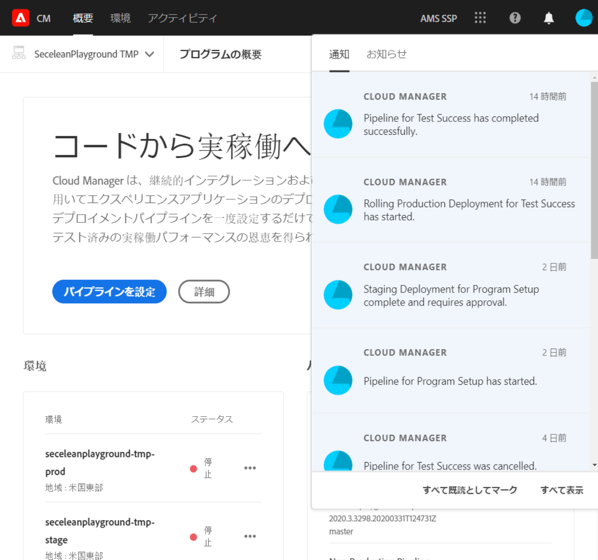

# 通知について {#notifications}

[!UICONTROL Cloud Manager] を使用すると、実稼動パイプラインの開始時、正常終了時、失敗時、および実稼動デプロイメントの開始時に、通知を受け取ることができます。これらの通知は、Adobe [!UICONTROL Experience Cloud] の通知システムを通じて送信されます。

>[!NOTE]
>
>承認およびスケジュール済みの通知は、ビジネスオーナー、プログラムマネージャー、デプロイメントマネージャーの役割のユーザーにのみ送信されます。

通知は、[!UICONTROL Cloud Manager] の UI（ユーザーインターフェイス）のサイドバーおよび Adobe [!UICONTROL Experience Cloud] 全体で表示されます。

下の図に示すように、ヘッダーのベルアイコンをクリックしてサイドバーを開き、通知を表示します。

サイドバーには、最新の通知が一覧表示されます。

## 電子メール通知 {#email-notifications}

デフォルトでは、Adobe [!UICONTROL Experience Cloud] ソリューションの Web ユーザーインターフェイスで通知を確認できます。個々のユーザーは、これらの通知を電子メールで即時またはダイジェストベースで受け取ることもできます。

これにより、Adobe [!UICONTROL Experience Cloud] の通知環境設定画面に移動します。

ユーザーは電子メール通知をオンにしたり、電子メールで受信する通知のタイプを（オプションで）選択したりできます。

>[!NOTE]
>Adobe [!UICONTROL Experience Cloud] からのダイジェスト作成を有効にすることもできます。
