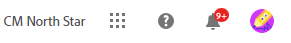
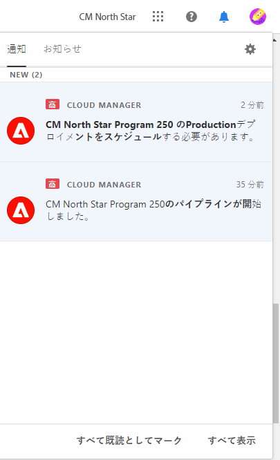
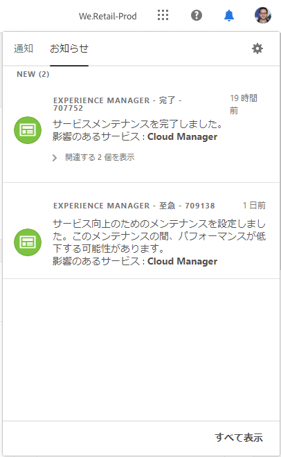
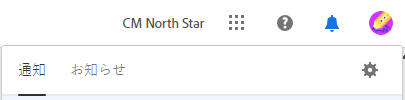
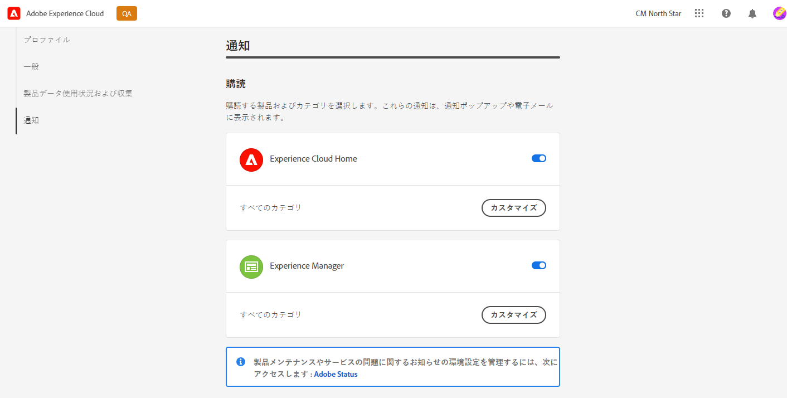
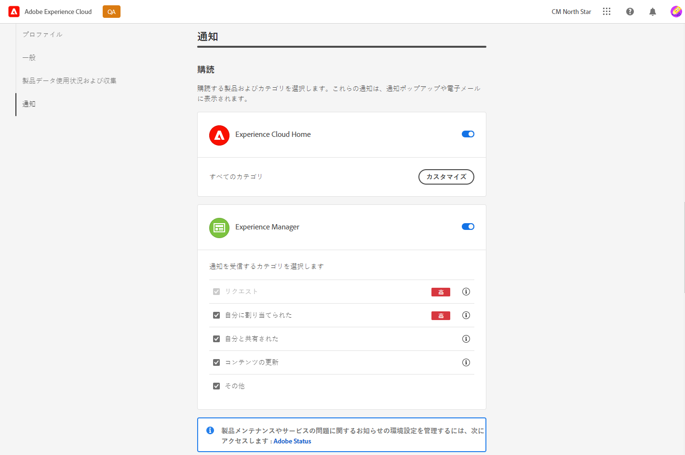
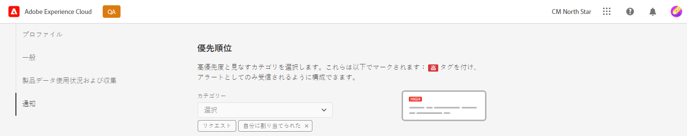
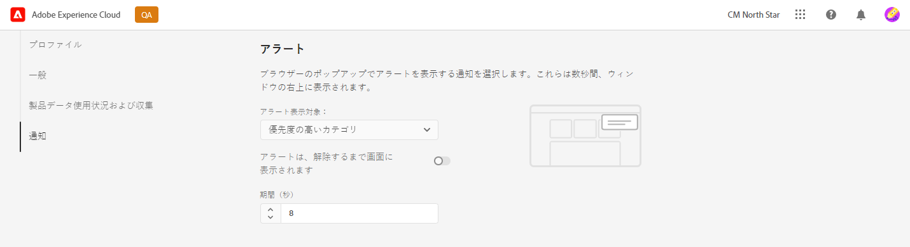
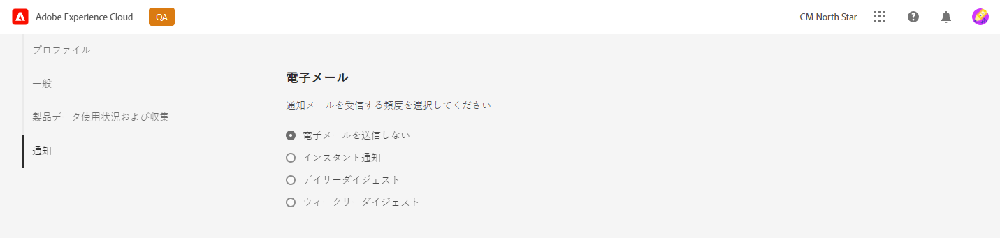

# 通知 {#notifications}

Cloud Manager による重要なイベントの通知方法を説明します。

## Cloud Manager の通知 {#cloud-manager-notifications}

[!UICONTROL Cloud Manager]実稼動パイプラインが開始され、実稼動デプロイメント中に（正常または失敗して）実稼動パイプラインが完了したときに通知が提供されます。

これらの通知は、[!UICONTROL CX Enterprise]通知システムを通じて、**ビジネスオーナー**、**プログラムマネージャー**、**デプロイメントマネージャー**&#x200B;の役割のユーザーに送信されます。

通知は、[!UICONTROL Cloud Manager]内およびAdobe [!UICONTROL CX Enterprise]全体のサイドバーに表示されます。 ヘッダーのベルアイコンには、新しい通知がある場合にバッジが表示されます。

ベルアイコンをクリックしてサイドバーを開き、通知を表示します。 サイドバーの「**通知**」タブには、デプロイメントの確認など、最新の通知が表示されます。 通知は環境に関するものです。

「**お知らせ**」タブには、アドビ製品のお知らせが含まれています。 お知らせは製品に関するものです。

通知またはお知らせをクリックすると、その詳細が表示されます。 パイプラインのデプロイメントなどのアクティビティにリンクされた通知は、パイプラインの実行ウィンドウなど、そのアクティビティの詳細に移動します。

パネルの下部にある「**すべて表示**」オプションをクリックすると、インボックス内のすべてのお知らせが表示されます。

パネルの下部にある「**すべて既読にする**」オプションをクリックすると、未読の通知がすべて既読としてマークされ、ベルアイコンが消去されます。

## 通知設定 {#configuration}

通知の受信方法と受信する通知をカスタマイズできます。

通知サイドバーの上部にある設定アイコンをクリックして、**CX エンタープライズ環境設定** ウィンドウを開きます。 ここから、通知サブスクリプションと通知の受け取り方法を定義できます。

### 購読 {#subscriptions}

サブスクリプションは、通知を受け取る製品と、受け取る通知の種類を定義します。

デフォルトでは、アプリケーションと電子メールの両方で、すべての製品のすべての通知が届きます。 製品名の横にある山形アイコンをクリックして、詳細オプションを表示し、その製品に対して受け取る通知の種類を定義します。 または、製品レベルのオプションをオンまたはオフにして、製品のすべてのオプションを選択または選択解除します。

### 優先度 {#priority}

優先度アラートには、**HIGH** ラベルが付けられます。 アラートとして受信するように設定できます。 「**優先度**」セクションでは、優先度と見なされるカテゴリの通知を定義できます。

ドロップダウンメニューを使用して、優先度が高いカテゴリのリストに追加します。 カテゴリ名の横にある削除アイコンをクリックして削除します。

### アラート {#alerts}

アラートは、ウィンドウの右上隅に数秒間表示されます。 「**アラート**」セクションを使用して、アラートを受信する通知を定義します。

アラートの動作を定義できます。

* ****&#x200B;の通知を表示 – トリガーが通知する通知の種類を定義します。
* **アラートを閉じるまで画面に表示される** - アラートを閉じない限り、アラートを保持するかどうかを制御します。
* **期間** – 保持するように設定していないアラートが画面に表示される期間を定義します。

### メール {#emails}

通知は、Adobe [!UICONTROL CX Enterprise] ソリューションのweb ユーザーインターフェイスで利用できます。 これらの通知を電子メールで送信するには、**電子メール** セクションを使用します。

デフォルトでは、メールは送信されません。 次のようにメールを受信するように選択できます。

* 即時
* 毎日
* 毎週

**インスタント通知**&#x200B;を選択すると、通知ごとにメールがすぐに送信されます。 **毎日ダイジェスト**&#x200B;および&#x200B;**毎週ダイジェスト**&#x200B;では、毎日ダイジェストを送信する日時と毎週ダイジェストを送信する日時を選択できます。