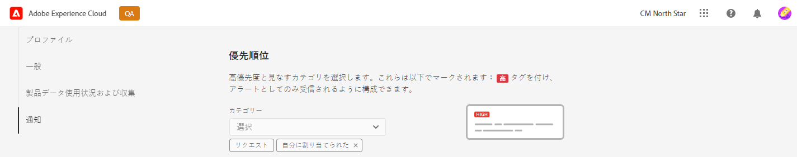

# 通知 {#notifications}

Cloud Manager による重要なイベントの通知方法を説明します。

## Cloud Manager の通知 {#cloud-manager-notifications}

[!UICONTROL Cloud Manager] は、実稼動パイプラインの開始時、終了時（正常終了時または失敗時）、実稼動デプロイメントの開始時に通知を送信します。

これらの通知は、[!UICONTROL Experience Cloud] の通知システムを介して、**ビジネスオーナー**、**プログラムマネージャー**、**デプロイメントマネージャー**&#x200B;の役割のユーザーに送信されます。

通知は、[!UICONTROL Cloud Manager] のサイドバーおよび Adobe [!UICONTROL Experience Cloud] 全体に表示されます。新しい通知がある場合、ヘッダーのベルアイコンにバッジが付きます。

ベルアイコンをクリックしてサイドバーを開き、通知を表示します。サイドバーの「**通知**」タブには、デプロイメントの確認など、最新の通知が表示されます。通知は環境に関するものです。

「**お知らせ**」タブには、アドビ製品のお知らせが含まれています。お知らせは製品に関するものです。

通知またはお知らせをクリックすると、その詳細が表示されます。パイプラインのデプロイメントなど、アクティビティにリンクされた通知には、パイプライン実行ウィンドウなど、そのアクティビティの詳細が表示されます。

パネルの下部にある「**すべて表示**」オプションをクリックすると、インボックス内のすべてのお知らせが表示されます。

パネルの下部にある「**すべて既読にする**」オプションをクリックすると、未読の通知がすべて既読としてマークされ、ベルアイコンが消去されます。

## 通知設定 {#configuration}

通知の受信方法と受信する通知をカスタマイズできます。

通知サイドバーの上部にある歯車アイコンをクリックして、**Experience Cloud環境設定** ウィンドウを開きます。 ここから、通知の購読と、通知の受信方法を定義できます。

### 購読 {#subscriptions}

購読では、通知を受信する製品および通知の対象を定義します。

デフォルトでは、アプリケーションとメールの両方で、すべての製品に関するすべての通知を受信します。 製品名の横にある山形アイコンをクリックすると、詳細なオプションが表示され、その製品に対して受信する通知のタイプを定義できます。 または、製品レベルのオプションをオンまたはオフにして、製品のすべてのオプションを選択または選択解除します。

### 優先度 {#priority}

優先度アラートは&#x200B;**高**&#x200B;タグでマークされます。アラートとしてのみ受信されるように設定できます。 「**優先度**」セクションでは、優先度と見なされるカテゴリの通知を定義できます。

ドロップダウンを使用すると、優先度と見なされるカテゴリのリストに追加できます。カテゴリ名の横にある「X」をクリックすると、削除できます。

### アラート {#alerts}

アラートは、ウィンドウの右上隅に数秒間表示されます。「**アラート**」セクションを使用すると、アラートを受信する通知を定義できます。

アラートの動作を定義できます。

* **アラート表示対象** - アラートをトリガーする通知のタイプを定義します
* **アラートは、解除するまで画面に表示されます** - アラートをアクティブに解除しない限り、アラートを保持するかどうかを制御します
* **期間** - アラートを画面に表示しておくように選択していない場合に、アラートを画面に表示しておく期間を定義します。

### メール {#emails}

Adobe [!UICONTROL Experience Cloud] ソリューションの web ユーザーインターフェイスで通知を確認できます。また、これらの通知を「**メール**」セクションで、メールで送信するように選択することもできます。

デフォルトでは、メールは送信されません。次のようにメールを受信するように選択できます。

* 即時
* 毎日
* 毎週

「**インスタント通知**」を選択すると、すべての通知に対して即座にメールが送信されます。 「**デイリーダイジェスト**」と「**ウィークリーダイジェスト**」では、日次ダイジェストを送信する日時と、週次ダイジェストを送信する日時を選択できます。