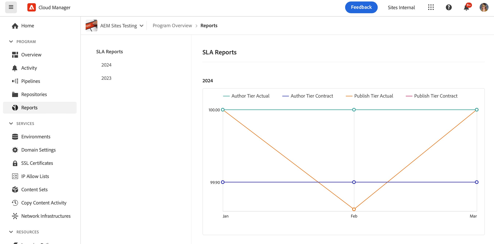
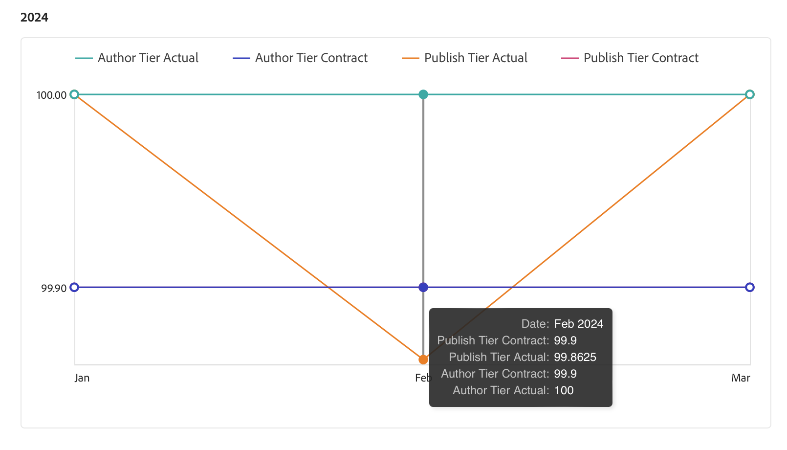

# SLA レポート {#sla-reporting}

次の節では、AEM as a Cloud Serviceの SLA レポートについて説明します。

## はじめに {#introduction}

お客様は、契約されたサービスレベル契約（SLA）に対する AEM の実稼動環境のパフォーマンスを確認できます。これは、メインヘッダーからアクセスできる「レポート」タブのメニューから使用できます。

次の例に従います。これは、2021 年の月別 SLA 達成度を示すグラフです。

データポイントをロールオーバーすると、その月の特定の値が表示されます。

>[!NOTE]
>これらのレポートは、顧客が順次利用できるようになります。 メインナビゲーションに「レポート」オプションが表示されない場合は、Adobe担当者に連絡して、レポートをいつ利用できるようにするかを問い合わせてください。

このグラフの「イベント分析」セクションには、現在選択されている年の中でプログラムに発生した一連のインシデントが表示されます。

次の図に示すように、各インシデントには、時間範囲、原因、一連のコメントが含まれます。

## SLA 指標 {#sla-metrics}

* **パブリッシュ層**
契約これは、パブリッシュ層のAdobeとの契約で定義される SLA です。

* **パブリッシュ層実**
際これは、Adobeやアドビのベンダーが原因で発生したインシデントを組み込んだ、実稼動パブリッシュ層の測定稼動時間です。

* **オーサー層**
契約これは、オーサー層のAdobeとの契約で定義される SLA です。

* **オーサー層実**
際これは、Adobeやアドビのベンダーが原因で発生したインシデントを組み込んだ、実稼動オーサー層の測定稼動時間です。

