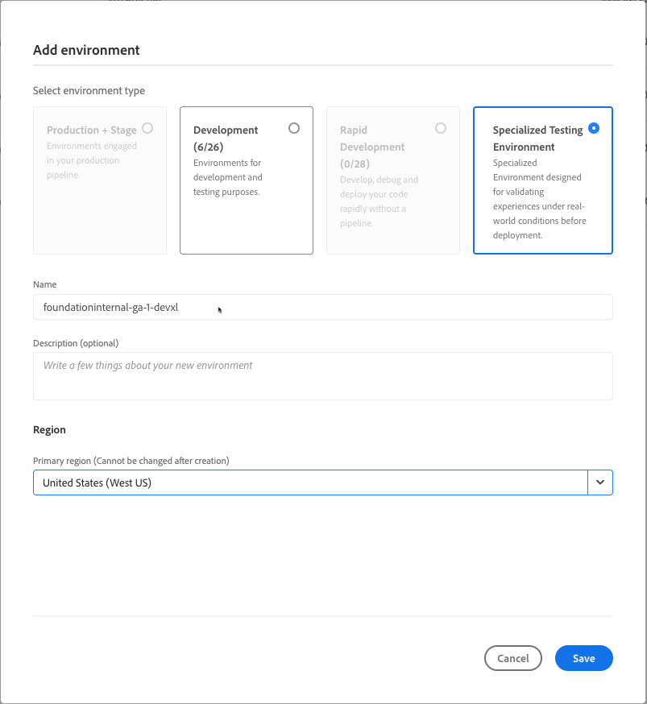

# 専用のテスト環境の追加{#add-special-test-enviro}

<!-- badge: label="Private beta" type="Positive" url="/help/implementing/cloud-manager/release-notes/current.md#gitlab-bitbucket"
-->

>[!NOTE]
>
>専用のテスト環境を購入できるようになりました。 Adobeの担当者に連絡して注文してください。

専用テスト環境は、作成可能な新しいタイプのCloud Manager環境です。 ユーザー受け入れテスト（UAT）やパフォーマンス検証などの高度なユースケースをサポートするように設計されています。 従来の開発環境、迅速な開発環境、ステージング環境とは異なり、専用のテスト環境は実稼動デプロイメントパイプラインの外部で動作します。 したがって、厳密な分離を維持しながら、実稼動ワークフローへの干渉を防ぎながら、より高い柔軟性を提供します。

特殊なテスト環境は、一般的なステージング環境のサイズ、スケーラビリティ、構成を反映するように構築されています。 このアプローチにより、専門のテスト環境で実行されるテストが、実稼動環境に似た条件でコードとコンテンツがどのように実行されるかに関する現実的なインサイトを得ることができます。 この環境では、実稼動環境またはステージング環境からのコンテンツの直接コピーもサポートしています。 また、デプロイメントワークフロー、アクセス制御、ネットワーク設定の点で、開発環境と同等の機能を維持します。

## 専用テスト環境の主な機能と設定 {#key-features}

| カテゴリ | 動作 |
| --- | --- |
| 目的 | UAT とパフォーマンステスト。 |
| パイプラインタイプ | 実稼動パイプラインではありません。 |
| 環境サイズ | ステージ環境に一致します。 |
| 分離 | 他の環境から完全に分離されています。 |
| コードパイプライン | 開発環境（検証、ビルド、デプロイ）と同じです。 |
| コンテンツをコピー | 実稼動環境、ステージング環境、または専用のテスト環境から許可されます。 |
| コンテンツ復元 | 開発環境と同じです。 |
| アクセスログ | 開発環境と同じです。 |
| Developer Console | 開発環境と同じです。 |
| `IP Allow List` | 開発環境と同じです。 |
| ネットワーク | 開発環境（サービス、ドメイン名、SSL 証明書、高度なネットワーク）と同じです。 |

詳しくは、[環境の管理](/help/implementing/cloud-manager/manage-environments.md)も参照してください。

## 専用のテスト環境の追加 {#add-specialized-testing-environment}

環境を追加または編集するには、ユーザーが&#x200B;**ビジネスオーナー**&#x200B;の役割のメンバーである必要があります。

**専用のテスト環境を追加するには：**

1. [my.cloudmanager.adobe.com](https://my.cloudmanager.adobe.com/) で Cloud Manager にログインし、適切な組織を選択します。

1. **[マイプログラム](/help/implementing/cloud-manager/navigation.md#my-programs)**&#x200B;コンソールで、環境を追加するプログラムをクリックします。

1. 次のいずれかの操作を行います。

   * **[マイプログラム](/help/implementing/cloud-manager/navigation.md#my-programs)** コンソールの **環境** カードで、「**環境を追加**」をクリックします。
「**環境を追加**」オプションがグレー表示（無効）になっている場合は、権限が不足しているか、ライセンス済みリソースに依存している場合があります。

     

   * 左側のサイドパネルで、「**環境**」をクリックし、環境ページの右上隅近くにある「**環境を追加**」をクリックします。

     

1. **環境を追加**&#x200B;ダイアログボックスで、次の操作を行います。

   * **専用テスト環境** をクリックします。
   * 環境の&#x200B;**名前**&#x200B;を入力します。環境名は、環境の作成後に変更できません。
   * （任意）環境の **説明** を入力します。
   * ドロップダウンリストから **プライマリ地域** を選択します。 作成されると、専用テスト環境のプライマリ地域（例：*英国（南部）* はロックされ、変更できなくなります。

     

1. 「**保存**」をクリックします。

   これで、**概要**&#x200B;ページの&#x200B;**環境**&#x200B;カードに新しい環境が表示されるようになりました。新しい環境にパイプラインを設定できるようになりました。

## その他のリソース {#additional-resources}

* ビデオ：[AEM Cloud Managerの環境タイプについて ](https://experienceleague.adobe.com/en/perspectives/cloud-manager-environment-types)
* [環境の管理](/help/implementing/cloud-manager/manage-environments.md)

