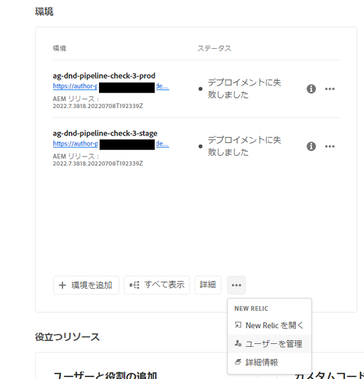
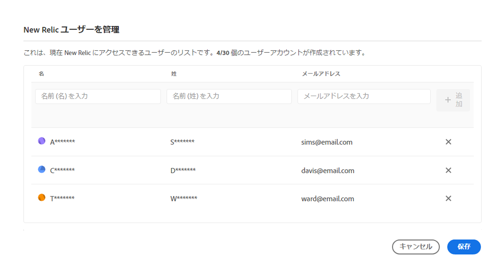
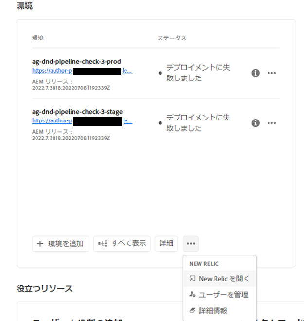

# New Relic One {#user-access}

AEM as a Cloud Service の New Relic One アプリケーションパフォーマンスモニタリング（APM）サービスと、そのサービスへのアクセス方法について説明します。

## New Relic One について {#introduction}

アドビは、アプリケーションのモニタリング、可用性、パフォーマンスを重視しています。AEM as a Cloud Service には、New Relic One モニタリングへのアクセスが含まれており、チームは標準製品の一部としてシステムと環境のパフォーマンス指標を包括的に可視化できます。

このドキュメントでは、AEM as a Cloud Service 環境で New Relic One アプリケーションパフォーマンスモニタリング（APM）機能へのアクセスを管理する方法について説明します。これらの機能を効果的に管理することで、最適なパフォーマンスをサポートし、AEM as a Cloud Service のメリットを最大限に活用できます。

新しい実稼動プログラムが作成されると、AEM as a Cloud Service プログラムに関連付けられた New Relic One サブアカウントが自動的に作成されます。データの取り込みを開始するには、[このサブアカウントをアクティベートする必要があります](#activate-sub-account)。

## 機能 {#transaction-monitoring}

AEM as a Cloud Service 用の New Relic One APM には、多くの機能があります。

* 専用の New Relic One アカウントへの直接アクセス

* 外部の依存関係やデータベースを含む、行番号のある正確なメソッド呼び出しを表示する New Relic One APM エージェントを実装。

* インフラストラクチャレベルのモニタリングおよびアプリケーション（Adobe Experience Manager）のモニタリングからの主要指標を組み合わせることで、全体的なパフォーマンス最適化を実現

* AEM as a Cloud Service は、Java Management Extensions（JMX）MBean とヘルスチェックを New Relic Insights 内に直接公開し、アプリケーションのパフォーマンスとヘルス指標の詳細な調査を有効にします。

## New Relic One サブアカウントをアクティベート {#activate-sub-account}

新しく作成したプログラムの場合は、New Relic One サブアカウントが作成されます。ただし、データを取り込むには、アクティベートする必要があります。このアクティベーションは自動ではありません。サブアカウントをアクティベートするには、次の手順に従います。

>[!NOTE]
>
>New Relic One サブアカウントを管理するには、**ビジネスオーナー**&#x200B;または&#x200B;**デプロイメントマネージャー**&#x200B;の役割を持つユーザーがログインしている必要があります。

1. [my.cloudmanager.adobe.com](https://my.cloudmanager.adobe.com/) で Cloud Manager にログインし、適切な組織を選択します。

1. **[マイプログラム](/help/implementing/cloud-manager/navigation.md#my-programs)**&#x200B;コンソールで、New Relic One ユーザーを管理するプログラムをクリックします。

1. プログラムの概要ページの&#x200B;**環境**&#x200B;カードの下部にある  をクリックし、「**New Relic をアクティベート**」を選択します。

   

   * また、「**ユーザーを管理**」オプションにアクセスすることもできます。プログラムの&#x200B;**環境**&#x200B;画面の上部にある  をクリックします。

1. サブアカウントのアクティベーションを正常に完了するには、同じ環境に対して[パイプラインを実行](/help/implementing/cloud-manager/configuring-pipelines/managing-pipelines.md#running-pipelines)します。

サブアカウントをアクティベート解除すると、データの取り込みは行われません。

## New Relic One ユーザーを管理 {#manage-users}

次の手順に従って、AEM as a Cloud Service プログラムに関連付けられた New Relic One サブアカウントのユーザーを定義します。

>[!NOTE]
>
>New Relic One ユーザーを管理するには、**ビジネスオーナー**&#x200B;または&#x200B;**デプロイメントマネージャー**&#x200B;の役割を持つユーザーがログインしている必要があります。

1. [my.cloudmanager.adobe.com](https://my.cloudmanager.adobe.com/) で Cloud Manager にログインし、適切な組織を選択します。

1. New Relic One ユーザーを管理するプログラムをクリックします。

1. プログラムの概要ページの&#x200B;**環境**&#x200B;カードの下部にある  をクリックし、「**ユーザーを管理**」を選択します。

   

   * また、「**ユーザーを管理**」オプションにアクセスすることもできます。プログラムの&#x200B;**環境**&#x200B;画面の上部にある  をクリックします。

1. **New Relic ユーザーを管理**&#x200B;ダイアログボックスで、追加するユーザーの氏名を入力し、「**追加**」ボタンをクリックします。追加するすべてのユーザーについて、この手順を繰り返します。

   

1. New Relic One ユーザーを削除するには、ユーザーを表す行の右端にある削除ボタンをクリックします。

1. 「**保存**」をクリックして、ユーザーを作成します。

ユーザーが定義されると、New Relic は、アクセス権を付与した各ユーザーに確認メールを送信します。これにより、ユーザーは設定プロセスを完了し、サインインできるようになります。

>[!NOTE]
>
>New Relic One ユーザーを管理している場合は、自分自身がアクセスできるように自分自身もユーザーとして追加する必要もあります。New Relic One にアクセスするには、**ビジネスオーナー**&#x200B;または&#x200B;**デプロイメントマネージャー**&#x200B;であるだけでは十分ではありません。自分自身もユーザーとして作成する必要があります。

## New Relic One ユーザーアカウントをアクティベート {#activate-user-account}

[New Relic One ユーザーの管理](#manage-users)のプレビューセクションで説明しているように、New Relic One ユーザーアカウントが作成されると、New Relic はそれらのユーザーに指定されたアドレスに確認メールを送信します。これらのアカウントを使用するには、ユーザーはまずパスワードをリセットして New Relic のアカウントを有効にする必要があります

**New Relic One ユーザーアカウントをアクティベートするには：**

1. New Relic からのメールに記載されているリンクをクリックします。

1. New Relic ログインページで、「**パスワードを忘れた場合**」をクリックします。

   

1. 確認メールを受信したメールアドレスを入力し、「**リセットリンクを送信**」を選択します。

   

1. New Relic から、アカウントを確認するためのリンクが記載されたメールが送信されます。

New Relic から確認メールが届かない場合は、[トラブルシューティングの節](#troubshooting)を参照してください。

## New Relic One へのアクセス {#accessing-new-relic}

[New Relic アカウントを有効](#activate-account)にすると、Cloud Manager を介して、または直接、New Relic One にアクセスできます。

**Cloud Manager を介して New Relic One にアクセスするには：**

1. [my.cloudmanager.adobe.com](https://my.cloudmanager.adobe.com/) で Cloud Manager にログインし、適切な組織を選択します。

1. New Relic One にアクセスするプログラムをクリックします。

1. プログラムの概要ページの&#x200B;**環境**&#x200B;カードの下部にある  をクリックし、「**New Relic を開く**」を選択します。

   

   * また、New Relic にアクセスすることもできます。プログラムの&#x200B;**環境**&#x200B;画面の上部にある  をクリックします。

1. 開いた新しいブラウザータブで、New Relic One にログインします。

**New Relic One に直接アクセスするには：**

1. [`https://login.newrelic.com/login`](https://login.newrelic.com/login) にある New Relic のログインページに移動します。

1. New Relic One にログインします。

### メールの検証 {#verify-email}

New Relic One へのログイン中に使用するメールを確認するように求められた場合は、メールが複数のアカウントに関連付けられていることを意味します。アクセスするアカウントを選択できます。

メールアドレスを確認しない場合、New Relic は、メールアドレスに関連付けられた最新のユーザーレコードを使用してログインを試みます。ログインする度にメールが確認されないようにするには、ログイン画面の「**このアカウントを記憶する**」チェックボックスをクリックします。

詳細なヘルプについては、[AEM サポートポータル](https://helpx.adobe.com/jp/enterprise/using/support-for-experience-cloud.html)を介してサポートチケットを開いてください。

## New Relic One ユーザーアクセスのトラブルシューティング {#troubleshooting}

[New Relic One ユーザーの管理](#manage-users)で説明しているように New Relic One ユーザーとして追加され、元のアカウント確認メールが見つからない場合は、次のトラブルシューティング手順に従ってください。

**New Relic One ユーザーアクセスのトラブルシューティングを行うには：**

1. [`login.newrelic.com/login`](https://login.newrelic.com/login) にある New Relic のログインページに移動します。

1. 「**[!UICONTROL パスワードを忘れた場合]**」をクリックします。

   

1. アカウントの作成に使用したメールアドレスを入力し、「**リセットリンクを送信**」を選択します。

   

1. New Relic から、アカウントを確認するためのリンクが記載されたメールが送信されます。

新規登録プロセスを完了し、メールまたはパスワードのエラーメッセージが原因でアカウントにログインできない場合は、[Admin Console](https://adminconsole.adobe.com/) からサポートチケットをログに記録します。

New Relic からメールが届かない場合は、次の操作を実行します。

* [スパムフィルター](https://docs.newrelic.com/docs/accounts/accounts-billing/account-setup/create-your-new-relic-account/)を確認します。
* 該当する場合、[メール許可リストに New Relic を追加](https://docs.newrelic.com/docs/accounts/accounts/account-maintenance/account-email-settings/#email-whitelist)します。
* いずれの提案も役に立たない場合は、サポートチケットに関するフィードバックを提供してください。

## 制限事項 {#limitations}

New Relic One にユーザーを追加する場合は、次の制限が適用されます。

* 最大 30 人のユーザーを追加できます。ユーザーの最大数に達した場合は、新しいユーザーを追加できるように、ユーザーを削除します。
* New Relicに追加されるユーザーのタイプは、**基本** です。 詳しくは、[New Relic のドキュメント](https://docs.newrelic.com/docs/accounts/accounts-billing/new-relic-one-user-management/user-type/)を参照してください。
* AEM as a Cloud Service は New Relic One APM ソリューションのみを提供し、アラート、ログ、API 統合のサポートは提供していません。

>[!NOTE]
>
>New Relic One サブアカウントで 30 日以上&#x200B;**ユーザーログイン**&#x200B;アクティビティが検出されなかった場合、APM エージェントは停止し、AEM Cloud Service から New Relic にデータは送信されません。**サブアカウントを再アクティブ化するまで、データは再送信されません。**
>
>このドキュメントの [New Relic One サブアカウントのアクティベート](#activate-sub-account)の節と同じ手順に従って、New Relic One サブアカウントを再アクティベートします。

AEM as a Cloud Service プログラムの New Relic One 製品に関する詳細なヘルプまたは追加のガイダンスについては、[AEM サポートポータル](https://helpx.adobe.com/jp/enterprise/using/support-for-experience-cloud.html)からサポートチケットを開いてください。

## よくある質問 {#faqs}

+++**アドビが New Relic One でモニタリングするものは何ですか？**

アドビは、New Relic One の Java プラグインを介して AEM as a Cloud Service のオーサー、パブリッシュ、プレビュー（利用可能な場合）サービスをモニタリングします。アドビは、カスタムの New Relic One APM テレメトリと、実稼動および実稼動以外の AEM as a Cloud Service 環境でのモニタリングを有効にします。

New Relic One アカウントは、アドビが管理するプライマリアカウントに接続されており、複数のアプリケーションがレポートを作成します。AEM as a Cloud Service 環境ごとに 3 つあります。

* 環境ごとにオーサーサービス用の 1 つのアプリケーション
* 環境ごとに `Publish` サービス用の 1 つのアプリケーション（ゴールデンパブリッシュを含む）
* 環境ごとにプレビューサービス用の 1 つのアプリケーション

メモ：

* 各アプリケーションは、1 つのライセンスキーを使用します。
* AEM as a Cloud Service 環境は、1 つの New Relic One アカウントにのみレポートします。
* 両方の New Relic One の完全なモニタリング指標およびイベントは、3 か月間保持されます。

+++

+++**アドビは New Relic Oneからのアラート通知を送信しますか？**

アドビは、監視の目的でのみ New Relic One へのアクセスを提供します。お客様への警告や内部の運用アラートには使用しません。インシデントに関する通知は、[ユーザー通知プロファイル](/help/journey-onboarding/notification-profiles.md)を使用して送信されます。
+++

+++**New Relic One Cloud Service のデータへは、誰がアクセスできますか？**

最大 30 人のチームメンバーに完全な読み取りアクセスが許可されます。読み取りアクセスには、New Relic One エージェントによって収集されたすべての APM 指標が含まれます。
+++

+++**カスタム SSO 設定はサポートされていますか？**

カスタム SSO 設定は、アドビがプロビジョニングした New Relic One アカウントではサポートされていません。
+++

+++**既にオンプレミスの New Relic サブスクリプションがある場合はどうなりますか？**

New Relic One は、New Relic の新しい観測可能なプラットフォームであり、アドビサポートとお客様のチームが指標とイベントをすべて 1 か所で観測、監視、表示できます。

New Relic One を使用すると、ユーザーがアクセスできるすべてのアカウントを検索し、すべてのサービスとホストからのデータを 1 つのビューで視覚化できます。

アドビサポートは、New Relic One やその他のツールを使用して AEM as a Cloud Service を監視しますが、お客様のチームは引き続き New Relic をオンプレミスのサービスとインフラストラクチャに活用できます。Adobe New Relic One アカウントと顧客管理の New Relic アカウントの両方からのデータを視覚化できるようになります。

>[!NOTE]
>
>New Relic One 内で両方のデータセットを表示するには、ユーザーが適切な権限を持ち、両方のアカウント（Adobe New Relic One と顧客管理の New Relic アカウント）に同じログイン方法を使用する必要があります。

+++

+++**New Relic One アカウントの APM エージェントが停止しました。何が起きたのでしょうか？**

30 日以上アクティビティが検出されなかった場合、[APM エージェントは停止します](#limitations)。このドキュメントの [New Relic One サブアカウントのアクティベート](#activate-sub-account)の節と同じ手順に従って、New Relic One サブアカウントを再アクティベートします。
+++
