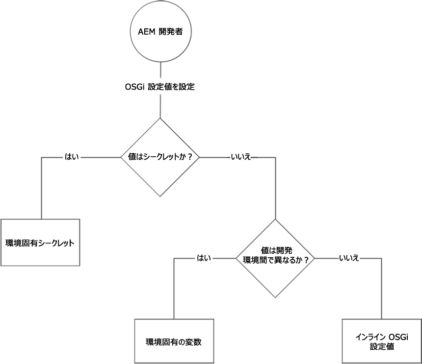

# OSGi 設定 {#osgi-configurations}

[OSGi](https://www.osgi.org/) はAdobe Experience Manager(AEM)の技術スタックの基本要素です。 AEMとその設定の複合バンドルを制御するために使用されます。

OSGiは、小規模で再利用可能なコラボレーションコンポーネントからアプリケーションを構築できるように、標準化されたプリミティブを提供します。 これらのコンポーネントは、アプリケーションに組み込んでデプロイすることができます。 これにより、OSGiバンドルの管理が容易になり、バンドルを個別に停止、インストール、開始できます。 相互依存関係は自動的に処理されます。 各OSGiコンポーネントは、様々なバンドルの1つに含まれています。 詳しくは、 [OSGiの仕様を参照してください](https://www.osgi.org/Specifications/HomePage)。

AEMコードプロジェクトに含まれる設定ファイルを使用して、OSGiコンポーネントの設定を管理できます。

## OSGi Configuration Files {#osgi-configuration-files}

設定の変更は、AEM Projectのコードパッケージ(`ui.apps`)で、実行モード固有の設定フォルダーの下に設定ファイル(`.cfg.json`)として定義されます。

`/apps/example/config.<runmode>`

OSGi設定ファイルの形式は、Apache Slingプロジェクトで定義されている `.cfg.json` 形式を使用したJSONベースです。

OSGi設定ターゲットOSGiコンポーネントは、Persistent Identity(PID)を介してコンポーネントを設定します。デフォルトでは、OSGiコンポーネントのJavaクラス名です。 例えば、次の方法で実装されるOSGiサービス用のOSGi設定を提供するには：

`com.example.workflow.impl.ApprovalWorkflow.java`

OSGi設定ファイルは次の場所で定義されます。

`/apps/example/config/com.example.workflow.impl.ApprovalWorkflow.cfg.json`

次の [cfg.json OSGi設定形式]（cfg.json OSGi設定形式に従います）。

> [!NOTE]
>
> 以前のバージョンのAEMでサポートされていたOSGi設定ファイルは、.cfg.、.config、XML sling:OsgiConfigリソース定義など、様々なファイル形式を使用しています。 これらの形式は、cfg.json OSGi設定形式に置き換えられました。

## Runmode Resolution {#runmode-resolution}

ランモードを使用すると、特定のOSGi設定を特定のAEMインスタンスにターゲット設定できます。 runmodeを使用するには、次の形式で、 `/apps/example` （例えばプロジェクト名）の下にconfigフォルダーを作成します。

`/apps/example/config.<author|publish>.<dev|stage|prod>/`

configフォルダー名で定義された実行モードがAEMで使用される実行モードと一致する場合、このようなフォルダー内のOSGi設定が使用されます。

例えば、AEMがrunmodes author and devを使用している場合、およびの設定ノードは適用され `/apps/example/config.author/` 、およびの設定ノードは `/apps/example/config.author.dev/``/apps/example/config.publish/``/apps/example/config.author.stage/` 適用されません。

同じ PID に複数の設定が該当する場合は、一致する実行モードの数が最も大きい設定が適用されます。

このルールの精度はPIDレベルです。 つまり、同じPIDの一部のプロパティと、同じPIDのより具体的なプロパティ `/apps/example/config.author/` を定義す `/apps/example/config.author.dev/` ることはできません。  一致する実行モードの数が最も多い設定は、PID全体に対して有効です。

ローカルで開発する場合は、実行モード起動パラメーターを渡して、使用する実行モード OSGi 設定を指定できます。

## OSGi設定値のタイプ {#types-of-osgi-configuration-values}

AEMでクラウドサービスとして使用できるOSGi設定値には3種類あります。

1. **インライン値**。OSGi設定にハードコードされ、Gitに保存される値です。 次に例を示します。

   ```json
   {
      "connection.timeout": 1000
   }
   ```

1. **シークレット値**。セキュリティ上の理由からGitに保存しない値です。 次に例を示します。

   ```json
   {
   "api-key": "$[secret:server-api-key]"
   } 
   ```

1. **環境固有の値**。開発環境間で変化する値であり、したがって実行モードで正確にターゲットにすることはできません(AEMではクラウドサービスとして `dev` 1つの実行モードが存在するため)。 次に例を示します。

   ```json
   {
    "url": "$[env:server-url]"
   }
   ```

   1つのOSGi設定ファイルで、これらの設定値タイプの任意の組み合わせを併用できます。 次に例を示します。

   ```json
   {
   "connection.timeout": 1000,
   "api-key": "$[secret:server-api-key]",
   "url": "$[env:server-url]"
   }
   ```

## 適切なOSGi設定値タイプの選択方法 {#how-to-choose-the-appropriate-osgi-configuration-value-type}

OSGiでは、インラインOSGi設定値を使用する場合が多くあります。 環境固有の設定は、開発環境間で値が異なる特定の使用例に対してのみ使用します。



環境固有の設定は、インライン値を含む、従来の静的に定義されたOSGi設定を拡張し、Cloud Manager APIを介してOSGi設定値を外部で管理できるようにします。 インライン値を定義してGitに保存する一般的で従来の方法を使用する必要がある場合、値を環境固有の設定に抽象化する必要がある場合を理解することが重要です。

次のガイダンスは、非秘密の構成と秘密の環境固有の構成を使用する場合の手順を示しています。

### インライン設定値を使用するタイミング {#when-to-use-inline-configuration-values}

インライン設定の値は標準的な方法と見なされるので、可能な場合は使用する必要があります。 インライン設定には次のような利点があります。

* Gitでのガバナンスとバージョン履歴に基づいて管理されます。
* 値はコードデプロイメントに暗黙的に結び付けられます
* 配置に関する考慮事項や調整を追加する必要はありません。

OSGi設定値を定義する場合は、インライン値を持つ開始は、必要に応じてシークレット設定または環境固有の設定を選択するだけです。

### 非秘密環境固有の設定値を使用する場合 {#when-to-use-non-secret-environment-specific-configuration-values}

非秘密の設定値に対しては、開発環境間で値が異なる場合にのみ、環境固有の設定(`$[env:ENV_VAR_NAME]`)を使用してください。 これには、ローカル開発インスタンスと、クラウドサービス開発環境としてのAEMが含まれます。 AEMの非秘密環境固有の設定を、クラウドサービスの段階または実稼働環境として使用しないでください。

* ローカル開発インスタンスなど、開発環境間で異なる設定値に対しては、秘密の環境固有でない設定のみを使用します。
* 代わりに、StageとProductionの非秘密値のOSGi設定で、標準のインライン値を使用します。  これに関連して、実行時にステージ環境と実稼働環境に対して設定を簡単に変更するために、環境固有の設定を使用しないことをお勧めします。 これらの変更は、ソースコード管理を通じて導入する必要があります。

### シークレット環境固有の設定値を使用するタイミング {#when-to-use-secret-environment-specific-configuration-values}

AEM as a Cloud Serviceでは、セキュリティ上の理由から、パスワード、プライベートAPIキー、Gitに保存できない他の値など、秘密のOSGi設定値に対して環境固有の設定(`$[secret:SECRET_VAR_NAME]`)を使用する必要があります。

秘密の環境固有の設定を使用して、StageやProductionなどのクラウドサービス環境としてすべてのAEMに秘密の値を保存します。

### リポジトリへの新しい設定の追加 {#adding-a-new-configuration-to-the-repository}

#### 必要な知識 {#what-you-need-to-know}

新しい設定をリポジトリに追加するには、以下を知っておく必要があります。

1. サービスの **永続的なID** (PID)。

   Webコンソールの「 **Configurations** 」フィールドを参照します。 名前は、バンドル名の後ろに括弧で囲まれて表示されます(または、ページの下部にある **設定情報** )。

   例えば、 `com.day.cq.wcm.core.impl.VersionManagerImpl.` AEM WCM Version Managerを設定するノード **を作成します**。

   

1. 特定の実行モードが必要かどうか。 フォルダーの作成：

   * `config`  — すべての実行モード
   * `config.author`  — 作成者環境用
   * `config.publish`  — 公開環境用
   * `config.<run-mode>`  — 適宜

1. Whether a **Configuration** or **Factory Configuration** is necessary.
1. 設定する個々のパラメータ 再作成する必要がある既存のパラメーター定義を含めます。

   Webコンソールの個々のパラメーターフィールドを参照します。 名前は、各パラメーターで括弧で囲まれて表示されます。

   例えば、プロパティを作成します。
   `versionmanager.createVersionOnActivation` 」をクリックして、「アクティベーションでバージョンを **作成**」を設定します。

   

1. に既に設定が存在しま `/libs`すか？ インスタンス内のすべての設定をリストするには、CRXDE Liteの **クエリ** ツールを使用して次のSQLクエリを送信します。

   `select * from sling:OsgiConfig`

   その場合は、この設定をにコピーし、新しい場所でカスタマイズす ` /apps/<yourProject>/`ることができます。

## リポジトリでの設定の作成 {#creating-the-configuration-in-the-repository}

新しい設定をリポジトリに実際に追加するには：

1. CRXDE Lite を使用して次の場所に移動します。

   ` /apps/<yourProject>`

1. If not already existing, create the `config` folder ( `sling:Folder`):

   * `config` - すべての実行モードに該当
   * `config.<run-mode>`  — 特定の実行モードに固有

1. このフォルダーの下に、次の設定でノードを作成します。

   * タイプ：`sling:OsgiConfig`
   * 名前： 永続的なID(PID);

      例えば、AEM WCM Version Managerで `com.day.cq.wcm.core.impl.VersionManagerImpl`
   >[!NOTE]
   >
   >When making a Factory Configuration append `-<identifier>` to the name.
   >
   >例： `org.apache.sling.commons.log.LogManager.factory.config-<identifier>`
   >
   >Where `<identifier>` is replaced by free text that you (must) enter to identify the instance (you cannot omit this information); for example:
   >
   >`org.apache.sling.commons.log.LogManager.factory.config-MINE`

1. 設定するパラメーターごとに、このノードでプロパティを作成します。

   * 名前： Webコンソールに表示されるパラメータ名 名前は、フィールドの説明の末尾に括弧で囲まれて表示されます。 例えば、 `Create Version on Activation` `versionmanager.createVersionOnActivation`
   * タイプ：適宜。
   * 値：必要に応じて。
   プロパティを作成する必要があるのは、設定対象のパラメーターのみです。その他は、AEM で設定されているデフォルト値を引き続き使用します。

1. すべての変更を保存します。

   変更は、サービスを再起動することによってノードが更新されるとすぐに適用されます（Web コンソールでおこなった変更と同様）。

>[!CAUTION]
>
>`/libs` パス内の設定は一切変更しないでください。

>[!CAUTION]
>
>起動時に設定を読み込むには、設定のフルパスを正しく指定する必要があります。


## ソース管理の設定プロパティの形式 {#configuration-property-format-in-source-control}

新しいOSGI設定プロパティの作成については、上の「リポジトリへの新しい設定の [追加](#creating-the-configuration-in-the-repository) 」の節で説明しています。 次の手順に従い、次のサブセクションで説明されている構文を変更します。

### インライン値 {#inline-values}

予想通り、インライン値は、標準のJSON構文に従って、標準の名前と値のペアとして形式設定されます。 次に例を示します。

```json
 {

 "my_var1": "val",
 "my_var2": "abc",
 "my_var3": 500

}
```

### 環境固有の設定値 {#environment-specific-configuration-values}

OSGi設定では、環境ごとに定義する変数にプレースホルダを割り当てる必要があります。

```
use $[env:ENV_VAR_NAME]
```

お客様は、カスタムコードに関連するOSGI設定プロパティに対してのみ、この手法を使用する必要があります。 アドビ定義のOSGI設定を上書きする場合は使用しないでください。

### シークレットの設定値 {#secret-configuration-values}

OSGi設定では、環境ごとに定義するシークレットのプレースホルダを割り当てる必要があります。

```
use $[secret:SECRET_VAR_NAME]
```

### 変数の命名 {#variable-naming}

環境固有の設定値とシークレットの設定値の両方に適用されます。

変数名は、次の規則に従う必要があります。

* 最小長： 2
* 最大長： 100
* はregexと一致する必要があります。 `[a-zA-Z_][a-zA-Z_0-9]*`

変数の値は2048文字を超えないようにしてください。

### デフォルト値 {#default-values}

環境固有の設定値とシークレットの設定値の両方に適用されます。

環境単位の値を設定しない場合、補間が行われないので、プレースホルダは実行時に置き換えられず、配置されたままになります。 これを回避するには、プレースホルダーの一部として次の構文でデフォルト値を指定します。

```
$[env:ENV_VAR_NAME;default=<value>]
```

デフォルト値を指定すると、プレースホルダーは、環境ごとの値（指定した場合）または指定したデフォルト値に置き換えられます。

### ローカル開発 {#local-development}

環境固有の設定値とシークレットの設定値の両方に適用されます。

変数は、実行時にローカルAEMによって取得されるように、ローカル環境で定義できます。 例えば、Linuxの場合：

```bash
export ENV_VAR_NAME=my_value
```

設定で使用される環境変数を設定し、AEMを起動する前にそれを実行する、単純なbashスクリプトを記述することをお勧めします。 https://direnv.net/などのツール [を使って](https://direnv.net/) 、このアプローチを簡略化できます。 値のタイプに応じて、すべてのユーザー間で共有できる場合は、値をソースコード管理にチェックインできます。

シークレットの値はファイルから読み取られます。 したがって、シークレットを使用するプレースホルダごとに、シークレット値を含むテキストファイルを作成する必要があります。

例えば、を使用 `$[secret:server_password]` する場合は、 **server_password** という名前のテキストファイルを作成する必要があります。 これらのシークレットファイルはすべて同じディレクトリに保存する必要があり、フレームワークのプロパティはそのローカルディレクトリを使用して設定する必要 `org.apache.felix.configadmin.plugin.interpolation.secretsdir` があります。

### 作成者と発行の設定 {#author-vs-publish-configuration}

OSGIプロパティで、作成者とパブリッシュで異なる値が必要な場合：

* 「 `config.author` 実行モードの解決」の節で説明したように、個別の `config.publish` OSGiフォルダーとOSGiフォルダーを使用する必要があり [](#runmode-resolution)ます。
* 独立変数名を使用する必要があります。 author_<variablename> およびpublish_<variablename> 変数名が同じ場合

### 設定例 {#configuration-examples}

以下の例では、ステージ環境とprod環境に加えて、3つの開発環境があると仮定します。

**例1**

この意図は、OSGIプロパティの値がstageとprod `my_var1` で同じになることですが、3つの開発環境ごとに異なります。

<table>
<tr>
<td>
<b>Folder</b>
</td>
<td>
<b>myfile.cfg.jsonの内容</b>
</td>
</tr>
<tr>
<td>
config
</td>
<td>
<pre>
{ "my_var1": "val", "my_var2": "abc", "my_var3": 500}
</pre>
</td>
</tr>
<tr>
<td>
config.dev
</td>
<td>
<pre>
{ "my_var1" : "$[env:my_var1]" "my_var2": "abc", "my_var3": 500}
</pre>
</td>
</tr>
</table>

**例2**

この目的は、OSGIプロパティの値がステージ、prod、および3つの開発環境 `my_var1` ごとに異なることです。 したがって、各開発環境の値を設定するには、Cloud Manager APIを呼び出す必要 `my_var1` があります。

