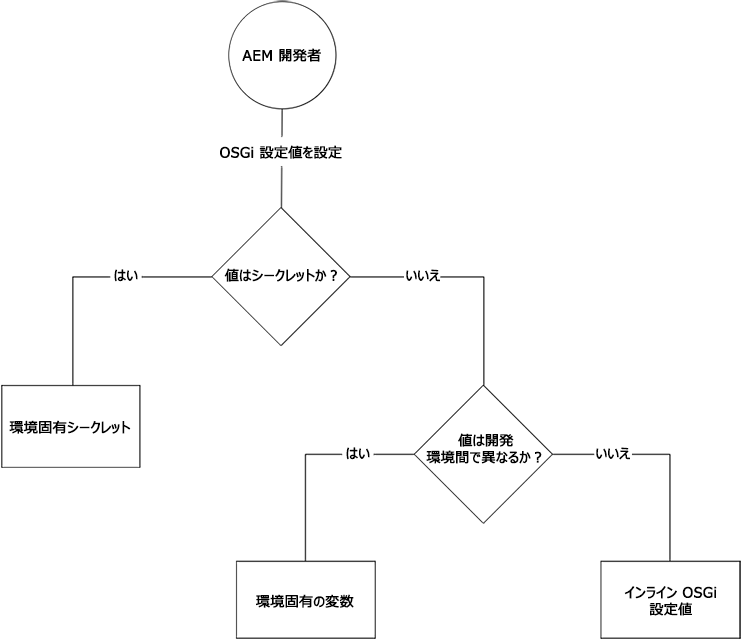

# AEM as a Cloud Service の OSGi の設定 {#configuring-osgi-for-aem-as-a-cloud-service}

[OSGi](https://www.osgi.org/) は Adobe Experience Manager（AEM）のテクノロジースタックの基本要素です。AEM とその設定の複合バンドルを制御するために使用されます。

OSGi で提供されている標準化されたプリミティブにより、サイズが小さく再利用やコラボレーションが可能なコンポーネントからアプリケーションを構築できます。これらのコンポーネントからアプリケーションを作成し、デプロイすることができます。これにより、OSGi バンドルの管理が容易になり、バンドルを個別に停止、インストール、開始できます。相互依存関係は自動的に処理されます。各 OSGi コンポーネントは、様々なバンドルの 1 つに含まれています。詳しくは、[OSGi の仕様](https://www.osgi.org/Specifications/HomePage)を参照してください。

AEM コードプロジェクトに含まれる設定ファイルを使用して、OSGi コンポーネントの設定を管理できます。

## OSGi の設定ファイル{#osgi-configuration-files}

設定の変更は、 AEM プロジェクトのコードパッケージ（`ui.apps`）で、実行モード固有の config フォルダーの下に設定ファイル（`.cfg.json`）として定義されます。

`/apps/example/config.<runmode>`

OSGi 設定ファイルは、Apache Sling プロジェクトで定義されている `.cfg.json` 形式を使用した JSON ベース形式です。

OSGi 設定は Persistent Identity（PID）を介して OSGi コンポーネントをターゲットに設定します。デフォルトは、OSGi コンポーネントの Java クラス名です。例えば、OSGi サービス用の OSGi 設定を提供するには、次のように実装します。

`com.example.workflow.impl.ApprovalWorkflow.java`

OSGi 設定ファイルは次の場所で定義されます。

`/apps/example/config/com.example.workflow.impl.ApprovalWorkflow.cfg.json`

cfg.json OSGi 設定形式に従います。

>[!NOTE]
>
>以前のバージョンの AEM は、.cfg、.config、XML sling:OsgiConfig リソース定義など、様々なファイル形式の OSGi 設定ファイルをサポートしていました。これらの形式は、cfg.json OSGi 設定形式に置き換えられます。

## 実行モードの解決{#runmode-resolution}

実行モードを使用すると、特定の OSGi 設定を特定の AEM インスタンスにターゲット設定できます。実行モードを使用するには、次の形式で、`/apps/example`（「example」はプロジェクト名）の下に config フォルダーを作成します。

`/apps/example/config.<author|publish>.<dev|stage|prod>/`

config フォルダー名で定義された実行モードが AEM で使用される実行モードと一致する場合、このようなフォルダー内の OSGi 設定が使用されます。

例えば、AEM がオーサーと開発の実行モードを使用している場合、`/apps/example/config.author/` および `/apps/example/config.author.dev/` の設定ノードが適用され、`/apps/example/config.publish/` および `/apps/example/config.author.stage/` の設定ノードは適用されません。

同じ PID に複数の設定が該当する場合は、一致する実行モードの数が最も大きい設定が適用されます。

このルールの精度は PID レベルです。つまり、`/apps/example/config.author/` で同じ PID の一部のプロパティと、`/apps/example/config.author.dev/` で同じ PID のより具体的なプロパティを定義することはできません。一致する実行モードの数が最も多い設定は、PID 全体に対して効果的です。

ローカルで開発する場合は、実行モード起動パラメーターを渡して、使用する実行モード OSGi 設定を指定できます。

## OSGi 設定値のタイプ{#types-of-osgi-configuration-values}

AEM as a Cloud Service で使用できる OSGi 設定値は 3 種類あります。

1. **インライン値**：OSGi 設定にハードコーディングされ、Git に保存される値です。次に例を示します。

   ```json
   {
      "connection.timeout": 1000
   }
   ```

1. **シークレット値**：セキュリティ上の理由から Git に保存しない値です。次に例を示します。

   ```json
   {
   "api-key": "$[secret:server-api-key]"
   } 
   ```

1. **環境固有値**：開発環境間で変化する値なので、実行モードで正確にターゲットを設定できません（AEM as a Cloud Service には 1 つの `dev` 実行モードのみ存在するため）。次に例を示します。

   ```json
   {
    "url": "$[env:server-url]"
   }
   ```

   1 つの OSGi 設定ファイルで、これらの設定値タイプの任意の組み合わせを併用できます。次に例を示します。

   ```json
   {
   "connection.timeout": 1000,
   "api-key": "$[secret:server-api-key]",
   "url": "$[env:server-url]"
   }
   ```

## 適切な OSGi 設定値タイプの選択方法 {#how-to-choose-the-appropriate-osgi-configuration-value-type}

OSGi では、インライン OSGi 設定値を使用する場合が多くあります。環境固有の設定は、開発環境間で値が異なる特定の使用例に対してのみ使用します。



環境固有の設定は、インライン値を含む、従来の静的に定義された OSGi 設定を拡張し、Cloud Manager API を介して OSGi 設定値を外部で管理できるようにします。インライン値を定義して Git に保存する一般的で従来の方法を使用する必要がある場合と、値を環境固有の設定に抽象化する必要がある場合を理解することが重要です。

次のガイダンスは、非シークレットの場合とシークレットの場合の環境固有の設定を使用する手順を示しています。

### インライン設定値を使用する場合 {#when-to-use-inline-configuration-values}

インライン設定の値は標準的なアプローチと見なされるので、可能であればこの設定を使用してください。インライン設定には次のような利点があります。

* Git でガバナンスとバージョン履歴に基づいて管理される
* 値はコードデプロイメントに暗黙的に結び付けられる
* デプロイメントに関する検討事項や調整を追加する必要がない

OSGi 設定値を定義する場合は、インライン値から開始し、必要な場合にのみシークレット設定または環境固有の設定を選択します。

### 非シークレットの環境固有の設定値を使用する場合 {#when-to-use-non-secret-environment-specific-configuration-values}

非シークレットの設定値に対しては、開発環境間で値が異なる場合にのみ、環境固有の設定（`$[env:ENV_VAR_NAME]`）を使用してください。これには、ローカル開発インスタンスと、AEM as a Cloud Service 開発環境が含まれます。非シークレットの環境固有の設定を、AEM as a Cloud Service のステージングまたは実稼働環境に使用しないでください。

* ローカル開発インスタンスなど、開発環境間で異なる設定値に対しては、非シークレットの環境固有の設定のみを使用します。
* 代わりに、ステージングと実稼働の非シークレット値の OSGi 設定では、標準のインライン値を使用します。これに関連して、ステージ環境と実稼働環境に対して、環境固有の設定を使用して、実行時に設定を変更しやすくすることは勧められません。これらの変更は、ソースコード管理を通じて導入する必要があります。

### シークレットの環境固有の設定値を使用する場合 {#when-to-use-secret-environment-specific-configuration-values}

AEM as a Cloud Service では、セキュリティ上の理由から、パスワード、プライベート API キー、Git に保存できない他の値など、シークレットの OSGi 設定値に対して環境固有の設定（`$[secret:SECRET_VAR_NAME]`）を使用する必要があります。

シークレットの環境固有の設定を使用して、ステージングや実稼働などのあらゆる AEM as a Cloud Service 環境にシークレットの値を保存します。

<!-- ### Adding a New Configuration to the Repository {#adding-a-new-configuration-to-the-repository}

#### What You Need to Know {#what-you-need-to-know}

To add a new configuration to the repository you need to know the following:

1. The **Persistent Identity** (PID) of the service.

   Reference the **Configurations** field in the Web console. The name is shown in brackets after the bundle name (or in the **Configuration Information** towards the bottom of the page).

   For example, create a node `com.day.cq.wcm.core.impl.VersionManagerImpl.` to configure **AEM WCM Version Manager**.

   

1. Whether a specific runmode is required. Create the folder:

    * `config` - for all run modes
    * `config.author` - for the author environment
    * `config.publish` - for the publish environment
    * `config.<run-mode>` - as appropriate

1. Whether a **Configuration** or **Factory Configuration** is necessary.
1. The individual parameters to be configured; including any existing parameter definitions that will need to be recreated.

   Reference the individual parameter field in the Web console. The name is shown in brackets for each parameter.

   For example, create a property
   `versionmanager.createVersionOnActivation` to configure **Create Version on Activation**.

   

1. Does a configuration already exist in `/libs`? To list all configurations in your instance, use the **Query** tool in CRXDE Lite to submit the following SQL query:

   `select * from sling:OsgiConfig`

   If so, this configuration can be copied to ` /apps/<yourProject>/`, then customized in the new location. -->

## OSGi 設定の作成

以下に説明するように、新しい OSGi 設定を作成する方法は 2 つあります。前者の方法は、通常、開発者によってよく知られている OSGi のプロパティと値を持つカスタム OSGi コンポーネントの設定に使用され、後者は AEM が提供する OSGi コンポーネントの設定に使用されます。

### OSGi 設定の書き込み

JSON 形式の OSGi 設定ファイルは、AEM プロジェクト内から直接手動で書き込むことができます。これは、よく知られている OSGi コンポーネント、特に、設定を定義する同じ開発者が設計および開発したカスタム OSGi コンポーネントに対して、OSGi 設定をすばやく作成する方法です。この方法は、同じ OSGi コンポーネントの設定を様々な実行モードフォルダーにコピー／貼り付け、更新する場合にも利用できます。

1. IDE で `ui.apps` プロジェクトを開き、新しい OSGi 構成が有効となる実行モードをターゲットに設定する config フォルダー（`/apps/.../config.<runmode>`）を探すか作成します
1. この config フォルダーに、新しい `<PID>.cfg.json` ファイルを作成します。PID は OSGi コンポーネントの永続的な ID です。通常、OSGi コンポーネントの実装の完全なクラス名です。次に例を示します。
   `/apps/.../config/com.example.workflow.impl.ApprovalWorkflow.cfg.json`
OSGi 設定ファクトリのファイル名には、`<PID>-<factory-name>.cfg.json` 命名規則を使用します。
1. 新しい `.cfg.json` ファイルを開き、[JSON OSGi 設定形式](https://sling.apache.org/documentation/bundles/configuration-installer-factory.html#configuration-files-cfgjson-1)に従って、OSGi プロパティと値のペアのキー／値の組み合わせを定義します。
1. 変更を新しい `.cfg.json` ファイルに保存します。
1. 新しい追加 OSGi 構成ファイルを Git にコミットします。

### AEM SDK Quickstart を使用した OSGi 設定の生成

AEM SDK Quickstart Jar の AEM Web コンソールは、OSGi コンポーネントの設定、および JSON として OSGi 設定を書き出すために使用できます。これは、OSGi プロパティとその値の形式が AEM プロジェクトで OSGi 設定を定義する開発者には理解されない可能性のある、AEM が提供する OSGi コンポーネントを設定する場合に役立ちます。AEM Web コンソールの設定 UI を使用すると、リポジトリに `.cfg.json` ファイルが書き込まれるので、AEM プロジェクト定義の OSGi 設定が生成される設定と異なる場合、ローカル開発中の予期しない動作を回避するために、これに注意が必要です。

1. AEM SDK Quickstart Jar の AEM Web コンソールに管理者ユーザーとしてログインします。
1. OSGi／設定に移動します。
1. 設定する OSGi コンポーネントを探し、タイトルをタップして編集します。
   
1. 必要に応じて Web UI を使用して OSGi 設定プロパティの値を編集します。
1. 安全な場所に永続的な ID（PID）を記録します。これは後で OSGi 設定 JSON の生成に使用されます。
1. 「保存」をタップします。
1. OSGi／OSGi インストーラー設定プリンターに移動します。
1. 手順 5 でコピーした PID に貼り付け、シリアル化形式が「OSGi Configurator JSON」に設定されていることを確認します。
1. 「印刷」をタップします。
1. JSON 形式の OSGi 設定は、「シリアライズされた設定プロパティ」セクションに表示されます。
   
1. IDE で `ui.apps` プロジェクトを開き、新しい OSGi 構成が有効となる実行モードをターゲットに設定する config フォルダー（`/apps/.../config.<runmode>`）を探すか作成します
1. この config フォルダーに、新しい `<PID>.cfg.json` ファイルを作成します。PID は、手順 5 と同じ値です。
1. 手順 10 のシリアライズされた設定プロパティを `.cfg.json` ファイルに貼り付けます。
1. 変更を新しい `.cfg.json` ファイルに保存します。
1. 新しい追加 OSGi 構成ファイルを Git にコミットします。


## OSGi 構成プロパティの形式

### インライン値 {#inline-values}

予想できるかもしれませんが、インライン値は、標準の JSON 構文に従って、標準の名前と値のペアとして形式設定されます。次に例を示します。

```json
{
   "my_var1": "val",
   "my_var2": [ "abc", "def" ],
   "my_var3": 500
}
```

### 環境固有の設定値 {#environment-specific-configuration-values}

OSGi 設定では、環境ごとに定義する変数にプレースホルダーを割り当てる必要があります。

```
use $[env:ENV_VAR_NAME]
```

顧客は、カスタムコードに関連する OSGi 設定プロパティに対してのみ、この手法を使用する必要があります。アドビ定義の OSGi 設定を上書きする場合は使用しないでください。

### シークレットの設定値 {#secret-configuration-values}

OSGi 設定では、環境ごとに定義するシークレットにプレースホルダーを割り当てる必要があります。

```
use $[secret:SECRET_VAR_NAME]
```

### 変数の命名 {#variable-naming}

環境固有の設定値とシークレットの設定値の両方に次のことが適用されます。

変数名は、次の規則に従う必要があります。

* 最小長：2
* 最大長：100
* 次の正規表現と一致する必要があります。`[a-zA-Z_][a-zA-Z_0-9]*`

変数の値は 2048 文字を超えないようにします。

### デフォルト値 {#default-values}

環境固有の設定値とシークレットの設定値の両方に次のことが適用されます。

環境単位の値を設定しない場合、補間がおこなわれないので、プレースホルダーは実行時に置き換えられず、配置されたままになります。これを回避するには、プレースホルダーの一部として次の構文でデフォルト値を指定します。

```
$[env:ENV_VAR_NAME;default=<value>]
```

デフォルト値を指定すると、プレースホルダーは、環境ごとの値（指定した場合）または指定したデフォルト値に置き換えられます。

### ローカル開発 {#local-development}

環境固有の設定値とシークレットの設定値の両方に次のことが適用されます。

変数は、実行時にローカル AEM によって取得されるように、ローカル環境で定義できます。例えば、Linux の場合：

```bash
export ENV_VAR_NAME=my_value
```

設定で使用される環境変数を設定し、AEM を起動する前に実行する、単純な bash スクリプトを記述することをお勧めします。[https://direnv.net/](https://direnv.net/) などのツールを使うと、このアプローチを簡略化できます。すべてのユーザー間で共有できる場合は、値のタイプに応じて、値をソースコード管理にチェックインできることがあります。

シークレットの値はファイルから読み取られます。したがって、シークレットを使用するプレースホルダーごとに、シークレット値を含むテキストファイルを作成する必要があります。

例えば、`$[secret:server_password]` を使用する場合は、**server_password** という名前のテキストファイルを作成する必要があります。これらのシークレットファイルはすべて同じディレクトリに保存する必要があり、フレームワークプロパティ `org.apache.felix.configadmin.plugin.interpolation.secretsdir` は、そのローカルディレクトリを使用して設定する必要があります。

### オーサーとパブリッシュの設定 {#author-vs-publish-configuration}

OSGi プロパティで、作成者とパブリッシュで異なる値が必要な場合：

* `config.author`実行モードの解決`config.publish`の節で説明したように、個別の [ と ](#runmode-resolution) の OSGi フォルダーを使用する必要があります。
* 独立変数名を使用する必要があります。変数名が同じである場合は、`author_<variablename>` および `publish_<variablename>` などのプレフィックスを使用することをお勧めします。

### 設定例 {#configuration-examples}

以下の例では、ステージング環境と実稼働環境に加えて、3 つの開発環境があると仮定します。

**例 1**

OSGi プロパティ `my_var1` の値を、ステージングと実稼働環境で同じ値、3 つの開発環境ではそれぞれ異なる値にします。

<table>
<tr>
<td>
<b>Folder</b>
</td>
<td>
<b>myfile.cfg.json の内容</b>
</td>
</tr>
<tr>
<td>
config
</td>
<td>
<pre>
{ 
 "my_var1": "val",
 "my_var2": "abc",
 "my_var3": 500
}
</pre>
</td>
</tr>
<tr>
<td>
config.dev
</td>
<td>
<pre>
{ 
 "my_var1" : "$[env:my_var1]"
 "my_var2": "abc",
 "my_var3": 500
}
</pre>
</td>
</tr>
</table>

**例 2**

OSGi プロパティ `my_var1` の値をステージング、実稼働、3 つの開発環境でそれぞれ異なる値にします。したがって、各開発環境の値 `my_var1` を設定するには、Cloud Manager API を呼び出す必要があります。

<table>
<tr>
<td>
<b>Folder</b>
</td>
<td>
<b>myfile.cfg.json の内容</b>
</td>
</tr>
<tr>
<td>
config.stage
</td>
<td>
<pre>
{ 
 "my_var1": "val1",
 "my_var2": "abc",
 "my_var3": 500
}
</pre>
</td>
</tr>
<tr>
<td>
config.prod
</td>
<td>
<pre>
{ 
 "my_var1": "val2",
 "my_var2": "abc",
 "my_var3": 500
}
</pre>
</td>
</tr>
<tr>
<td>
config.dev
</td>
<td>
<pre>
{ 
 "my_var1" : "$[env:my_var1]"
 "my_var2": "abc",
 "my_var3": 500
}
</pre>
</td>
</tr>
</table>

**例 3**

OSGi プロパティ `my_var1` の値をステージング、実稼働、1 つの開発環境で同じ値、他の 2 つの開発環境では異なる値にします。この場合、Cloud Manager API を呼び出して各開発環境の値 `my_var1` を設定する必要があります。この値は、ステージングと実稼働と同じ値にする必要がある開発環境も含みます。フォルダー **config** に設定された値は継承されません。

<table>
<tr>
<td>
<b>Folder</b>
</td>
<td>
<b>myfile.cfg.json の内容</b>
</td>
</tr>
<tr>
<td>
config
</td>
<td>
<pre>
{ 
 "my_var1": "val1",
 "my_var2": "abc",
 "my_var3": 500
}
</pre>
</td>
</tr>
<tr>
<td>
config.dev
</td>
<td>
<pre>
{ 
 "my_var1" : "$[env:my_var1]"
 "my_var2": "abc",
 "my_var3": 500
}
</pre>
</td>
</tr>
</table>

これをおこなう別の方法は、config.dev フォルダーの置き換えトークンのデフォルト値を、**config** フォルダーと同じ値に設定することです。

<table>
<tr>
<td>
<b>Folder</b>
</td>
<td>
<b>myfile.cfg.json の内容</b>
</td>
</tr>
<tr>
<td>
config
</td>
<td>
<pre>
{ 
 "my_var1": "val1",
 "my_var2": "abc",
 "my_var3": 500
}
</pre>
</td>
</tr>
<tr>
<td>
config.dev
</td>
<td>
<pre>
{ 
 "my_var1": "$[env:my_var1;default=val1]"
 "my_var2": "abc",
 "my_var3": 500
}
</pre>
</td>
</tr>
</table>

## プロパティ設定用の Cloud Manager API 形式 {#cloud-manager-api-format-for-setting-properties}

### API を使用した値の設定 {#setting-values-via-api}

API を呼び出すと、一般的なカスタマーコードのデプロイメントパイプラインと同様に、新しい変数と値がクラウド環境にデプロイされます。オーサーとパブリッシュサービスは再起動され、新しい値が参照されます（通常、数分かかります）。

```
PATCH /program/{programId}/environment/{environmentId}/variables
```

```
]
        {
                "name" : "MY_VAR1",
                "value" : "plaintext value",
                "type" : "string"  <---default
        },
        {
                "name" : "MY_VAR2",
                "value" : "<secret value>",
                "type" : "secretString"
        }
]
```

デフォルトの変数は API 経由ではなく、OSGi プロパティ自体に設定されることに注意してください。

詳しくは、[こちらのページ](https://www.adobe.io/apis/experiencecloud/cloud-manager/api-reference.html#/Environment_Variables/patchEnvironmentVariables)を参照してください。

### API を使用した値の取得 {#getting-values-via-api}

```
GET /program/{programId}/environment/{environmentId}/variables
```

詳しくは、[こちらのページ](https://www.adobe.io/apis/experiencecloud/cloud-manager/api-reference.html#/Environment_Variables/getEnvironmentVariables)を参照してください。

### API を使用した値の削除 {#deleting-values-via-api}

```
PATCH /program/{programId}/environment/{environmentId}/variables
```

変数を削除するには、空の値を含めます。

詳しくは、[こちらのページ](https://www.adobe.io/apis/experiencecloud/cloud-manager/api-reference.html#/Environment_Variables/patchEnvironmentVariables)を参照してください。

### コマンドラインを使用した値の取得 {#getting-values-via-cli}

```bash
$ aio cloudmanager:list-environment-variables ENVIRONMENT_ID
Name     Type         Value
MY_VAR1  string       plaintext value 
MY_VAR2  secretString ****
```


### コマンドラインを使用した値の設定 {#setting-values-via-cli}

```bash
$ aio cloudmanager:set-environment-variables ENVIRONMENT_ID --variable MY_VAR1 "plaintext value" --secret MY_VAR2 "some secret value"
```

### コマンドラインを使用した値の削除 {#deleting-values-via-cli}

```bash
$ aio cloudmanager:set-environment-variables ENVIRONMENT_ID --delete MY_VAR1 MY_VAR2
```

>[!NOTE]
>
>Adobe I/O CLI 用の Cloud Manager プラグインを使用した値の設定方法の詳細については、[こちらのページ](https://github.com/adobe/aio-cli-plugin-cloudmanager#aio-cloudmanagerset-environment-variables-environmentid)を参照してください。

### 変数の数 {#number-of-variables}

1 つの環境につき最大 200 個の変数を宣言できます。

## シークレットおよび環境固有の設定値のデプロイメントに関する考慮事項 {#deployment-considerations-for-secret-and-environment-specific-configuration-values}

シークレットと環境に固有の設定値は Git の外部に存在するので、AEM as a Cloud Service の正式なデプロイメントメカニズムには含まれません。そのため、顧客が管理および統括し、AEM as a Cloud Service のデプロイメントプロセスに統合する必要があります。

前述したように、API を呼び出すと、一般的なカスタマーコードのデプロイメントパイプラインと同様に、新しい変数と値がクラウド環境にデプロイされます。オーサーとパブリッシュサービスは再起動され、新しい値が参照されます（通常、数分かかります）。通常のコードのデプロイメント中に Cloud Manager によって実行される品質ゲートおよびテストは、このプロセス中は実行されません。

通常、Cloud Manager で API を使用するコードをデプロイする前に、API を呼び出して環境変数を設定します。場合によっては、コードが既にデプロイされた後で既存の変数を変更する必要があります。

パイプラインが AEM の更新または顧客向けのデプロイメントで使用中の場合、その時点でエンドツーエンドパイプラインのどの部分が実行されているかに応じて、API が正常に動作しない可能性があります。エラーの応答は、リクエストが成功しなかったことを示しますが、理由は示しません。

予定されている顧客コードのデプロイメントが、新しい値を持つ既存の変数に依存している場合があります。これは、現在のコードには適していません。これが問題となる場合は、変数の変更を加える方法をお勧めします。そのためには、古いコードが新しい値を参照しないように、古い変数の値を変更する代わりに、新しい変数名を作成します。後日、新しいカスタマーリリースが安定したら、古い値を削除できます。

同様に、変数の値はバージョン管理されないので、コードのロールバックによって、新しい値を参照することで問題を引き起こす場合があります。上記の変数の加算方式戦略は、この場合にも役立ちます。

この変数の加算方式戦略は、数日前のコードを再デプロイする必要がある災害復旧シナリオにも役立ちます。コードが参照する変数名と値は変わりません。これは、顧客が古い変数を削除する前に数日間待機するという手法に依存しています。この手法を使用していない場合、古いコードには参照できる適切な変数はありません。