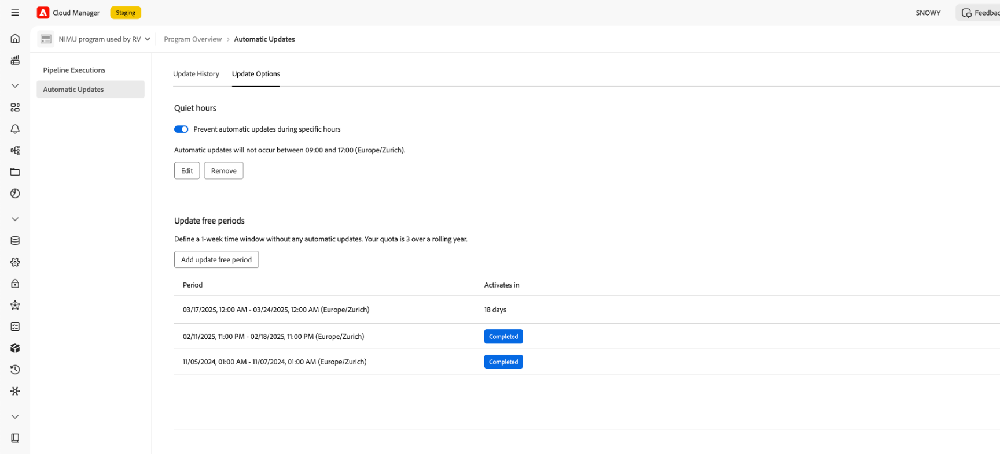
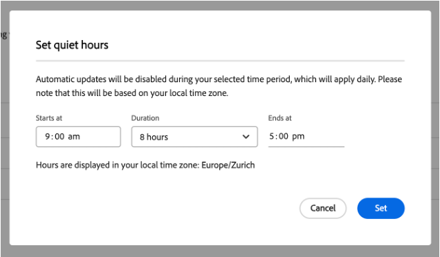
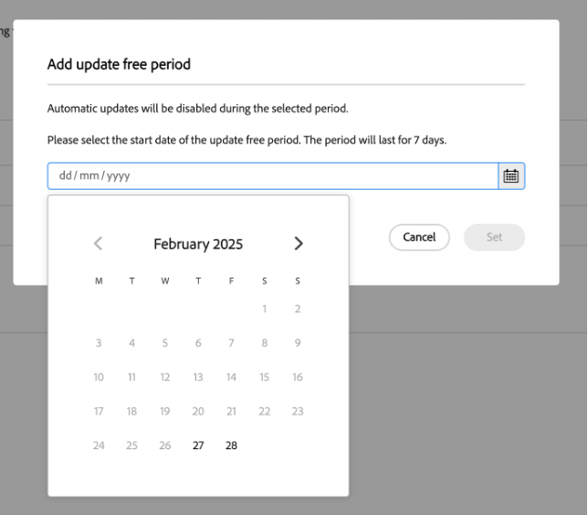

# 非表示時間と自由期間の更新 {#quiet-hours-update-free-periods}

>[!NOTE]
>この機能は、9 月 25 日（PT）以降、**限定提供** 機能として使用できるようになります。 プログラムで機能をアクティブにするには、[aemcs-update-free@adobe.com](mailto:aemcs-update-free@adobe.com) にメールを送信します。

>[!WARNING]
>「停止時間」機能と「自由期間の更新」機能は、[ 自動メンテナンス更新 ](/help/implementing/deploying/aem-version-updates.md) にオンボーディングされた後でのみ使用できます。

AEM as a Cloud Service[ 自動メンテナンスアップデート ](/help/implementing/deploying/aem-version-updates.md) は、インスタンスのセキュリティを確保し、最新のメンテナンスリリースを最新の状態に保ちます。 ただし、運用開始イベントなどの場合には、潜在的な中断から重要な営業時間を「保護」する必要が生じる可能性があります。 そのため、AEM as a Cloud Serviceでは、進行中のプログラムに自動更新が行われない時間枠を設定できます。

次の 2 つのスケジュール・オプションを使用して、これらのタイム・フレームを構成できます。

* **待ち時間** – 更新が行われない毎日の時間間隔（最大 8 時間）を定義できます。
* **自由期間の更新** – 更新が行われない 7 日間の期間を定義できます。 12 か月の期間内に最大 3 つの更新自由期間を設定できます。

更新自由期間と非表示時間機能は、「プログラム単位」で設定されます。

また、AEM as a Cloud Serviceの自動メンテナンススケジュールについては、[Experience Manager リリースロードマップ ](https://experienceleague.adobe.com/ja/docs/experience-manager-release-information/aem-release-updates/update-releases-roadmap) のページを参照してください。

## 通知のない時間 {#quiet-hours}

クワイエットアワー機能を使用すると、自動更新を行わずに、日中の時間枠を定義できます。 すべてのメンテナンス更新は、設定された時間枠外に行われるようにシフトします。 例えば、指定した待ち時間に更新がスケジュールされている場合、待ち時間の間隔が終了した後に、更新が自動的に開始されます。 設定されている時間間隔は 8 時間を超えることはできないため、引き続き毎日更新を行うことができます。

ローカルタイムゾーンを使用して **プログラムごとに** これらの非表示時間を定義できます。

### クワイエット時間間隔の設定方法 {#configure-quiet-hours}

非表示時間帯は、AEM Cloud Manager インターフェイスを使用して次のように設定できます。

**アクティビティ/自動更新/更新オプション** に移動します。

1. 「**特定の時間内に自動更新を行わない**」オプションが切り替えられていることを確認します。
2. 「**編集**」をクリックします。
3. 設定ウィンドウでクワイエット時間間隔を設定します。

設定した開始時間と終了時間は、今後、すべてのカレンダー日に適用されます。 必要に応じて、クワイエットアワー時間の値を無効にするか、再設定できます。

## 自由期間の更新 {#update-free-periods}

自由期間の更新機能を使用すると、更新が行われない 7 日間の時間枠を定義できます。 設定が完了すると、定義された時間枠外にメンテナンスアップデートがすべて自動的に移行されます。 12 か月の期間内に最大 3 つの更新無料期間を設定できます。 また、更新無料期間は最長 1 年先まで指定できます。

このオプションを設定する場合、自動更新を容易にするために、（少なくとも）期間の間に 1 週間の時間間隔が必須であることに注意してください。 そのため、この 1 週間の時間間隔は自動的に適用され、設定した更新の空き期間の間にカレンダーに追加されます。 これにより、一部のカレンダー日が選択できなくなる可能性があります。

更新自由期間は **プログラムごと** 定義できます。

### 更新自由期間の設定方法 {#configure-update-free-periods}

自由期間の更新機能は、次のようにAEM Cloud Manager インターフェイスを使用して設定できます。

**アクティビティ/自動更新/更新オプション** に移動します。

1. 「自由期間の更新」セクションに移動します。
2. **無料期間を追加/更新** をクリックします。
3. カレンダーから 1 週間の更新自由期間を選択します。

**アクティブ** アイコンは現在アクティブな更新空き期間の近くに表示され、**完了** アイコンは完了した更新空き期間の近くに表示されます。
