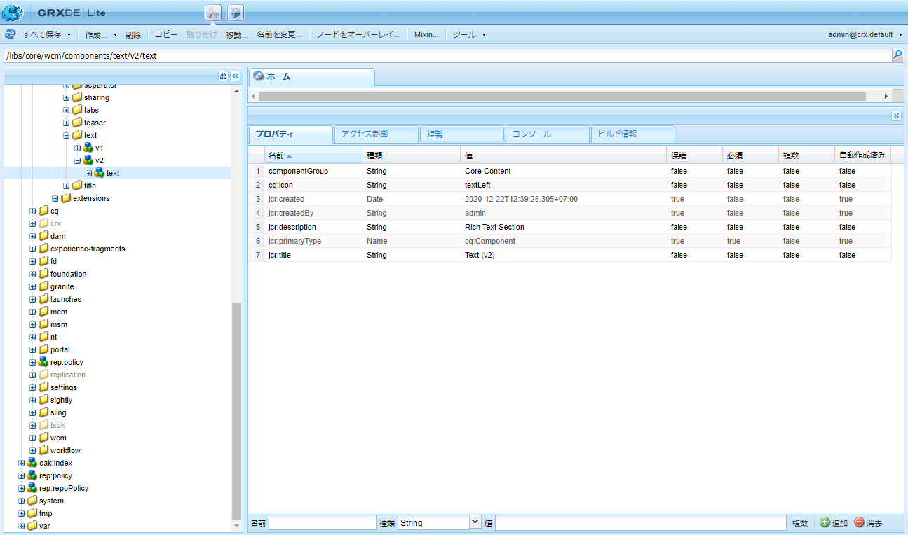
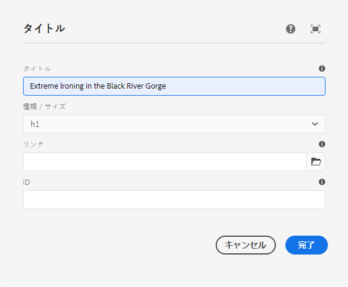
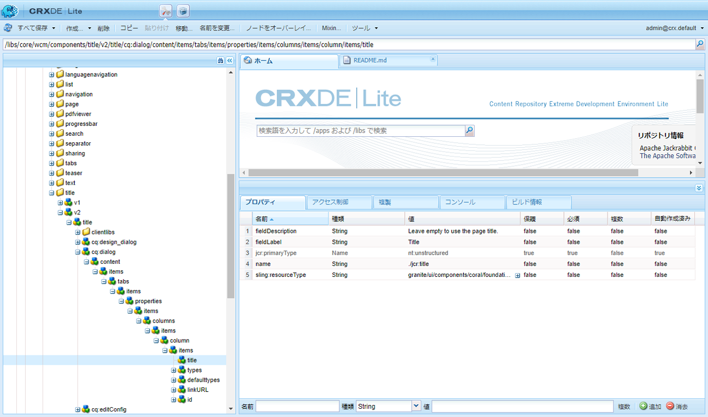
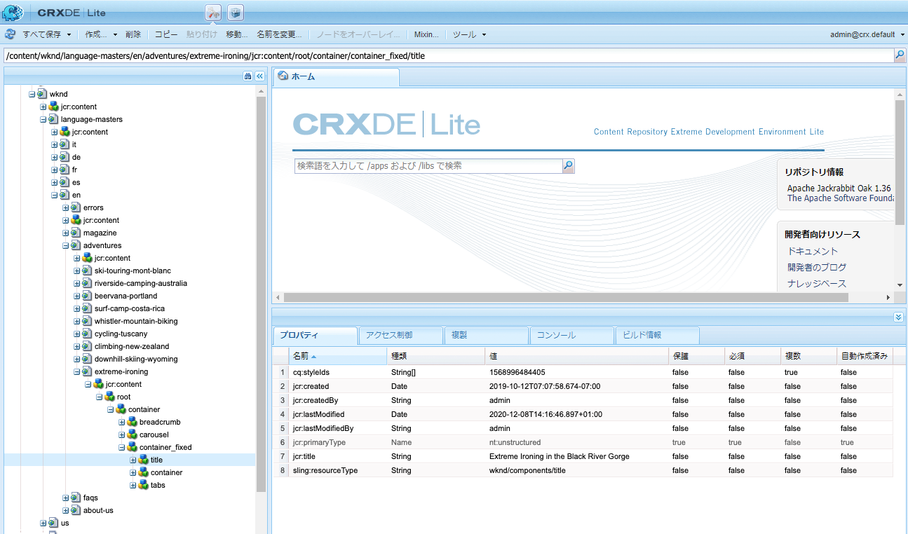
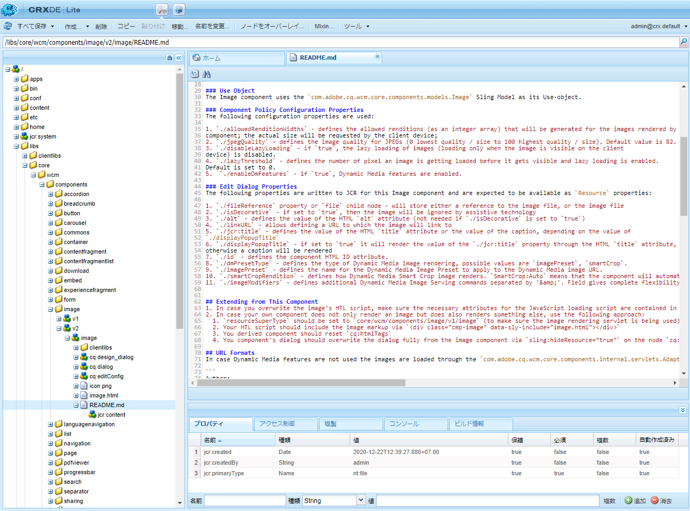
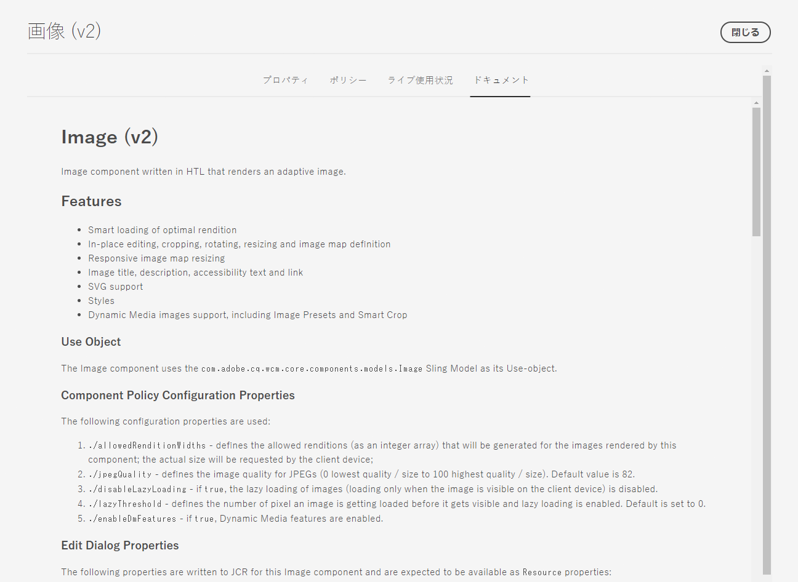

# コンポーネントリファレンスガイド{#components-reference-guide}

コンポーネントは、AEMでエクスペリエンスを構築する際の核心となります。 [コアコンポーネント](https://experienceleague.adobe.com/docs/experience-manager-core-components/using/introduction.html)と[AEMプロジェクトのアーキタイプ](https://experienceleague.adobe.com/docs/experience-manager-core-components/using/developing/archetype/overview.html)を使うと、既製で堅牢なコンポーネントのツールセットを簡単に使い始めることができます。 [WKND Tutorial](/help/implementing/developing/introduction/develop-wknd-tutorial.md)では、開発者がこれらのツールの使用方法と、新しいAEMサイトを作成するためのカスタムコンポーネントの作成方法を学びます。

>[!TIP]
>
>このドキュメントを参照する前に、[WKND Tutorial](/help/implementing/developing/introduction/develop-wknd-tutorial.md)を完了し、[コアコンポーネント](https://experienceleague.adobe.com/docs/experience-manager-core-components/using/introduction.html)と[AEMプロジェクトのアーキタイプに精通していることを確認してください。](https://experienceleague.adobe.com/docs/experience-manager-core-components/using/developing/archetype/overview.html)

WKNDチュートリアルではほとんどの使用例をカバーしているので、このドキュメントはこれらのリソースを補完する目的でのみ使用されます。 AEMでのコンポーネントの構造化および設定方法に関する詳細な技術的詳細を説明し、入門用ガイドとしての意図はありません。

## 概要 {#overview}

この節では、独自コンポーネントの開発時に知っておくべき詳細の導入段階として、基本的な概念と注意点について説明します。

### 計画 {#planning}

実際にコンポーネントを設定またはコーディングする前に、次のように尋ねる必要があります。

* そもそも新しいコンポーネントで何をするか
* コンポーネントを一から作成する必要があるか、基本部分を既存のコンポーネントから継承できるか
* コンポーネントのコンテンツを選択または操作するためのロジックが必要か
   * ロジックは、ユーザーインターフェイス層から分離しておく必要があります。HTL はこれに対応した設計になっています。
* コンポーネントを CSS で書式設定する必要があるか
   * CSS による書式設定は、コンポーネント定義から分離しておく必要があります。外部の CSS ファイルを通じて HTML 要素を変更できるように、HTML 要素の命名規約を定義してください。
* 新しいコンポーネントが導入するセキュリティ上の影響は何ですか。

### 既存のコンポーネントの再利用{#reusing-components}

完全に新しいコンポーネントの作成に時間を費やす前に、既存のコンポーネントのカスタマイズや拡張を検討してください。 [コア](https://experienceleague.adobe.com/docs/experience-manager-core-components/using/introduction.html) コンポーネントは、柔軟で堅牢かつ十分にテストされた実稼働用コンポーネントのスイートを提供します。

#### コアコンポーネントの拡張{#extending-core-components}

また、コアコンポーネントは、オファー[クリアなカスタマイズパターン](https://experienceleague.adobe.com/docs/experience-manager-core-components/using/developing/customizing.html)を使用して、独自のプロジェクトのニーズに合わせることもできます。

#### コンポーネントのオーバーレイ{#overlying-components}

コンポーネントは、検索パスロジックに基づいて、[オーバーレイ](/help/implementing/developing/introduction/overlays.md)で再定義することもできます。 ただし、この場合、[Sling Resource Marge](/help/implementing/developing/introduction/sling-resource-merger.md)はトリガされず、`/apps`はオーバーレイ全体を定義する必要があります。

#### コンポーネントダイアログの拡張{#extending-component-dialogs}

Sling Resource Merger を使用し、`sling:resourceSuperType` プロパティを定義して、コンポーネントダイアログをオーバーライドすることもできます。

つまり、ダイアログ全体を再定義するのではなく、必要な違いだけを再定義する必要があります。

### コンテンツのロジックとマークアップのレンダリング  {#content-logic-and-rendering-markup}

コンポーネントは [HTML を使用してレンダリングされます。](https://www.w3schools.com/htmL/html_intro.asp)コンポーネントでは、リクエストされたコンテンツを取得して、オーサリング環境とパブリッシュ環境の両方で必要に応じてレンダリングするために必要な HTML を定義しなければなりません。

マークアップおよびレンダリングをおこなうコードと、コンポーネントのコンテンツ選択に関するロジックを制御するコードは、分離しておくことをお勧めします。

この方法をサポートするテンプレート言語が [HTL](https://experienceleague.adobe.com/docs/experience-manager-htl/using/overview.html) です。HTL では、基盤となるビジネスロジックを定義するときにのみプログラミング言語を使用します。このメカニズムは、特定の表示に対して呼び出されるコードを強調表示し、必要に応じて、同じコンポーネントの異なる表示に対して特定のロジックを許可します。

この（オプション）ロジックは様々な方法で実装でき、次に示す特定のコマンドを使用してHTLから呼び出します。

* Javaの使用 — [HTL Java Use-API](https://helpx.adobe.com/experience-manager/htl/using/use-api-java.html)を使用すると、HTLファイルからカスタムJavaクラスのヘルパーメソッドにアクセスできます。 そのため、Java コードを使用して、コンポーネントのコンテンツを選択および設定するためのロジックを実装できます。
* JavaScript の使用 - [HTL JavaScript Use-API](https://experienceleague.adobe.com/docs/experience-manager-htl/using/htl/use-api-javascript.html)は、HTLファイルがJavaScriptで記述されたヘルパーコードにアクセスできるようにします。 そのため、JavaScript コードを使用して、コンポーネントのコンテンツを選択および設定するためのロジックを実装できます。
* クライアント側ライブラリの使用 — 最新のWebサイトは、複雑なJavaScriptとCSSコードによるクライアント側の処理に大きく依存しています。 詳しくは、「AEMでのクライアント側ライブラリのCloud Serviceとしての使用[」のドキュメントを参照してください。](/help/implementing/developing/introduction/clientlibs.md)

### 独自コンポーネントの開発 {#developing-your-own-components}

開発コンテンツはこちら？

## コンポーネント構造{#structure}

AEMコンポーネントの構造は強力で柔軟性があります。 主な部分は次のとおりです。

* [リソースタイプ](#resource-type)
* [コンポーネント定義](#component-definition)
* [コンポーネントのプロパティおよび子ノード](#properties-and-child-nodes-of-a-component)
* [ダイアログ](#dialogs)
* [デザインダイアログ](#design-dialogs)

### リソースタイプ {#resource-type}

構造の重要な構成要素となるのが、リソースタイプです。

* コンテンツ構造は意図を宣言します。
* これらは、リソースタイプによって実装されます。

これは抽象化で、時間の経過とともにルックアンドフィールが変化しても、意図が時間を守るのに役立ちます。

### コンポーネント定義 {#component-definition}

コンポーネントの定義は次のように分解できます。

* AEMコンポーネントは[Sling.](https://sling.apache.org/documentation.html)に基づいています
* AEMコンポーネントは`/libs/core/wcm/components`の下にあります。
* プロジェクト/サイト固有のコンポーネントは`/apps/<myApp>/components`の下に配置されています。
* AEM の標準コンポーネントは、`cq:Component` として定義され、次の主要な構成要素を持ちます。
   * jcrプロパティ — jcrプロパティのリスト。 これらは変数であり、一部はオプションですが、コンポーネントノードの基本構造、そのプロパティ、サブノードは`cq:Component`定義によって定義されます。
   * リソース — コンポーネントで使用される静的要素を定義します。
   * スクリプト — コンポーネントの結果として生成されるインスタンスの動作を実装するために使用されます。

#### 重要なプロパティ{#vital-properties}

* **ルートノード**：
   * `<mycomponent> (cq:Component)`  — コンポーネントの階層ノード。
* **重要なプロパティ**：
   * `jcr:title`  — コンポーネントタイトル；例えば、コンポーネントが [コンポーネントブラウザーおよびコンポー](/help/sites-cloud/authoring/fundamentals/environment-tools.md#components-browser) ネント [コンソールに表示される場合にラベルとして使用されます。](/help/sites-cloud/authoring/features/components-console.md)
   * `jcr:description`  — コンポーネントの説明コンポーネントブラウザーおよびコンポーネントコンソールでマウスオーバーヒントとして使用
   * 詳しくは、[コンポーネントアイコン](#component-icon)を参照してください
* **重要な子ノード**：
   * `cq:editConfig (cq:EditConfig)`  — コンポーネントの編集プロパティを定義し、コンポーネントをコンポーネントブラウザーに表示できるようにします。
      * コンポーネントにダイアログがある場合、cq:editConfigが存在しなくても、コンポーネントブラウザーまたはサイドキックに自動的に表示されます。
   * `cq:childEditConfig (cq:EditConfig)`  — 独自のコンポーネントを定義しない子コンポーネントの作成者UI要素を制御し `cq:editConfig`ます。
   * `cq:dialog (nt:unstructured)`  — このコンポーネントのダイアログ。ユーザーがコンポーネントを設定したり、コンテンツを編集したりできるインターフェイスを定義します。
   * `cq:design_dialog (nt:unstructured)`  — このコンポーネントのデザイン編集

#### コンポーネントアイコン{#component-icon}

コンポーネントのアイコンまたは省略形は、開発者がコンポーネントを作成する際に、コンポーネントのJCRプロパティを介して定義されます。 これらのプロパティは、次の順番で評価され、最初に見つかった有効なプロパティが使用されます。

1. `cq:icon`  — コンポーネントブラウザに表示する [Coral UI](https://helpx.adobe.com/jp/experience-manager/6-5/sites/developing/using/reference-materials/coral-ui/coralui3/Coral.Icon.html) ライブラリ内の標準アイコンを示す文字列プロパティ。
   * Coral アイコンの HTML 属性の値を使用します。
1. `abbreviation`  — コンポーネントブラウザのコンポーネント名の省略形をカスタマイズする文字列プロパティ
   * 省略形は 最大2 文字までにする必要があります。
   * 空の文字列を指定すると、`jcr:title`プロパティの最初の2文字から省略形が作成されます。
      * 例えば、「Image」の場合は「Im」になります。
      * ローカライズされたタイトルが省略形の作成に使用されます。
   * 省略形は、コンポーネントに `abbreviation_commentI18n` プロパティがある場合にのみ翻訳されます。これは、翻訳ヒントとして使用されます。
1. `cq:icon.png` または `cq:icon.svg`  — コンポーネントブラウザに表示される、このコンポーネントのアイコン
   * 20 x 20 pixel は、標準的なコンポーネントのアイコンのサイズです。
      * 大きいアイコンはクライアント側で縮小されます。
   * レコメンデーションカラーはrgb(112, 112, 112) > #707070です。
   * 標準的なコンポーネントアイコンの背景は、透明です。
   * `.png`ファイルと`.svg`ファイルのみがサポートされています。
   * Eclipseプラグインを介してファイルシステムからインポートする場合、ファイル名は`_cq_icon.png`や`_cq_icon.svg`のようにエスケープする必要があります。
   * `.png` は、両方が存在する `.svg` 場合に先例となる。

上記のプロパティ(`cq:icon`、`abbreviation`、`cq:icon.png`、`cq:icon.svg`)がコンポーネントに見つからない場合：

* システムは、`sling:resourceSuperType` プロパティに続くスーパーコンポーネント上の同じプロパティを検索します。
* スーパーコンポーネントレベルで省略形が見つからない場合や空の省略形が見つかった場合は、現在のコンポーネントの`jcr:title`プロパティの最初の文字から省略形が作成されます。

スーパーコンポーネントからアイコンの継承をキャンセルするために、コンポーネントで空の `abbreviation` プロパティを設定すると、デフォルトの動作に戻ります。

[コンポーネントコンソール](/help/sites-cloud/authoring/features/components-console.md#component-details)には、特定のコンポーネントのアイコンの定義方法が表示されます。

#### SVG アイコンの例 {#svg-icon-example}

```xml
<?xml version="1.0" encoding="utf-8"?>
<!DOCTYPE svg PUBLIC "-//W3C//DTD SVG 1.1//EN" "https://www.w3.org/Graphics/SVG/1.1/DTD/svg11.dtd">
<svg version="1.1" id="Layer_1" xmlns="https://www.w3.org/2000/svg" xmlns:xlink="https://www.w3.org/1999/xlink" x="0px" y="0px"
     width="20px" height="20px" viewBox="0 0 20 20" enable-background="new 0 0 20 20" xml:space="preserve">
    <ellipse cx="5" cy="5" rx="3" ry="3" fill="#707070"/>
    <ellipse cx="15" cy="5" rx="4" ry="4" fill="#707070"/>
    <ellipse cx="5" cy="15" rx="5" ry="5" fill="#707070"/>
    <ellipse cx="15" cy="15" rx="4" ry="4" fill="#707070"/>
</svg>
```

### コンポーネントのプロパティおよび子ノード {#properties-and-child-nodes-of-a-component}

コンポーネントの定義に必要なノードまたはプロパティの多くは、両方の UI に共通です。コンポーネントがどちらの環境でも機能できるよう、相違点の独立性は確保されています。

コンポーネントはタイプ `cq:Component` のノードで、次のプロパティと子ノードがあります。

| 名前 | 種類 | 説明 |
|---|---|---|
| `.` | `cq:Component` | これは現在のコンポーネントを表します。 コンポーネントはノードタイプ`cq:Component`です。 |
| `componentGroup` | `String` | これは、[コンポーネントブラウザーでコンポーネントを選択できるグループを表します。](/help/sites-cloud/authoring/fundamentals/environment-tools.md#components-browser) で始まる値 `.` は、他のコンポーネントが継承する基本コンポーネントなど、UIから選択できないコンポーネントに使用されます。 |
| `cq:isContainer` | `Boolean` | これは、コンポーネントがコンテナコンポーネントであるかどうかを示すもので、段落システムなどの他のコンポーネントを含めることができます。 |
| `cq:dialog` | `nt:unstructured` | これは、コンポーネントの編集ダイアログの定義です。 |
| `cq:design_dialog` | `nt:unstructured` | これは、コンポーネントのデザインダイアログの定義です。 |
| `cq:editConfig` | `cq:EditConfig` | これはコンポーネントの[編集構成を定義します。](#edit-behavior) |
| `cq:htmlTag` | `nt:unstructured` | これにより、周囲のHTMLタグに追加される追加のタグ属性が返されます。 自動生成された div に属性を追加できます。 |
| `cq:noDecoration` | `Boolean` | true の場合、コンポーネントは、自動生成された div クラスと css クラスでレンダリングされません。 |
| `cq:template` | `nt:unstructured` | 見つかった場合、このノードは、コンポーネントがコンポーネントブラウザから追加される際に、コンテンツテンプレートとして使用されます。 |
| `jcr:created` | `Date` | これは、コンポーネントの作成日です。 |
| `jcr:description` | `String` | これはコンポーネントの説明です。 |
| `jcr:title` | `String` | これはコンポーネントのタイトルです。 |
| `sling:resourceSuperType` | `String` | 設定した場合、コンポーネントの継承元がこのコンポーネントになります。 |
| `component.html` | `nt:file` | これは、コンポーネントのHTLスクリプトファイルです。 |
| `cq:icon` | `String` | この値は、コンポーネント](#component-icon)の[アイコンを指し、コンポーネントブラウザーに表示されます。 |

**テキスト**&#x200B;コンポーネントを見ると、次の要素がいくつか見えます。



特に重要なプロパティを次に示します。

* `jcr:title`  — これは、コンポーネントブラウザ内のコンポーネントを識別するために使用されるコンポーネントのタイトルです。
* `jcr:description`  — コンポーネントの説明です。
* `sling:resourceSuperType`  — コンポーネントを拡張する場合（定義を上書きして）、継承のパスを示します。

特に重要な子ノードを次に示します。

* `cq:editConfig`  — 編集時のコンポーネントの視覚的な外観を制御します。
* `cq:dialog`  — これは、このコンポーネントのコンテンツを編集するためのダイアログを定義します。
* `cq:design_dialog`  — これは、このコンポーネントのデザイン編集オプションを指定します。

### ダイアログ {#dialogs}

ダイアログは、コンテンツページでコンポーネントを設定し、そのコンポーネントの入力を提供する作成者のインターフェイスを提供するので、コンポーネントの主要な要素です。 コンテンツ作成者がコンポーネントとやり取りする方法の詳細については、[オーサリングドキュメント](/help/sites-cloud/authoring/fundamentals/editing-content.md)を参照してください。

コンポーネントの複雑さに応じて、ダイアログに1つ以上のタブが必要になる場合があります。

AEMコンポーネントのダイアログ：

* タイプ`nt:unstructured`の`cq:dialog`ノードです。
* `cq:Component`ノードの下で、コンポーネント定義の横に配置されます。
* このコンポーネントのコンテンツを編集するためのダイアログを定義します。
* Granite UIコンポーネントを使用して定義されます。
* コンテンツ構造と`sling:resourceType`プロパティに基づいて、サーバー側（Slingコンポーネントとして）がレンダリングされます。
* ダイアログ内のフィールドを説明するノード構造を含みます
   * これらのノードは`nt:unstructured`で、必要な`sling:resourceType`プロパティがあります。



ダイアログ内で、個々のフィールドは次のように定義されます。



### デザインダイアログ {#design-dialogs}

デザインダイアログは、コンテンツの編集と設定に使用されるダイアログと似ていますが、テンプレート作成者が事前設定を行い、ページテンプレートにそのコンポーネントのデザインの詳細を提供するためのインターフェイスを提供します。 次に、コンテンツ作成者がページテンプレートを使用してコンテンツページを作成します。 テンプレートの作成方法の詳細については、[テンプレートドキュメント](/help/sites-cloud/authoring/features/templates.md)を参照してください。

[ページテンプレートの編集時にはデザインダイアログが使用されます](/help/sites-cloud/authoring/features/templates.md)。ただし、すべてのコンポーネントで必要とされるわけではありません。例えば、**タイトル**&#x200B;と&#x200B;**画像コンポーネント**&#x200B;の両方にデザインのダイアログがあり、**ソーシャルメディア共有コンポーネント**&#x200B;はありません。

### Coral UI と Granite UI {#coral-and-granite}

Coral UIとGranite UIはAEMのルック&amp;フィールを定義します。

* [Coral ](https://helpx.adobe.com/jp/experience-manager/6-5/sites/developing/using/reference-materials/coral-ui/coralui3/index.html) UIは、すべてのクラウドソリューションで一貫したUIを提供します。
* [Granite ](https://helpx.adobe.com/experience-manager/6-5/sites/developing/using/reference-materials/granite-ui/api/jcr_root/libs/granite/ui/index.html) UIは、SlingコンポーネントにまとめられたCoral UIマークアップを提供し、UIコンソールとダイアログを構築します。

Granite UIは、オーサリング環境上でダイアログを作成するのに必要な、幅広い基本ウィジェットを提供します。 必要な場合には、選択したウィジェットを拡張し、独自のウィジェットを作成することができます。

詳しくは、次のリソースを参照してください。

* [Coral UI ガイド](https://helpx.adobe.com/experience-manager/6-5/sites/developing/using/reference-materials/coral-ui/coralui3/index.html)
* [Granite UI ドキュメント](https://helpx.adobe.com/jp/experience-manager/6-5/sites/developing/using/reference-materials/granite-ui/api/index.html)
* [AEM UI の構造](/help/implementing/developing/introduction/ui-structure.md)

### ダイアログフィールドのカスタマイズ {#customizing-dialog-fields}

>[!TIP]
>
>ダイアログフィールドのカスタマイズについては、[AEM Gemsセッション](https://docs.adobe.com/content/ddc/en/gems/customizing-dialog-fields-in-touch-ui.html)を参照してください。

コンポーネントダイアログで使用する新しいウィジェットを作成するには、新しいGranite UIフィールドコンポーネントを作成する必要があります。

ダイアログをフォーム要素のシンプルなコンテナと見なす場合は、ダイアログコンテンツの主要コンテンツをフォームフィールドと見なすこともできます。新しいフォームフィールドを作成するには、リソースタイプを作成する必要があります。これは、新しいコンポーネントの作成と同等です。この作業を容易にするために、Granite UI は、`sling:resourceSuperType` を使用して以下を継承する汎用フィールドコンポーネントを提供しています。

`/libs/granite/ui/components/coral/foundation/form/field`

具体的には、Granite UIは、ダイアログでの使用や[フォームでの一般的な使用に適した、幅広いフィールドコンポーネントを提供します。](https://helpx.adobe.com/jp/experience-manager/6-5/sites/developing/using/reference-materials/granite-ui/api/jcr_root/libs/granite/ui/components/foundation/form/index.html)

リソースタイプを作成したうえで、`sling:resourceType` プロパティで作成したリソースタイプを参照して、新しいノードをダイアログに追加することによって、フィールドをインスタンス化できます。

#### ダイアログフィールドへのアクセス {#access-to-dialog-fields}

レンダリング条件（`rendercondition`）を使用して、ダイアログ内の特定のタブやフィールドへのアクセス権を持つユーザーを制御することもできます。以下に例を示します。

```text
+ mybutton
  - sling:resourceType = granite/ui/components/coral/foundation/button
  + rendercondition
    - sling:resourceType = myapp/components/renderconditions/group
    - groups = ["administrators"]
```

## コンポーネントの使用{#using-components}

コンポーネントを作成したら、それを使用するために有効にする必要があります。 これを使用すると、コンポーネントの構造とリポジトリの結果として得られるコンテンツの構造との関連が示されます。

### コンポーネントをテンプレートに追加する{#adding-your-component-to-the-template}

コンポーネントを定義した上で、使用可能にする必要があります。コンポーネントをテンプレートで使用できるようにするには、テンプレートのレイアウトコンテナのポリシーでそのコンポーネントを有効にする必要があります。

テンプレートの作成方法の詳細については、[テンプレートドキュメント](/help/sites-cloud/authoring/features/templates.md)を参照してください。

### コンポーネントおよびコンポーネントによって作成されるコンテンツ {#components-and-the-content-they-create}

ページ上の&#x200B;**タイトル**&#x200B;コンポーネントのインスタンスを作成し、設定する場合：`/content/wknd/language-masters/en/adventures/extreme-ironing.html`


ここで、リポジトリ内に作成されたコンテンツの構造を確認できます。



特に、**タイトルコンポーネント**&#x200B;の実際のテキストを見ると、次のようになります。

* コンテンツには`jcr:title`プロパティが含まれ、このプロパティには作成者が入力したタイトルの実際のテキストが含まれています。
* また、コンポーネント定義への`sling:resourceType`参照も含まれます。

定義されるプロパティは、個々の定義によって異なります。上記と比べて複雑なプロパティの場合もありますが、なお同じ基本原則に従っています。

## コンポーネントの階層および継承  {#component-hierarchy-and-inheritance}

AEM内のコンポーネントは、**リソースタイプの階層**&#x200B;の対象となります。 これは、`sling:resourceSuperType`プロパティを使用してコンポーネントを拡張するために使用されます。 これにより、コンポーネントは別のコンポーネントから継承できます。

詳しくは、[コンポーネントの再利用](#reusing-components)を参照してください。

## 編集動作 {#edit-behavior}

この節では、コンポーネントの編集動作の設定方法について説明します。これには、コンポーネントで使用できるアクション、in.placeエディタの特性、コンポーネントのイベントに関連するリスナーなどの属性が含まれます。

コンポーネントの編集動作を設定するには、タイプ `cq:editConfig` の `cq:EditConfig` ノードをコンポーネントノード（タイプ `cq:Component`）の下に追加し、特定のプロパティと子ノードを追加します。使用可能なプロパティと子ノードを次に示します。

* `cq:editConfig` nodeプロパティ
* [`cq:editConfig` 子ノード](#configuring-with-cq-editconfig-child-nodes):
   * `cq:dropTargets` (ノードタイプ `nt:unstructured`):コンテンツファインダーのアセットからのドロップを受け入れることができるドロップターゲットのリストを定義します(1つのドロップターゲットを許可します)。
   * `cq:inplaceEditing` (ノードタイプ `cq:InplaceEditingConfig`):コンポーネントのインプレイス編集設定を定義する
   * `cq:listeners` (ノードタイプ `cq:EditListenersConfig`):コンポーネントでアクションが発生する前または後の動作を定義する

AEMには、多くの既存の設定が存在します。 **CRXDE Lite**&#x200B;のクエリツールを使用すると、特定のプロパティまたは子ノードを簡単に検索できます。

### cq:EditConfig の子ノードを使用した設定 {#configuring-with-cq-editconfig-child-nodes}

#### アセットをダイアログにドロップする — cq:dropTargets {#cq-droptargets}

`cq:dropTargets`ノード（ノードタイプ`nt:unstructured`）は、コンテンツファインダーからドラッグされたアセットからのドロップを受け入れるドロップターゲットを定義します。 `cq:DropTargetConfig`型のノードです。

タイプ`cq:DropTargetConfig`の子ノードは、コンポーネント内でドロップターゲットを定義します。

### インプレース編集 — cq:inplaceEditing {#cq-inplaceediting}

インプレースエディターを使用すると、ダイアログを開くことなく、コンテンツフロー内で直接コンテンツを編集できます。 例えば、標準の&#x200B;**テキスト**&#x200B;と&#x200B;**タイトル**&#x200B;コンポーネントには、どちらもインプレースエディターがあります。

インプレースエディターは、すべてのコンポーネントタイプに対して必要/意味がありません。

`cq:inplaceEditing`ノード（ノードタイプ`cq:InplaceEditingConfig`）は、コンポーネントのインプレイス編集設定を定義します。 このノードは、次のプロパティを持つことができます。

| プロパティ名 | プロパティタイプ | プロパティの値 |
|---|---|---|
| `active` | `Boolean` | `true` を使用して、コンポーネントのインプレイス編集を有効にします。 |
| `configPath` | `String` | エディター設定のパス（設定ノードで指定可能） |
| `editorType` | `String` | 次のタイプを使用できます。`plaintext` HTML以外のコンテンツの場合、`title`は、編集を開始する前にグラフィカルタイトルを平文に変換し、`text`はリッチテキストエディタを使用します |

次の設定は、コンポーネントのインプレース編集を有効にし、`plaintext`をエディタータイプとして定義します。

```text
    <cq:inplaceEditing
        jcr:primaryType="cq:InplaceEditingConfig"
        active="{Boolean}true"
        editorType="plaintext"/>
```

### フィールドイベントの処理 — cq:listeners {#cq-listeners}

ダイアログフィールドのイベントを処理する方法は、カスタム[クライアントライブラリのリスナーで実行されます。](/help/implementing/developing/introduction/clientlibs.md)

フィールドにロジックを挿入するには、以下を実行する必要があります。

* 対象となるフィールドを、指定された CSS クラス（フック）でマークします。
* クライアントライブラリで、そのCSSクラス名にフックされたJSリスナーを定義します（これにより、カスタムロジックはフィールドのみにスコープされ、同じタイプの他のフィールドには影響しません）。

これを実現するには、やり取りする、基になるウィジェットライブラリについて理解する必要があります。[反応するイベントの識別については、Coral UI ドキュメント](https://helpx.adobe.com/experience-manager/6-5/sites/developing/using/reference-materials/coral-ui/coralui3/index.html)を参照してください

`cq:listeners`ノード（ノードタイプ`cq:EditListenersConfig`）は、コンポーネントに対するアクションの前後に何が起こるかを定義します。 次の表では、使用する可能性のあるプロパティ値の定義を示します。

| プロパティ名 | プロパティの値 |
|---|---|
| `beforedelete` | コンポーネントを削除する前にハンドラーがトリガーされます。 |
| `beforeedit` | コンポーネントを編集する前にハンドラーが呼び出されます。 |
| `beforecopy` | コンポーネントをコピーする前にハンドラーが呼び出されます。 |
| `beforeremove` | コンポーネントを移動する前にハンドラーが呼び出されます。 |
| `beforeinsert` | コンポーネントを挿入する前にハンドラーが呼び出されます。 |
| `beforechildinsert` | コンポーネントを別のコンポーネント（コンテナのみ）の内部に挿入する前にハンドラーが呼び出されます。 |
| `afterdelete` | コンポーネントを削除した後にハンドラーが呼び出されます。 |
| `afteredit` | ハンドラーは、コンポーネントの編集後にトリガーされます。 |
| `aftercopy` | ハンドラーは、コンポーネントのコピー後にトリガーされます。 |
| `afterinsert` | ハンドラーは、コンポーネントの挿入後にトリガーされます。 |
| `aftermove` | コンポーネントを移動した後にハンドラーが呼び出されます。 |
| `afterchildinsert` | ハンドラーは、コンポーネントが別のコンポーネント内に挿入された後にトリガーされます(コンテナのみ)。 |

>[!NOTE]
>
>ネストされたコンポーネントの場合、`cq:listeners`ノードのプロパティとして定義されたアクションにはいくつかの制限があります。 コンポーネントがネストされている場合、次のプロパティの値を **にする必要があります。**`REFRESH_PAGE`
>
>* `aftermove`
>* `aftercopy`


イベントハンドラーを実装するときは、カスタム実装を組み込むことができます。次に例を示します（`project.customerAction` は静的メソッドです）。

`afteredit = "project.customerAction"`

次の例は`REFRESH_INSERTED`設定と同じです。

`afterinsert="function(path, definition) { this.refreshCreated(path, definition); }"`

次の設定では、コンポーネントを削除、編集、挿入または移動した後にページが更新されます。

```text
    <cq:listeners
        jcr:primaryType="cq:EditListenersConfig"
        afterdelete="REFRESH_PAGE"
        afteredit="REFRESH_PAGE"
        afterinsert="REFRESH_PAGE"
        afterMove="REFRESH_PAGE"/>
```

### フィールドの検証 {#field-validation}

Granite UIとGranite UIウィジェットのフィールド検証は、`foundation-validation` APIを使用して行います。 詳しくは、[`foundation-valdiation` Graniteのドキュメント](https://helpx.adobe.com/experience-manager/6-5/sites/developing/using/reference-materials/granite-ui/api/jcr_root/libs/granite/ui/components/coral/foundation/clientlibs/foundation/js/validation/index.html)を参照してください。

## プレビュー動作{#preview-behavior}

プレビューモードに切り替えると、ページが更新されなくても [WCM モード](https://helpx.adobe.com/experience-manager/6-5/sites/developing/using/reference-materials/javadoc/com/day/cq/wcm/api/WCMMode.html) Cookie が設定されます。

レンダリングが WCM モードの影響を受けるコンポーネントの場合は、明確にそのコンポーネントを更新し、この Cookie の値を使用するように定義する必要があります。

## コンポーネントのドキュメント化{#documenting-components}

開発者は、コンポーネントのドキュメントに簡単にアクセスでき、コンポーネントの次の内容をすばやく理解できるようにします。

* 説明
* 使用目的
* コンテンツの構造とプロパティ
* 公開済みの API と拡張ポイント
* その他

この理由から、既存のドキュメントマークダウンをコンポーネント自体の中で利用できるようにすることは非常に簡単です。

これには、コンポーネント構造に `README.md` ファイルを配置するだけです。



このマークダウンは[コンポーネントコンソールに表示されます。](/help/sites-cloud/authoring/features/components-console.md)



サポートされるマークダウンは、[コンテンツフラグメントと同じです。](/help/assets/content-fragments/content-fragments.md)