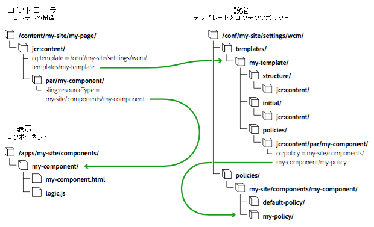
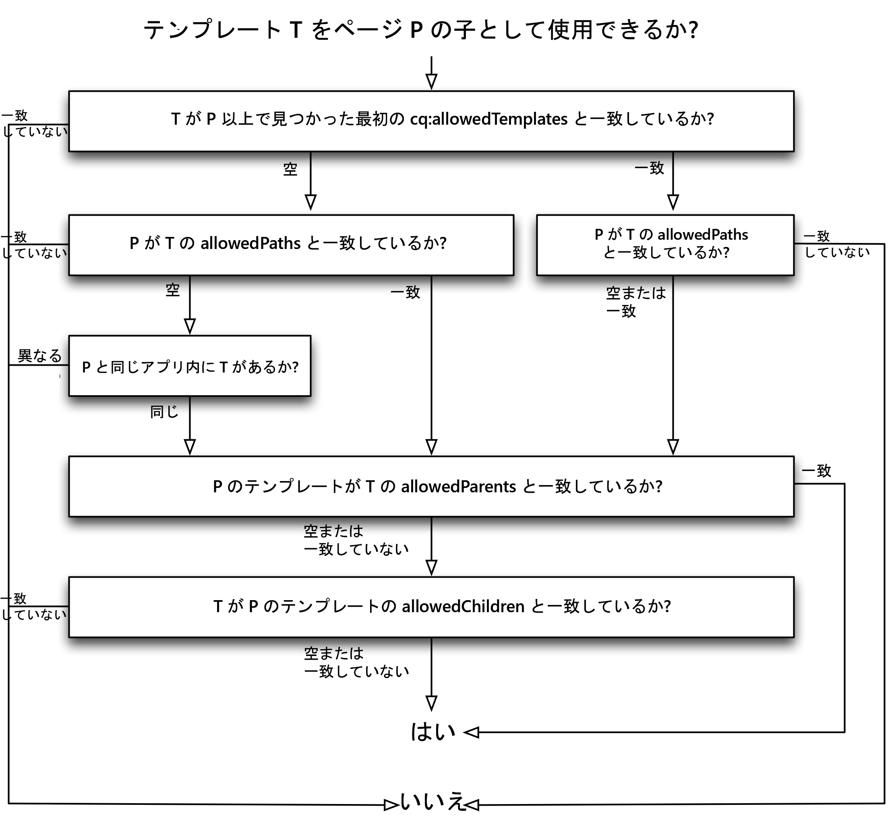

# ページテンプレート {#page-templates}

ページを作成する場合は、テンプレートを選択する必要があります。 ページテンプレートは、新しいページのベースとして使用されます。 テンプレートによって、結果ページの構造、すべての初期コンテンツ、使用可能なコンポーネント（設計プロパティ）が定義されます。これには、次のような多数の利点があります。

* Page Templates allow specialized authors to [create and edit templates](/help/sites-cloud/authoring/features/templates.md).
   * このような専門的な作成者は、**テンプレート作成者**&#x200B;と呼ばれます。
   * テンプレート作成者は、`template-authors` グループのメンバーである必要があります。
* ページテンプレートから作成されたすべてのページとの動的な接続が保持されます。 これにより、テンプレートに対するすべての変更がページ自体に反映されます。
* ページテンプレートを使用すると、ページコンポーネントがより一般的になるので、コアページコンポーネントをカスタマイズせずに使用できます。

ページテンプレートを使用する場合、ページを構成する要素はコンポーネント内で分離されます。 UI で必要なコンポーネントの組み合わせを設定できるので、ページのバリエーションごとに新しいページコンポーネントを開発する必要はなくなります。

このドキュメントでは、

* ページテンプレートの作成の概要を示します。
* 編集可能テンプレートの作成に必要な管理者／開発者のタスク
* 編集可能テンプレートの技術基盤
* AEMがテンプレートの可用性を評価する方法について説明します

>[!NOTE]
>
>このドキュメントでは、テンプレートの作成と編集について既に理解していることを前提としています。See the authoring document [Creating Page Templates](/help/sites-cloud/authoring/features/templates.md), which details the capabilities of editable templates as exposed to the template author.

>[!TIP]
>
>[WKNDのチュートリアル](/help/implementing/developing/introduction/develop-wknd-tutorial.md) では、例を実装してページテンプレートの使用方法を詳しく説明し、新しいプロジェクトでのテンプレートの設定方法を理解するのに非常に役立ちます。

## 新しいテンプレートの作成 {#creating-a-new-template}

Creating Page Templates is primarily done with the [template console and template editor](/help/sites-cloud/authoring/features/templates.md) by a template author. ここでは、そのプロセスの概要を示し、技術的なレベルでどのような処理がおこなわれるかを説明します。

新しい編集可能テンプレートを作成する場合は、次の手順を実行します。

1. [テンプレート用のフォルダー](#template-folders)を作成します。これは必須ではありませんが、推奨されるベストプラクティスです。
1. Select a [template type](#template-type). This is copied to create the [template definition](#template-definitions).

   >[!NOTE]
   >
   >様々なテンプレートタイプが標準で提供されています。必要に応じて、[独自のサイト固有のテンプレートタイプを作成する](#creating-template-types)こともできます。

1. 新しいテンプレートの構造、コンテンツポリシー、初期コンテンツおよびレイアウトを設定します。

   **構造**

   * 構造では、テンプレートのコンポーネントとコンテンツを定義できます。
   * テンプレート構造で定義されたコンポーネントは、作成されるページで移動することも、作成されるすべてのページから削除することもできません。
   * ページ作成者がコンポーネントを追加または削除するには、テンプレートに段落システムを追加する必要があります。
   * コンポーネントのロックを解除（再度ロックできます）して、初期コンテンツを定義できます。

   テンプレート作成者が構造を定義する方法について詳しくは、[ページテンプレートの作成](/help/sites-cloud/authoring/features/templates.md#editing-a-template-structure-template-author)を参照してください。

   For technical deatils of the structure, see [Structure](#structure) in this document.

   **ポリシー**

   * コンテンツポリシーでは、コンポーネントのデザインプロパティを定義します。

      * 例えば、使用できるコンポーネントや最小／最大サイズを定義できます。
   * これらのポリシーは、テンプレートと、そのテンプレートを使用して作成されるページに適用されます。

   テンプレート作成者がポリシーを定義する方法について詳しくは、[ページテンプレートの作成](/help/sites-cloud/authoring/features/templates.md#editing-a-template-structure-template-author)を参照してください。

   ポリシーの技術的な詳細については、このドキュメントの[コンテンツポリシー](#content-policies)を参照してください。

   **初期コンテンツ**

   * 初期コンテンツでは、テンプレートに基づいてページが最初に作成されたときに表示されるコンテンツを定義します。
   * その後、ページ作成者が初期コンテンツを編集できます。

   テンプレート作成者が構造を定義する方法について詳しくは、[ページテンプレートの作成](/help/sites-cloud/authoring/features/templates.md#editing-a-template-initial-content-author)を参照してください。

   初期コンテンツの技術的な詳細については、このドキュメントの[初期コンテンツ](#initial-content)を参照してください。

   **レイアウト**

   * デバイスの形式に合わせてテンプレートのレイアウトを定義できます。
   * テンプレートがページオーサリングと同じように動作するには、レスポンシブレイアウトを使用します。

   テンプレート作成者がテンプレートレイアウトを定義する方法について詳しくは、[ページテンプレートの作成](/help/sites-cloud/authoring/features/templates.md#editing-a-template-layout-template-author)を参照してください。

   テンプレートレイアウトの技術的な詳細については、このドキュメントの[レイアウト](#layout)を参照してください。

1. テンプレートを有効化し、特定のコンテンツツリーに対して許可します。

   * テンプレートを有効にするか無効して、ページ作成者による使用可否を決めることができます。
   * テンプレートは、特定のページブランチに対して使用可能または使用不可にすることができます。

   テンプレート作成者がテンプレートを有効にする方法について詳しくは、[ページテンプレートの作成](/help/sites-cloud/authoring/features/templates.md#enabling-and-allowing-a-template-template-author)を参照してください。

   テンプレートの有効化の技術的な詳細については、このドキュメントの[使用するテンプレートの有効化と許可](#enabling-and-allowing-a-template-for-use)を参照してください。

1. テンプレートを使用してコンテンツページを作成します。

   * テンプレートを新しいページを作成するために使用するときは、静的テンプレートと編集可能なテンプレートの間に視覚的な違いはありません。
   * ページの作成者にとって、この処理は透過的です。

   For details on how a page author uses templates to create a page, see [Creating and Organizing Pages](/help/sites-cloud/authoring/fundamentals/organizing-pages.md#templates).

   編集可能テンプレートを使用したページ作成の技術的な詳細については、このドキュメントの[作成されるコンテンツページ](#resultant-content-pages)を参照してください。

>[!NOTE]
>
>The editor client library assumes the presence of the `cq.shared` namespace in content pages, and if it is absent the JavaScript error `Uncaught TypeError: Cannot read property 'shared' of undefined` will result.
>
>すべてのサンプルコンテンツページには `cq.shared` が含まれているので、それらをベースとするコンテンツには自動的に `cq.shared` が含められます。ただし、サンプルコンテンツをベースとせず、ゼロから独自のコンテンツページを作成する場合は、`cq.shared` 名前空間を含める必要があります。

<!--See [Using Client-Side Libraries](/help/sites-developing/clientlibs.md) for further information.-->

>[!CAUTION]
>
>国際化する必要がある情報は、テンプレートに含めないでください。

## テンプレートフォルダー {#template-folders}

以下のフォルダーを使用してテンプレートを整理できます。

* `global`
* サイト固有

>[!NOTE]
>
>フォルダーはネストできますが、**テンプレート**&#x200B;コンソールで表示すると、フラット構造として表されます。

In a standard AEM instance the `global` folder already exists in the template console. この中にデフォルトのテンプレートが格納されており、現在のフォルダーにポリシーやテンプレートタイプがない場合にはフォールバックとして機能します。このフォルダーにデフォルトのテンプレートを追加することも、新しいフォルダーを作成すること（推奨）もできます。

>[!NOTE]
>
>It is best practice to create a new folder to hold your customized templates and not to use the `global` folder.

>[!CAUTION]
>
>Folders must be created by a user with `admin` rights.

テンプレートのタイプやポリシーは、次の優先順位に従ってすべてのフォルダーに継承されます。

1. 現在のフォルダー
1. 現在のフォルダーの親
1. `/conf/global`
1. `/apps`
1. `/libs`

許可されたすべてのエントリのリストが表示されます。If any configurations overlap ( `path`/ `label`), only the instance closest to the current folder is presented to the user.

新しいフォルダーを作成するには、次のいずれかの方法を使用できます。

* プログラムで自動的に、または CRXDE Lite を使用して作成する
* 設定ブラウザーの使用

## CRXDE Lite の使用 {#using-crxde-lite}

1. インスタンスに対して（/confの下に）新しいフォルダーをプログラムで作成するか、CRXDE Liteを使用して作成できます。

   次の構造を使用する必要があります。

   ```xml
   /conf
       <your-folder-name> [sling:Folder]
           settings [sling:Folder]
               wcm [cq:Page]
                   templates [cq:Page]
                   policies [cq:Page]
   ```

1. その後、フォルダーのルートノードに次のプロパティを定義できます。

   `<your-folder-name> [sling:Folder]`

   * 名前：`jcr:title`
   * 型：`String`
   * 値：**テンプレート**&#x200B;コンソールに表示される（フォルダーの）タイトルです。

1. 作成者が新しいフォルダーにテンプレートを作成できるようにするには、標準のオーサリング権限（`content-authors` など）に加え、グループを割り当てて作成者に必要なアクセス権限（ACL）を定義する必要があります。

   割り当てる必要があるデフォルトのグループは、`template-authors` グループです。See the section [ACLs and Groups](#acls-and-groups) for details.

   <!--See [Access Right Management](/help/sites-administering/user-group-ac-admin.md#access-right-management) for full details on managing and assigning access rights.-->

### 設定ブラウザーの使用 {#using-the-configuration-browser}

1. **グローバルナビゲーション**／**ツール**／**設定ブラウザー**&#x200B;に移動します。

   The existing folders are listed to the left including the `global` folder.

1. 「**作成**」をクリックします。
1. In the **Create Configuration** dialog the following fields need to be configured:

   * **タイトル**：設定フォルダーのタイトルを指定します。
   * **編集可能なテンプレート**：このフォルダー内で編集可能テンプレートを許可する場合にチェックします。

1. 「**作成**」をクリックします。

>[!NOTE]
>
>グローバルフォルダーにテンプレートを作成する場合は、設定ブラウザーでグローバルフォルダーを編集し、「**編集可能なテンプレート**」オプションをオンにします。ただし、これは推奨されるベストプラクティスではありません。

### ACL とグループ {#acls-and-groups}

（CRXDE または設定ブラウザーを使用して）テンプレートフォルダーが作成されたら、セキュリティを確保するために、テンプレートフォルダーの適切なグループに ACL を定義する必要があります。

The template folders for the [WKND tutorial](/help/implementing/developing/introduction/develop-wknd-tutorial.md) can be used as an example.

#### template-authors グループ {#the-template-authors-group}

`template-authors` グループは、テンプレートへのアクセスを管理するために使用されるグループで、AEM に標準で付属していますが空です。ユーザーは、プロジェクト／サイトのグループに追加する必要があります。

>[!CAUTION]
>
>`template-authors` グループは、新しいテンプレートを作成する必要があるユーザー専用です。
>
>テンプレートの編集は非常に強力で、正しく行われないと既存のテンプレートが壊れる場合があります。 そのため、この役割には注意深く、ふさわしいユーザーだけを含めてください。

次の表に、テンプレートの編集に必要な権限の詳細を示します。

<table>
 <tbody>
  <tr>
   <th>パス</th>
   <th>役割／グループ</th>
   <th>権限<br /> </th>
   <th>説明</th>
  </tr>
  <tr>
   <td rowspan="3"><code>/conf/&lt;<i>your-folder</i>&gt;/settings/wcm/templates</code></td>
   <td>テンプレート作成者<br /> </td>
   <td>読み取り、書き込み、複製</td>
   <td>サイト固有のス <code>/conf</code> ペースでテンプレートを作成、読み取り、更新、削除、複製するテンプレート作成者</td>
  </tr>
  <tr>
   <td>匿名Webユーザー</td>
   <td>read</td>
   <td>匿名Webユーザーは、ページのレンダリング中にテンプレートを読む必要があります</td>
  </tr>
  <tr>
   <td>コンテンツ作成者</td>
   <td>複製する</td>
   <td>replicateContent作成者は、ページをアクティブ化する際に、ページのテンプレートをアクティブ化する必要があります</td>
  </tr>
  <tr>
   <td rowspan="3"><code>/conf/&lt;<i>your-folder</i>&gt;/settings/wcm/policies</code></td>
   <td><code>Template Author</code></td>
   <td>読み取り、書き込み、複製</td>
   <td>サイト固有のス <code>/conf</code> ペースでテンプレートを作成、読み取り、更新、削除、複製するテンプレート作成者</td>
  </tr>
  <tr>
   <td>匿名Webユーザー</td>
   <td>read</td>
   <td>匿名Webユーザーは、ページのレンダリング中にポリシーを読む必要があります</td>
  </tr>
  <tr>
   <td>コンテンツ作成者</td>
   <td>複製する</td>
   <td>コンテンツ作成者は、ページをアクティブ化する際に、ページのテンプレートのポリシーをアクティブ化する必要があります</td>
  </tr>
  <tr>
   <td rowspan="2"><code>/conf/&lt;site&gt;/settings/template-types</code></td>
   <td>テンプレート作成者</td>
   <td>read</td>
   <td>テンプレート作成者は、定義済みのテンプレートタイプの1つに基づいて新しいテンプレートを作成します。</td>
  </tr>
  <tr>
   <td>匿名Webユーザー</td>
   <td>なし</td>
   <td>匿名Webユーザーはテンプレートの種類にアクセスできません</td>
  </tr>
 </tbody>
</table>

This default `template-authors` group only covers the project setups, where all `template-authors` members are allowed to access and author all templates. より複雑な設定では、テンプレートに個別にアクセスするためにテンプレート作成者グループが複数必要になるので、さらに多くのカスタムテンプレート作成者グループを作成する必要があります。ただし、テンプレート作成者グループの権限は変わりません。

## テンプレートタイプ {#template-type}

新しいテンプレートの作成時には、テンプレートタイプを指定する必要があります。

* テンプレートタイプは、テンプレートのためのテンプレートとなるものです。テンプレート作成時に選択したテンプレートタイプの構造と初期コンテンツに基づいて、新しいテンプレートが作成されます。

   * テンプレートはテンプレートタイプをコピーして作成されます。
   * コピー後のテンプレートとテンプレートタイプとの関連付けは、情報を取得するだけの静的参照のみとなります。

* テンプレートタイプでは、以下の項目を定義できます。

   * ページコンポーネントのリソースタイプ。
   * ルートノードのポリシー。テンプレートエディターで許可されるコンポーネントを定義します。
   * そのテンプレートタイプで、モバイルエミュレーターのレスポンシブグリッドと設定のブレークポイントを定義することをお勧めします。

* AEM には、既製のテンプレートタイプがいくつか用意されています（HTML5 ページ、アダプティブフォームページなど）。

   * その他の例は、 [WKNDチュートリアルの一部として提供されています。](/help/implementing/developing/introduction/develop-wknd-tutorial.md)

* テンプレートタイプは通常、開発者が定義します。

既製のテンプレートタイプは次のフォルダーに保存されています。

* `/libs/settings/wcm/template-types`

>[!CAUTION]
>
>`/libs` パス内の設定は一切変更しないでください。これは、のコンテンツがAEMの更新によっていつでも上書きさ `/libs` れる可能性があるためです。

サイト固有のテンプレートタイプは、以下に相当する場所に保存してください。

* `/apps/settings/wcm/template-types`

Definitions for your customized templates types should be stored in user-defined folders (recommended) or alternatively in `global`. 次に例を示します。

* `/conf/<my-folder-01>/<my-folder-02>/settings/wcm/template-types`
* `/conf/<my-folder>/settings/wcm/template-types`
* `/conf/global/settings/wcm/template-types`

>[!CAUTION]
>
>The template types have to respect the correct folder structure (i.e. `/settings/wcm/...`), otherwise the template types will not be found.

<!--
### Template Type and Mobile Device Groups {#template-type-and-mobile-device-groups-br}

The [device groups](/help/sites-developing/mobile.md#device-groups) used for an editable template (set as relative path of the property `cq:deviceGroups`) define which mobile devices are available as emulators in the [layout mode](/help/sites-authoring/responsive-layout.md) of page authoring. This value can be set in two places:

* On the editable template type
* On the editable template

When creating a new editable template, the value is copied from the template type to the individual template. If the value is not set on the type, it can be set on the template. Once a template is created, there is no inheritance from the type to the template.

>[!CAUTION]
>
>The value of `cq:deviceGroups` must be set as a relative path such as `mobile/groups/responsive` and not as an absolute path such as `/etc/mobile/groups/responsive`.

>[!NOTE]
>
>With static templates /help/sites-developing/page-templates-static.md, the value of `cq:deviceGroups` could be set at the root of the site.
>
>With editable templates, this value is now stored at the template level and is not supported at the page root level.
-->

### テンプレートタイプの作成 {#creating-template-types}

他のテンプレートの基盤となるテンプレートを作成した場合、このテンプレートをテンプレートタイプとしてコピーできます。

1. Create a template as you would any Page Template [as documented here](/help/sites-cloud/authoring/features/templates.md#creating-a-new-template-template-author), which will serve as the basis of your template type.
1. CRXDE Lite を使用している場合は、新しく作成したテンプレートを `templates` ノードから`template-types`テンプレートフォルダー[の下の ](#template-folders) ノードにコピーします。
1. Delete the template from the `templates` node under the [template folder](#template-folders).
1. In the copy of the template that is under the `template-types` node, delete all `cq:template` and `cq:templateType` `jcr:content` properties.

また、GitHub で入手できる、編集可能テンプレートのサンプルを基盤として使用し、独自のテンプレートタイプを作成することもできます。

GitHub のコード

このページのコードは GitHub にあります

* [GitHubでaem-sites-example-custom-template-typeプロジェクトを開きます](https://github.com/Adobe-Marketing-Cloud/aem-sites-example-custom-template-type)
* プロジェクトを [ZIP ファイル](https://github.com/Adobe-Marketing-Cloud/aem-sites-example-custom-template-type/archive/master.zip)としてダウンロードします

## テンプレート定義 {#template-definitions}

Definitions for editable templates are stored [user-defined folders](#template-folders) (recommended) or alternatively in `global`. 次に例を示します。

* `/conf/<my-folder>/settings/wcm/templates`
* `/conf/<my-folder-01>/<my-folder-02>/settings/wcm/templates`
* `/conf/global/settings/wcm/templates`

テンプレートのルートノードは、以下のスケルトン構造を持つ `cq:Template` タイプです。

```xml
<template-name>
  initial
    jcr:content
      root
        <component>
        ...
        <component>
  jcr:content
    @property status
  policies
    jcr:content
      root
        @property cq:policy
        <component>
          @property cq:policy
        ...
        <component>
          @property cq:policy
  structure
    jcr:content
      root
        <component>
        ...
        <component>
      cq:responsive
        breakpoints
  thumbnail.png
```

主な要素は以下のとおりです。

* `<template-name>`

   * ` [initial](#initial-content)`
   * `jcr:content`
   * ` [structure](#structure)`
   * ` [policies](#policies)`
   * `thumbnail.png`

### jcr:content {#jcr-content}

このノードは、テンプレートのプロパティを保持します。

* **名前**：`jcr:title`
* **名前**：`status`
   * ``**型**: `String`
   * **値**: `draft`、 `enabled` または `disabled`

### 構造 {#structure}

作成されるページの構造を定義します。

* Is merged with the initial content ( `/initial`) when creating a new page.
* 構造に加えた変更は、そのテンプレートを使用して作成されたすべてのページに反映されます。
* The `root` ( `structure/jcr:content/root`) node defines the list of components that will be available in the resulting page.
   * テンプレート構造で定義されたコンポーネントは、作成されたページで移動することも、作成されたページから削除することもできません。
   * コンポーネントをロック解除すると、`editable` プロパティが `true` に設定されます。
   * 既にコンテンツを含むコンポーネントをロック解除すると、このコンテンツは `initial` ブランチに移動されます.

* The `cq:responsive` node holds definitions for the responsive layout.

### 初期コンテンツ {#initial-content}

作成時に新しいページに表示される初期コンテンツを定義します。

* すべての新しいページにコピーされる `jcr:content` ノードが含まれます。
* Is merged with the structure ( `/structure`) when creating a new page.
* 作成後に初期コンテンツが変更されても、既存のページはすべて更新されません。
* `root` ノードは、作成されたページで使用できるコンポーネントを定義する、コンポーネントのリストを保持します。
* コンテンツが構造モードでコンポーネントに追加され、その後、そのコンポーネントがロック解除された場合（またはコンポーネントのロック解除後にコンテンツが追加された場合）、このコンテンツは初期コンテンツとして使用されます。

### レイアウト {#layout}

テンプレートを [編集する際に、レイアウトを定義できます](/help/sites-cloud/authoring/features/templates.md)。これには、 [標準のレスポンシブレイアウトが使用され](/help/sites-cloud/authoring/features/responsive-layout.md)ます。

<!-- that can also be [configured](/help/sites-administering/configuring-responsive-layout.md). -->

### コンテンツポリシー {#content-policies}

コンテンツポリシーでは、コンポーネントのデザインプロパティを定義します。例えば、使用できるコンポーネントや最小／最大サイズを定義できます。これらのポリシーは、テンプレートと、そのテンプレートを使用して作成されるページに適用されます。テンプレートエディターでコンテンツポリシーを作成して選択できます。

* The property `cq:policy`, on the `root` node
   `/conf/<your-folder>/settings/wcm/templates/<your-template>/policies/jcr:content/root`
ページの段落システムのコンテンツポリシーに対する相対参照を提供します。

* The property `cq:policy`, on the component-explicit nodes under `root`, provide links to the policies for the individual components.

* 実際のポリシー定義は、次の場所に保存されます。
   `/conf/<your-folder>/settings/wcm/policies/wcm/foundation/components`

>[!NOTE]
>
>The paths of policy definitions depend on the path of the component. `cq:policy` holds a relative reference to the configuration itself.

### ページポリシー {#page-policies}

ページポリシーを使用して、テンプレートまたは作成されるページで、ページ（メインの parsys）の[コンテンツポリシー](#content-policies)を定義できます。

### 使用するテンプレートの有効化と許可 {#enabling-and-allowing-a-template-for-use}

1. **テンプレートの有効化**

   テンプレートは、次のどちらかの方法で有効化してからでなければ使用できません。

   * **テンプレート**&#x200B;コンソールから[テンプレートを有効化](/help/sites-cloud/authoring/features/templates.md)する。

   * Setting the status property on the `jcr:content` node.

      * 例えば、次の場合：
         `/conf/<your-folder>/settings/wcm/templates/<your-template>/jcr:content`

      * プロパティの定義

         * 名前：status
         * タイプ：String
         * 値：`enabled`

1. **許可されたテンプレート**

   * 適切なページまたはサブブランチのルートページの[**ページプロパティ**](/help/sites-cloud/authoring/features/templates.md#allowing-a-template-author)&#x200B;に対して許可されたテンプレートのパスを定義します。
   * プロパティの設定：
      `cq:allowedTemplates`
Folio Builder 
`jcr:content` ノードを追加します。
   例えば、次の値を使用します。

   `/conf/<your-folder>/settings/wcm/templates/.*`

## 作成されるコンテンツページ {#resultant-content-pages}

編集可能テンプレートから作成されるページには、次の特徴があります。

* テンプレートの `structure` と `initial` を統合したサブツリーを使用して作成されます。

* テンプレートおよびテンプレートタイプに保持されている情報への参照を持ちます。 これは、次のプロパティを持つ `jcr:content` ノードを使用して行います。

   * `cq:template`  — 実際のテンプレートへの動的な参照を提供します。テンプレートに対する変更を実際のページに反映させます。

   * `cq:templateType`  — テンプレートタイプの参照を提供します。



上の図は、テンプレート、コンテンツおよびコンポーネントの相関関係を示したものです。

* Controller - `/content/<my-site>/<my-page>` - The resultant page that references the template. コンテンツがプロセス全体を制御します。定義に従って、適切なテンプレートとコンポーネントにアクセスします。
* Configuration - `/conf/<my-folder>/settings/wcm/templates/<my-template>` - The [template and related content policies](#template-definitions) define the page configuration.
* Model - OSGi bundles - The [OSGI bundles](/help/implementing/deploying/configuring-osgi.md) implement the functionality.
* View - `/apps/<my-site>/components` - On both the author and publish environments the content is rendered by components.

ページのレンダリング時

* **テンプレート**:

   * The `cq:template` property of its `jcr:content` node will be referenced to access the template that corresponds to that page.

* **コンポーネント**:

   * The page component will merge the `structure/jcr:content` tree of the template with the `jcr:content` tree of the page.
      * 作成者は、ページコンポーネントを使用して、「編集可能」のフラグが設定されているテンプレート構造のノード（およびいずれかの子）を編集できるだけです。
      * ページ上にコンポーネントをレンダリングする際、そのコンポーネントの相対パスが `jcr:content` ノードから取得されます。その後、テンプレートの `policies/jcr:content` ノードの下の同じパスが検索されます。
         * The `cq:policy` property of this node points to the actual content policy (i.e. it holds the design configuration for that component).
            * このため、同じコンテンツポリシー設定を再利用する複数のテンプレートを持つことができます。

### Template Availability {#template-availability}

サイト管理インターフェイスで新しいページを作成する場合、使用可能なテンプレートのリストは、新しいページの場所と、各テンプレートで指定されている配置制限によって異なります。

次のプロパティは、新しいページをページの子として配置する場合に、テンプレート `T` を使用できるかどうかを決定 `P`します。 これらの各プロパティは、0個以上の正規式を保持する複数値の文字列で、パスとの一致に使用されます。

* The `cq:allowedTemplates` property of the `jcr:content` subnode of `P` or an ancestor of `P`.

* の `allowedPaths` プロパティ `T`。

* の `allowedParents` プロパティ `T`。

* The `allowedChildren` property of the template of `P`.

評価は次のようにおこなわれます。

* で始まるページ階層を昇順にしているときに見つかった、最初の空でない `cq:allowedTemplates` プロパティ `P` は、のパスと一致し `T`ます。 一致する値がない場合、は拒否さ `T` れます。

* If `T` has a non-empty `allowedPaths` property, but none of the values match the path of `P`, `T` is rejected.

* 上記のプロパティの両方が空または存在しない場合、と同じアプリケーションに属し `T` ない限りは拒否され `P`ます。 `T` は、のパスの2番目のレベルの名前がのパスの2番目のレベルの名前と同じである場合 `P` に限り、ifと同じアプリケーション `T` に属し `P`ます。 例えば、テンプレート `/apps/geometrixx/templates/foo` はページと同じアプリに属してい `/content/geometrixx`ます。

* If `T` has an non-empty `allowedParents` property, but none of the values match the path of `P`, `T` is rejected.

* If the template of `P` has a non-empty `allowedChildren` property, but none of the values match the path of `T`, `T` is rejected.

* その他すべての場合は、`T` は許可されます。

以下の図は、テンプレートの評価プロセスを示しています。



>[!CAUTION]
>
>AEMは、複数のプロパティをオファーして、 **Sites**（サイト）で許可されるテンプレートを制御します。 ただし、組み合わせると、追跡や管理が困難な非常に複雑なルールになる可能性があります。
>
>したがって、Adobeでは、次の項目を定義して、単純な開始を行うことをお勧めします。
>
>* 唯一の `cq:allowedTemplates` 財産
   >
   >
* サイトのルートにのみ
>
>
例については、 [WKNDチュートリアルの内容を参照してください](/help/implementing/developing/introduction/develop-wknd-tutorial.md) 。 `/content/wknd/jcr:content`
>
>プロパティ `allowedPaths`、 `allowedParents``allowedChildren` およびをテンプレートに配置して、より高度なルールを定義することもできます。 ただし、可能な場合は、許可されるテンプレートをさらに制限する必要がある場合は ** 、サイトのサブセクションでさらに `cq:allowedTemplates` プロパティを定義する方が簡単です。
>
>また、「 `cq:allowedTemplates` ページプロパティ」の「 **詳細** 」タブで、作成者がプロパティを更新できるという利点もあります ****。 その他のテンプレートプロパティは、（標準） UIを使用して更新することはできないので、変更を行うたびに、ルールとコードのデプロイメントを管理する開発者が必要になります。

#### 子ページで使用するテンプレートの制限 {#limiting-templates-used-in-child-pages}

特定のページの下に子ページを作成するために使用できるテンプレートを制限するには、ページの `cq:allowedTemplates``jcr:content` nodeのプロパティを使用して、子ページとして許可するテンプレートのリストを指定します。 例えば、リストの各値は、許可されている子ページのテンプレートへの絶対パスである必要があり `/apps/wknd/templates/page-content`ます。

You can use the `cq:allowedTemplates` property on the template&#39;s  `jcr:content` node to have this configuration applied to all newly created pages that use this template.

テンプレート階層などに関する制約をさらに追加する場合は、テンプレートの `allowedParents/allowedChildren` プロパティを使用できます。 その後、テンプレートTから作成されたページが、テンプレートTから作成されたページの親/子である必要があることを明示的に指定できます。
