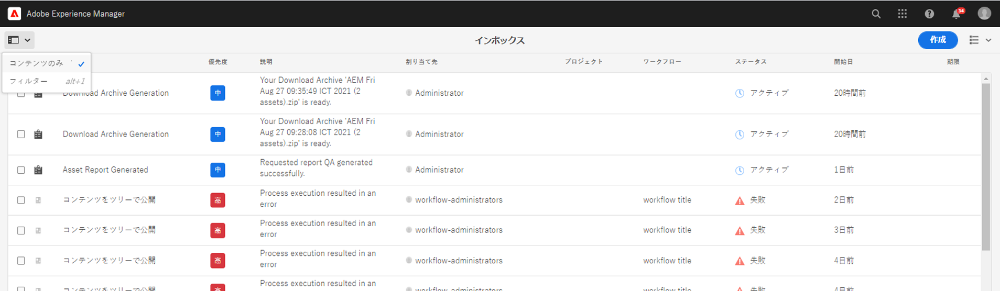

# インボックス用の検索フィルターの設定 {#configure-search-filters-inbox}

インボックス項目の検索フィルターを設定できます。特定のインボックス列に基づいて検索条件を設定し、結果を絞り込みます。

例えば、「生年月日」インボックス列の範囲に基づいてインボックス項目をフィルタリングするには、「日付の範囲の述語」を使用して日付範囲を定義します。

インボックスに使用可能な述語のタイプは次のとおりです。

* 範囲の述語

* テキストの術語

* 日付の範囲の述語

* オプションプロパティの述語

>[!NOTE]
>
>`workflow-administrators` グループのメンバーであることを確認して、インボックスの検索フィルターを設定します。

## カスタマイズした設定の作成またはオープン {#creating-opening-customized-configuration}

1. **[!UICONTROL ツール]**／**[!UICONTROL 一般]**／**[!UICONTROL 検索フォーム]**&#x200B;に移動します。

1. 「**[!UICONTROL インボックス検索レール]**」設定を選択し、「**[!UICONTROL 編集]**」を選択します。
1. 「**[!UICONTROL 検索フォームを編集]**」を使用して、述語の設定変更を組み込みます。
1. 「**[!UICONTROL 完了]**」を選択して設定を保存します。

## カスタマイズした設定の削除 {#delete-customized-configuration}

カスタマイズした設定を削除するには：

1. **[!UICONTROL ツール]**／**[!UICONTROL 一般]**／**[!UICONTROL 検索フォーム]**&#x200B;に移動します。

1. 「**[!UICONTROL インボックス検索レール]**」設定を選択し、「**[!UICONTROL 削除]**」を選択します。

## 範囲の述語の設定 {#range-predicate}

範囲の述語を使用すると、インボックス項目をフィルタリングして、インボックス列内の数値範囲を検索できます。数値に小数値を含めることもできます。

範囲の述語を設定するには、以下の手順を実行します。

1. [設定用のフォーム](#creating-opening-customized-configuration)を開きます。
1. 「**[!UICONTROL 述語を選択]**」タブを選択し、「**[!UICONTROL 範囲の述語]**」をフォームにドラッグします。
1. 「**[!UICONTROL 設定]**」タブで、検索の基になるインボックス列名を「**[!UICONTROL 列名]**」フィールドから選択します。
1. フィルターのラベルを「**[!UICONTROL フィルターラベル]**」フィールドで指定します。範囲の定義時に数値の小数値を使用可能にするには、「**[!UICONTROL 小数値を有効にする]**」チェックボックスをオンにします。
1. 設定の説明（オプション）を指定し、「**[!UICONTROL 完了]**」を選択して設定を保存します。

フィルターページを開くと、設定の変更が反映されます。手順 4 で指定したフィルターラベルが表示され、最大値と最小値を定義するオプションが表示されます。Enter キーを押すと、[!DNL Experience Manager] は、手順 3 で指定した列名に検索条件を適用し、インボックス項目を返します。

>[!NOTE]
>
>この記事では、最新のユーザーインターフェイスオプションを示しています。オプション名は、今後のリリースのユーザーインターフェイスで更新されます。

## テキストの述語の設定 {#text-predicate}

テキストの述語を使用すると、インボックス項目をフィルタリングして、インボックス列内のテキスト文字列を検索できます。

テキストの述語を設定するには、以下の手順を実行します。

1. [設定用のフォーム](#creating-opening-customized-configuration)を開きます。
1. 「**[!UICONTROL 述語を選択]**」タブを選択し、「**[!UICONTROL テキストの述語]**」をフォームにドラッグします。
1. 「**[!UICONTROL 設定]**」タブで、検索の基になるインボックス列名を「**[!UICONTROL 列名]**」フィールドから選択します。
1. 「検索」テキストボックスにプレースホルダーテキストとして表示するテキストを「**[!UICONTROL 検索テキストボックスのプレースホルダー]**」フィールドに指定します。
1. 設定の説明（オプション）を指定し、「**[!UICONTROL 完了]**」を選択して設定を保存します。

フィルターページを開くと、設定の変更が反映されます。Enter キーを押すと、[!DNL Experience Manager] は、手順 4 で指定した検索テキストを手順 3 で指定した列名に適用し、インボックス項目を返します。

## 日付範囲の述語の設定 {#date-range-predicate}

日付範囲の述語を使用すると、インボックス項目をフィルタリングして、インボックス列内の日付範囲を検索できます。

日付範囲の述語を設定するには、以下の手順を実行します。

1. [設定用のフォーム](#creating-opening-customized-configuration)を開きます。
1. 「**[!UICONTROL 述語を選択]**」タブを選択し、「**[!UICONTROL 日付の範囲の述語]**」をフォームにドラッグします。
1. 「**[!UICONTROL 設定]**」タブで、検索の基になるインボックス列名を「**[!UICONTROL 列名]**」フィールドから選択します。
1. 日付範囲フィルターのラベルを「**[!UICONTROL フィルターラベル]**」フィールドで指定します。
1. フィルターの開始日と終了日のラベルを指定します。
1. 設定の説明（オプション）を指定し、「**[!UICONTROL 完了]**」を選択して設定を保存します。

フィルターページを開くと、設定の変更が反映されます。手順 4 で指定したフィルターラベルは、手順 5 で指定した開始日および終了日のラベルと共に日付範囲フィルターのラベルとして表示されます。[!DNL Experience Manager] は、手順 3 で指定した列名に検索条件を適用し、インボックス項目を返します。

## カスタム列オプションの述語の設定 {#custom-column-options-predicate}

カスタム列オプションの述語を使用すると、インボックス項目をフィルタリングして、インボックス列内のカスタムオプションを検索できます。

カスタム列オプションの述語を設定するには、以下の手順を実行します。

1. [設定用のフォーム](#creating-opening-customized-configuration)を開きます。
1. 「**[!UICONTROL 述語を選択]**」タブを選択し、「**[!UICONTROL カスタム列オプションの述語]**」をフォームにドラッグします。
1. 「**[!UICONTROL 設定]**」タブで、検索の基になるインボックス列名を「**[!UICONTROL 列名]**」フィールドから選択します。
1. カスタム列オプションフィルターのラベルを「**[!UICONTROL フィルターラベル]**」フィールドで指定します。
1. 「**[!UICONTROL 単一の選択]**」チェックボックスをオンにして、インボックス列にフィルターを適用する際に 1 つのオプションのみを選択できるようにします。
1. 「**[!UICONTROL オプションを追加]**」セクションで、次の操作を行います。
   1. フィルター検索オプションを手動で定義する場合は、「**[!UICONTROL 手動]**」を選択します。「**[!UICONTROL フィルターオプションを追加]**」を選択して、最初のオプションを定義します。列オプションのラベルと検索するオプション値のテキストを指定します。例えば、インボックス列の値として「**Female**」を検索する場合は、列オプションのラベルとして「**F**」を指定し、オプション値のテキストとして「**Female**」を追加します。同様に、フィルターオプションをさらに追加できます。
   1. JSON ファイルパスを使用してオプションを定義する場合は、「**[!UICONTROL JSON パス]**」を選択します。フィルターオプションを定義する JSON ファイルの例を以下に示します。

      ```JSON
          {
         "options":[
            {
            "text":"Female",
            "value":"F"
            },
            {
            "text":"Male",
            "value":"M"
            }
          ]
        }
      ```

   1. CRX リポジトリーパスを使用してオプションを定義する場合は、「**[!UICONTROL CRX オプションパス]**」を選択します。複数のパスを追加するには、「**[!UICONTROL オプションパスを追加]**」を選択します。`Male` および `Female` フィルターオプションを定義する例を以下に示します。

      ```JSON
         <gender jcr:primaryType="sling:OrderedFolder">
                        <male
                            jcr:primaryType="nt:unstructured"
                            jcr:title="Male"
                            value="M"/>
                        <female
                            jcr:primaryType="nt:unstructured"
                            jcr:title="Female"
                            value="F"/>
                    </gender>
      ```

1. 設定の説明（オプション）を指定し、「**[!UICONTROL 完了]**」を選択して設定を保存します。

フィルターページを開くと、設定の変更が反映されます。手順 4 で指定したフィルターラベルが、「カスタム列オプションの述語」のラベルとして表示されます。[!DNL Experience Manager] は、手順 3 で指定した列名に手順 6 で定義した検索条件を適用し、インボックス項目を返します。

次のビデオでは、`true` および `false` オプション値に基づいて列をフィルタリングする手順を説明しています。

>[!VIDEO](https://video.tv.adobe.com/v/335679)

## 述語に基づく検索フィルターの表示 {#view-search-filters-for-predicates}

述語に基づく検索フィルターを表示できます。インボックスページで「**[!UICONTROL フィルター]**」を選択します。左側のペインにフィルターが表示されます。次に、検索条件を指定してインボックス項目をフィルタリングできます。



述語の設定の管理について詳しくは、[検索フォームの設定](search-forms.md)を参照してください。
