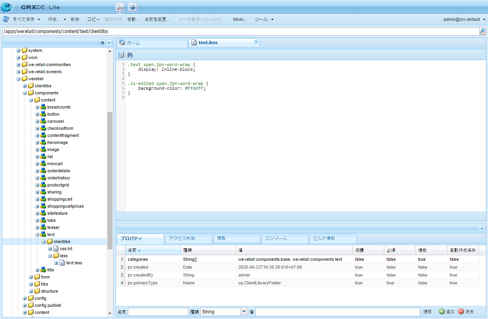
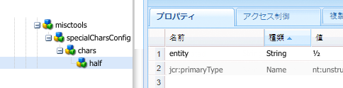
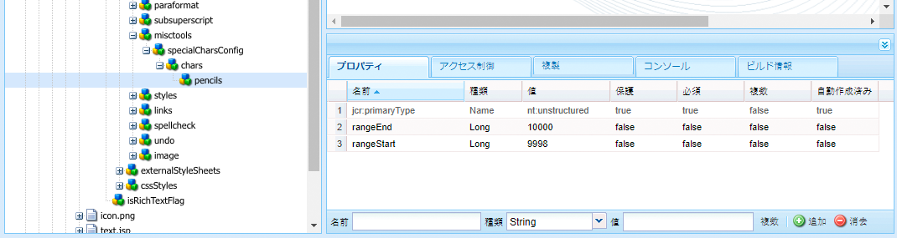
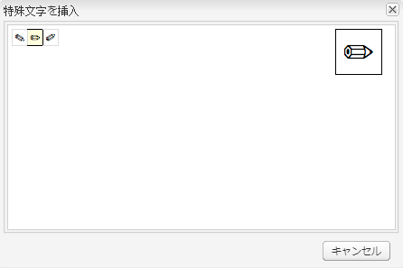

# リッチテキストエディタープラグインの設定 {#configure-the-rich-text-editor-plug-ins}

リッチテキストエディター（RTE）の各機能は一連のプラグインを介して使用可能になり、それぞれに features プロパティがあります。features プロパティを設定することで、1 つ以上の RTE 機能を有効または無効にできます。この記事では、RTEプラグインを具体的に設定する方法について説明します。

For details about the other RTE configurations, see [configure Rich Text Editor](/help/implementing/developing/extending/rich-text-editor.md).

>[!NOTE]
>
>When working with CRXDE Lite, it is recommended to save the changes regularly using [!UICONTROL Save All] option.

## プラグインのアクティベートと features プロパティの設定 {#activateplugin}

プラグインをアクティベートするには、次の手順に従います。初めてプラグインを設定するときは、対応するノードが存在しないので、一部の手順のみ実行します。

By default, `format`, `link`, `list`, `justify`, and `control` plugins and all their features are enabled in RTE.

>[!NOTE]
>
>The respective `rtePlugins` node is referred to as `<rtePlugins-node>` to avoid duplication in this article.

1. CRXDE Lite を使用して、プロジェクトのテキストコンポーネントを見つけます。
1. Create the parent node of `<rtePlugins-node>` if it does not exist, before configuring any RTE plug-ins:

   * コンポーネントに応じて、親ノードは次のとおりです。

      * `config: .../text/cq:editConfig/cq:inplaceEditing/config`
      * 代替の設定ノード: `.../text/cq:editConfig/cq:inplaceEditing/inplaceEditingTextConfig`
      * `text: .../text/dialog/items/tab1/items/text`
   * Are of type: **jcr:primaryType** `cq:Widget`
   * いずれも以下のプロパティを持ちます。

      * **名前** `name`
      * **Type** `String`
      * **値** `./text`


1. Depending on the interface you are configuring for, create a node `<rtePlugins-node>`, if it does not exist:

   * **名前** `rtePlugins`
   * **Type** `nt:unstructured`

1. 次の手順で、アクティブ化する各プラグインに対してノードを作成します。

   * **Type** `nt:unstructured`
   * **名前** 必要なプラグインのプラグイン ID

After activating a plug-in, follow these guidelines to configure the `features` property.

|  | すべての機能を有効化 | 一部の特定の機能を有効化 | すべての機能を無効化 |
|---|---|---|---|
| 名前 | features | features | features |
| タイプ | String | String[] (multi-string; set Type to String and click Multi in CRXDE Lite) | String |
| 値 | `*` （アスタリスク） | 1 つまたは複数の機能値を設定 | - |

## findreplace プラグインの理解 {#findreplace}

The `findreplace` plug-in does not need any configuration. それは既製です。

置換機能を使用する場合は、検索文字列と同時に置換後の文字列も入力する必要があります。ただし、置換する前に「検索」をクリックして文字列を検索することはできます。「検索」をクリックした後に置換後の文字列を入力すると、検索がリセットされ、テキストの先頭から再開されます。

検索と置換ダイアログは、「検索」をクリックすると透明になり、「置換」をクリックすると不透明になります。これにより、作成者は、置換されるテキストを確認できます。「すべてを置換」をクリックすると、ダイアログが閉じて、実行された置換の回数が表示されます。

## 貼り付けモードの設定 {#pastemodes}

RTE では、次の 3 つのいずれかのモードで、コンテンツを貼り付けることができます。

* **ブラウザーモード**：ブラウザーのデフォルトの貼り付け機能を使用して、テキストを貼り付けます。この方法は推奨されません。不要なマークアップが追加されることがあります。

* **プレーンテキストモード**：クリップボードの内容をプレーンテキストとして貼り付けます。この方法では、クリップボードの内容を AEM コンポーネントに挿入する前に、そのスタイル要素とフォーマット要素がすべて削除されます。

* **MS Word モード**：MS Word からテキスト（テーブルを含む）を書式付きでコピーして貼り付けます。Web ページや MS Excel など、他のソースからのテキストのコピー＆貼り付けはサポートされていないので、一部の書式しか保持されません。

### RTE ツールバーで使用可能な貼り付けオプションの設定  {#configure-paste-options-available-on-the-rte-toolbar}

これらの 3 つのアイコンのいくつか、またはすべてを RTE ツールバーに表示できます（どのアイコンも表示しないという選択も可能です）。

* **[!UICONTROL 貼り付け（Ctrl + V）]**：事前設定によって、3 つの貼り付けモードのいずれかに対応付けることができます。

* **[!UICONTROL テキストとして貼り付け]**: プレーンテキストモード機能を提供します。

* **[!UICONTROL Word から貼り付け]**：MS Word モード機能を提供します。

必須アイコンを表示するように RTE を設定するには、以下の手順に従います。

1. 例えば、コンポーネントに移動し `/apps/<myProject>/components/text`ます。
1. Navigate to the node `rtePlugins/edit`. このノードが存在しない場合は、[プラグインのアクティベート](#activateplugin)を参照してください。
1. `features` ノードの `edit` プロパティを作成し、1 つ以上の機能を追加します。すべての変更を保存します。

### 貼り付け（Ctrl + V）アイコンとショートカットの動作の設定 {#configure-the-behavior-of-the-paste-ctrl-v-icon-and-shortcut}

以下の手順に従って、**[!UICONTROL 貼り付け（Ctrl + V）]**&#x200B;アイコンの動作を事前設定できます。また、この設定では、作成者がコンテンツの貼り付けに使用するキーボードショートカット Ctrl + V の動作も定義します。

この設定では、以下の 3 つの使用方法を定義できます。

* ブラウザーのデフォルトの貼り付け機能を使用して、テキストを貼り付けます。この方法は推奨されません。不要なマークアップが追加されることがあります。Configured using `browser` below.

* クリップボードの内容をプレーンテキストとして貼り付けます。この方法では、クリップボードの内容を AEM コンポーネントに挿入する前に、そのスタイル要素とフォーマット要素がすべて削除されます。Configured using `plaintext` below.

* MS Word からテキスト（テーブルを含む）を書式付きでコピーして貼り付けます。Web ページや MS Excel など、他のソースからのテキストのコピー＆貼り付けはサポートされていないので、一部の書式しか保持されません。Configured using `wordhtml` below.

1. In your component, navigate to `<rtePlugins-node>/edit` node. このノードが存在しない場合は作成します。詳しくは、[プラグインのアクティベート](#activateplugin)を参照してください。
1. `edit` ノード内で、次の詳細情報を使用してプロパティを作成します。

   * **名前** `defaultPasteMode`
   * **Type** `String`
   * **[値** ]必要な貼り付けモード `browser`、 `plaintext`またはのいずれか `wordhtml`。

### コンテンツの貼り付け時に使用可能な書式の設定 {#pasteformats}

The paste-as-Microsoft-Word (`paste-wordhtml`) mode can be further configured so that you can explicitly define which styles are allowed when pasting in AEM from another program, such as Microsoft Word.

例えば、AEMで貼り付けるときに太字の形式とリストのみを許可する必要がある場合は、他の形式をフィルターで除外できます。 これは、設定可能な貼り付けフィルタリングと呼ばれ、次の両方に対して実行できます。

* [テキスト](#pastemodes)
* [リンク](#linkstyles)

リンクに関しては、自動的に承認されるプロトコルも定義できます。

別のプログラムから AEM にテキストを貼り付けるときに使用可能な書式を設定するには、次のようにします。

1. In your component, navigate to the node `<rtePlugins-node>/edit`. このノードが存在しない場合は作成します。詳しくは、[プラグインのアクティベート](#activateplugin)を参照してください。
1. `edit` ノードの下に、HTML 貼り付けルールを格納するノードを作成します。

   * **名前** `htmlPasteRules`
   * **Type** `nt:unstructured`

1. `htmlPasteRules` の下に、使用可能な基本書式の詳細を格納するノードを作成します。

   * **名前** `allowBasics`
   * **Type** `nt:unstructured`

1. 受け入れられる個々の書式を制御するには、以下のうち 1 つまたは複数のプロパティを `allowBasics` ノードで作成します。

   * **名前** `bold`
   * **名前** `italic`
   * **名前** `underline`
   * **名前** `anchor`（リンクと名前付きアンカーの両方に対応）
   * **名前** `image`

   All properties are of **Type** `Boolean`, so in the appropriate **Value** you can either select or remove the check mark to enable or disable the functionality.

   >[!NOTE]
   >
   >明示的に定義されていない場合は、デフォルト値である true が使用され、書式が承認されます。

1. その他の様々なプロパティやノードを使用して、その他の書式も定義でき、`htmlPasteRules` ノードに適用できます。

<table>
 <tbody>
  <tr>
   <td><strong>プロパティ</strong></td>
   <td><strong>タイプ</strong></td>
   <td><strong>説明</strong></td>
  </tr>
  <tr>
   <td>allowBlockTags</td>
   <td>String[]</td>
   <td><p>使用可能なブロックタグのリストを定義します。</p> <p>次に、ブロックタグの例を示します。</p>
    <ul>
     <li>見出し（h1、h2、h3）</li>
     <li>段落（p）</li>
     <li>リスト（ol、ul）</li>
     <li>テーブル（table）</li>
    </ul> </td>
  </tr>
  <tr>
   <td>fallbackBlockTag</td>
   <td>String</td>
   <td><p>allowBlockTags に含まれていないブロックタグを含むブロックに使用されるブロックタグを定義します。</p> <p> ほとんどの場合は p で十分です。</p> </td>
  </tr>
  <tr>
   <td>table</td>
   <td>nt:unstructured</td>
   <td><p>テーブルを貼り付けるときの動作を定義します。<br /> </p> <p>このノードには、テーブルの貼り付けを許可するかどうかを定義するプロパティ <code>allow</code>（型は <code>Boolean</code>）が必要です。</p> <p>をに設定 <code>allow</code> した場合、貼り付け <code>false</code>たテーブルコンテンツの処理方法を定義するプロパティ <code>ignoreMode</code> (型<code> String</code>)を指定する必要があります。 の有効な値は次のと <code>ignoreMode</code> おりです。</p>
    <ul>
     <li><code>remove</code>: テーブルのコンテンツを削除します。</li>
     <li><code>paragraph</code>: 表のセルを段落に変換します。</li>
    </ul> </td>
  </tr>
  <tr>
   <td>list</td>
   <td>nt:unstructured</td>
   <td><p>リストを貼り付けるときの動作を定義します。<br /> </p> <p>リストの貼り付けを許可するかどうかを定義するプロパティ <code>allow</code>（型は <code>Boolean</code>）が必要です。</p> <p>をに設定 <code>allow</code> した場合、プロパティ <code>false</code>(タイプ <code>ignoreMode</code><code>String</code>)を指定して、貼り付けたリストコンテンツの処理方法を定義する必要があります。 の有効な値は次のと <code>ignoreMode</code> おりです。</p>
    <ul>
     <li><code>remove</code>: リストのコンテンツを削除します。</li>
     <li><code>paragraph</code>: リスト項目を段落に変換します。</li>
    </ul> </td>
  </tr>
 </tbody>
</table>

Example of a valid `htmlPasteRules` structure:

```xml
"htmlPasteRules": {
    "allowBasics": {
        "italic": true,
        "link": true
    },
    "allowBlockTags": [
        "p", "h1", "h2", "h3"
    ],
    "list": {
        "allow": false,
        "ignoreMode": "paragraph"
    },
    "table": {
        "allow": true,
        "ignoreMode": "paragraph"
    }
}
```

1. すべての変更を保存します。

## テキストスタイルの設定 {#textstyles}

スタイルを適用して、テキストの外観を部分的に変更できます。スタイルは、CSS スタイルシートに事前定義する CSS クラスに基づきます。スタイル設定したコンテンツは、CSS クラスを参照する `span` 属性を使用して `class` タグで囲まれます。次に例を示します。

`<span class=monospaced>Monospaced Text Here</span>`

スタイルプラグインを初めて有効にしたときは、使用可能なデフォルトのスタイルがありません。ポップアップリストは空です。スタイルを使用できるようにするには、次の操作をおこないます。

* 「スタイル」ドロップダウンセレクターを有効にします。
* スタイルシートの場所を指定します。
* 「スタイル」ドロップダウンリストから選択可能な個々のスタイルを指定します。

後で（再）設定する場合、例えばスタイルを追加する場合は、新しいスタイルシートを参照して追加スタイルを指定する手順にのみ従います。

>[!NOTE]
>
>[テーブルやテーブルセル](configure-rich-text-editor-plug-ins.md#tablestyles)のスタイルを定義することもできます。これらの設定には別の手順が必要となります。

### 「スタイル」ドロップダウンセレクターリストの有効化{#styleselectorlist}

これをおこなうには、スタイルプラグインを有効にします。

1. In your component, navigate to the node `<rtePlugins-node>/styles`. このノードが存在しない場合は作成します。詳しくは、[プラグインのアクティベート](#activateplugin)を参照してください。
1. Create the `features` property on the `styles` node:

   * **名前** `features`
   * **Type** `String`
   * **値**`*` （アスタリスク）

1. すべての変更を保存します。

>[!NOTE]
>
>スタイルプラグインが有効になると、編集ダイアログに「スタイル」ドロップダウンリストが表示されます。ただし、スタイルが設定されていないので、リストは空です。

### スタイルシートの場所の指定 {#locationofstylesheet}

次に、参照するスタイルシートの場所を指定します。

1. Navigate to the root node of your text component, for example `/apps/<myProject>/components/text`.
1. Add the property `externalStyleSheets` to the parent node of `<rtePlugins-node>`:

   * **名前** `externalStyleSheets`
   * **Type** (multi-string `String[]` ; 「 **Multi** in CRXDE」をクリックします)。
   * **値** 使用する各スタイルシートのパスとファイル名。リポジトリパスを使用します。

   >[!NOTE]
   >
   >参照先のスタイルシートは後から追加できます。

1. すべての変更を保存します。

>[!NOTE]
>
>RTE をダイアログ（クラシック UI）で使用する場合は、リッチテキスト編集用に最適化されたスタイルシートを指定できます。技術上の制限により、CSS コンテキストはエディターから失われるので、CSS コンテキストをエミュレートして WYSIWYG 環境を改善できます。
>
>リッチテキストエディターでは、`CQrte` という ID を持つコンテナ DOM 要素を使用します。これを使用して、表示や編集用に様々なスタイルを提供できます。
>
>
```
>#CQ td {
> // defines the style for viewing
> }
>```
>
>
```
>#CQrte td {
> // defines the style for editing
> }
>```

### ポップアップリストで使用可能なスタイルの指定 {#stylesindropdown}

1. In the component definition, navigate to the node `<rtePlugins-node>/styles`, as created in [Enabling the style drop-down selector](#styleselectorlist).
1. `styles` ノードの下に、選択可能にするリストを格納する新しいノード（同じく `styles` という名前）を作成します。

   * **名前** `styles`
   * **Type** `cq:WidgetCollection`

1. `styles` ノードの下に、個別のスタイルを表す新しいノードを作成します。

   * **名前** 実際のスタイルに適した名前を指定可能
   * **Type** `nt:unstructured`

1. CSS クラスを参照する `cssName` プロパティをこのノードに追加します。

   * **名前** `cssName`
   * **Type** `String`
   * **値** CSS クラスの名前（先頭に &quot;.&quot; を付けない。; for example, `cssClass` instead of `.cssClass`)

1. `text` プロパティを同じノードに追加します。これは、選択ボックスに表示されるテキストを定義します。

   * **名前** `text`
   * **Type** `String`
   * **値** スタイルの説明。この説明は、「スタイル」ドロップダウン選択ボックスに表示されます。

1. 変更内容を保存します。

   必要な各スタイルについて上記の手順を繰り返します。

### 日本語で最適な単語分割をするための RTE の設定 {#jpwordwrap}

AEM を使用して日本語コンテンツを作成する作成者は、改行が不要な場合に改行を避けるスタイルを文字に適用できます。これにより、作成者は文を目的の位置で区切ることができます。この機能のスタイルは、CSS スタイルシートに事前定義する CSS クラスに基づいています。

>[!NOTE]
>
>この機能には、AEM 6.5 Service Pack 1 以降が必要です。

作成者が日本語のテキストに適用できるスタイルを作成するには、次の手順に従います。

1. スタイルノードの下に新しいノードを作成します。[新しいスタイルを指定する](#stylesindropdown)を参照してください。
   * 名前：`jpn-word-wrap`
   * タイプ： `nt：構造解除

1. CSS クラスを参照する `cssName` プロパティをノードに追加します。このクラス名は日本語のワードラップ機能のための予約名です。
   * 名前：`cssName`
   * タイプ：`String`
   * 値： `jpn-word-wrap` (先行なし `.`)

1. プロパティテキストを同じノードに追加します。値は、スタイルを選択するときに作成者に表示されるスタイルの名前です。
   * Name: `text`
*Type: 
`String`
   * 値: `Japanese word-wrap`

1. スタイルシートを作成してそのパスを指定します。[スタイルシートの場所を指定](#locationofstylesheet)を参照してください。スタイルシートに次のコンテンツを追加します。必要に応じて背景色を変更してください。

   ```css
   .text span.jpn-word-wrap {
       display:inline-block;
   }
   .is-edited span.jpn-word-wrap {
       background-color: #ffddff;
   }
   ```

   

## 段落書式の設定 {#paraformats}

Any text authored in RTE is placed within a block tag, the default being `<p>`. By enabling the `paraformat` plug-in, you specify additional block tags that can be assigned to paragraphs, using a drop-down selection list. 段落書式は、正しいブロックタグを割り当てることにより、段落の種類を特定します。作成者は、書式セレクターを使用して書式を選択し、割り当てることができます。ブロックタグとしては、例えば、標準段落 &lt;p> や見出し &lt;h1>、&lt;h2> などがあります。

>[!CAUTION]
>
>このプラグインは、リストやテーブルなど複雑な構造を持つコンテンツには適していません。

>[!NOTE]
>
>ブロックタグ（&lt;hr> タグなど）を段落に割り当てることができない場合は、paraformat プラグインを使用するのに有効なケースではありません。

段落書式プラグインを初めて有効にしたときは、使用可能なデフォルトの段落書式はありません。ポップアップリストは空です。段落書式を使用できるようにするには、次の操作をおこないます。

* 「形式」ドロップダウンセレクターリストを有効にします。
* ドロップダウンから段落書式として選択できるブロックタグを指定します。

後で（再）設定する場合、例えば書式を追加する場合は、関連する手順にのみ従います。

### 「フォーマット」ドロップダウンセレクターの有効化 {#formatselectorlist}

まず、paraformat プラグインを有効にします。

1. In your component, navigate to the node `<rtePlugins-node>/paraformat`. このノードが存在しない場合は作成します。詳しくは、[プラグインのアクティベート](#activateplugin)を参照してください。
1. Create the `features` property on the `paraformat` node:

   * **名前** `features`
   * **Type** `String`
   * **値**`*` （アスタリスク）

>[!NOTE]
プラグインをこれ以上設定しない場合は、次のデフォルトの書式が有効になります。
* 段落 ( `<p>`)
* 見出し 1 ( `<h1>`)
* 見出し 2 ( `<h2>`)
* 見出し 3 ( `<h3>`)


>[!CAUTION]
RTE の段落書式を設定する際に、書式オプションとしての段落タグ &lt;p> を削除しないでください。If the `<p>` tag is removed, then the content author can not select the **Paragraph formats** option even if there are additional formats configured.

### 使用可能な段落書式の指定 {#paraformatsindropdown}

段落書式を選択可能にするには、次の手順を実行します。

1. In the component definition, navigate to the node `<rtePlugins-node>/paraformat`, as created in [Enabling the format drop-down selector](#styleselectorlist).
1. `paraformat` ノードの下に、書式のリストを格納する新しいノードを作成します。

   * **名前** `formats`
   * **Type** `cq:WidgetCollection`

1. `formats` ノードの下に、個別の書式の詳細を格納する新しいノードを作成します。

   * **名前** 実際の書式に適した名前（myparagraph、myheading1 など）を指定可能です。
   * **Type** `nt:unstructured`

1. このノードに、使用するブロックタグを定義するプロパティを追加します。

   * **名前** `tag`
   * **Type** `String`
   * **値** ：形式のブロックタグ。 例： p、h1、h2など

      区切りの山括弧を入力する必要はありません。

1. 同じノードに、説明テキストをドロップダウンリストに表示するための別のプロパティを追加します。

   * **名前** `description`
   * **Type** `String`
   * **値** この書式の説明テキスト。例えば、段落、見出し 1、見出し 2 など。このテキストは「フォーマット」選択リストに表示されます。

1. 変更内容を保存します。

   必要な各書式について上記の手順を繰り返します。

>[!CAUTION]
If you define custom formats, the default formats (`<p>`, `<h1>`, `<h2>`, and `<h3>`) are removed. Re-create `<p>` format as it is the default format.

## 特殊文字の設定 {#spchar}

標準的な AEM インストール環境では、`misctools` プラグインで特殊文字（`specialchars`）を有効にすると、デフォルトの選択肢が直ちに使用可能になります。例えば、著作権や商標の記号などです。

個別の文字またはシーケンス全体を定義することにより、独自で選択した文字が使用可能になるように RTE を設定できます。

>[!CAUTION]
独自の特殊文字を追加すると、デフォルトの選択肢よりも優先されます。必要に応じて、特殊文字を独自の選択肢に（再）定義します。

### 単一文字の定義 {#definesinglechar}

1. In your component, navigate to the node `<rtePlugins-node>/misctools`. このノードが存在しない場合は作成します。詳しくは、[プラグインのアクティベート](#activateplugin)を参照してください。
1. Create the `features` property on the `misctools` node:

   * **名前** `features`
   * **Type** `String[]`
   * **値** `specialchars`

          (or `String / *` if applying all features for this plug-in)

1. `misctools` の下に、特殊文字の設定を格納するノードを作成します。

   * **名前** `specialCharsConfig`
   * **Type** `nt:unstructured`

1. `specialCharsConfig` の下に、文字のリストを格納する別のノードを作成します。

   * **名前** `chars`
   * **Type** `nt:unstructured`

1. `chars` の下に、個々の文字定義を格納する新しいノードを追加します。

   * **名前** 文字を反映する名前（half など）を指定可能
   * **Type** `nt:unstructured`

1. このノードに、以下のプロパティを追加します。

   * **名前** `entity`
   * **Type** `String`
   * **必要な文字のHTML表現の値** 。 例えば、分数 `&189;` の場合は半分です。

1. 変更内容を保存します。

CRXDEでは、プロパティが保存されると、表示された文字が表示されます。 下の例を参照してください。上記の手順を繰り返して、より多くの特殊文字を使用できるようにします。



### 文字範囲の定義 {#definerangechar}

1. Use steps 1 to 3 from [Define a single character](#definesinglechar).
1. `chars` の下に、文字範囲の定義を格納する新しいノードを追加します。

   * **名前** 文字範囲を反映する名前（pencils など）を指定可能
   * **Type** `nt:unstructured`

1. このノード（特殊文字の範囲に従って命名）の下に、次の 2 つのプロパティを追加します。

   * **名前** `rangeStart`

      **Type** `Long`
      **範囲内の最初の文字の** Unicode [](https://unicode.org/) （10進数）表現値

   * **名前** `rangeEnd`

      **Type** `Long`
      **範囲内の最後の文字の** Unicode [](https://unicode.org/) （10進数）表現値

1. 変更内容を保存します。

   例えば、9998 ～ 10000 の範囲を定義すると、次の文字が作成されます。

   

   *図： CRXDEで、RTEで使用可能にする文字の範囲を定義します*

   

## テーブルスタイルの設定 {#tablestyles}

スタイルは一般的に、テキストに適用されますが、テーブルやいくつかのテーブルセルに適用できるスタイルもあります。こうしたスタイルは、セルのプロパティまたはテーブルのプロパティダイアログの「スタイル」セレクターボックスから使用できます。スタイルは、標準のテーブルコンポーネントではなく、テキストコンポーネント（または派生コンポーネント）内のテーブルを編集するときに使用できます。

>[!NOTE]
テーブルとセルのスタイルはクラシック UI 用にのみ定義できます。

>[!NOTE]
RTE コンポーネント内または RTE コンポーネントからのテーブルのコピーおよび貼り付けはブラウザーに依存します。デフォルトでは一部のブラウザーしかサポートされていません。結果はテーブルの構造やブラウザーに応じて様々です。例えば、Mozilla FirefoxのClassic UIとTouch UIで、RTEコンポーネントに表をコピーして貼り付けた場合、表のレイアウトは保持されません。

1. Within your component navigate to the node `<rtePlugins-node>/table`. このノードが存在しない場合は作成します。詳しくは、[プラグインのアクティベート](#activateplugin)を参照してください。
1. Create the `features` property on the `table` node:

   * **名前** `features`
   * **Type** `String`
   * **値** `*`

   >[!NOTE]
   テーブルの機能をすべて有効にはしない場合は、`features` プロパティを次のように作成します。
   * **Type** `String[]`

   * **値** 必要に応じて、以下のいずれかまたは両方：
      * `table` テーブルプロパティの編集を許可するには、次の手順に従います。 スタイルを含める。
      * `cellprops` を使用して、スタイルなどのセルプロパティを編集できます。


1. 参照する CSS スタイルシートの場所を定義します。これは、[テキストのスタイル](#textstyles)を定義する場合と同じなので、[スタイルシートの場所の指定](#locationofstylesheet)を参照してください。他のスタイルを定義済みであれば、場所は定義されている可能性があります。
1. `table` ノードの下に、次の新しいノードを作成します（必要に応じて）。

   * テーブル全体のスタイルを定義するには（**テーブルのプロパティ**&#x200B;の下）：

      * **名前** `tableStyles`
      * **Type** `cq:WidgetCollection`
   * 個々のセルのスタイルを定義するには（**セルのプロパティ**&#x200B;の下）：

      * **名前** `cellStyles`
      * **Type** `cq:WidgetCollection`


1. Create a new node (under the `tableStyles` or `cellStyles` node as appropriate) to represent an individual style:

   * **名前** ：名前は指定できますが、スタイルを反映する名前にする必要があります。
   * **Type** `nt:unstructured`

1. このノードで、以下のプロパティを作成します。

   * 参照する CSS スタイルを定義するには

      * **名前** `cssName`
      * **Type** `String`
      * **CSSクラスの名前** (前に `.`付けない、 `cssClass` 例えば、 `.cssClass`ではなく)の値
   * ドロップダウンセレクターに表示する説明テキストを定義するには

      * **名前** `text`
      * **Type** `String`
      * **値** 選択リストに表示するテキスト


1. すべての変更を保存します。

必要な各スタイルについて上記の手順を繰り返します。

### アクセシビリティ向上のためにテーブル内に非表示のヘッダーを設定 {#hiddenheader}

列ヘッダーの目的が他の列との関係性によって暗示される場合に、目に見えるテキストを列ヘッダーに含まないデータテーブルを作成することがあります。その場合は、ヘッダーセル内に非表示の内部テキストを指定し、様々な補助を必要とするユーザーがスクリーンリーダーやその他補助テクノロジーを利用して列の目的を理解できるようにする必要があります。

このようなシナリオでアクセシビリティを向上させるために、RTE は非表示のヘッダーセルをサポートします。また、テーブルの非表示のヘッダーに関連する設定が用意されています。これらの設定を使用すると、編集モードとプレビューモードで、非表示のヘッダーにCSSスタイルを適用できます。 作成者が編集モードで非表示のヘッダーを特定できるように、コードに次のパラメーターを追加してください。

* `hiddenHeaderEditingCSS`: RTEを編集する際にhidden-headerセルに適用するCSSクラスの名前を指定します。
* `hiddenHeaderEditingStyle`: RTEを編集する際に非表示ヘッダーセルに適用するスタイル文字列を指定します。

コードに CSS とスタイル文字列の両方を指定すると、CSS がスタイル文字列に優先され、スタイル文字列によって加えられたすべての設定の変更が上書きされることがあります。

プレビューモードで非表示のヘッダーにCSSを適用する際に役立つように、コードに次のパラメーターを含めることができます。

* `hiddenHeaderClassName`：プレビューモードで非表示のヘッダーセルに適用される CSS クラスの名前を指定します。
* `hiddenHeaderStyle`：プレビューモードで非表示のヘッダーセルに適用されているスタイル文字列を指定します。

コードに CSS とスタイル文字列の両方を指定すると、CSS がスタイル文字列に優先され、スタイル文字列によって加えられたすべての設定の変更が上書きされることがあります。

## スペルチェッカー用の辞書の追加 {#adddict}

スペルチェックプラグインがアクティベートされると、RTE ではそれぞれ該当する言語の辞書を使用します。その後、サブツリーの言語プロパティを取得するか、URL から言語を抽出することによって、Web サイトの言語に従って辞書が選択されます。the `/en/` branch is checked as English, the `/de/` branch as German.

>[!NOTE]
インストールされていない言語に関してチェックを試みると、「スペルチェックできませんでした。」というメッセージが表示されます。

標準の AEM インストールには、以下の辞書が含まれます。

* アメリカ英語（en_us）
* イギリス英語（en_gb）

>[!NOTE]
The standard dictionaries are located at `/libs/cq/spellchecker/dictionaries`, along with the appropriate readme files. これらのファイルを修正しないでください。

必要に応じて辞書を追加するには、次の手順に従います。

1. ページ [https://extensions.openoffice.org/](https://extensions.openoffice.org/) に移動します。
1. 必要な言語を選択して、スペル定義を含む ZIP ファイルをダウンロードします。アーカイブの内容をファイルシステム上に抽出します。

   >[!CAUTION]
   OpenOffice.org v2.0.1 以前の `MySpell` 形式の辞書のみがサポートされています。辞書は現在アーカイブファイルなので、ダウンロード後にアーカイブを確認することをお勧めします。

1. .aff ファイルと .dic ファイルを見つけます。ファイル名は小文字のままにします。例えば、 `de_de.aff` と `de_de.dic`。
1. Load the .aff and .dic files in the repository at `/apps/cq/spellchecker/dictionaries`.

>[!NOTE]
RTE スペルチェッカーは、オンデマンドで使用できます。テキストの入力を開始しても自動的に実行されません。
スペルチェッカーを実行するには、ツールバーの「スペルチェッカー」ボタンをタップまたはクリックします。RTE は、単語のスペルをチェックし、スペルミスした単語をハイライト表示します。
スペルチェッカーが提案した変更を組み込むと、テキストの状態が変更され、スペルミスした単語はハイライト表示されなくなります。スペルチェッカーを実行するには、「スペルチェッカー」ボタンをもう一度タップまたはクリックします。

## 取り消しおよびやり直し操作の履歴サイズの設定 {#undohistory}

RTE では、以前の編集を取り消す、またはやり直すことができます。デフォルトでは、50 回分の編集が履歴に保存されます。この値は必要に応じて設定できます。

1. Within your component navigate to the node `<rtePlugins-node>/undo`. これらのノードが存在しない場合は作成します。詳しくは、[プラグインのアクティベート](#activateplugin)を参照してください。
1. `undo` ノードで、以下のプロパティを作成します。

   * **名前** `maxUndoSteps`
   * **Type** `Long`
   * **値** 履歴に保存する取り消しステップ数。デフォルトは 50 です。元に戻す/やり直し `0` を完全に無効にする場合に使用します。

1. 変更内容を保存します。

## タブサイズの設定 {#tabsize}

任意のテキスト内でタブ文字を押すと、事前に定義済みの数のスペースが挿入されます。デフォルトでは、これはノーブレークスペース 3 個とスペース 1 個です。

タブサイズを定義するには、次のようにします。

1. In your component, navigate to the node `<rtePlugins-node>/keys`. このノードが存在しない場合は作成します。詳しくは、[プラグインのアクティベート](#activateplugin)を参照してください。
1. `keys` ノードで、以下のプロパティを作成します。

   * **名前** `tabSize`
   * **Type** `String`
   * **値** タブに使用するスペース文字の数.

1. 変更内容を保存します。

## インデントの余白の設定 {#indentmargin}

インデントが有効なとき（デフォルト）は、インデントのサイズを定義できます。

>[!NOTE]
このインデントサイズは、テキストの段落（ブロック）のみに適用されます。実際のリストのインデントには影響しません。

1. Within your component navigate to the node `<rtePlugins-node>/lists`. これらのノードが存在しない場合は作成します。詳しくは、[プラグインのアクティベート](#activateplugin)を参照してください。
1. On the `lists` node create the `identSize` parameter:

   * **名前**：`identSize`
   * **Type**: `Long`
   * **値**：インデントの余白に必要なピクセル数.

## 編集可能な領域の高さの設定 {#editablespace}

>[!NOTE]
これは、ダイアログでRTEを使用する場合にのみ適用されます（クラシックUIのインプレイス編集では使用できません）。

コンポーネントダイアログ内に表示される編集可能な領域の高さを定義できます。

1. On the `../items/text` node in the dialog definition for the component, create a new property:

   * **名前** `height`
   * **Type** `Long`
   * **値** 編集キャンバスの高さ（ピクセル単位）.

   >[!NOTE]
   これによってダイアログウィンドウの高さが変わることはありません。

1. 変更内容を保存します。

## リンクのスタイルとプロトコルの設定 {#linkstyles}

AEM にリンクを追加する場合、次の定義が可能です。

* 使用する CSS スタイル
* 自動的に承認されるプロトコル

別のプログラムから AEM にリンクを追加する方法を設定するには、HTML ルールを定義します。

1. CRXDE Lite を使用して、プロジェクトのテキストコンポーネントを見つけます。
1. Create a new node at the same level as `<rtePlugins-node>`, that is, create the node under the parent node of `<rtePlugins-node>`:

   * **名前** `htmlRules`
   * **Type** `nt:unstructured`

   >[!NOTE]
   The `../items/text` node has the property:
   * **名前** `xtype`
   * **Type** `String`
   * **値** `richtext`

   The location of the `../items/text` node can vary, depending on the structure of your dialog; two examples include:
   * `/apps/myProject>/components/text/dialog/items/text`
   * `/apps/<myProject>/components/text/dialog/items/panel/items/text`


1. `htmlRules` の下に、新しいノードを作成します。

   * **名前** `links`
   * **Type** `nt:unstructured`

1. `links` ノードの下で、必要に応じてプロパティを定義します。

   * 内部リンクの CSS スタイル：

      * **名前** `cssInternal`
      * **Type** `String`
      * **値** CSS クラスの名前（先頭に &quot;.&quot; を付けない。; for example, `cssClass` instead of `.cssClass`)
   * 外部リンクの CSS スタイル：

      * **名前** `cssExternal`
      * **Type** `String`
      * **値** CSS クラスの名前（先頭に &quot;.&quot; を付けない。; for example, `cssClass` instead of `.cssClass`)
   * Array of valid **protocols** (including https://, https:// file://, mailto:, amongst others)

      * **名前** `protocols`
      * **Type** `String[]`
      * **値** 1 つまたは複数のプロトコル
   * **defaultProtocol**（型が **String** のプロパティ）：ユーザーが明示的に指定しなかった場合に使用されるプロトコル。

      * **名前** `defaultProtocol`
      * **Type** `String`
      * **値** 1 つまたは複数のデフォルトプロトコル
   * リンクのターゲット属性の処理方法の定義。新しいノードを作成します。

      * **名前** `targetConfig`
      * **Type** `nt:unstructured`

      `targetConfig` ノード上：必要なプロパティを定義します。

      * ターゲットモードを指定：

         * **名前** `mode`
         * **Type** `String`)
         * **値**：

            * `auto`: 自動ターゲットが選択されたことを意味する

               (外部リンクの `targetExternal` プロパティまたは内部リンク `targetInternal` のプロパティで指定)。

            * `manual`：このコンテキストでは使用不可
            * `blank`：このコンテキストでは使用不可
      * 内部リンクのターゲット：

         * **名前** `targetInternal`
         * **Type** `String`
         * **内部リンクのターゲット値** (「モード」の場合のみ使用 `auto`)
      * 外部リンクのターゲット：

         * **名前** `targetExternal`
         * **Type** `String`
         * **値** 外部リンクのターゲット（モードが `auto` の場合にのみ使用）


1. すべての変更を保存します。
