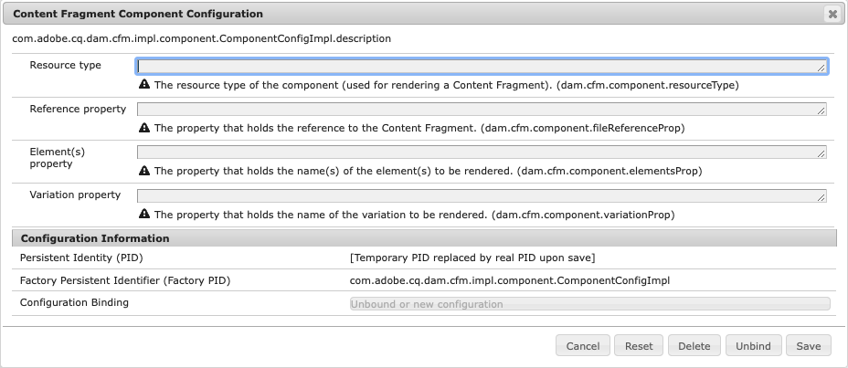

# コンテンツフラグメントレンダリング用のコンポーネントの設定{#content-fragments-configuring-components-for-rendering}

コンテンツフラグメ [ントのレンダリングに](#definition-of-advanced-services-that-need-configuration) 、いくつかの高度なサービスがあります。 これらのサービスを使用するには、そのようなコンポーネントのリソースタイプが、コンテンツフラグメントフレームワークに対して自らを認識する必要があります。

これは、 [OSGiサービス — コンテンツフラグメントコンポーネントの設定を行うことで行いま](#osgi-service-content-fragment-component-configuration)す。

この情報は、次の場合に必要です。

* 独自のコンテンツフラグメントベースのコンポーネントを実装する必要があります。
* 高度なサービスを利用する必要がある。

ただし、コアコンポーネントを使用することをお勧めします。

>[!CAUTION]
>
>* **以下に説明する高度なサービスが[必要ない場合](#definition-of-advanced-services-that-need-configuration)**、この設定は無視できます。
   >
   >
* **標準搭載のコンポーネントを拡張または使用する場合は**、OSGiの設定を変更しないことをお勧めします。
   >
   >
* **高度なサービスを使用しないで、コンテンツフラグメントAPIのみを使用するコンポーネントを新規に作成できます**。 ただし、この場合は、適切な処理を行うようにコンポーネントを開発する必要があります。
>
>
したがって、コアコンポーネントを使用することをお勧めします。

## 設定が必要なアドバンスサービスの定義 {#definition-of-advanced-services-that-need-configuration}

コンポーネントの登録を必要とするサービスは、次のとおりです。

* パブリケーション中に依存関係を正しく判断する（例：前回のパブリケーションから変更が加えられた場合は、フラグメントとモデルをページと共に自動的にパブリッシュできることを確認）。
* フルテキスト検索でのコンテンツフラグメントのサポート。
* 中間コンテンツの *管理/処理。*
* 混在メディアアセットの管 *理/処理。*
* ディスパッチャーは、参照されるフラグメントをフラッシュします（フラグメントを含むページが再公開される場合）。
* 段落ベースのレンダリングの使用

これらの機能を1つ以上使用する必要がある場合は（通常）、標準搭載のAdvanced Servicesを使用する方が、一から開発するよりも簡単です。

## OSGiサービス — コンテンツフラグメントコンポーネントの設定 {#osgi-service-content-fragment-component-configuration}

設定は、OSGiサービスコンテンツフラグメントコンポーネントの設定にバ **インドする必要があります**。

`com.adobe.cq.dam.cfm.impl.component.ComponentConfigImpl`

>[!NOTE]
>
>詳しくは [、OSGi設定](/help/implementing/deploying/overview.md#osgi-configuration) を参照してください。

次に例を示します。



OSGiの設定は次のとおりです。

<table>
 <thead>
  <tr>
   <td>ラベル</td>
   <td>OSGi Configuration<br /> </td>
   <td>説明</td>
  </tr>
 </thead>
 <tbody>
  <tr>
   <td><strong>リソースタイプ</strong></td>
   <td><code>dam.cfm.component.resourceType</code></td>
   <td>登録するリソースの種類例： <br /> <p><span class="cmp-examples-demo__property-value"><code>core/wcm/components/contentfragment/v1/contentfragment</code></code></p> </td>
  </tr>
  <tr>
   <td><strong>Referenceプロパティ</strong></td>
   <td><code>dam.cfm.component.fileReferenceProp</code></td>
   <td>フラグメントへの参照を含むプロパティの名前。例え <code>fragmentPath</code> ば <code>fileReference</code></td>
  </tr>
  <tr>
   <td><strong>Element(s)プロパティ</strong></td>
   <td><code>dam.cfm.component.elementsProp</code></td>
   <td>レンダリングする要素の名前を含むプロパティの名前。例：<code>elementName</code></td>
  </tr>
  <tr>
   <td><strong>バリエーションのプロパティ</strong><br /> </td>
   <td><code>dam.cfm.component.variationProp</code></td>
   <td>レンダリングするバリエーションの名前を含むプロパティの名前。例：<code>variationName</code></td>
  </tr>
 </tbody>
</table>

一部の機能については、コンポーネントは定義済みの規則に従う必要があります。 次の表に、各段落（各コンポーネントインスタンスに対して）に対してコンポーネントごとに定義する必要があるプロパティの詳細を示します。これにより、サービスは、これらのプロパティを正しく検出して処理できます。 `jcr:paragraph`

<table>
 <thead>
  <tr>
   <td>プロパティ名</td>
   <td>説明</td>
  </tr>
 </thead>
 <tbody>
  <tr>
   <td><code>paragraphScope</code></td>
   <td><p>単一要素のレンダリングモードで段落を出力する方法を定義する <em>stringプロパティです</em>。</p> <p>値:</p>
    <ul>
     <li><code>all</code> :すべての段落をレンダリングする</li>
     <li><code>range</code> :段落の範囲をレンダリングする <code>paragraphRange</code></li>
    </ul> </td>
  </tr>
  <tr>
   <td><code>paragraphRange</code></td>
   <td><p>単一要素のレンダリングモードの場合に出力される段落の範囲を定義する <em>stringプロパティです</em>。</p> <p>ファイル形式:</p>
    <ul>
     <li><code>1</code> または <code>1-3</code> ま <code>1-3;6;7-8</code> たは <code>*-3;5-*</code>
     <ul>
       <li><code>-</code> 範囲指標</li>
       <li><code>;</code> リスト分離器</li>
       <li><code>*</code> ワイルドカード</li>
     </ul>
     </li>
     <li>が <code>paragraphScope</code> <code>range</code></li>
    </ul> </td>
  </tr>
  <tr>
   <td><code>paragraphHeadings</code></td>
   <td>見出し（例えば、、、など）を段落( <code>h1</code>)としてカウ <code>h2</code>ントす <code>h3</code>るか、カウントしないかを定義する<code>true</code>booleanプロパティ<code>false</code>。</td>
  </tr>
 </tbody>
</table>

## 例 {#example}

例として、次を参照してください（標準搭載のAEMインスタンス上）。

```
/apps/core/wcm/config/com.adobe.cq.dam.cfm.impl.component.ComponentConfigImpl-core-comp-v1.config
```

次を含む：

```
dam.cfm.component.resourceType="core/wcm/components/contentfragment/v1/contentfragment"
dam.cfm.component.fileReferenceProp="fragmentPath"
dam.cfm.component.elementsProp="elementName"
dam.cfm.component.variationProp="variationName"
```

