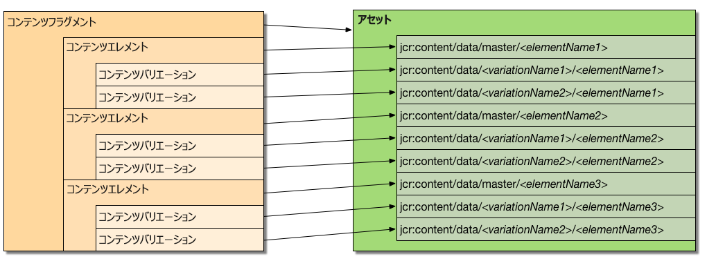
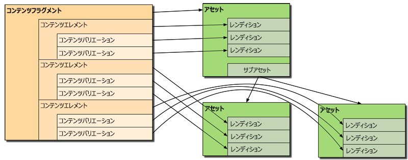

# コンテンツフラグメントのカスタマイズと拡張{#customizing-and-extending-content-fragments}

クラウドサービスとしてのAdobe Experience Manager内で、コンテンツフラグメントは標準アセットを拡張します。参照：

* コンテンツフラグメントについて詳しくは、[コンテンツフラグメントの作成と管理](/help/assets/content-fragments/content-fragments.md)および[コンテンツフラグメントを使用したページオーサリング](/help/sites-cloud/authoring/fundamentals/content-fragments.md)を参照してください。

* [アセットの管理](/help/assets/manage-digital-assets.md) とア [セットエディタのカスタマイズと拡張](/help/assets/extend-asset-editor.md) 」を参照してください。

## アーキテクチャ {#architecture}

コンテンツフラグメントの基本的な[構成要素](/help/assets/content-fragments/content-fragments.md#constituent-parts-of-a-content-fragment)は次のとおりです。

* A *Content Fragment*,
* consisting of one or more *Content Elements*,
* and which can have one or more *Content Variations*.

フラグメントのタイプに応じて、モデルまたは単純なフラグメ **ントテンプレート** も使用されます。

>[!CAUTION]
>
>[すべてのフラグメントを作成する場合](/help/assets/content-fragments/content-fragments-models.md) 、コンテンツフラグメントモデルが推奨されるようになりました。
>
>コンテンツフラグメントモデルは、WKNDのすべての例で使用されます。

* コンテンツフラグメントモデル：

   * 構造化コンテンツを含むコンテンツフラグメントの定義に使用します。
   * コンテンツフラグメントモデルでは、コンテンツフラグメントの作成時にその構造を定義します。
   * フラグメントはモデルを参照するので、モデルに対する変更は、そのモデルに関連付けられているフラグメントにも影響します。
   * モデルはデータタイプで構成されています。
   * 新しいバリエーションを追加するときなどは、それに合わせてフラグメントを更新する必要があります。
   >[!NOTE]
   >
   >コンテンツフラグメントを表示/レンダリングするには、アカウントにモデルの権限が `read` 必要です。

   >[!CAUTION]
   >
   >既存のコンテンツフラグメントモデルに変更を加えると、そのモデルに関連付けられているフラグメントに影響が生じる場合があり、対象のフラグメントで孤立プロパティが生まれることもあります。

* コンテンツフラグメントテンプレ **ート — シンプルフラグ**:

   * シンプルなコンテンツフラグメントの定義に使用します。

   * このテンプレートは、コンテンツフラグメントの作成時に、（基本的なテキストのみの）構造を定義します。

   * テンプレートは、作成時にフラグメントにコピーされます。

   * 新しいバリエーションを追加するときなどは、それに合わせてフラグメントを更新する必要があります。

   * The Content fragment template (**Simple Fragment**) operates in a different manner to that of other templating mechanisms within the AEM ecosystem (e.g. page templates, etc.). 従って、別々に考える必要がある。

   * When based on the **Simple Fragment** template the MIME type of the content is managed on the actual content; this means that each element and variation can have a different MIME type.

### サイトとアセットの統合 {#integration-of-sites-with-assets}

コンテンツフラグメント管理（CFM）は、次の理由から AEM Assets の一部と考えられます。

* コンテンツフラグメントはアセットである。
* 既存の AEM Assets 機能を使用する。
* AEM Assets に完全に統合されている（管理コンソールなど）。

コンテンツフラグメントは、次のようにサイト機能と見なされます。

* ページのオーサリング時に使用されます。

#### 構造化コンテンツフラグメントのアセットへのマッピング {#mapping-structured-content-fragments-to-assets}



コンテンツフラグメントモデルがベースの構造化コンテンツフラグメントは、単一のアセットにマッピングされます。

* All content is stored under the `jcr:content/data` node of the asset:

   * 要素データは、マスターサブノードの下に保存されます。
      `jcr:content/data/master`

   * Variations are stored under a sub-node that carries the name of the variation:
e.g. `jcr:content/data/myvariation`

   * The data of each element is stored in the respective sub-node as a property with the element name:
e.g. the content of element `text` is stored as property `text` on `jcr:content/data/master`

* Metadata and associated content is stored below `jcr:content/metadata`
Except for the title and description, which are not considered traditional metadata and stored on `jcr:content`

#### シンプルなコンテンツフラグメントのアセットへのマッピング {#mapping-simple-content-fragments-to-assets}



Simple content fragments (based on the **Simple Fragment** template) are mapped to a composite consisting of a main asset and (optional) sub-assets:

* フラグメントのコンテンツ以外の情報（タイトル、説明、メタデータ、構造など）はすべて、メインアセットでのみ管理されます。
* フラグメントの最初の要素のコンテンツは、メインアセットのオリジナルレンディションにマッピングされます。

   * 最初の要素のバリエーション（存在する場合）は、メインアセットのその他のレンディションにマッピングされます。

* 追加要素（存在する場合）は、メインアセットのサブアセットにマッピングされます。

   * これらの追加要素のメインコンテンツは、それぞれのサブアセットの元のレンディションにマップされます。
   * すべての追加要素のその他のバリエーション（該当する場合）は、それぞれのサブアセットのその他のレンディションにマッピングされます。

#### アセットの場所 {#asset-location}

標準アセットの場合、コンテンツフラグメントは次の場所に保持されます。

`/content/dam`

#### アセットの権限 {#asset-permissions}

詳しくは、コンテンツフラグメン [ト — 削除に関する考慮事項を参照してくださ](/help/assets/content-fragments/content-fragments-delete.md)い。

#### 機能の統合 {#feature-integration}

Assetsコアと統合するには：

* コンテンツフラグメント管理(CFM)機能は、アセットコアを基に構築されます。

* CFMは、カード、列、リスト表示内の項目に対して独自の実装を提供します。これらのプラグインは、既存のアセットコンテンツレンダリング実装に組み込まれます。

* 複数のアセットコンポーネントが拡張され、コンテンツフラグメントに対応できるようになりました。

### ページでのコンテンツフラグメントの使用 {#using-content-fragments-in-pages}

>[!CAUTION]
>
>コンテンツ [フラグメントコンポーネントは、コアコンポーネントの一部です](https://docs.adobe.com/content/help/jp/experience-manager-core-components/using/components/content-fragment-component.html)。 詳しくは、[コアコンポーネントの開発](https://docs.adobe.com/content/help/ja-JP/experience-manager-core-components/using/developing/developing.html)を参照してください。

コンテンツフラグメントは、その他のアセットタイプと同様に、AEM ページから参照できます。AEM では、**[コンテンツフラグメントコアコンポーネント](https://docs.adobe.com/content/help/jp/experience-manager-core-components/using/components/content-fragment-component.html)**を利用できます。これは、[コンテンツフラグメントをページ上に含めることができるコンポーネント](/help/sites-cloud/authoring/fundamentals/content-fragments.md#adding-a-content-fragment-to-your-page)です。You can also extend this**[Content Fragment](https://docs.adobe.com/content/help/ja-JP/experience-manager-core-components/using/developing/developing.html)** core component.

* このコンポーネントは、`fragmentPath` プロパティを使用して、実際のコンテンツフラグメントを参照します。The `fragmentPath` property is handled in the same manner as similar properties of other asset types; for example, when the content fragment is moved to another location.

* このコンポーネントを使用して、表示するバリエーションを選択できます。

* さらに、一定範囲の段落を選択して、出力を制限できます。例えば、複数列の出力に利用できます。

* このコンポーネントは、中間コンテンツを許可します。

   * ここで、このコンポーネントを使用して、他のアセット（画像など）を参照されているフラグメントの段落の中間に配置できます。

   * 中間コンテンツの場合は、次のことを実行する必要があります。

      * 不安定な言及の可能性を認識し、中間コンテンツ（ページの作成時に追加）は、その隣に配置される段落との固定的な関係がなく、中間コンテンツの位置が相対的な位置から失われる前に新しい段落（コンテンツフラグメントエディター内）を挿入します

      * ページ上にレンダリングされる内容を設定するために、追加のフィルター（バリエーションや段落パラメータなど）を考慮します。

>[!NOTE]
>
>**コンテンツフラグメントモデル：**
>
>ページ上でコンテンツフラグメントモデルを基にしたコンテンツフラグメントを使用している場合は、そのモデルが参照されます。そのため、ページ公開時にモデルが公開されていない場合は、フラグが付けられ、リソースに追加されているモデルがページとともに公開されます。
>
>**コンテンツフラグメントテンプレート — シンプルフラグメント：**
>
>When using a content fragment that has been based on the content fragment template **Simple Fragment** on a page, there is no reference as the template was copied when creating the fragment.

### その他のフレームワークとの統合 {#integration-with-other-frameworks}

コンテンツフラグメントは、次のフレームワークと統合できます。

* **翻訳**

   コンテンツフラグメントは、AEM翻訳ワークフローと完全に統合されています。 つまり、アーキテクチャレベルでは以下を意味します。

   * コンテンツフラグメントの個々の翻訳は、実際には別々のフラグメントです。例えば、以下のようになります。

      * 異なる言語のルートの下に位置しています。しかし、関連する言語ルートの下の同じ相対パスを共有します。

         `/content/dam/<path>/en/<to>/<fragment>`

         対

         `/content/dam/<path>/de/<to>/<fragment>`
   * ルールベースのパスを除き、コンテンツフラグメントの様々な言語バージョンの間にそれ以上のつながりはありません。UI には言語バリアント間を移動する手段が用意されていますが、それらは 2 つの別々のフラグメントとして扱われます。
   >[!NOTE]
   >
   >The AEM translation workflow works with `/content`:
   >
   >* As the content fragment models reside in `/conf`, these are not included in such translations. UI 文字列を国際化できます。


* **メタデータスキーマ**

   * コンテンツフラグメントは、[メタデータのスキーマ](/help/assets/metadata-schemas.md)を（再）利用します。メタデータのスキーマは、標準アセットを使用して定義できます。

   * CFMには、次のような独自の固有のスキーマがあります。

      `/libs/dam/content/schemaeditors/forms/contentfragment`

      必要に応じて拡張できます。

   * 各スキーマフォームは、フラグメントエディターと統合されています。

## コンテンツフラグメント管理 API - サーバー側 {#the-content-fragment-management-api-server-side}

サーバー側 API を使用して、コンテンツフラグメントにアクセスできます。以下を参照してください。

[com.adobe.cq.dam.cfm](https://docs.adobe.com/content/help/en/experience-manager-cloud-service/implementing/developing/ref/javadoc/com/adobe/cq/dam/cfm/package-frame.html)

>[!CAUTION]
>
>コンテンツ構造に直接アクセスする代わりに、サーバー側 API を使用することを強くお勧めします。

### 主要インターフェイス {#key-interfaces}

次の 3 つのインターフェイスが、入口の役割を果たします。

* **Content Fragment** ([ContentFragment](https://docs.adobe.com/content/help/en/experience-manager-cloud-service/implementing/developing/ref/javadoc/com/adobe/cq/dam/cfm/ContentFragment.html))

   このインターフェイスでは、コンテンツフラグメントを抽象化して使用できます。

   このインターフェイスでは、次のことを実行できます。

   * 基本データを管理する（名前の取得、タイトルまたは説明の取得／設定など）
   * メタデータにアクセスする
   * 要素にアクセスする

      * 要素を一覧表示する
      * 要素を名前で取得する
      * Create new elements (see [Caveats](#caveats))

      * Access element data (see `ContentElement`)
   * そのフラグメントに対して定義されているバリエーションを一覧表示する
   * 新しいバリエーションをグローバルに作成する
   * 関連コンテンツを管理する

      * コレクションを一覧表示する
      * コレクションを追加する
      * コレクションを削除する
   * フラグメントのモデルまたはテンプレートにアクセスする
   フラグメントの主要要素を表すインターフェイスには、次のものがあります。

   * **コンテンツ要素**（[ContentElement](https://docs.adobe.com/content/help/en/experience-manager-cloud-service/implementing/developing/ref/javadoc/com/adobe/cq/dam/cfm/ContentElement.html)）

      * 基本データ（名前、タイトル、説明）を取得する
      * コンテンツを取得／設定する
      * 要素のバリエーションにアクセスする

         * バリエーションを一覧表示する
         * バリエーションを名前で取得する
         * 新しいバリエーションを作成する（[注意事項](#caveats)を参照）
         * Remove variations (see [Caveats](#caveats))
         * Access variation data (see `ContentVariation`)
      * バリエーションを解決するためのショートカット（要素に指定されたバリエーションを使用できない場合は実装固有の追加のフォールバックロジックを適用）
   * **コンテンツバリエーション**（[ContentVariation](https://docs.adobe.com/content/help/en/experience-manager-cloud-service/implementing/developing/ref/javadoc/com/adobe/cq/dam/cfm/ContentVariation.html)）

      * 基本データ（名前、タイトル、説明）を取得する
      * コンテンツを取得／設定する
      * 最後に変更された情報に基づくシンプルな同期
   All three interfaces ( `ContentFragment`, `ContentElement`, `ContentVariation`) extend the `Versionable` interface, which adds versioning capabilities, required for content fragments:

   * 要素の新しいバージョンを作成する
   * 要素のバージョンを一覧表示する
   * バージョン管理されている要素の特定のバージョンのコンテンツを取得する


### Adapting - Using adaptTo() {#adapting-using-adaptto}

次のものを適応させることができます。

* `ContentFragment` は、次のように適応できます。

   * `Resource`  — 基礎となるスリング資源。基になるオブジェクトを `Resource` 直接更新する場合は、オブジェクトを再構築 `ContentFragment` する必要があります。

   * `Asset`  — コンテンツフ `Asset` ラグメントを表すDAM抽象化。更新を直接行うに `Asset` は、オブジェクトを再構築する必要が `ContentFragment` あります。

* `ContentElement` は、次のように適応できます。

   * `ElementTemplate` - 要素の構造に関する情報にアクセスするためのものです。

* `Resource` は、次のように適応できます。

   * `ContentFragment`

### 注意事項 {#caveats}

次のことに注意してください。

* API 全体は、（API JavaDoc で特に記載がない限り）変更を自動では保持&#x200B;**しない**&#x200B;ように設計されています。したがって、各リクエストのリソースリゾルバー（または実際に使用しているリゾルバー）を必ずコミットしなければなりません。

* 次のタスクには、追加作業が必要な場合があります。

   * データ構造を更新するには、 `ContentFragment` から新しいバリエーションを作成します。

   * を使用して、要素を介して既存のバリエーションを削除し `ContentElement.removeVariation()`ても、バリエーションに割り当てられたグローバルデータ構造は更新されません。 これらのデータ構造を確実に同期させるには、代わりにを使用し、バリエー `ContentFragment.removeVariation()` ションをグローバルに削除します。

## コンテンツフラグメント管理 API - クライアント側 {#the-content-fragment-management-api-client-side}

>[!CAUTION]
>
>クライアント側APIは内部用です。

### 追加情報 {#additional-information}

次のファイルを参照してください。

* `filter.xml`

   The `filter.xml` for content fragment management is configured so that it does not overlap with the Assets core content package.

## 編集セッション {#edit-sessions}

>[!CAUTION]
>
>この背景情報を考慮して下さい。 ここでは(リポジトリ内の私的な領域としてマークされているので *)何も変更しないでくださいが* 、場合によっては、内部での動作を理解するのに役立ちます。

複数の表示（= HTMLページ）にまたがるコンテンツフラグメントの編集は、アトミックです。 このようなアトミックなマルチ表示編集機能は、一般的なAEMの概念ではないので、コンテンツフラグメントは、「編集セッション」と呼ばれるもの *を使用しま*&#x200B;す。

編集セッションは、ユーザーがエディターでコンテンツフラグメントを開いたときに開始されます。 The editing session is finished when the user leaves the editor by selecting either **Save** or **Cancel**.

技術的には、すべての編集は、他のすべてのAEM *の編集と同様* 、ライブコンテンツで行われます。 編集セッションが開始されると、現在の未編集ステータスのバージョンが作成されます。 ユーザーが編集をキャンセルすると、そのバージョンが復元されます。 ユーザーが「保存」をクリッ **クした場合**、特定の操作は行われず、すべての編集がライブコンテンツで実行されたので ** 、すべての変更が既に保持されます。 また、「保存」をク **リックす** ると、一部のバックグラウンド処理（全文検索情報の作成や混在メディアアセットの処理など）がトリガされます。

エッジケースには、いくつかの安全対策があります。例えば、ユーザーが編集セッションを保存またはキャンセルせずにエディターを終了しようとした場合などです。 また、データの損失を防ぐために、定期的な自動保存を使用できます。
2人のユーザーが同じコンテンツフラグメントを同時に編集できるので、他のユーザーが変更した内容が上書きされる場合があります。 これを防ぐには、フラグメントにDAM管理のチェックアウトアクションを適用して、コンテンツフラグメントをロ *ックする* 必要があります。

## 例 {#examples}

### 例：既存のコンテンツフラグメントへのアクセス {#example-accessing-an-existing-content-fragment}

既存のコンテンツフラグメントにアクセスするには、API を表すリソースを以下に適応させます。

`com.adobe.cq.dam.cfm.ContentFragment`

次に例を示します。

```java
// first, get the resource
Resource fragmentResource = resourceResolver.getResource("/content/dam/fragments/my-fragment");
// then adapt it
if (fragmentResource != null) {
    ContentFragment fragment = fragmentResource.adaptTo(ContentFragment.class);
    // the resource is now accessible through the API
}
```

### 例：新しいコンテンツフラグメントの作成 {#example-creating-a-new-content-fragment}

新しいコンテンツフラグメントをプログラムで作成するには、モデルまたはテンプレート`FragmentTemplate` リソースから適合したを使用する必要があります。

次に例を示します。

```java
Resource templateOrModelRsc = resourceResolver.getResource("...");
FragmentTemplate tpl = templateOrModelRsc.adaptTo(FragmentTemplate.class);
ContentFragment newFragment = tpl.createFragment(parentRsc, "A fragment name", "A fragment description.");
```

### 例：自動保存間隔の指定 {#example-specifying-the-auto-save-interval}

The [auto save interval](/help/assets/content-fragments/content-fragments-managing.md#save-cancel-and-versions) (measured in seconds) can be defined using the configuration manager (ConfMgr):

* Node: `<conf-root>/settings/dam/cfm/jcr:content`
* プロパティ名: `autoSaveInterval`
* タイプ: `Long`

* Default: `600` (10 minutes); this is defined on `/libs/settings/dam/cfm/jcr:content`

自動保存間隔を 5 分に設定する場合は、次のようにノードにプロパティを定義する必要があります。

* Node: `/conf/global/settings/dam/cfm/jcr:content`
* プロパティ名: `autoSaveInterval`

* タイプ: `Long`

* 値：`300`（5 分は 300 秒です）

## ページオーサリング用コンポーネント {#components-for-page-authoring}

詳しくは、次を参照してください。

* [コアコンポーネント - コンテンツフラグメントコンポーネント](https://docs.adobe.com/content/help/jp/experience-manager-core-components/using/components/content-fragment-component.html)（推奨）
