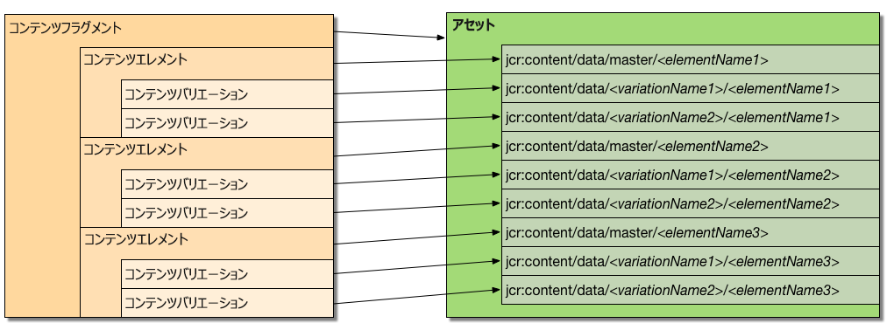

# コンテンツフラグメントのカスタマイズと拡張{#customizing-and-extending-content-fragments}

Adobe Experience Manager as a Cloud Service 内で、コンテンツフラグメントは標準アセットを拡張します。

* コンテンツフラグメントについて詳しくは、[コンテンツフラグメントの作成と管理](/help/assets/content-fragments/content-fragments.md)および[コンテンツフラグメントを使用したページオーサリング](/help/sites-cloud/authoring/fundamentals/content-fragments.md)を参照してください。

* [アセットの管理](/help/assets/manage-digital-assets.md) 」を参照してください。

<!-- Removing the extend-asset-editor article for now as I'm unsure of its accuracy. Hence commenting this link.
* [Managing Assets](/help/assets/manage-digital-assets.md) and [Customizing and Extending the Asset Editor](/help/assets/extend-asset-editor.md) for further information about standard assets.
-->

## アーキテクチャ {#architecture}

コンテンツフラグメントの基本的な[構成要素](/help/assets/content-fragments/content-fragments.md#constituent-parts-of-a-content-fragment)は次のとおりです。

* *コンテンツフラグメント*
* *コンテンツフラグメント*&#x200B;を構成する 1 つ以上のコンテンツ要素
* （場合によっては）1 つ以上の&#x200B;*コンテンツバリエーション*

個々のコンテンツフラグメントは、コンテンツフラグメントモデルに基づいています。

* コンテンツフラグメントモデルでは、コンテンツフラグメントの作成時にその構造を定義します。
* フラグメントはモデルを参照するので、モデルに対する変更は、そのモデルに関連付けられているフラグメントにも影響します。
* モデルはデータタイプで構成されています。
* 新しいバリエーションを追加するときなどは、それに合わせてフラグメントを更新する必要があります。

   >[!NOTE]
   >
   >コンテンツフラグメントを表示およびレンダリングするには、アカウントにモデルへの `read` 権限が必要です。

   >[!CAUTION]
   >
   >既存のコンテンツフラグメントモデルに変更を加えると、そのモデルに関連付けられているフラグメントに影響が生じる場合があり、対象のフラグメントで孤立プロパティが生まれることもあります。

### Sites と Assets の統合 {#integration-of-sites-with-assets}

コンテンツフラグメント管理（CFM）は、次の理由から AEM Assets の一部と考えられます。

* コンテンツフラグメントはアセットである。
* 既存の AEM Assets 機能を使用する。
* AEM Assets に完全に統合されている（Admin Console など）。

コンテンツフラグメントは、次のように Sites の機能と見なされます。

* ページのオーサリング時に使用されます。

#### コンテンツフラグメントとアセットのマッピング {#mapping-content-fragments-to-assets}



コンテンツフラグメントモデルがベースのコンテンツフラグメントは、単一のアセットにマッピングされます。

* すべてのコンテンツはアセットの `jcr:content/data` ノードに格納されます。

   * 要素データは次のマスターサブノードに格納されます。
      `jcr:content/data/master`

   * バリエーションは、そのバリエーション名のサブノードに格納されます。
例：`jcr:content/data/myvariation`

   * 各要素のデータは、その要素名のプロパティとしてそれぞれのサブノードに格納されます。
例えば `text` 要素のコンテンツは、`text` プロパティとして `jcr:content/data/master` に格納されます。

* メタデータと関連コンテンツは、`jcr:content/metadata` に格納されます。
ただし、タイトルと説明は従来のメタデータと見なされないので、次の場所に格納されます。 
`jcr:content`

#### アセットの場所 {#asset-location}

標準アセットの場合、コンテンツフラグメントは次の場所に保持されます。

`/content/dam`

#### アセットの権限 {#asset-permissions}

詳しくは、[コンテンツフラグメント - 削除に関する考慮事項](/help/assets/content-fragments/content-fragments-delete.md)を参照してください。

#### 機能の統合 {#feature-integration}

Assets コアと統合するには：

* コンテンツフラグメント管理（CFM）機能は、アセットコアを基に構築されます。

* CFM は、カード／列／リスト表示の項目に独自の実装を提供します。つまり、それらの項目が、既存のアセットコンテンツのレンダリング実装に挿入されます。

* コンテンツフラグメントに対応するために、いくつかのアセットコンポーネントが拡張されています。

### ページでのコンテンツフラグメントの使用 {#using-content-fragments-in-pages}

>[!CAUTION]
>
>[コンテンツフラグメントコンポーネントは、コアコンポーネントの一部です](https://docs.adobe.com/content/help/ja-JP/experience-manager-core-components/using/components/content-fragment-component.html)。詳しくは、[コアコンポーネントの開発](https://docs.adobe.com/content/help/ja-JP/experience-manager-core-components/using/developing/developing.html)を参照してください。

コンテンツフラグメントは、その他のアセットタイプと同様に、AEM ページから参照できます。AEM では、**[コンテンツフラグメントコアコンポーネント](https://docs.adobe.com/content/help/ja-JP/experience-manager-core-components/using/components/content-fragment-component.html)**&#x200B;を利用できます。これは、[コンテンツフラグメントをページ上に含めることができるコンポーネント](/help/sites-cloud/authoring/fundamentals/content-fragments.md#adding-a-content-fragment-to-your-page)です。この&#x200B;**[コンテンツフラグメント](https://docs.adobe.com/content/help/ja-JP/experience-manager-core-components/using/developing/developing.html)**&#x200B;コアコンポーネントを拡張することもできます。

* このコンポーネントは、`fragmentPath` プロパティを使用して、実際のコンテンツフラグメントを参照します。`fragmentPath` プロパティは、その他のアセットタイプの類似プロパティと同じ方法で処理されます。例えば、コンテンツフラグメントが別の場所に移動された場合などです。

* このコンポーネントを使用して、表示するバリエーションを選択できます。

* さらに、一定範囲の段落を選択して、出力を制限できます。例えば、複数列の出力に利用できます。

* このコンポーネントは、中間コンテンツを許可します。

   * ここで、このコンポーネントを使用して、他のアセット（画像など）を参照されているフラグメントの段落の中間に配置できます。

   * 中間コンテンツの場合は、次のことを実行する必要があります。

      * 参照が不安定になる可能性に注意します。中間コンテンツ（ページのオーサリング時に追加）とその横にある段落の関係は、固定されていません。（コンテンツフラグメントエディター内で）中間コンテンツの位置の前に新しい段落を挿入すると、相対的な位置が失われることがあります。

      * ページ上にレンダリングされる内容を設定するために、追加のフィルター（バリエーションや段落パラメータなど）を考慮します。

>[!NOTE]
>
>**コンテンツフラグメントモデル：**
>
>コンテンツフラグメントをページで使用する場合、そのフラグメントの基になるコンテンツフラグメントモデルが参照されます。
>
>そのため、ページ公開時にモデルが公開されていない場合は、フラグが付けられ、リソースに追加されているモデルがページとともに公開されます。

### その他のフレームワークとの統合 {#integration-with-other-frameworks}

コンテンツフラグメントは、次のフレームワークと統合できます。

* **翻訳**

   コンテンツフラグメントは、AEM の翻訳ワークフローと完全に統合されています。つまり、アーキテクチャレベルでは以下を意味します。

   * コンテンツフラグメントの個々の翻訳は、実際には別々のフラグメントです。例えば、以下のようになります。

      * それぞれ異なる言語のルートの下に位置していますが、関連する言語ルートの下の同じ相対パスを共有します。

         `/content/dam/<path>/en/<to>/<fragment>`

         上記に対して次のようになります。

         `/content/dam/<path>/de/<to>/<fragment>`
   * ルールベースのパスを除き、コンテンツフラグメントの様々な言語バージョンの間にそれ以上のつながりはありません。UI には言語バリアント間を移動する手段が用意されていますが、それらは 2 つの別々のフラグメントとして扱われます。
   >[!NOTE]
   >
   >AEM 翻訳ワークフローでは、`/content` が使用されます。
   >
   >* コンテンツフラグメントモデルは `/conf` 内に配置されるので、これらの翻訳には含まれません。UI 文字列を国際化できます。


* **メタデータスキーマ**

   * コンテンツフラグメントは、[メタデータのスキーマ](/help/assets/metadata-schemas.md)を（再）利用します。メタデータのスキーマは、標準アセットを使用して定義できます。

   * CFM には、次のような独自の固有のスキーマがあります。

      `/libs/dam/content/schemaeditors/forms/contentfragment`

      必要に応じて拡張できます。

   * 各スキーマフォームは、フラグメントエディターと統合されています。

## コンテンツフラグメント管理 API - サーバー側 {#the-content-fragment-management-api-server-side}

サーバー側 API を使用して、コンテンツフラグメントにアクセスできます。以下を参照してください。

[com.adobe.cq.dam.cfm](https://docs.adobe.com/content/help/en/experience-manager-cloud-service/implementing/developing/ref/javadoc/com/adobe/cq/dam/cfm/package-summary.html#package.description)

>[!CAUTION]
>
>コンテンツ構造に直接アクセスする代わりに、サーバー側 API を使用することを強くお勧めします。

### 主要インターフェイス {#key-interfaces}

次の 3 つのインターフェイスが、入口の役割を果たします。

* **コンテンツフラグメント**（[ContentFragment](https://docs.adobe.com/content/help/ja-JP/experience-manager-cloud-service/implementing/developing/ref/javadoc/com/adobe/cq/dam/cfm/ContentFragment.html)）

   このインターフェイスでは、コンテンツフラグメントを抽象化して使用できます。

   このインターフェイスでは、次のことを実行できます。

   * 基本データを管理する（名前の取得、タイトルまたは説明の取得／設定など）
   * メタデータにアクセスする
   * 要素にアクセスする

      * 要素を一覧表示する
      * 要素を名前で取得する
      * 新しい要素を作成する（[注意事項](#caveats)を参照）

      * 要素データにアクセスする（`ContentElement` を参照）
   * そのフラグメントに対して定義されているバリエーションを一覧表示する
   * 新しいバリエーションをグローバルに作成する
   * 関連コンテンツを管理する

      * コレクションを一覧表示する
      * コレクションを追加する
      * コレクションを削除する
   * フラグメントのモデルにアクセスする

   フラグメントの主要要素を表すインターフェイスには、次のものがあります。

   * **コンテンツ要素**（[ContentElement](https://docs.adobe.com/content/help/ja-JP/experience-manager-cloud-service/implementing/developing/ref/javadoc/com/adobe/cq/dam/cfm/ContentElement.html)）

      * 基本データ（名前、タイトル、説明）を取得する
      * コンテンツを取得／設定する
      * 要素のバリエーションにアクセスする

         * バリエーションを一覧表示する
         * バリエーションを名前で取得する
         * 新しいバリエーションを作成する（[注意事項](#caveats)を参照）
         * バリエーションを削除する（[注意事項](#caveats)を参照）
         * バリエーションデータにアクセスする（`ContentVariation` を参照）
      * バリエーションを解決するためのショートカット（要素に指定されたバリエーションを使用できない場合は実装固有の追加のフォールバックロジックを適用）
   * **コンテンツバリエーション**（[ContentVariation](https://docs.adobe.com/content/help/ja-JP/experience-manager-cloud-service/implementing/developing/ref/javadoc/com/adobe/cq/dam/cfm/ContentVariation.html)）

      * 基本データ（名前、タイトル、説明）を取得する
      * コンテンツを取得／設定する
      * 最後に変更された情報に基づくシンプルな同期

   3 つのインターフェイス（`ContentVariation`、`ContentFragment`、`ContentElement`、）すべてによって `Versionable` インターフェイスを拡張し、コンテンツフラグメントに必要な次のバージョン管理機能を追加します。

   * 要素の新しいバージョンを作成する
   * 要素のバージョンを一覧表示する
   * バージョン管理されている要素の特定のバージョンのコンテンツを取得する


### 適応 - adaptTo() の使用{#adapting-using-adaptto}

次のものを適応させることができます。

* `ContentFragment` は、次のものに適応させることができます。

   * `Resource` - 基になる Sling リソース。基になる `Resource` を直接更新するには `ContentFragment` オブジェクトを再構築します。

   * `Asset` - コンテンツフラグメントを表す DAM `Asset`の抽象化。`Asset` を直接更新するには `ContentFragment` オブジェクトを再構築する必要があります。

* `ContentElement` は、次のものに適応させることができます。

   * [`ElementTemplate`](https://docs.adobe.com/content/help/en/experience-manager-cloud-service/implementing/developing/ref/javadoc/com/adobe/cq/dam/cfm/ElementTemplate.html) - 要素の構造に関する情報にアクセスするためのものです。

* [`FragmentTemplate`](https://docs.adobe.com/content/help/en/experience-manager-cloud-service/implementing/developing/ref/javadoc/com/adobe/cq/dam/cfm/FragmentTemplate.html)

* `Resource` は、次のものに適応させることができます。

   * `ContentFragment`

### 注意事項 {#caveats}

次のことに注意してください。

* API 全体は、（API JavaDoc で特に記載がない限り）変更を自動では保持&#x200B;**しない**&#x200B;ように設計されています。したがって、各リクエストのリソースリゾルバー（または実際に使用しているリゾルバー）を必ずコミットしなければなりません。

* 次のタスクには、追加作業が必要な場合があります。

   * `ContentFragment` から新しいバリエーションを作成することを強くお勧めします。これにより、すべての要素がこのバリエーションを共有することになり、新しく作成したバリエーションをコンテンツ構造に反映するために、適切なグローバルデータ構造が必要に応じて更新されます。

   * `ContentElement.removeVariation()` を使用して、要素を介して既存のバリエーションを削除しても、バリエーションに割り当てられたグローバルデータ構造は更新されません。これらのデータ構造を確実に同期させるには、代わりに `ContentFragment.removeVariation()` を使用すると、バリエーションがグローバルに削除されます。

## コンテンツフラグメント管理 API - クライアント側 {#the-content-fragment-management-api-client-side}

>[!CAUTION]
>
>クライアントサイド API は内部用です。

### 追加情報 {#additional-information}

次のファイルを参照してください。

* `filter.xml`

   コンテンツフラグメント管理のための `filter.xml` は、アセットのコアコンテンツパッケージと重複しないように設定されています。

## 編集セッション {#edit-sessions}

>[!CAUTION]
>
>この背景情報を考慮して下さい。ここでは（リポジトリ内の&#x200B;*私的な領域*&#x200B;としてマークされているため）何も変更しないでください。ですが、場合によっては、内部の動作を理解するのに役立ちます。

複数のビュー（= HTML ページ）にまたがる可能性があるコンテンツフラグメントの編集はアトミックです。このようなアトミックなマルチ表示編集機能は、一般的な AEM の概念ではないので、コンテンツフラグメントは、*編集セッション*&#x200B;と呼ばれるものを使用します。

編集セッションは、ユーザーがエディターでコンテンツフラグメントを開くと開始されます。ユーザーが「**保存**」または「**キャンセル**」を選択してエディターから移動すると、編集セッションは終了します。

技術的には、すべての編集は、他のすべての AEM の編集と同様、*ライブ*&#x200B;コンテンツでおこなわれます。編集セッションが開始されると、現在の未編集ステータスのバージョンが作成されます。ユーザーが編集をキャンセルすると、そのバージョンが復元されます。ユーザーが「**保存**」をクリックした場合、特定の操作はおこなわれません。すべての編集が&#x200B;*ライブ*&#x200B;コンテンツで実行されたので、すべての変更が既に保持されているからです。また、「**保存**」をクリックすると、一部のバックグラウンド処理（全文検索情報の作成や混在メディアアセットの処理など）がトリガーされます。

エッジケースには、いくつかの安全対策があります（例：ユーザーが編集セッションを保存またはキャンセルせずにエディターを終了しようとした場合など）。また、データの損失を防ぐために、定期的な自動保存を使用できます。
2 人のユーザーが同じコンテンツフラグメントを同時に編集できるので、他のユーザーが変更した内容が上書きされる場合があります。これを防ぐには、フラグメントに DAM 管理の*チェックアウト*&#x200B;アクションを適用して、コンテンツフラグメントをロックする必要があります。

## 例 {#examples}

### 例：既存のコンテンツフラグメントへのアクセス {#example-accessing-an-existing-content-fragment}

既存のコンテンツフラグメントにアクセスするには、API を表すリソースを以下に適応させます。

`com.adobe.cq.dam.cfm.ContentFragment`

次に例を示します。

```java
// first, get the resource
Resource fragmentResource = resourceResolver.getResource("/content/dam/fragments/my-fragment");
// then adapt it
if (fragmentResource != null) {
    ContentFragment fragment = fragmentResource.adaptTo(ContentFragment.class);
    // the resource is now accessible through the API
}
```

### 例：新しいコンテンツフラグメントの作成 {#example-creating-a-new-content-fragment}

新しいコンテンツフラグメントをプログラムで作成するには、モデルリソースから適合した `FragmentTemplate` を使用する必要があります。

次に例を示します。

```java
Resource modelRsc = resourceResolver.getResource("...");
FragmentTemplate tpl = modelRsc.adaptTo(FragmentTemplate.class);
ContentFragment newFragment = tpl.createFragment(parentRsc, "A fragment name", "A fragment description.");
```

### 例：自動保存間隔の指定 {#example-specifying-the-auto-save-interval}

[自動保存間隔](/help/assets/content-fragments/content-fragments-managing.md#save-cancel-and-versions)（秒単位）は、設定マネージャー（ConfMgr）を使用して定義できます。

* ノード：`<conf-root>/settings/dam/cfm/jcr:content`
* プロパティ名：`autoSaveInterval`
* 型：`Long`

* デフォルト：`600`（10 分）。`/libs/settings/dam/cfm/jcr:content` で定義されています

自動保存間隔を 5 分に設定する場合は、次のようにノードにプロパティを定義する必要があります。

* ノード：`/conf/global/settings/dam/cfm/jcr:content`
* プロパティ名：`autoSaveInterval`

* 型：`Long`

* 値：`300`（5 分は 300 秒です）

## ページオーサリング用コンポーネント {#components-for-page-authoring}

詳しくは、次を参照してください。

* [コアコンポーネント - コンテンツフラグメントコンポーネント](https://docs.adobe.com/content/help/ja-JP/experience-manager-core-components/using/components/content-fragment-component.html)（推奨）
