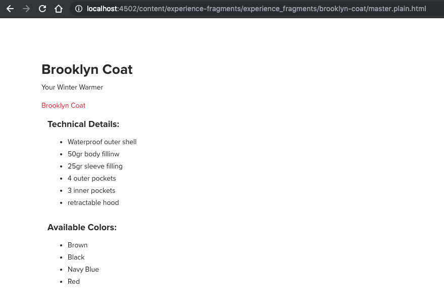

# エクスペリエンスフラグメント{#experience-fragments}

## 基本知識 {#the-basics}

[エクスペリエンスフラグメント](/help/sites-cloud/authoring/fundamentals/experience-fragments.md)は、ページ内で参照できるコンテンツおよびレイアウトを含む 1 つ以上のコンポーネントのグループです。

エクスペリエンスフラグメントのマスターやバリアントでは、次のものを使用します。

* `sling:resourceType`：`/libs/cq/experience-fragments/components/xfpage`

`/libs/cq/experience-fragments/components/xfpage/xfpage.html` がないので、次のものに戻ります。

* `sling:resourceSuperType`：`wcm/foundation/components/page`

## プレーン HTML レンディション {#the-plain-html-rendition}

URL で `.plain.` セレクターを使用すると、プレーン HTML レンディションにアクセスできます。

これはブラウザーから利用できますが、主な目的は、他のアプリケーション（例えば、サードパーティ Web アプリ、カスタムモバイル実装など）が、URL のみを使用して、エクスペリエンスフラグメントのコンテンツに直接アクセスできるようにすることです。

プレーン HTML レンディションは、次のようなパスにプロトコル、ホストおよびコンテキストパスを追加します。

* タイプが `src`、`href`、`action` のいずれか

* または、`-src` か `-href` で終わる

次に例を示します。

`.../brooklyn-coat/master.plain.html`

>[!NOTE]
>
>リンクは、常に、パブリッシュインスタンスを参照します。リンクは、サードパーティによって使用されることを意図しているので、オーサーインスタンスではなく、常にパブリッシュインスタンスから呼び出されます。



プレーンレンディションセレクターでは、追加スクリプトとは異なり、トランスフォーマーを使用します。[Sling Rewriter](https://sling.apache.org/documentation/bundles/output-rewriting-pipelines-org-apache-sling-rewriter.html) がトランスフォーマーとして使用されます。これは次の場所で設定されています。

* `/libs/experience-fragments/config/rewriter/experiencefragments`

## ソーシャルバリエーション {#social-variations}

ソーシャルバリエーションをソーシャルメディア（テキストおよび画像）に投稿できます。AEM では、これらのソーシャルバリエーションに、テキストコンポーネントや画像コンポーネントなどのコンポーネントを含めることができます。

ソーシャル投稿の画像やテキストは、（構築ブロックまたはレイアウトコンテナの）任意の深さレベルの任意の画像リソースタイプまたはテキストリソースタイプから取得できます。

また、ソーシャルバリエーションを使用すると、（パブリッシュ環境で）ソーシャルアクションをおこなう際に構築ブロックを考慮に入れることもできます。

的確なテキストと画像をソーシャルメディアネットワークに投稿するには、カスタマイズした独自のコンポーネントを開発する場合、いくつかの規則に従う必要があります。

それには、次のプロパティを使用する必要があります。

* 画像を抽出する場合

   * `fileReference`
   * `fileName`

* テキストを抽出する場合

   * `text`

この規則を使用しないコンポーネントは考慮されません。

## エクスペリエンスフラグメントのテンプレート {#templates-for-experience-fragments}

>[!CAUTION]
>
>エクスペリエンスフラグメントでサポートされているのは、編集可能なテンプレート&#x200B;***だけ***&#x200B;です。

<!-- >***Only*** [editable templates](/help/sites-developing/page-templates-editable.md) are supported for Experience Fragments.
-->

エクスペリエンスフラグメントの新しいテンプレートを作成する際は、編集可能なテンプレートの標準的な手法に従うことができます。

<!-- When developing a new template for Experience Fragments you can follow follow the standard practices for an [editable template](/help/sites-developing/page-templates-editable.md).
-->

**エクスペリエンスフラグメントを作成**&#x200B;ウィザードで検出されるエクスペリエンスフラグメントテンプレートを作成するには、次のいずれかのルールセットに従う必要があります。

1. 次の両方：

   1. テンプレート（初期ノード）のリソースタイプは、次のものから継承する必要があります。
      `cq/experience-fragments/components/xfpage`

   1. テンプレートの名前は次の文字列で始まる必要があります。
      `experience-fragments`
これにより、ユーザーは /content/experience-fragments にエクスペリエンスフラグメントを作成できます。このフォルダーの `cq:allowedTemplates` プロパティには、`experience-fragment` で始まる名前の付いたすべてのテンプレートが含まれています。ユーザーは、このプロパティを更新して、独自の命名方式やテンプレート場所を取り入れることができます。

1. [使用可能なテンプレート](/help/sites-cloud/authoring/fundamentals/experience-fragments.md#configure-allowed-templates-folder)はエクスペリエンスフラグメントコンソールで設定できます。

<!--
1. Add the template details manually in `cq:allowedTemplates` on the `/content/experience-fragment` node.
-->

<!-- >[!NOTE]
>
>[Allowed templates](/help/sites-authoring/experience-fragments.md#configuring-allowed-templates) can be configured in the Experience Fragments console.
-->

## エクスペリエンスフラグメントのコンポーネント {#components-for-experience-fragments}

エクスペリエンスフラグメントで使用するコンポーネントの開発は、標準的な方法に従っておこないます。

後は、コンポーネントをテンプレートで使用できるように設定するだけです。それには、コンテンツポリシーを使用します。

<!--
[Developing components](/help/sites-developing/components.md) for use with/in Experience Fragments follow standard practices.

The only additional configuration is to ensure that the components are [allowed on the template, this is achieved with the Content Policy](/help/sites-developing/page-templates-editable.md#content-policies).
-->

## Experience Fragment Link Rewriter Provider - HTML {#the-experience-fragment-link-rewriter-provider-html}

AEM では、エクスペリエンスフラグメントを作成できます。エクスペリエンスフラグメントは、

* コンポーネントグループとレイアウトで構成されます。
* AEM ページとは独立して存在できます。

このようなグループの使用例の 1 つは、Adobe Target などのサードパーティのタッチポイントにコンテンツを埋め込む場合です。

### デフォルトのリンク書き換え {#default-link-rewriting}

<!--Using the [Export to Target](/help/sites-administering/experience-fragments-target.md) feature, you can:
-->

「Adobe Target に書き出し」機能を使用すると、次の操作が可能です。

* エクスペリエンスフラグメントを作成する
* エクスペリエンスフラグメントにコンポーネントを追加する
* エクスペリエンスフラグメントを HTML 形式または JSON 形式で Adobe Target オファーとして書き出す

この機能は、AEM のオーサーインスタンスで有効にすることができます。有効な Adobe Target 設定と、Link Externalizer の設定が必要です。

<!--
This feature can be [enabled on an author instance of AEM](/help/sites-administering/experience-fragments-target.md#Prerequisites). It requires a valid Adobe Target Configuration, and configurations for the Link Externalizer.
-->

Link Externalizer は、Target オファーの HTML バージョンを作成する際に必要な正しい URL を決定するために使用されます。オファーは、その後 Adobe Target に送信されます。これが必要なのは、Adobe Target では Target HTML オファー内のすべてのリンクに公にアクセスできる必要があるからです。つまり、リンクが参照するあらゆるリソースとエクスペリエンスフラグメントそのものを使用するには、まずそれらを公開する必要があります。

デフォルトでは、Target HTML オファーを作成すると、AEM のカスタム Sling セレクターにリクエストが送信されます。このセレクターの名前は `.nocloudconfigs.html` です。これはエクスペリエンスフラグメントのプレーン HTML レンダリングを作成しますが、その名前が示すとおり、クラウド設定を含んでいません（クラウド設定は余分な情報です）。

HTML ページを生成すると、Sling Rewriter パイプラインは出力に次のような変更を加えます。

1. `html`、`head`、`body` の各要素が `div` 要素に置き換わります。`meta`、`noscript`、`title` の各要素が削除されます（これらは元の `head` 要素の子要素であり、親が `div` 要素に置き換わる場合は考慮されません）。

   このような変更がおこなわれるのは、HTML Target オファーを Target アクティビティに確実に含めることができるようにするためです。

2. AEM では、HTML に存在するすべての内部リンクを変更して、公開されたリソースを指すようにします。

   変更するリンクを決定するために、AEM では HTML 要素の次の属性パターンに従います。

   1. `src` 属性
   2. `href` 属性
   3. `*-src` 属性（例：data-src、custom-src など）
   4. `*-href` 属性（例：`data-href`、`custom-href`、`img-href` など）
   >[!NOTE]
   >
   >ほとんどの場合、HTML 内の内部リンクは相対リンクですが、カスタムコンポーネントの HTML で完全な URL が指定されている場合もあります。デフォルトでは、AEM はこれらの完全な URL を無視し、変更しません。

   公開済みのインスタンス上にある公開 URL であるかのように URL を再作成するために、これらの属性のリンクを AEM Link Externalizer `publishLink()` に通します。

そのまま使用できる標準実装を使用する場合、エクスペリエンスフラグメントから Target オファーを生成して Adobe Target に書き出すには、上記のプロセスで十分です。しかし、このプロセスでは対応していない使用例もいくつかあります。例えば、次のような場合です。

* Sling マッピングがパブリッシュインスタンスでのみ使用可能
* Dispatcher によるリダイレクト

これらの使用例のために、AEM には Link Rewriter Provider インターフェイスが用意されています。

### Link Rewriter Provider インターフェイス {#link-rewriter-provider-interface}

（[デフォルトのリンク書き換え](#default-link-rewriting)では対応していない）より複雑な場合のために、AEM では Link Rewriter Provider インターフェイスを提供しています。これは、バンドルにサービスとして実装できる `ConsumerType` インターフェイスです。このインターフェイスは、エクスペリエンスフラグメントからレンダリングされる HTML オファーの内部リンクに対して AEM で実行される変更をバイパスします。このインターフェイスを使用すると、内部 HTML リンクの書き換えプロセスをビジネスニーズに合わせてカスタマイズできます。

このインターフェイスをサービスとして実装する使用例としては、例えば次のものがあります。

* Sling マッピングがパブリッシュインスタンスでは有効になっているが、オーサーインスタンスでは有効になっていない
* Dispatcher または類似の技術を使用して URL を内部的にリダイレクトする
* リソース用に `sling:alias mechanisms` が整備されている

>[!NOTE]
>
>このインターフェイスでは、生成された Target オファーからの内部 HTML リンクのみ処理します。

Link Rewriter Provider インターフェイス（`ExperienceFragmentLinkRewriterProvider`）は次のとおりです。

```java
public interface ExperienceFragmentLinkRewriterProvider {

    String rewriteLink(String link, String tag, String attribute);

    boolean shouldRewrite(ExperienceFragmentVariation experienceFragment);

    int getPriority();

}
```

### Link Rewriter Provider インターフェイスの使用方法 {#how-to-use-the-link-rewriter-provider-interface}

このインターフェイスを使用するには、まず、Link Rewriter Provider インターフェイスを実装する新しいサービスコンポーネントを含んだバンドルを作成する必要があります。

このサービスは、様々なリンクにアクセスできるように、エクスペリエンスフラグメントの「Adobe Target に書き出し」機能でのリンク書き換えにプラグインするために使用されます。

例えば、`ComponentService` の場合は次のようになります。

```java
import com.adobe.cq.xf.ExperienceFragmentLinkRewriterProvider;
import com.adobe.cq.xf.ExperienceFragmentVariation;
import org.osgi.service.component.annotations.Service;
import org.osgi.service.component.annotations.Component;

@Component
@Service
public class GeneralLinkRewriter implements ExperienceFragmentLinkRewriterProvider {

    @Override
    public String rewriteLink(String link, String tag, String attribute) {
        return null;
    }

    @Override
    public boolean shouldRewrite(ExperienceFragmentVariation experienceFragment) {
        return false;
    }

    @Override
    public int getPriority() {
        return 0;
    }

}
```

このサービスが機能するには、次の 3 つのメソッドをサービス内に実装する必要があります。

* ` [shouldRewrite](#shouldrewrite)`
* ` [rewriteLink](#rewritelink)`

   * `rewriteLinkExample2`

* ` [getPriority](#priorities-getpriority)`

#### shouldRewrite {#shouldrewrite}

エクスペリエンスフラグメントの特定のバリエーションに対して「Adobe Target に書き出し」機能が呼び出された場合に、リンクを書き換える必要があるかどうかをシステムに指定する必要があります。それには、次のメソッドを実装します。

`shouldRewrite(ExperienceFragmentVariation experienceFragment);`

次に例を示します。

```java
@Override
public boolean shouldRewrite(ExperienceFragmentVariation experienceFragment) {
    return experienceFragment.getPath().equals("/content/experience-fragment/master");
}
```

このメソッドは、現在「Adobe Target に書き出し」システムによる書き換えの対象となっているエクスペリエンスフラグメントバリエーションをパラメーターとして受け取ります。

上の例では、次のものが書き換えの対象となります。

* `src` に指定されているリンク

* `href` 属性のみ

* 特定のエクスペリエンスフラグメントの場合：
   `/content/experience-fragment/master`

「Adobe Target に書き出し」システムに通す他のあらゆるエクスペリエンスフラグメントは無視され、本サービスに実装される変更の影響を受けません。

#### rewriteLink {#rewritelink}

書き換えプロセスの影響を受けるエクスペリエンスフラグメントバリエーションの場合は、サービスでリンクの書き換えを処理するように作業を進めます。内部 HTML でリンクが検出されるたびに、次のメソッドが呼び出されます。

`rewriteLink(String link, String tag, String attribute)`

このメソッドは入力として次のパラメーターを受け取ります。

* `link`：
現在処理中のリンクの `String` 表現です。これは通常、オーサーインスタンス上のリソースを指す相対 URL です。

* `tag`：
現在処理中の HTML 要素の名前です。

* `attribute`：
正確な属性名です。

例えば、「Adobe Target に書き出し」システムが現在この要素を処理している場合は、`CSSInclude` を次のように定義できます。

```java
<link rel="stylesheet" href="/etc.clientlibs/foundation/clientlibs/main.css" type="text/css">
```

`rewriteLink()` メソッドの呼び出しは、次のパラメーターを使用しておこないます。

```java
rewriteLink(link="/etc.clientlibs/foundation/clientlibs/main.css", tag="link", attribute="href" )
```

サービスを作成する際は、指定された入力に基づいて判断し、それに応じてリンクを書き換えることができます。

この例では、URL の `/etc.clientlibs` 部分を削除し、適切な外部ドメインを追加するとしましょう。話を簡単にするために、`rewriteLinkExample2` に示すように、サービスのリソースリゾルバーにアクセスできると考えます。

>[!NOTE]
>
>サービスユーザーを通じてリソースリゾルバーを取得する方法について詳しくは、「AEM のサービスユーザー」を参照してください。

<!--
>For more information on how to get a resource resolver through a service user see [Service Users in AEM](/help/sites-administering/security-service-users.md).
-->

```java
private ResourceResolver resolver;

private Externalizer externalizer;

@Override
public String rewriteLink(String link, String tag, String attribute) {

    // get the externalizer service
    externalizer = resolver.adaptTo(Externalizer.class);
    if(externalizer == null) {
        // if there was an error, then we do not modify the link
        return null;
    }

    // remove leading /etc.clientlibs from resource link before externalizing
    link = link.replaceAll("/etc.clientlibs", "");

    // considering that we configured our publish domain, we directly apply the publishLink() method
    link = externalizer.publishLink(resolver, link);

    return link;
}
```

>[!NOTE]
>
>上記のメソッドが `null` を返した場合、「Adobe Target に書き出し」システムは、リンクをそのままの状態（リソースへの相対リンク）にしておきます。

#### 優先度 - getPriority {#priorities-getpriority}

様々な種類のエクスペリエンスフラグメントに対応するためや、すべてのエクスペリエンスフラグメントの外部化とマッピングを処理する汎用サービスを用意するために、いくつかのサービスが必要になることは珍しくありません。このような場合、使用するサービスに関するの競合が発生する可能性があるので、AEM では、様々なサービスの&#x200B;**優先度**&#x200B;を定義できるようになっています。優先度は、次のメソッドを使用して指定します。

* `getPriority()`

このメソッドを使用すると、複数のサービスを使用しても、同じエクスペリエンスフラグメントについては `shouldRewrite()` メソッドが true を返すようにすることができます。`getPriority()` メソッドから最高の優先度が返されるサービスが、対象となっているエクスペリエンスフラグメントバリエーションを処理するサービスになります。

例えば、エクスペリエンスフラグメントのすべてのバリエーションについて `shouldRewrite()` メソッドが `true` を返す場合にすべてのエクスペリエンスフラグメントの基本マッピングを処理する `GenericLinkRewriterProvider` を用意することができます。一部の特定のエクスペリエンスフラグメントについては、特別な処理が必要になる場合があります。その場合は、一部のエクスペリエンスフラグメントバリエーションについてのみ `shouldRewrite()` メソッドが true を返すような `SpecificLinkRewriterProvider` を用意することができます。それらのエクスペリエンスフラグメントバリエーションを処理するために `SpecificLinkRewriterProvider` が必ず選択されるようにするには、そのプロバイダーの `getPriority()` メソッドで返される優先度が `GenericLinkRewriterProvider.` の場合より高くなるようにする必要があります。