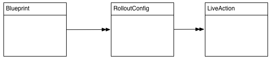

# マルチサイトマネージャーの拡張 {#extending-the-multi-site-manager}

このドキュメントは、マルチサイトマネージャーの機能を拡張する方法をわかりやすく説明しており、次のトピックを取り扱っています。

* MSM Java API の主な構成要素について説明します。
* ロールアウト設定で使用できる、新しい同期アクションを作成します。
* デフォルトの言語コードと国コードを変更します。

>[!TIP]
>
>このページは、[コンテンツの再利用：マルチサイトマネージャー](/help/sites-cloud/administering/msm/overview.md)のドキュメントを読んでおくとより簡単に理解できます。

>[!CAUTION]
>
>マルチサイトマネージャーとその API は web サイトのオーサリング時に使用するため、オーサー環境での使用のみを目的としています。

## Java API の概要 {#overview-of-the-java-api}

マルチサイト管理は、次のパッケージで構成されています。

* [com.day.cq.wcm.msm.api](https://developer.adobe.com/experience-manager/reference-materials/6-5/javadoc/com/day/cq/wcm/msm/api/package-frame.html)
* [com.day.cq.wcm.msm.commons](https://developer.adobe.com/experience-manager/reference-materials/6-5/javadoc/com/day/cq/wcm/msm/commons/package-frame.html)

主な MSM API オブジェクトは、次のようにやり取りします（[使用される用語](/help/sites-cloud/administering/msm/overview.md#terms-used)のセクションも参照してください）。


* **`Blueprint`** - `Blueprint`（[ブループリント設定](/help/sites-cloud/administering/msm/overview.md#source-blueprints-and-blueprint-configurations)）は、ライブコピーのコンテンツ継承元となるページを指定します。

  

   * ブループリント設定（`Blueprint`）の使用は任意ですが、次の事項が可能になります。

      * 作成者がソースに対して「**ロールアウト**」オプションを使用すると、このソースから継承するライブコピーへの変更を（明示的に）プッシュできます。
      * 作成者が「**サイトを作成**」を使用すると、ユーザーが簡単に言語を選択し、ライブコピーの構造を設定できます。
      * 結果として生じるすべてのライブコピーに対するデフォルトのロールアウト設定を定義します。

* **`LiveRelationship`** - `LiveRelationship` は、ライブコピーブランチのリソースと、同等のソースまたはブループリントのリソースとの関連付け（関係）を指定します。

   * この関係は、継承およびロールアウトの実現時に使用されます。
   * `LiveRelationship` オブジェクトは、ロールアウト設定（`RolloutConfig`）、`LiveCopy` 、および関係に関連付けた `LiveStatus` オブジェクトへのアクセス（参照）を可能にします。

   * 例えば、`/content/wknd/language-masters` にあるソースまたはブループリントから、`/content/copy/us` にライブコピーが作成されるとします。リソース `/content/wknd/language-masters/en/jcr:content` および `/content/copy/us/en/jcr:content` は関係を築きます。

* **`LiveCopy`** - `LiveCopy` は、ライブコピーのリソースとそのソースまたはブループリントのリソースとの関係（`LiveRelationship`）の詳細な設定を保持します。

   * `LiveCopy` クラスを使用すると、ページのパスや、ソースまたはブループリントページのパス、ロールアウト設定にアクセスでき、さらに子ページも `LiveCopy` に含まれるかどうかを決めます。

   * `LiveCopy` ノードは、「**サイトを作成**」または「**ライブコピーを作成**」を使用するたびに作成されます。

* **`LiveStatus`** - `LiveStatus` オブジェクトは、`LiveRelationship` の実行時ステータスへのアクセスを可能にします。このオブジェクトを使用して、ライブコピーの同期ステータスを問い合わせます。

* **`LiveAction`** - `LiveAction` は、ロールアウトに含まれる各リソースに対して実行されるアクションです。

   * `LiveAction` は、`RolloutConfig` によってのみ生成されます。

* **`LiveActionFactory`** ‐ `LiveActionFactory` は、`LiveAction` 設定を指定して、`LiveAction` オブジェクトを作成します。設定は、リポジトリ内にリソースとして保存されます。

* **`RolloutConfig`** - `RolloutConfig` は、トリガー時に使用される `LiveActions` のリストを保持します。`LiveCopy` は `RolloutConfig` を継承し、その結果が `LiveRelationship` に含まれます。

   * 初めてライブコピーを設定する場合は、（`LiveAction` をトリガーする）`RolloutConfig` も使用します。

## 新しい同期アクションの作成 {#creating-a-new-synchronization-action}

ロールアウト設定で使用するカスタム同期アクションを作成できます。これは、[インストール済みのアクション](/help/sites-cloud/administering/msm/live-copy-sync-config.md#installed-synchronization-actions)が特定のアプリケーション要件を満たさない場合に役立ちます。

同期アクションを作成するには、次の 2 つのクラスを作成します。

* アクションを実行する [`com.day.cq.wcm.msm.api.LiveAction`](https://developer.adobe.com/experience-manager/reference-materials/6-5/javadoc/com/day/cq/wcm/msm/api/LiveAction.html) インターフェイスの実装。
* [`com.day.cq.wcm.msm.api.LiveActionFactory`](https://developer.adobe.com/experience-manager/reference-materials/6-5/javadoc/com/day/cq/wcm/msm/api/LiveActionFactory.html) インターフェイスを実装し、`LiveAction` クラスのインスタンスを作成する OSGi コンポーネント

`LiveActionFactory` は、指定された設定の `LiveAction` クラスのインスタンスを作成します。

* `LiveAction` クラスには次のメソッドが含まれます。

   * `getName` - アクションの名前を返します

      * この名前は、（例えば、ロールアウト設定で）アクションの参照に使用されます。

   * `execute` - アクションのタスクを実行します

* `LiveActionFactory` クラスには次の要素が含まれます。

   * `LIVE_ACTION_NAME` - 関連付けられた `LiveAction` の名前を含むフィールド

      * この名前は、`getName` クラスの `LiveAction` メソッドが返す値と一致する必要があります。

   * `createAction` - `LiveAction` のインスタンスを作成します

      * オプションの `Resource` パラメーターを使用して、設定情報を指定できます。

   * `createsAction` - 関連付けられた `LiveAction` の名前を返します

### LiveAction 設定ノードへのアクセス {#accessing-the-liveaction-configuration-node}

リポジトリ内の `LiveAction` 設定ノードを使用して、`LiveAction` インスタンスの実行時の動作に影響を与える情報を格納します。`LiveAction` 設定を保存するリポジトリ内のノードは、実行時に `LiveActionFactory` オブジェクトに使用できます。そのため、設定ノードにプロパティを追加し、必要に応じて `LiveActionFactory` 実装内で使用することができます。

例えば、`LiveAction` にはブループリント作成者の名前を保存する必要があります。設定ノードのプロパティには、情報を保存するブループリントページのプロパティ名が含まれます。実行時、`LiveAction` は設定からプロパティ名を取得して、そのプロパティ値を取得します。

[`LiveActionFactory.createAction`](https://developer.adobe.com/experience-manager/reference-materials/6-5/javadoc/com/day/cq/wcm/msm/api/LiveActionFactory.html) メソッドのパラメーターは `Resource` オブジェクトです。この `Resource` オブジェクトは、ロールアウト設定のこのライブアクションの `cq:LiveSyncAction` ノードを表します。

詳しくは、[ロールアウト設定の作成](/help/sites-cloud/administering/msm/live-copy-sync-config.md#creating-a-rollout-configuration)を参照してください。

通常どおり、設定ノードを使用する場合は、`ValueMap` オブジェクトに適応させる必要があります。

```java
public LiveAction createAction(Resource resource) throws WCMException {
        ValueMap config;
        if (resource == null || resource.adaptTo(ValueMap.class) == null) {
            config = new ValueMapDecorator(Collections.<String, Object>emptyMap());
        } else {
            config = resource.adaptTo(ValueMap.class);
        }
        return new MyLiveAction(config, this);
}
```

### ターゲットノード、ソースノード、LiveRelationship へのアクセス {#accessing-target-nodes-source-nodes-and-the-liverelationship}

`execute` オブジェクトの `LiveAction` メソッドのパラメーターとして、以下のオブジェクトを指定します。

* ライブコピーのソースを表す [`Resource`](https://developer.adobe.com/experience-manager/reference-materials/cloud-service/javadoc/org/apache/sling/api/resource/Resource.html) オブジェクト
* ライブコピーのターゲットを表す `Resource` オブジェクト
* ライブコピーの [`LiveRelationship`](https://developer.adobe.com/experience-manager/reference-materials/cloud-service/javadoc/com/day/cq/wcm/msm/api/LiveRelationship.html) オブジェクト
   * `autoSave` 値は、`LiveAction` がリポジトリに対して行われた変更を保存するかどうかを示します。
   * `reset` 値は、ロールアウトのリセットモードを示します。

これらのオブジェクトから、`LiveCopy` に関するすべての情報を取得できます。`Resource` オブジェクトを使用して、`ResourceResolver`、`Session`、`Node` の各オブジェクトも取得できます。これらのオブジェクトは、リポジトリコンテンツの操作に役立ちます。

以下のコードの先頭行で、source はソースページの `Resource` オブジェクトです。

```java
ResourceResolver resolver = source.getResourceResolver();
Session session = resolver.adaptTo(javax.jcr.Session.class);
Node sourcenode = source.adaptTo(javax.jcr.Node.class);
```

>[!NOTE]
>
>`Resource` 引数には、`null` `Resources` オブジェクトなどの `Node` オブジェクトに適応しない [`NonExistingResource` または &#x200B;](https://developer.adobe.com/experience-manager/reference-materials/cloud-service/javadoc/org/apache/sling/api/resource/NonExistingResource.html) オブジェクトを指定できます。

## 新しいロールアウト設定の作成 {#creating-a-new-rollout-configuration}

インストールされたロールアウト設定がアプリケーションの要件を満たさない場合は、次の 2 つの手順でロールアウト設定を作成できます。

* [ロールアウト設定の作成](#create-the-rollout-configuration)
* [ロールアウト設定への同期アクションの追加](#add-synchronization-actions-to-the-rollout-configuration)

ブループリントページまたはライブコピーページでロールアウト設定を指定すると、新しいロールアウト設定を使用できるようになります。

>[!TIP]
>
>[ロールアウトをカスタマイズするためのベストプラクティス](/help/sites-cloud/administering/msm/best-practices.md#customizing-rollouts)も参照してください。

### ロールアウト設定の作成 {#create-the-rollout-configuration}

ロールアウト設定を作成するには、次の手順に従います。

1. `https://<host>:<port>/crx/de` で CRXDE Lite を開きます。

1. `/libs/msm/wcm/rolloutconfigs` のプロジェクトのカスタマイズバージョンの `/apps/msm/<your-project>/rolloutconfigs` に移動します。

   * 初めて設定を行う場合は、この `/libs` ブランチをテンプレートとして使用して、`/apps` の下に新しいブランチを作成する必要があります。

1. この場所の下に、次のプロパティを持つノードを作成します。

   * **名前**：ロールアウト設定のノード名（`contentCopy` や `workflow` など）
   * **タイプ**：`cq:RolloutConfig`

1. このノードに次のプロパティを追加します。

   * **名前**：`jcr:title`
     **型**：`String`
     **値**：UI に表示される識別タイトル

   * **名前**：`jcr:description`
     **型**：`String`
     **値**：オプションの説明です。

   * **名前**：`cq:trigger`
     **型**：`String`
     **値**：使用される[ロールアウトトリガー](/help/sites-cloud/administering/msm/live-copy-sync-config.md#rollout-triggers)
      * `rollout`
      * `modification`
      * `publish`
      * `deactivate`

1. 「**すべて保存**」をクリックします。

### ロールアウト設定への同期アクションの追加 {#add-synchronization-actions-to-the-rollout-configuration}

ロールアウト設定は、`/apps/msm/<your-project>/rolloutconfigs` ノードの下に作成した[ロールアウト設定ノード](#create-the-rollout-configuration)の下に保存されています。

タイプ `cq:LiveSyncAction` の子ノードを追加して、同期アクションをロールアウト設定に追加します。同期アクションノードの順序によって、アクションが実行される順序が決まります。

1. CRXDE Lite で、[ロールアウト設定](#create-the-rollout-configuration)ノード（`/apps/msm/myproject/rolloutconfigs/myrolloutconfig` など）を選択します。

1. 次のノードプロパティを持つノードを作成します。

   * **名前**：同期アクションのノード名
      * 名前は、[同期アクション](/help/sites-cloud/administering/msm/live-copy-sync-config.md#installed-synchronization-actions)の下の表の&#x200B;**アクション名**&#x200B;と同じである必要があります（`contentCopy` または `workflow` など）。
   * **タイプ**：`cq:LiveSyncAction`

1. 必要な数の同期アクションノードを追加して設定します。

1. アクションノードの順序を、実行する順序と一致するように並べ替えます。
   * 最上位のアクションノードが最初に実行されます。

## シンプルな LiveActionFactory クラスの作成と使用 {#creating-and-using-a-simple-liveactionfactory-class}

この節の手順を実行して `LiveActionFactory` を作成し、ロールアウト設定で使用します。この手順では、Maven と Eclipse を使用して、`LiveActionFactory` を作成およびデプロイします。

1. [Maven プロジェクトを作成](#create-the-maven-project)して、Eclipse に読み込みます。
1. POM ファイルに[依存関係を追加します](#add-dependencies-to-the-pom-file)。
1. [`LiveActionFactory` インターフェイス](#implement-liveactionfactory)を実装し、OSGi バンドルをデプロイします。
1. [ロールアウト設定を作成します](#create-the-example-rollout-configuration)。
1. [ライブコピーを作成](#create-the-live-copy)します。

[Maven プロジェクトと Java クラスのソースコード](https://github.com/Adobe-Marketing-Cloud/experiencemanager-java-msmrollout)は、パブリック Git リポジトリで入手できます。

### Maven プロジェクトの作成 {#create-the-maven-project}

次の手順では、`adobe-public` プロファイルを Maven 設定ファイルに追加している必要があります。

* adobe-public プロファイルについては、[コンテンツパッケージ Maven プラグインの取得](/help/implementing/developing/tools/maven-plugin.md#obtaining-the-content-package-maven-plugin)を参照してください。
* Maven 設定ファイルについては、Maven の[設定リファレンス](https://maven.apache.org/settings.html)を参照してください。

1. 端末またはコマンドラインセッションを開き、ディレクトリがプロジェクトを作成する場所を指すように変更します。
1. 以下のコマンドを入力します。

   ```text
   mvn archetype:generate -DarchetypeGroupId=com.day.jcr.vault -DarchetypeArtifactId=multimodule-content-package-archetype -DarchetypeVersion=1.0.0 -DarchetypeRepository=adobe-public-releases
   ```

1. インタラクティブなプロンプトで、次の値を指定します。

   * **`groupId`**：`com.adobe.example.msm`
   * **`artifactId`**：`MyLiveActionFactory`
   * **`version`**：`1.0-SNAPSHOT`
   * **`package`**：`MyPackage`
   * **`appsFolderName`**：`myapp`
   * **`artifactName`**：`MyLiveActionFactory package`
   * **`packageGroup`**：`myPackages`

1. Eclipse を起動して、[Maven プロジェクトを読み込みます](/help/implementing/developing/tools/eclipse.md#import-the-maven-project-into-eclipse)。

### POM ファイルへの依存関係の追加 {#add-dependencies-to-the-pom-file}

`LiveActionFactory` コード内で使用されるクラスを Eclipse コンパイラーが参照できるようにするために、依存関係を追加します。

1. Eclipse Project Explorer から、ファイル `MyLiveActionFactory/pom.xml` を開きます。

1. エディターで、「`pom.xml`」タブをクリックし、`project/dependencyManagement/dependencies` セクションを探します。

1. 次の XML を `dependencyManagement` 要素内に追加して、ファイルを保存します。

   ```xml
    <dependency>
     <groupId>com.day.cq.wcm</groupId>
     <artifactId>cq-msm-api</artifactId>
     <version>5.6.2</version>
     <scope>provided</scope>
    </dependency>
    <dependency>
     <groupId>org.apache.sling</groupId>
     <artifactId>org.apache.sling.api</artifactId>
     <version>2.4.3-R1488084</version>
     <scope>provided</scope>
    </dependency>
    <dependency>
     <groupId>com.day.cq.wcm</groupId>
     <artifactId>cq-wcm-api</artifactId>
     <version>5.6.6</version>
     <scope>provided</scope>
    </dependency>
    <dependency>
     <groupId>org.apache.sling</groupId>
     <artifactId>org.apache.sling.commons.json</artifactId>
     <version>2.0.6</version>
     <scope>provided</scope>
    </dependency>
    <dependency>
     <groupId>com.day.cq</groupId>
     <artifactId>cq-commons</artifactId>
     <version>5.6.4</version>
     <scope>provided</scope>
    </dependency>
    <dependency>
     <groupId>org.apache.sling</groupId>
     <artifactId>org.apache.sling.jcr.jcr-wrapper</artifactId>
     <version>2.0.0</version>
     <scope>provided</scope>
    </dependency>
    <dependency>
     <groupId>com.day.cq</groupId>
     <artifactId>cq-commons</artifactId>
     <version>5.6.4</version>
     <scope>provided</scope>
    </dependency>
   ```

1. **Project Explorer** から、バンドルの POM ファイルを `MyLiveActionFactory-bundle/pom.xml` で開きます。

1. エディターで、「`pom.xml`」タブをクリックし、project/dependencies セクションを探します。次の XML を dependencies 要素内に追加して、ファイルを保存します。

   ```xml
    <dependency>
     <groupId>com.day.cq.wcm</groupId>
     <artifactId>cq-msm-api</artifactId>
    </dependency>
    <dependency>
     <groupId>org.apache.sling</groupId>
     <artifactId>org.apache.sling.api</artifactId>
    </dependency>
    <dependency>
     <groupId>com.day.cq.wcm</groupId>
     <artifactId>cq-wcm-api</artifactId>
    </dependency>
    <dependency>
     <groupId>org.apache.sling</groupId>
     <artifactId>org.apache.sling.commons.json</artifactId>
    </dependency>
    <dependency>
     <groupId>com.day.cq</groupId>
     <artifactId>cq-commons</artifactId>
    </dependency>
    <dependency>
     <groupId>org.apache.sling</groupId>
     <artifactId>org.apache.sling.jcr.jcr-wrapper</artifactId>
    </dependency>
    <dependency>
     <groupId>com.day.cq</groupId>
     <artifactId>cq-commons</artifactId>
    </dependency>
   ```

### LiveActionFactory の実装 {#implement-liveactionfactory}

次の `LiveActionFactory` クラスは、ソースページおよびターゲットページに関するメッセージをログに記録し、ソースノードからターゲットノードに `cq:lastModifiedBy` プロパティをコピーする `LiveAction` を実装します。ライブアクションの名前は `exampleLiveAction` です。

1. Eclipse Project Explorer で、`MyLiveActionFactory-bundle/src/main/java/com.adobe.example.msm` パッケージを右クリックし、**新規**／**クラス**&#x200B;をクリックします。

1. 「**名前**」に「`ExampleLiveActionFactory`」と入力し、「**完了**」をクリックします。

1. `ExampleLiveActionFactory.java` ファイルを開き、内容を次のコードで置き変えて、ファイルを保存します。

   ```java
   package com.adobe.example.msm;
   
   import java.util.Collections;
   
   import org.apache.felix.scr.annotations.Component;
   import org.apache.felix.scr.annotations.Property;
   import org.apache.felix.scr.annotations.Service;
   import org.apache.sling.api.resource.Resource;
   import org.apache.sling.api.resource.ResourceResolver;
   import org.apache.sling.api.resource.ValueMap;
   import org.apache.sling.api.wrappers.ValueMapDecorator;
   import org.apache.sling.commons.json.io.JSONWriter;
   import org.apache.sling.commons.json.JSONException;
   
   import org.slf4j.Logger;
   import org.slf4j.LoggerFactory;
   
   import javax.jcr.Node;
   import javax.jcr.RepositoryException;
   import javax.jcr.Session;
   
   import com.day.cq.wcm.msm.api.ActionConfig;
   import com.day.cq.wcm.msm.api.LiveAction;
   import com.day.cq.wcm.msm.api.LiveActionFactory;
   import com.day.cq.wcm.msm.api.LiveRelationship;
   import com.day.cq.wcm.api.WCMException;
   
   @Component(metatype = false)
   @Service
   public class ExampleLiveActionFactory implements LiveActionFactory<LiveAction> {
    @Property(value="exampleLiveAction")
    static final String actionname = LiveActionFactory.LIVE_ACTION_NAME;
   
    public LiveAction createAction(Resource config) {
     ValueMap configs;
     /* Adapt the config resource to a ValueMap */
           if (config == null || config.adaptTo(ValueMap.class) == null) {
               configs = new ValueMapDecorator(Collections.<String, Object>emptyMap());
           } else {
               configs = config.adaptTo(ValueMap.class);
           }
   
     return new ExampleLiveAction(actionname, configs);
    }
    public String createsAction() {
     return actionname;
    }
    /************* LiveAction ****************/
    private static class ExampleLiveAction implements LiveAction {
     private String name;
     private ValueMap configs;
     private static final Logger log = LoggerFactory.getLogger(ExampleLiveAction.class);
   
     public ExampleLiveAction(String nm, ValueMap config){
      name = nm;
      configs = config;
     }
   
     public void execute(Resource source, Resource target,
       LiveRelationship liverel, boolean autoSave, boolean isResetRollout)
         throws WCMException {
   
      String lastMod = null;
   
      log.info(" *** Executing ExampleLiveAction *** ");
   
      /* Determine if the LiveAction is configured to copy the cq:lastModifiedBy property */
      if ((Boolean) configs.get("repLastModBy")){
   
       /* get the source's cq:lastModifiedBy property */
       if (source != null && source.adaptTo(Node.class) !=  null){
        ValueMap sourcevm = source.adaptTo(ValueMap.class);
        lastMod = sourcevm.get(com.day.cq.wcm.msm.api.MSMNameConstants.PN_PAGE_LAST_MOD_BY, String.class);
       }
   
       /* set the target node's la-lastModifiedBy property */
       Session session = null;
       if (target != null && target.adaptTo(Node.class) !=  null){
        ResourceResolver resolver = target.getResourceResolver();
        session = resolver.adaptTo(javax.jcr.Session.class);
        Node targetNode;
        try{
         targetNode=target.adaptTo(javax.jcr.Node.class);
         targetNode.setProperty("la-lastModifiedBy", lastMod);
         log.info(" *** Target node lastModifiedBy property updated: {} ***",lastMod);
        }catch(Exception e){
         log.error(e.getMessage());
        }
       }
       if(autoSave){
        try {
         session.save();
        } catch (Exception e) {
         try {
          session.refresh(true);
         } catch (RepositoryException e1) {
          e1.printStackTrace();
         }
         e.printStackTrace();
        }
       }
      }
     }
     public String getName() {
      return name;
     }
   
     /************* Deprecated *************/
     @Deprecated
     public void execute(ResourceResolver arg0, LiveRelationship arg1,
       ActionConfig arg2, boolean arg3) throws WCMException {
     }
     @Deprecated
     public void execute(ResourceResolver arg0, LiveRelationship arg1,
       ActionConfig arg2, boolean arg3, boolean arg4)
         throws WCMException {
     }
     @Deprecated
     public String getParameterName() {
      return null;
     }
     @Deprecated
     public String[] getPropertiesNames() {
      return null;
     }
     @Deprecated
     public int getRank() {
      return 0;
     }
     @Deprecated
     public String getTitle() {
      return null;
     }
     @Deprecated
     public void write(JSONWriter arg0) throws JSONException {
     }
    }
   }
   ```

1. ターミナルまたはコマンドセッションを使用して、ディレクトリを `MyLiveActionFactory` ディレクトリ（Maven プロジェクトディレクトリ）に変更します。次のコマンドを入力します。

   ```shell
   mvn -PautoInstallPackage clean install
   ```

1. AEM `error.log` ファイルは、バンドルが開始されたことを示し、`https://<host>:<port>/system/console/status-slinglogs` のログに表示されます。

   ```text
   13.08.2013 14:34:55.450 *INFO* [OsgiInstallerImpl] com.adobe.example.msm.MyLiveActionFactory-bundle BundleEvent RESOLVED
   13.08.2013 14:34:55.451 *INFO* [OsgiInstallerImpl] com.adobe.example.msm.MyLiveActionFactory-bundle BundleEvent STARTING
   13.08.2013 14:34:55.451 *INFO* [OsgiInstallerImpl] com.adobe.example.msm.MyLiveActionFactory-bundle BundleEvent STARTED
   13.08.2013 14:34:55.453 *INFO* [OsgiInstallerImpl] com.adobe.example.msm.MyLiveActionFactory-bundle Service [com.adobe.example.msm.ExampleLiveActionFactory,2188] ServiceEvent REGISTERED
   13.08.2013 14:34:55.454 *INFO* [OsgiInstallerImpl] org.apache.sling.audit.osgi.installer Started bundle com.adobe.example.msm.MyLiveActionFactory-bundle [316]
   ```

### ロールアウト設定例の作成 {#create-the-example-rollout-configuration}

作成した `LiveActionFactory` を使用する MSM ロールアウト設定を作成します。

1. 次のように、プロパティを使用して[標準の手順でロールアウト設定](/help/sites-cloud/administering/msm/live-copy-sync-config.md#creating-a-rollout-configuration)を作成および設定します。

   * **タイトル**：ロールアウト設定例
   * **名前**： examplerolloutconfig
   * **cq:trigger**: `publish`

### ロールアウト設定例へのライブアクションの追加 {#add-the-live-action-to-the-example-rollout-configuration}

前の手順で作成したロールアウト設定で `ExampleLiveActionFactory` クラスを使用するように設定します。

1. CRXDE Lite を開きます。

1. `/apps/msm/rolloutconfigs/examplerolloutconfig/jcr:content` 以下に、次のノードを作成します。

   * **名前**：`exampleLiveAction`
   * **型**：`cq:LiveSyncAction`

1. 「**すべて保存**」をクリックします。

1. `exampleLiveAction` ノードを選択してプロパティを追加し、`cq:LastModifiedBy` プロパティをソースからターゲットノードにレプリケートする必要があることを `ExampleLiveAction` クラスに対して示します。

   * **名前**：`repLastModBy`
   * **型**：`Boolean`
   * **値**：`true`

1. 「**すべて保存**」をクリックします。

### ライブコピーの作成 {#create-the-live-copy}

次のように、ロールアウト設定を使用して、WKND 参照サイトの English/Products ブランチの[ライブコピーを作成](/help/sites-cloud/administering/msm/creating-live-copies.md#creating-a-live-copy-of-a-page)します。

* **ソース**：`/content/wknd/language-masters/en/products`

* **ロールアウト設定**：ロールアウト設定例

ソースブランチの **Products**（英語）ページをアクティベートし、`LiveAction` クラスが生成するログメッセージを監視します。

```xml
16.08.2013 10:53:33.055 *INFO* [Thread-444535] com.adobe.example.msm.ExampleLiveActionFactory$ExampleLiveAction  ***ExampleLiveAction has been executed.***
16.08.2013 10:53:33.055 *INFO* [Thread-444535] com.adobe.example.msm.ExampleLiveActionFactory$ExampleLiveAction  ***Target node lastModifiedBy property updated: admin ***
```

## 言語名とデフォルトの国の変更 {#changing-language-names-and-default-countries}

AEM では、言語コードと国コードのデフォルトセットを使用します。

* デフォルトの言語コードは、ISO-639-1 で定義されている小文字 2 文字のコードです。
* デフォルトの国コードは、ISO 3166 で定義されている小文字または大文字 2 文字のコードです。

MSM は、保存されている言語コードと国コードのリストを使用して、ページの言語バージョン名に関連付けられている国名を判断します。必要に応じて、リストの次の要素を変更できます。

* 言語タイトル
* 国名
* （`en`、`de` などのコードの）言語に対するデフォルトの国

言語のリストは、`/libs/wcm/core/resources/languages` ノードの下に格納されます。各子ノードは、言語または言語-国を表します。

* ノード名は、言語コード（`en` または `de` など）や言語_国コード（`en_us` または `de_ch` など）です。

* ノードの `language` プロパティには、そのコードが表す言語の正式名称が格納されます。
* ノードの `country` プロパティには、そのコードが表す国の正式名称が格納されます。
* ノード名が言語コードのみ（`en` など）で構成されている場合、country プロパティは `*` で、追加の `defaultCountry` プロパティには、使用する国を示す言語-国のコードが格納されます。


言語を変更するには、次の手順に従います。

1. CRXDE Lite を開きます。
1. `/apps` フォルダーを選択し、「**作成**」をクリックして、「**フォルダーを作成**」をクリックします。

1. 新しいフォルダーに「`wcm`」という名前を付けます。

1. 前のステップを繰り返して、`/apps/wcm/core` フォルダーツリーを作成します。`core` でのタイプ `sling:Folder` の `resources` というノードを作成します。

1. `/libs/wcm/core/resources/languages` ノードを右クリックして、「**コピー**」をクリックします。
1. `/apps/wcm/core/resources` フォルダーを右クリックして、「**貼り付け**」をクリックします。必要に応じて子ノードを変更します。
1. 「**すべて保存**」をクリックします。
1. **ツール**／**運営**／**Web コンソール**&#x200B;の順にクリックします。このコンソールから「**OSGi**」をクリックし、次に「**設定**」をクリックします。
1. **Day CQ WCM Language Manager** を探してクリックし、「**言語リスト**」の値を `/apps/wcm/core/resources/languages` に変更して、「**保存**」をクリックします。

   

## ページプロパティに対する MSM ロックの設定 {#configuring-msm-locks-on-page-properties}

カスタムページプロパティの作成時に、新しいプロパティをすべてのライブコピーへのロールアウトの対象にするかどうかを検討しなければならない場合があります。

例えば、次の 2 つのページプロパティを追加する場合は、

* 連絡先メール：

   * このプロパティは各国（またはブランドなど）によって異なるので、ロールアウトする必要はありません。

* キービジュアルのスタイル：

   * プロジェクトの要件としては、このプロパティは（通常は）すべての国（またはブランドなど）に共通なので、ロールアウトする必要があります。

次のことを保証する必要があります。

* 連絡先メール：

   * ロールアウトされたプロパティから除外されます。
   * 詳しくは、[ライブコピーの同期の設定](/help/sites-cloud/administering/msm/live-copy-sync-config.md#excluding-properties-and-node-types-from-synchronization)を参照してください。

* キービジュアルのスタイル：

   * 継承がキャンセルされない限り、このプロパティの編集を許可しないようにしてください。
   * また、継承を元に戻すこともできます。これは、接続のステータスを示す切り替えを行うチェーンリンクまたは破損リンクをクリックすることで制御します。

ページプロパティをロールアウトの対象にするかどうか（したがって編集時に継承をキャンセルまたは復元するかどうか）は、次のダイアログプロパティで制御されます。

* `cq-msm-lockable`

   * ダイアログ内にチェーンリンクシンボルを作成します。
   * 継承がキャンセルされている（チェーンリンクが破損している）場合は、編集のみ可能です。
   * リソースの最初の子レベルにのみ適用されます
      * **タイプ**：`String`
      * **値**：対象のプロパティ名を保持し、`name` プロパティの値に相当します。
         * 例えば、次を参照してください。
           `/libs/foundation/components/page/cq:dialog/content/items/tabs/items/basic/items/column/items/title/items/title`

`cq-msm-lockable` が定義されている場合は、次の方法でチェーンの解除またはクローズを MSM と連携できます。

* `cq-msm-lockable` の値が次の場合。

   * **相対**（例：`myProperty` または `./myProperty`）

      * チェーンを解除すると、`cq:propertyInheritanceCancelled` からプロパティが追加および削除されます。

   * **絶対**（例：`/image`）

      * チェーンを解除すると、`cq:LiveSyncCancelled` mixin を `./image` に追加し、`cq:isCancelledForChildren` を `true` に設定することで、継承がキャンセルされます。

      * チェーンを閉じると、継承が元に戻ります。

>[!NOTE]
>
>`cq-msm-lockable` は、編集対象のリソースの最初の子レベルに適用され、値が絶対として定義されているか相対として定義されているかに関係なく、より深いレベルの親に対しては機能しません。

>[!NOTE]
>
>継承を再度有効にしても、ライブコピーページのプロパティはソースのプロパティとは自動的には同期されません。必要な場合は、手動で同期をリクエストできます。
