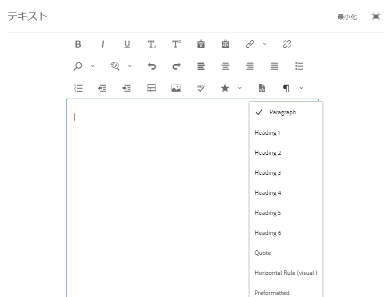

# リッチテキストエディターの設定 {#configure-the-rich-text-editor}

リッチテキストエディター(RTE)は、テキストコンテンツを編集するための様々な機能を作成者に提供します。 アイコン、選択ボックス、ツールバーおよびメニューを使用して、テキストを WYSIWYG で編集できます。管理者は、オーサリングコンポーネントで使用可能な機能を有効、無効、拡張するようにRTEを設定します。 作成者がWebコンテンツのオーサリングにRTEを [使用する方法を確認します](/help/sites-cloud/authoring/fundamentals/rich-text-editor.md) 。

RTEの概念と設定に必要な手順を以下に示します。

| RTEの概念について | 必要な機能を有効にする | 個々の機能の設定 |
|---|---|---|
| [インターフェイスの理解](#understand-rte-ui) | [設定の場所の理解と設定](#understand-the-configuration-paths-and-locations) | [プラグインの設定](#enable-rte-functionalities-by-activating-plug-ins) |
| [編集モードの種類](#editingmodes) | [プラグインのアクティブ化](/help/implementing/developing/extending/configure-rich-text-editor-plug-ins.md#activateplugin) | [フィーチャのプロパティを設定](#aboutplugins) |
| [プラグインについて](#aboutplugins) | [RTEツールバーの設定](#dialogfullscreen) | [貼り付けモードの設定](/help/implementing/developing/extending/configure-rich-text-editor-plug-ins.md#textstyles) |

## 作成者が使用できるユーザーインターフェイスを理解します。 {#understand-rte-ui}

RTEインターフェイスは、環境をオーサリングするための [レスポンシブデザイン](/help/sites-cloud/authoring/features/responsive-layout.md) をオファーします。 このインターフェイスは、タッチデバイスとデスクトップデバイスで使用できるように設計されています。



*図： 使用可能なすべてのオプションが有効なリッチテキストエディタのツールバー*

ツールバーには、WYSIWYGオーサリング環境で使用できるオプションが用意されています。 Experience Manager管理者は、インターフェイスのツールバーで使用できるオプションを設定できます。 Experience Managerでは、包括的な編集オプションのセットをデフォルトで使用できます。 開発者はExperience Managerをカスタマイズして、さらに編集オプションを追加できます。

## 各種編集モード {#editingmodes}

作成者は、様々なコンポーネントモードを使用して、Experience Manager内のテキストコンテンツを作成および編集できます。 コンテンツを作成およびフォーマットするためのツールバーオプションと、各種編集モードにおける RTE 対応コンポーネントのユーザーエクスペリエンスは、RTE 設定によって異なります。

| 編集モード | 編集領域 | 有効化が推奨される機能 |
|--- |--- |--- |
| インライン | 小さな編集をすばやくおこなうのに適したインプレース編集。ダイアログボックスを開かないフォーマット | 最小限の RTE 機能 |
| RTEフルスクリーン | ページ全体に広がる | 必要なすべての RTE 機能 |
| ダイアログ | ページコンテンツの上面にダイアログボックスが表示されるが、ページ全体に広がらない | 慎重に機能を有効にする |
| ダイアログのフルスクリーン | フルスクリーンモードと同じ。 RTEと同時にダイアログのフィールドが含まれます | 必要なすべての RTE 機能 |

>[!NOTE]
>
>ソース編集機能は、インライン編集モードでは使用できません。 フルスクリーンモードでは画像をドラッグできません。 その他の機能はすべて全モードで使用できます。

### インライン編集 {#inline-editing}

重複のクリックが遅い状態で開くと、ページ内でコンテンツを編集できます。 非常に基本的なオプションを備えたコンパクトツールバーが表示されます。


*図： ツールバーの基本オプションを使用したインライン編集。*

### Full-screen editing {#full-screen-editing}

Experience Managerコンポーネントは、ページコンテンツを非表示にして利用可能な画面を占めるフルスクリーン表示で開くことができます。 最も多くの編集オプションをオファーするので、インライン編集の詳細バージョンはフルスクリーン編集にすることを検討してください。 It can be opened by clicking , from the compact toolbar when using the inline editing mode.

ダイアログのフルスクリーンモードでは、詳細なRTEツールバーと共に、ダイアログで使用できるオプションとコンポーネントも使用できます。 このモードは、他のコンポーネントと共に RTE を含むダイアログにのみ適用されます。


*図： フルスクリーンモードで編集する場合の詳細なRTEツールバー。*

### ダイアログ編集 {#dialog-editing}

コンポーネントをダブルクリックすると、コンテンツ編集用のダイアログボックスが開きます。既存のページの上面に開きます。一部のシナリオでは、ポップアップウィンドウとして開くこともあります。例えば、テキストコンポーネントが複数列のページレイアウトの列の一部で、ダイアログで使用できる領域が少ない場合、


*図： ダイアログ編集モード。*

## RTE プラグインと関連機能について {#aboutplugins}

この機能は、一連のプラグインを介して使用可能になります。各プラグインには以下が含まれます。

* プロパティ `features` は、

   * プラグインの基本機能をアクティベートまたはアクティベート解除するために使用.
   * 標準化された手順を使用して設定します。

* 必要に応じて、追加のプロパティやオプションに特別な設定が必要.

RTE の基本機能は、該当するプラグインのノードにある `features` プロパティの値によって、アクティベートまたはアクティベート解除されます。

以下の表に最新のプラグインを示します。

* API ドキュメントへのリンクを含むプラグイン ID。ID は、[プラグインをアクティベート](/help/implementing/developing/extending/configure-rich-text-editor-plug-ins.md#activateplugin)するときにノード名として使用されます。
* `features` プロパティの許可されている値。
* プラグインが提供する機能の説明。

| プラグイン ID | features | 説明 |
|--- |--- |--- |
| edit | cut copy paste-default paste-plaintext paste-wordhtml | [切り取り、コピーおよび 3 つの貼り付けモード](/help/implementing/developing/extending/configure-rich-text-editor-plug-ins.md#textstyles)。 |
| [findreplace](https://helpx.adobe.com/experience-manager/6-5/sites/developing/using/reference-materials/widgets-api/index.html?class=CQ.form.rte.plugins.FindReplacePlugin) | find replace | 検索と置換. |
| [format](https://helpx.adobe.com/experience-manager/6-5/sites/developing/using/reference-materials/widgets-api/index.html?class=CQ.form.rte.plugins.FormatPlugin) | bold italic underline | [基本的なテキストフォーマット](configure-rich-text-editor-plug-ins.md#textstyles)。 |
| [画像](https://helpx.adobe.com/experience-manager/6-5/sites/developing/using/reference-materials/widgets-api/index.html?class=CQ.form.rte.plugins.ImagePlugin) | 画像 | 基本的な画像のサポート（コンテンツまたはコンテンツファインダーからのドラッグ） ブラウザーによって、サポートされる動作が作成者によって異なります |
| [keys](https://helpx.adobe.com/experience-manager/6-5/sites/developing/using/reference-materials/widgets-api/index.html?class=CQ.form.rte.plugins.KeyPlugin) |  | この値を定義するには、[タブサイズ](configure-rich-text-editor-plug-ins.md#tabsize)を参照してください。 |
| [justify](https://helpx.adobe.com/experience-manager/6-5/sites/developing/using/reference-materials/widgets-api/index.html?class=CQ.form.rte.plugins.JustifyPlugin) | justifyleft justifycenter justifyright | 段落の整列。 |
| [links](https://helpx.adobe.com/experience-manager/6-5/sites/developing/using/reference-materials/widgets-api/index.html?class=CQ.form.rte.plugins.LinkPlugin) | modifylink unlink anchor | [ハイパーリンクおよびアンカー](configure-rich-text-editor-plug-ins.md#linkstyles)。 |
| [lists](https://helpx.adobe.com/experience-manager/6-5/sites/developing/using/reference-materials/widgets-api/index.html?class=CQ.form.rte.plugins.ListPlugin) | ordered unordered indent outdent | This plug-in controls both [indentation and lists](configure-rich-text-editor-plug-ins.md#indentmargin); including nested lists. |
| [misctools](https://helpx.adobe.com/experience-manager/6-5/sites/developing/using/reference-materials/widgets-api/index.html?class=CQ.form.rte.plugins.MiscToolsPlugin) | specialchars sourceedit | Miscellaneous tools allow authors to enter [special characters](configure-rich-text-editor-plug-ins.md#spchar) or edit the HTML source. Also, you can add a whole [range of special characters](configure-rich-text-editor-plug-ins.md#definerangechar) if you want to define your own list. |
| Paraformat | paraformat | The default paragraph formats are Paragraph, Heading 1, Heading 2, and Heading 3 (`<p>`, `<h1>`, `<h2>`, and `<h3>`). [他の段落フォーマットを追加](configure-rich-text-editor-plug-ins.md#paraformats)したり、リストを拡張したりできます。 |
| spellcheck | checktext | [言語ごとのスペルチェッカー](configure-rich-text-editor-plug-ins.md#adddict)。 |
| styles | styles | CSS クラスを使用したスタイル設定のサポート。[新しい追加テキストスタイル](configure-rich-text-editor-plug-ins.md#textstyles) 。 |
| subsuperscript | subscript superscript | 基本形式の拡張子。サブスクリプトとスーパースクリプトを追加します。 |
| table | table removetable insertrow removerow insertcolumn removecolumn cellprops mergecells splitcell selectrow selectcolumns | See [configure table styles](configure-rich-text-editor-plug-ins.md#tablestyles), if you want to add your own styles for either entire tables or individual cells. |
| undo | undo redo | History size of [undo and redo](configure-rich-text-editor-plug-ins.md#undohistory) operations. |

>[!NOTE]
>
>ダイアログモードでは、フルスクリーンプラグインはサポートされていません。 Use of the `dialogFullScreen` setting to configure the toolbar for full-screen mode.

## 設定パスと設定の場所について {#understand-the-configuration-paths-and-locations}

作成者に提供する [RTE 編集のモード（および UI）](#editingmodes)によって、[RTE プラグインをアクティベート](configure-rich-text-editor-plug-ins.md#activateplugin)するときの設定詳細の場所が決まります。

* インラインモード： `cq:editConfig/cq:inplaceEditing`
* フルスクリーンモード: `cq:editConfig/cq:inplaceEditing`
* ダイアログモード： `cq:dialog`
* フルスクリーンダイアログモード： `cq:dialog`

>[!NOTE]
>
>Do not name the node under `cq:inplaceEditing` as `config`. On `cq:inplaceEditing` node, define the following properties:
>
>* **名前**：`configPath`
>* **Type**: `String`
>* **値**：実際の設定を含むノードのパス
>
>
RTE 設定ノードの名前を `config` にしないでください。Otherwise, the RTE configurations take effect for only the administrators and not for the users in the group `content-author`.

ダイアログ編集モードで適用する次のプロパティを設定します。

* `useFixedInlineToolbar`: RTEノード(sling:resourceType=を持つもの `cq/gui/components/authoring/dialog/richtext`)で定義されているこのBooleanプロパティをに設定し、RTEツールバーをフローティングではな `True`く固定します。

    このプロパティが true のときは、デフォルト動作により、リッチテキスト編集が「foundation-contentloaded」イベントで開始します。

   これを防ぐには、`customStart``True` プロパティを に設定し、「rte-start」イベントを呼び出して RTE の編集を開始するようにします。このプロパティが true のときは、デフォルトの動作（クリック時に RTE が開始する）が機能しません。

* `customStart`：RTE を開始するタイミングを `True` イベントの呼び出しによって制御するには、RTE ノードに定義されているこのブール値プロパティを `rte-start` に設定します。

* `rte-start`：このイベントを RTE の `contenteditable-div`（RTE の編集を開始するタイミング）で呼び出します。これは、`customStart` が true に設定されている場合にのみ機能します。

タッチ操作対応ダイアログでRTEを使用する場合は、問題を回避するた `useFixedInlineToolbar` めにプロパティを `true` に設定します。

## プラグインのアクティベートによる RTE 機能の有効化 {#enable-rte-functionalities-by-activating-plug-ins}

リッチテキストエディター（RTE）の各機能は一連のプラグインを介して使用可能になり、それぞれに features プロパティがあります。features プロパティを設定することで、各プラグインの各種機能を有効化または無効化できます。

RTE プラグインの設定について詳しくは、[RTE プラグインのアクティベートおよび設定方法に関する説明](configure-rich-text-editor-plug-ins.md)を参照してください。

<!-- TBD ENGREVIEW: To confirm if the sample works in CS or not?
**Sample**: Download [this sample configuration](/help/sites-administering/assets/rte-sample-all-features-enabled-10.zip) that illustrates how to configure RTE. In this package all the features are enabled. -->

The [Core Components text component](https://docs.adobe.com/content/help/ja-JP/experience-manager-core-components/using/components/text.html#the-text-component-and-the-rich-text-editor) allows template editors to configure many RTE plugins using the user interface as content policies, eliminating the need for technical configuration. コンテンツポリシーは、このドキュメントで説明するように RTE UI 設定と連携させることができます。For more information, see [create page templates](/help/sites-cloud/authoring/features/templates.md) and the [Core Components developer documentation](https://docs.adobe.com/content/help/ja-JP/experience-manager-core-components/using/developing/developing.html).

>参照用として、デフォルトのテキストコンポーネント（標準インストールの一環として提供）が次の場所に用意されています。
>
>* `/libs/wcm/foundation/components/text`
>* `/libs/foundation/components/text`
>
>
独自のテキストコンポーネントを作成するには、上記のコンポーネントを直接編集するのではなく、コピーしてください。

## RTE ツールバーの設定 {#dialogfullscreen}

Experience Managerを使用すると、リッチテキストエディターのインターフェイスを、編集モードごとに異なる方法で設定できます。 デフォルト設定を以下に示します。これらの設定を必要に応じて上書きできます。作成者に提供するツールバー機能のみをカスタマイズします。 すべてのツールバー設定を指定する必要はありません。

`dialogFullScreen` 用のツールバーを設定するには、次のサンプル設定を使用します。

```java
<uiSettings jcr:primaryType="nt:unstructured">
  <cui jcr:primaryType="nt:unstructured">
    <inline
      jcr:primaryType="nt:unstructured"
      toolbar="[format#bold,format#italic,format#underline,#justify,#lists,links#modifylink,links#unlink,#paraformat]">
      <popovers jcr:primaryType="nt:unstructured">
        <justify
          jcr:primaryType="nt:unstructured"
          items="[justify#justifyleft,justify#justifycenter,justify#justifyright,justify#justifyjustify]"
          ref="justify"/>
        <lists
          jcr:primaryType="nt:unstructured"
          items="[lists#unordered,lists#ordered,lists#outdent,lists#indent]"
          ref="lists"/>
        <paraformat
          jcr:primaryType="nt:unstructured"
          items="paraformat:getFormats:paraformat-pulldown"
          ref="paraformat"/>
      </popovers>
    </inline>
    <dialogFullScreen
      jcr:primaryType="nt:unstructured"
      toolbar="[format#bold,format#italic,format#underline,justify#justifyleft,justify#justifycenter,justify#justifyright,justify#justifyjustify,lists#unordered,lists#ordered,lists#outdent,lists#indent,links#modifylink,links#unlink,table#createoredit,#paraformat,image#imageProps]">
      <popovers jcr:primaryType="nt:unstructured">
        <paraformat
          jcr:primaryType="nt:unstructured"
          items="paraformat:getFormats:paraformat-pulldown"
          ref="paraformat"/>
      </popovers>
    </dialogFullScreen>
    <tableEditOptions
      jcr:primaryType="nt:unstructured"
      toolbar="[table#insertcolumn-before,table#insertcolumn-after,table#removecolumn,-,table#insertrow-before,table#insertrow-after,table#removerow,-,table#mergecells-right,table#mergecells-down,table#mergecells,table#splitcell-horizontal,table#splitcell-vertical,-,table#selectrow,table#selectcolumn,-,table#ensureparagraph,-,table#modifytableandcell,table#removetable,-,undo#undo,undo#redo,-,table#exitTableEditing,-]">
    </tableEditOptions>
  </cui>
</uiSettings>
```

インラインモードとフルスクリーンモードでは、ユーザーインターフェイスの設定が異なります。 toolbarプロパティは、ツールバーのオプションを指定します。

For example, if the option is itself a feature (for example, `Bold`), it is specified as `PluginName#FeatureName` (for example, `links#modifylink`).

If the option is a popover (containing some features of a plug-in), it is specified as `#PluginName` (for example, `#format`).

Separators (`|`) between a group of option can be specified with `-`.

インラインまたはフルスクリーンモードのポップアップノードには、使用するポップオーバーのリストが含まれます。「popovers」ノードの下の各子ノードは、プラグインの名前を取って名付けられます（例：format）。プラグインの機能のリストが含まれるプロパティ「items」があります（例：format#bold）。

## RTE ユーザーインターフェイス設定とコンテンツポリシー {#rtecontentpolicies}

管理者は、上述のような設定をおこなわなくても、コンテンツポリシーを使用して RTE オプションを制御することができます。コンテンツポリシーでは、[編集可能テンプレート](/help/sites-cloud/authoring/features/templates.md)の一部として使用されるコンポーネントのデザインプロパティが定義されます。例えば、RTE を使用するテキストコンポーネントが編集可能テンプレートで使用される場合は、コンテンツポリシーの定義によって、太字オプションやいくつかの段落フォーマットオプションを使用可能にできます。コンテンツポリシーは再利用が可能であり、複数のテンプレートに対して適用できます。

RTE フローで使用可能なオプションに関するユーザーインターフェイス設定がコンテンツポリシーに影響します。

* ユーザーインターフェイス設定では、コンテンツポリシーで使用可能なオプションを定義します。
* RTEのユーザーインターフェイス設定が削除されたか、アイテムを有効にしていない場合、コンテンツポリシーは項目を設定できません。
* オーサーは、ユーザーインターフェイス設定およびコンテンツポリシーによって使用可能となっている機能にのみアクセスできます。

例については、[テキストコアコンポーネントのドキュメント](https://docs.adobe.com/content/help/ja-JP/experience-manager-core-components/using/components/text.translate.html#the-text-component-and-the-rich-text-editor)を参照してください。

## ツールバーアイコンとコマンドのマッピングのカスタマイズ {#iconstoolbar}

RTE ツールバーに表示される Coral アイコンと使用可能なコマンドとのマッピングをカスタマイズできます。Coralアイコン以外のアイコンは使用できません。

1. Create a node named `icons` under `uiSettings/cui`.

1. そのノードの下に、各アイコンのノードを作成します。
1. 個々のアイコンノードで、「Coral」アイコンと、アイコンにマッピングするコマンドを指定します。

Below is a sample snippet to map the command Bold to the Coral icon named `textItalic`.

```java
<text jcr:primaryType="nt:unstructured" sling:resourceType="cq/gui/components/authoring/dialog/richtext" name="./text" useFixedInlineToolbar="{Boolean}true">
    <rtePlugins jcr:primaryType="nt:unstructured">
        <format jcr:primaryType="nt:unstructured" features="bold,italic"/>
    </rtePlugins>
    <uiSettings jcr:primaryType="nt:unstructured">
        <cui jcr:primaryType="nt:unstructured">
            <inline jcr:primaryType="nt:unstructured"
                toolbar="[format#bold,format#italic,format#underline,links#modifylink,links#unlink]">
            </inline>
            <icons jcr:primaryType="nt:unstructured">
                <bold jcr:primaryType="nt:unstructured"
                    command="format#bold"
                    icon="textItalic"/>
            </icons>
        </cui>
    </uiSettings>
</text>
```

## 既知の制限事項 {#known-limitations}

Experience ManagerRTE機能には次の制限があります。

* RTE機能は、Experience Managerコンポーネントのダイアログでのみサポートされます。 RTEは、ウィザードまたはFoundation-formsではサポートされていません。

* Experience Managerはハイブリッドデバイスでは機能しません。 <!-- TBD: Check. This is not mentioned in Known Issue /help/release-notes/known-issues.md-->

* Do not name the RTE configuration node `config`. Otherwise, the RTE configuration takes effect for only the administrators and not for the users in the group `content-author`.

* RTEは、インラインフレームまたはiframeへのコンテンツの埋め込みをサポートしていません。

## Best practices and tips {#best-practices-and-tips}

* フローティングダイアログの場合は、ポップアップダイアログを表示しないプラグインのみを有効にします。 ポップアップのないプラグインはサイズが小さくなり、フローティングダイアログに適しています。
* Enable the plug-ins with larger pop-up, such as the `Paste` plug-in, only in the full-screen dialog mode or in full-screen mode. 大きなポップアップがあるプラグインは、優れたオーサリング環境を提供するために、より多くのスクリーンスペースを必要とします。
* CoralUI RTE のカスタムプラグインを使用する場合は、`rte.coralui3`3 ライブラリを使用してください。

>[!MORELIKETHIS]
>
>* [RTE プラグインの設定](configure-rich-text-editor-plug-ins.md)
>* [リッチテキストエディターをオーサリングに使用](/help/sites-cloud/authoring/fundamentals/rich-text-editor.md)
>* [RTE をアクセス可能なサイト用に設定](rte-accessible-content.md)
>* [複合マルチフィールドコンポーネントを作成するためのチュートリアルサンプル](https://experience-aem.blogspot.com/2019/05/aem-65-touchui-composite-multifield-with-coral3-rte-rich-text.html)

