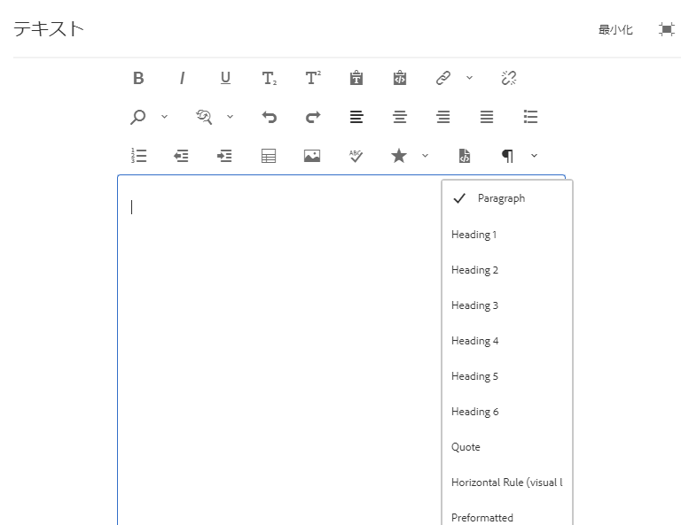
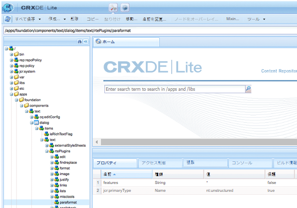

# アクセシブルなサイトの作成に向けた RTE の設定 {#configure-rte-accessible-sites}

[!DNL Adobe Experience Manager] は、画像の代替テキストなどの標準的なアクセシビリティ機能や、コンテンツの作成時にアクセスできる追加機能をサポートしています。 コンテンツ作成者は、リッチテキストエディター（RTE）を使用するコンポーネントでこれらの機能を使用します。この機能には、代替テキスト、見出しや段落要素からの構造情報の追加などが含まれます。

RTE の一般的な設定の詳細については、[RTE の設定](rich-text-editor.md)と、[特定の機能に対する RTE プラグインの設定](configure-rich-text-editor-plug-ins.md)を参照してください。

RTE プラグイン設定を使用して、アクセシビリティ関連機能を設定およびカスタマイズします。For example, use `paraformat` to add extra block level semantic elements, including extending the number of heading levels supported beyond the basic `H1`, `H2` and `H3` provided by default. リッチテキストの編集は、オーサリングユーザーインターフェイスの多くのコンポーネントを使用できます。一般的に使用されるコンポーネントは、テキスト、画像、ダウンロードなどです。

RTE 機能は、多くのコンポーネントで使用できます。主要なコンポーネントは `Text` コンポーネントです。

For the `Text` component in [!DNL Experience Manager], the following screenshot displays the rich text editor with a range of plug-ins enabled, including `paraformat`:



## Configure the plug-in features {#configuring-the-plugin-features}

RTE の設定手順については、[リッチテキストエディターの設定](rich-text-editor.md)ページを参照してください。この記事では、次の内容を扱っています。

* [プラグインとその機能](rich-text-editor.md#aboutplugins)
* [設定場所](rich-text-editor.md#understand-the-configuration-paths-and-locations)
* [プラグインのアクティベートと features プロパティの設定](rich-text-editor.md#enable-rte-functionalities-by-activating-plug-ins)
* [RTE のその他の機能の設定](rich-text-editor.md#enable-rte-functionalities-by-activating-plug-ins)

To activate a few or all features for a plug-in, configure the plug-in within the appropriate `rtePlugins` sub-branch in CRXDE Lite.



### Example to specify paragraph formats available in RTE selection field {#example-specifying-paragraph-formats-available-in-rte-selection-field}

新しいセマンティックブロック形式が選択可能になりました。

1. 使用している RTE によって、[設定場所](rich-text-editor.md#understand-the-configuration-paths-and-locations)を特定し、移動します。
1. [プラグインを](rich-text-editor.md) アクティブ化して、段落選択フィールドを有効にします [](rich-text-editor.md#enable-rte-functionalities-by-activating-plug-ins)。
1. [段落選択フィールドで使用可能にする形式を指定します](rich-text-editor.md)。
1. これにより、コンテンツ作成者は、指定した段落形式を RTE の選択フィールドから選択できます。

With structural elements available in the RTE via the paragraph format options, [!DNL Experience Manager] provides a good basis for the development of accessible content. コンテンツ作成者は、RTE を使用してフォントサイズや色などの関連属性の形式を設定できず、インライン形式を作成できません。代わりに、見出しや「スタイル」オプションから選択したグローバルスタイルを使用して、独自のスタイルシートを使用し、正しく構造化されたコンテンツを参照するユーザに対して、きれいにマークアップや高度なオプションを提供できます。

## Use of the Source Edit feature {#use-of-the-source-edit-feature}

場合によっては、コンテンツ作成者はRTEを使用して作成されたHTMLソースコードを調べ、調整する必要があると見なします。 例えば、RTE内で作成されるコンテンツの一部がWCAG 2.0に準拠するためには、より多くのマークアップが必要になる場合があります。これは、RTEの [ソース編集](rich-text-editor.md#aboutplugins) オプションを使用して行うことができます。 You can specify the [`sourceedit` feature on the `misctools` plug-in](rich-text-editor.md#aboutplugins).

>[!CAUTION]
>
>`sourceedit` 機能の使用には十分に注意してください。入力エラーやサポートされていない機能によって問題が発生する場合があります。

<!--
TBD ENGREVIEW: Is this only applicable to Classic UI? 

## Adding Support for further HTML Elements and Attributes {#adding-support-for-additional-html-elements-and-attributes}

To further extend the accessibility features of [!DNL Experience Manager], it is possible to extend the existing components based on the RTE (such as the `Text` and `Table` components) with extra elements and attributes.

The following procedure illustrates how to extend the `Table` component with a `Caption` element that provides information about a data table to assistive technology users:

### Example: Add a caption to a table properties dialog {#example-adding-the-caption-to-the-table-properties-dialog}

In the constructor of the `TablePropertiesDialog`, add an extra text input field that is used for editing the caption. Set the `itemId` to `caption` (the DOM attribute’s name) to automatically handle its content.

In a `Table`, set the attribute to the DOM element or or remove it from the DOM element. The dialog in the `config` object passed the value. Set or remove the DOM attributes using the corresponding `CQ.form.rte.Common` methods (`com` is a shortcut for `CQ.form.rte.Common`). Using `CQ.form.rte.Common` methods avoids common pitfalls with browser implementations.

>[!NOTE]
>
>This procedure is only suitable for the classic UI.

### Step-by-step instructions {#step-by-step-instructions}

1. Start CRXDE Lite. For example: [http://localhost:4502/crx/de/](http://localhost:4502/crx/de/)

1. Copy `/libs/cq/ui/widgets/source/widgets/form/rte/commands/Table.js` to `/apps/cq/ui/widgets/source/widgets/form/rte/commands/Table.js`. Create intermediate folders if those do not exist.

1. Copy `/libs/cq/ui/widgets/source/widgets/form/rte/plugins/TablePropertiesDialog.js` to `/apps/cq/ui/widgets/source/widgets/form/rte/plugins/TablePropertiesDialog.js`.

1. Open `/apps/cq/ui/widgets/source/widgets/form/rte/plugins/TablePropertiesDialog.js` file to edit.

1. In the `constructor` method, before the mention of `var dialogRef = this;`, add the following code:

   ```javascript
   editItems.push({
       "itemId": "caption",
       "name": "caption",
       "xtype": "textfield",
       "fieldLabel": CQ.I18n.getMessage("Caption"),
       "value": (this.table && this.table.caption ? this.table.caption.textContent : "")
   });
   ```

1. Open `/apps/cq/ui/widgets/source/widgets/form/rte/commands/Table.js` file.

1. Add the following code at the end of the `transferConfigToTable` method:

   ```javascript
   /**
    * Adds Caption Element
   */
   var captionElement;
   if (dom.firstChild && dom.firstChild.tagName.toLowerCase() == "caption")
   {
      captionElement = dom.firstChild;
   }
   if (config.caption)
   {
       var captionTextNode = document.createTextNode(config.caption)
       if (captionElement)
       {
          dom.replaceNode(captionElement.firstChild,captionTextNode);
       } else
       {
           captionElement = document.createElement("caption");
           captionElement.appendChild(captionTextNode);
           if (dom.childNodes.length>0)
           {
              dom.insertBefore(captionElement, dom.firstChild);
           } else
           {
              dom.appendChild(captionElement);
           }
       }
   } else if (captionElement)
   {
     dom.removeChild(captionElement);
   }
   ```

1. To save your changes, click **[!UICONTROL Save All]**.

## Best practices and limitations {#best-practices-limitations-tips}

* A plain text field is not the only type of input allowed for the value of the caption element. You can use any ExtJS widget, that provides the caption’s value through its `getValue()` method.
* To add editing capabilities for more elements and attributes, ensure that:

  * The `itemId` property for each corresponding field is set to the name of the appropriate DOM attribute (`TablePropertiesDialog`).
  * The attribute is set and/or removed on the DOM element explicitly (`Table`).
-->

>[!MORELIKETHIS]
>
>* [WCAG 標準規格のクイックガイド](/help/onboarding/accessibility/quick-guide-wcag.md)
>* [Experience Managerでアクセシブルなコンテンツを作成する方法](/help/sites-cloud/authoring/fundamentals/accessible-content.md)

