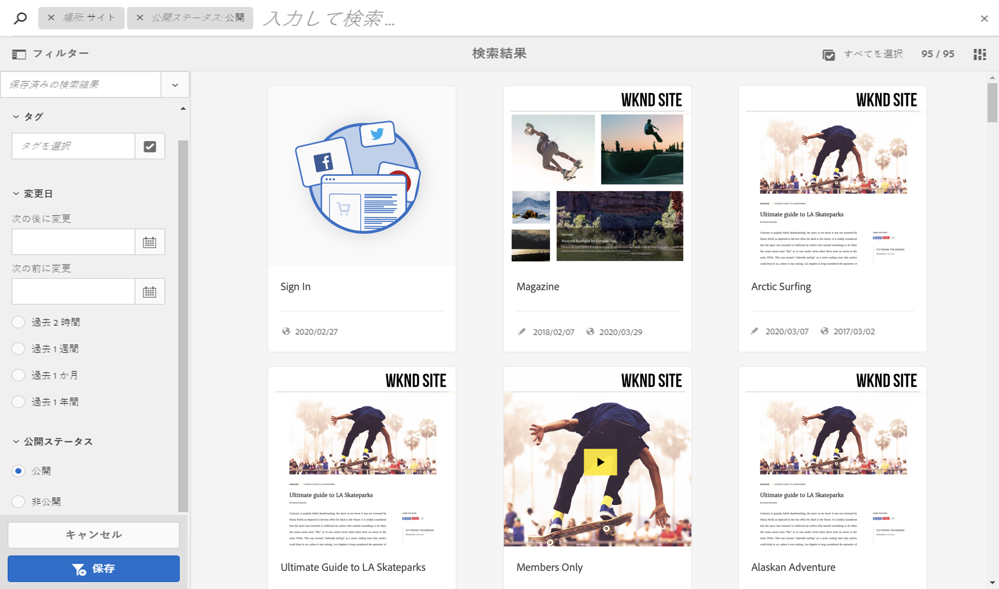
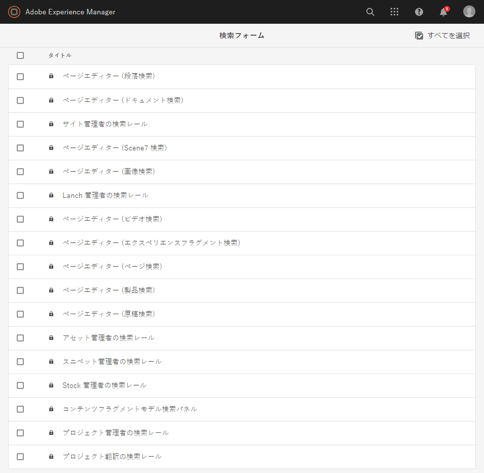
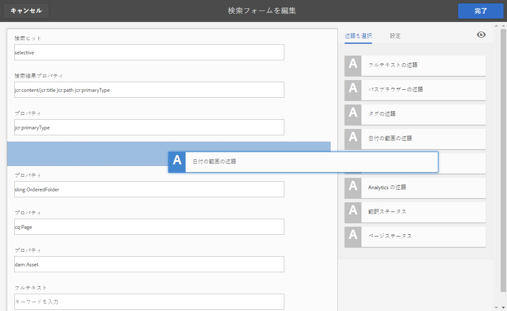
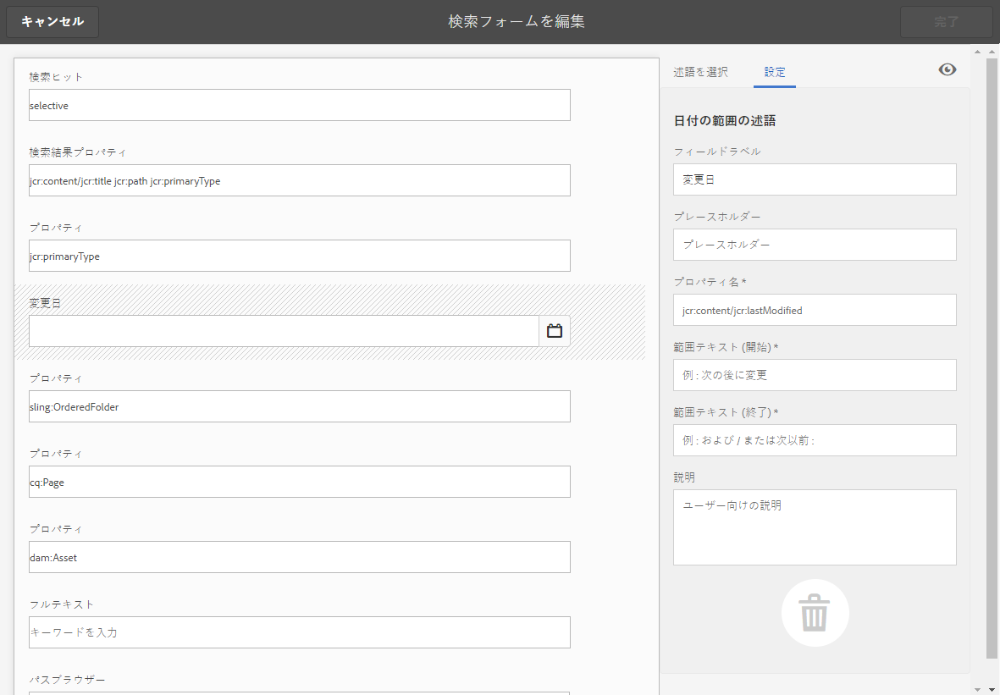
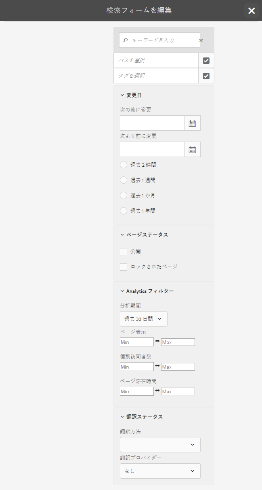
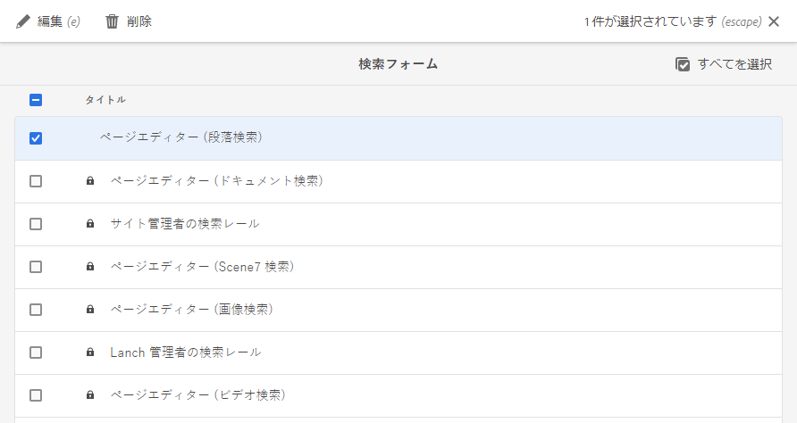
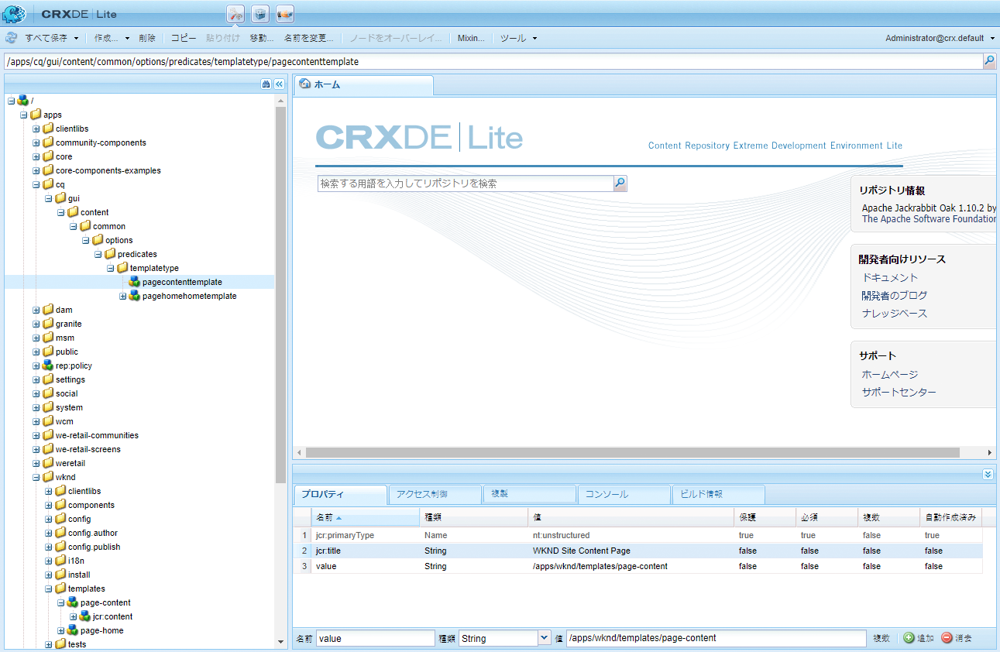
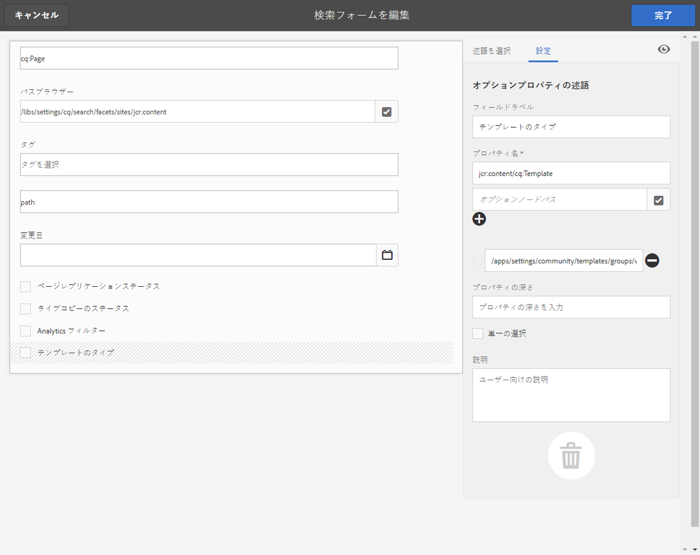
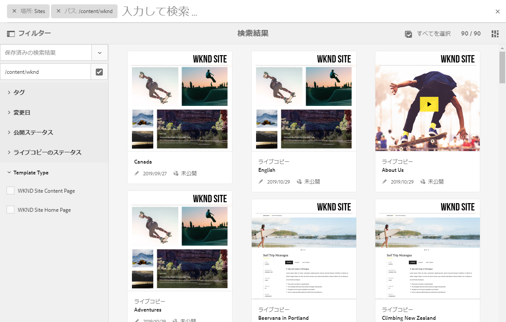

# 検索フォームの設定 {#configuring-search-forms}

Adobe Experience Manager as a Cloud Service には、強力な[検索](/help/sites-cloud/authoring/getting-started/search.md)メカニズムが付属しています。

これと組み合わせて、コンテンツのフィルタリングに役立つ定義済みのオプションセットもあります。オプションには、**変更日**、**公開ステータス**、**ライブコピーのステータス**&#x200B;などの事前定義されたファセットが含まれており、必要なリソースをすばやく掘り下げることができます。

これらを組み合わせることで、次の場所からすばやく簡単にコンテンツを見つけることができます。

* [検索とフィルター](/help/sites-cloud/authoring/getting-started/search.md#search-and-filter)
* [パネルセレクター](/help/sites-cloud/authoring/getting-started/basic-handling.md#rail-selector)
* [アセットブラウザー](/help/sites-cloud/authoring/fundamentals/environment-tools.md#assets-browser)（ページ編集時）

>[!NOTE]
>
>基になる[コンテンツの検索とインデックス作成](/help/operations/indexing.md)サービスを設定できます。

**検索フォーム**&#x200B;を使用すると、これらのパネルを特定のニーズに合わせてカスタマイズ、拡張できます。

**検索フォーム**&#x200B;では、組み合わせて定義できる一連の[述語](#predicates-and-their-settings)が標準で提供されています。[これらのフォームを設定するためのダイアログ](#configuring-your-search-forms)には、次の手順でアクセスできます。

* **ツール**

   * **一般**

      * **検索フォーム**

## デフォルトフォーム {#default-forms}

最初に&#x200B;**検索フォーム**&#x200B;コンソールにアクセスすると、すべての設定に南京錠アイコンが表示されます。これは、対応する設定がデフォルトの（そのまま使用できる）設定であり、削除できないことを示します。設定をカスタマイズして保存すると、南京錠アイコンは消えます。[カスタマイズした設定を削除する](#deleting-a-configuration-to-reinstate-the-default)と、再び表示されます。その場合、デフォルト（および南京錠アイコン）が復元されます。

デフォルトの設定（アルファベット順に一覧表示）は、次のとおりです。

* **アセット管理者の検索レール：**

* **ページエディター（ドキュメント検索）：**

* **ページエディター（エクスペリエンスフラグメント検索）：**

* **ページエディター（画像検索）：**

* **ページエディター（原稿検索）：**

* **ページエディター（ページ検索）：**

* **ページエディター（段落検索）：**

* **ページエディター（製品検索）：**

* **ページエディター（Scene7 検索）：**

* **ページエディター（ビデオ検索）：**

* **プロジェクト管理者の検索レール：**

* **プロジェクト翻訳の検索レール：**

* **Sites 管理者の検索レール：**

* **スニペット管理者の検索レール：**

* **Stock 管理者の検索レール：**

>[!NOTE]
>
>Assets 関連の検索フォームについて詳しくは、[Assets - 検索ファセット](/help/assets/search-facets.md)を参照してください。

## 述語とその設定 {#predicates-and-their-settings}

### 述語 {#predicates}

設定によって、次の述語が使用可能です。

<table>
 <tbody>
  <tr>
   <th>述語</th>
   <th>目的</th>
   <th>設定</th>
  </tr>
  <tr>
   <td>分析</td>
   <td>Analytics データを表示する際の、Sites ブラウザーの検索／フィルター機能。Analytics の検索フィルターは、マッピングされ、カスタマイズされた Analytics 列に一致するまで読み込みます。</td>
   <td>
    <ul>
     <li>フィールドラベル</li>
     <li>説明</li>
    </ul> </td>
  </tr>
  <tr>
   <td>承認ステータス</td>
   <td>承認ステータスに従って検索します。</td>
   <td>
    <ul>
     <li>フィールドラベル</li>
     <li>プロパティ名*</li>
     <li>説明</li>
    </ul> 
   </td>
  </tr>
  <tr>
   <td>作成者</td>
   <td>作成者に従って検索します。</td>
   <td>
    <ul>
     <li>プレースホルダー</li>
     <li>プロパティ名*</li>
     <li>説明</li>
    </ul> 
   </td>
  </tr>
  <tr>
   <td>チェックアウト実行者</td>
   <td>特定のユーザーがチェックアウトしたアセットを検索します。</td>
   <td>
    <ul>
     <li>フィールドラベル</li>
     <li>プレースホルダー</li>
     <li>説明</li>
    </ul> 
   </td>
  </tr>
  <tr>
   <td>チェックアウトステータス</td>
   <td>特定のチェックアウトステータスのアセットを検索します。</td>
   <td>
    <ul>
     <li>フィールドラベル</li>
     <li>プロパティ名*</li>
     <li>説明</li>
    </ul> 
   </td>
  </tr>
  <tr>
   <td>コンポーネント</td>
   <td>作成者が、特定のコンポーネントを持つページを検索／フィルターできます。例えば、画像ギャラリーなどです。  </td>
   <td>
    <ul>
     <li>プレースホルダー</li>
     <li>プロパティ名*</li>
     <li>プロパティの深さ</li>
     <li>説明</li>
    </ul> </td>
  </tr>
  <tr>
   <td>日付範囲</td>
   <td>指定した範囲内で作成されたリソースの日付プロパティを検索します。検索パネルで、開始日と終了日を指定できます。</td>
   <td>
    <ul>
     <li>フィールドラベル</li>
     <li>プレースホルダー</li>
     <li>プロパティ名*</li>
     <li>範囲のテキスト（開始）*</li>
     <li>範囲のテキスト（終了）*</li>
     <li>説明</li>
    </ul> </td>
  </tr>
  <tr>
   <td>有効期限ステータス</td>
   <td>有効期限ステータスに基づいてリソースを検索します。</td>
   <td>
    <ul>
     <li>フィールドラベル</li>
     <li>プロパティ名*</li>
     <li>説明</li>
    </ul> </td>
  </tr>
  <tr>
   <td>ファイルサイズ</td>
   <td>サイズに基づいてリソースをフィルタリングします。</td>
   <td>
    <ul>
     <li>フィールドラベル</li>
     <li>プロパティ名*</li>
     <li>オプションパス</li>
     <li>説明</li>
    </ul> </td>
  </tr>
  <tr>
   <td>ファイルタイプ</td>
   <td>ファイル／MIME タイプに基づいてアセットを検索します。</td>
   <td>
    <ul>
     <li>フィールドラベル</li> 
     <li>プロパティ名*</li>
     <li>MIME タイプのパス</li>
     <li>説明</li>
    </ul> 
   </td>
  </tr>
  <tr>
   <td>フルテキスト</td>
   <td>フルテキスト検索用の検索述語。これは「jcr:contains」演算子と共にマッピングされます。</td>
   <td>
    <ul>
     <li>プレースホルダー</li>
     <li>プロパティ名</li>
     <li>説明</li>
    </ul> </td>
  </tr>
  <tr>
   <td>グループ</td>
   <td>グループの検索述語（インサイトの述語内でのみ使用）。</td>
   <td>
    <ul>
     <li>フィールドラベル</li>
     <li>説明</li>
    </ul> </td>
  </tr>
  <tr>
   <td>非表示フィルター</td>
   <td>プロパティおよび値のフィルターで、ユーザーには表示されません。</td>
   <td>
    <ul>
     <li>プロパティ名*</li>
     <li>プロパティの値*</li>
     <li>説明</li>
    </ul> </td>
  </tr>
  <tr>
   <td>インサイト</td>
   <td>選択したインサイトパラメーターに従って検索します。</td>
   <td>複数の述語から構成される複雑な述語です。
    <ul>
     <li>グループ</li>
     <li>範囲</li>
     <li>オプション</li>
    </ul> 
   </td>
  </tr>
  <tr>
   <td>コレクションのメンバー</td>
   <td>コレクションのメンバーであるアセットの検索</td>
   <td>
    <ul>
     <li>説明</li>
    </ul> 
   </td>
  </tr>
  <tr>
   <td>複数値プロパティ</td>
   <td>指定したプロパティの複数の値を検索します。</td>
   <td>
    <ul>
     <li>フィールドラベル</li>
     <li>プレースホルダー</li>
     <li>プロパティ名*</li>
     <li>区切り文字のサポート</li>
     <li>入力区切り文字</li>
     <li>大文字と小文字を区別しない</li>
     <li>説明</li>
    </ul> 
   </td>
  </tr>
  <tr>
   <td>オプション</td>
   <td>
オプションは、ユーザーが作成したコンテンツノードです。
 
詳しくは、<a href="#addinganoptionspredicate">オプションの述語の追加</a>を参照してください。
 </td>
   <td>
    <ul>
     <li>フィールドラベル</li>
     <li>プロパティ名*</li>
     <li>単一の選択</li>
     <li>オプションを追加</li>
     <li>手動</li>
     <li>説明</li>
    </ul> </td>
  </tr>
  <tr>
   <td>オプションプロパティ</td>
   <td>オプションの 1 つ以上のプロパティで検索します。</td>
   <td>
    <ul>
     <li>フィールドラベル</li>
     <li>プロパティ名*</li>
     <li>オプションノードパス</li>
     <li>プロパティの深さ</li>
     <li>単一の選択</li>
     <li>説明</li>
    </ul> </td>
  </tr>
  <tr>
   <td>ページステータス</td>
   <td>ステータスに従ってページをフィルタリングします。</td>
   <td>
    <ul>
     <li>フィールドラベル</li>
     <li>プロパティ名を公開*</li>
     <li>ロックされたページのプロパティ名*</li>
     <li>説明</li>
    </ul> </td>
  </tr>
  <tr>
   <td>パス</td>
   <td>特定のパスに基づいてフィルタリングします。オプションとして複数のパスを指定できます。</td>
   <td>
    <ul>
     <li>フィールドラベル</li>
     <li>検索パスを追加</li>
     <li>説明</li>
    </ul> </td>
  </tr>
  <tr>
   <td>パスブラウザー</td>
   <td>事前に定義されたルートパスの下で検索するパスブラウザーを提供します。</td>
   <td>
    <ul>
     <li>プレースホルダー</li>
     <li>ルートパス</li>
     <li>説明</li>
    </ul> 
   </td>
  </tr>
  <tr>
   <td>パス非表示</td>
   <td>パスに対するフィルター（ユーザーには表示されません）。</td>
   <td>
    <ul>
     <li>プロパティ名（path）</li>
     <li>プロパティの値（/content/dam）</li>
    </ul> 
   </td>
  </tr>
  <tr>
   <td>プロパティ</td>
   <td>指定したプロパティで検索します。</td>
   <td>
    <ul>
     <li>フィールドラベル</li>
     <li>プレースホルダー</li>
     <li>プロパティ名</li>
     <li>部分検索</li>
     <li>大文字と小文字を区別しない</li>
     <li>説明</li>
    </ul> 
   </td>
  </tr>
  <tr>
   <td>公開ステータス</td>
   <td>公開ステータスに基づいてリソースをフィルターします。</td>
   <td>
    <ul>
     <li>フィールドラベル</li>
     <li>プロパティ名*</li>
     <li>説明</li>
    </ul> </td>
  </tr>
  <tr>
   <td>範囲</td>
   <td>指定した範囲内にあるリソースを検索します。検索パネルで、範囲の最小値と最大値を指定できます。</td>
   <td>
    <ul>
     <li>フィールドラベル</li>
     <li>プロパティ名*</li>
     <li>説明</li>
    </ul> </td>
  </tr>
  <tr>
   <td>評価</td>
   <td>平均評価に従ってリソースを検索します。  </td>
   <td>
    <ul>
     <li>フィールドラベル</li>
     <li>プロパティ名*</li>
     <li>オプションパス</li>
     <li>説明</li>
    </ul> </td>
  </tr>
  <tr>
   <td>相対的な日付</td>
   <td>相対的な作成日に基づいてリソースをフィルタリングします。例えば、1 週間前、1 ヶ月前などです。</td>
   <td>
    <ul>
     <li>フィールドラベル</li>
     <li>プロパティ名*</li>
     <li>相対的な日付</li>
     <li>説明</li>
    </ul> </td>
  </tr>
  <tr>
   <td>スライダー範囲</td>
   <td>範囲の述語をスライダー機能で拡張する共通の検索述語。検索対象のプロパティの値は、スライダーの制限内とする必要があります。</td>
   <td>
    <ul>
     <li>フィールドラベル</li>
     <li>プロパティ名*</li>
     <li>オプションノードパス</li>
     <li>説明</li>
    </ul> </td>
  </tr>
  <tr>
   <td>ステータス</td>
   <td>承認およびチェックアウトステータスに従って検索します。</td>
   <td>複数の述語から構成される複雑な述語です。
    <ul>
     <li>承認ステータス</li>
     <li>チェックアウトステータス</li>
    </ul> 
   </td>
  </tr>
  <tr>
   <td>タグ</td>
   <td>タグに基づいて検索します。</td>
   <td>
    <ul>
     <li>フィールドラベル</li>
     <li>プレースホルダー</li>
     <li>プロパティ名*</li>
     <li>すべてのタグに一致オプションを表示</li>
     <li>ルートタグのパス</li>
     <li>説明</li>
    </ul> </td>
  </tr>
  <tr>
   <td>テンプレート</td>
   <td>選択したテンプレートに従って検索します。</td>
   <td>
    <ul>
     <li>プレースホルダー</li>
     <li>プロパティ名*</li>
     <li>説明</li>
    </ul> 
   </td>
  </tr>
  <tr>
   <td>翻訳ステータス</td>
   <td>翻訳ステータスに従って検索します。</td>
   <td>
    <ul>
     <li>フィールドラベル</li>
    </ul> 
   </td>
  </tr>
 </tbody>
</table>

<!--
  <tr>
   <td>Date ???</td>
   <td>Slider-based search of assets based on a date property.</td>
   <td>
    <ul>
     <li>Field Label</li>
     <li>Property Name*</li>
     <li>Description</li>
    </ul> </td>
  </tr>
  <tr>
   <td>Asset Last Modified ?????</td>
   <td>Date the asset was last modified.  </td>
   <td>A customized predicate, based on the Date Predicate.</td>
  </tr>
  <tr>
   <td>Range Options ???</td>
   <td>A specific search predicate for Assets and the same as common Slider Predicate. Is still available due to backward compatibilty issues.</td>
   <td>
    <ul>
     <li>Field Label</li>
     <li>Property Name*</li>
     <li>Option Path</li>
     <li>Description</li>
    </ul> </td>
  </tr>
  <tr>
   <td>Tag </td>
   <td>Search assets based on tags. You can configure the Path property to populate various tags in the Tags list.</td>
   <td>
    <ul>
     <li>Field Label</li>
     <li>Property Name*</li>
     <li>Option Path</li>
     <li>Description</li>
    </ul> </td>
  </tr>
-->

>[!NOTE]
>
>一般的な検索述語は、次の場所で定義されます。
>  `/libs/cq/gui/components/common/admin/customsearch/searchpredicates`
>
>この情報は参照用です。`/libs` には変更を加えないでください。

<!--
>* Search predicates related only to siteadmin (classic UI) are located under:
> `/libs/cq/gui/components/siteadmin/admin/searchpanel/searchpredicates`
>   * These are deprecated and only available for backward compatibility.
>
-->

### 述語の設定 {#predicate-settings}

述語によっては、以下のような設定が可能です。

* **フィールドラベル**

   述語の折りたたみ可能なヘッダーまたはフィールドラベルとして表示されるラベル。

* **説明**

   ユーザーのための詳細な説明。

* **プレースホルダー**

   フィルターテキストを入力しない場合は、空のテキストまたは述語のプレースホルダー。

* **プロパティ名**

   検索対象のプロパティ。相対パスとワイルドカード `*/*/*` を使用して、`jcr:content` ノードを基準とするプロパティの深さを指定します（各アスタリスクは 1 つのノードレベルを表します）。

   `jcr:content` ノード上の `x` プロパティを持つリソースの第 1 レベルの子ノードでのみ検索する場合は、`*/jcr:content/x` を使用してください。

* **プロパティの深さ**

   リソース内でそのプロパティを検索する最大の深さです。そのため、子のレベルが指定の深さに等しくなるまで、そのプロパティの検索をリソースと再帰的な子に対して実行できます。

* **プロパティの値**

   プロパティの値は、絶対文字列または式言語です。例えば、`cq:Page` または

   `${empty requestPathInfo.suffix ? "/content" : requestPathInfo.suffix}` です。

* **範囲テキスト**

   **日付の範囲**&#x200B;の述語の範囲フィールドのラベル。

* **オプションパス**

   ユーザーは、「述語の設定」タブのパスブラウザーを使用してパスを選択できます。選択した後、**+** アイコンを使用して、有効なオプションのリストに選択を追加します（必要に応じて、**-** アイコンを削除します）。

   オプションは、ユーザーが作成したコンテンツノードで、次の構造を持ちます。

   `(jcr:primaryType = nt:unstructured, value (String), jcr:title (String))`

* **オプションノードのパス**
実質的に 
**オプションパス**&#x200B;と同じ。前者は共通の述語フィールドにのみ存在し、後者はアセットに固有です。

* **単一の選択**&#x200B;オンにすると、オプションは単一の選択のみを許可するチェックボックスとしてレンダリングされます。チェックボックスを誤って選択した場合は、選択を解除できます。

* **公開とライブコピーのプロパティ名**
Sites 専用の述語の、公開およびライブコピーのチェックボックスのラベル。

* 「**設定**」タブのフィールドラベルに &amp;ast; が付いている場合、そのフィールドは必須であるという意味になり、空白のままにするとエラーメッセージが表示されます。

## 検索フォームの設定 {#configuring-your-search-forms}

### カスタマイズされた設定を作成／開く {#creating-opening-a-customized-configuration}

1. **ツール**／**一般**／**検索フォーム**&#x200B;に移動します。

1. カスタマイズする設定を選択します。
1. 「**編集**」アイコンを使用して、更新用に設定を開きます。
1. 新規のカスタマイズの場合は、必要に応じて[新しい述語フィールドを追加して設定を定義](#add-edit-a-predicate-field-and-define-field-settings)します。既存のカスタマイズの場合は、既存のフィールドを選択して[設定を更新](#add-edit-a-predicate-field-and-define-field-settings)できます。
1. 「**完了**」を選択して設定を保存します。変更は、次回設定を使用したときに表示されます。

   >[!NOTE]
   >
   >カスタマイズした設定は（必要に応じて）以下の場所に保存されます。
   >
   >* `/apps/cq/gui/content/facets/<option>`
   >* `/apps/commerce/gui/content/facets/<option>`

### 述語フィールドの追加／編集とフィールド設定の定義 {#add-edit-a-predicate-field-and-define-field-settings}

フィールドを追加または編集して、その設定を定義／更新できます。

1. 更新する[カスタマイズ設定を開きます](#creating-opening-a-customized-configuration)。
1. 新しいフィールドを追加する場合は、「**述語を選択**」タブを開いて、必要な述語を必要な場所にドラッグします。**日付の範囲の述語**&#x200B;の例を以下に示します。

   

1. 状況に応じて、以下の手順を実行します。

   * 新しいフィールドを追加する場合：

      述語を追加すると、「**設定**」タブが開き、定義可能なプロパティが表示されます。

   * 既存の述語を更新する場合：

      右側の述語フィールドを選択し、「**設定**」タブを開きます。
   **日付の範囲の述語**&#x200B;の設定例を以下に示します。

   

1. 必要に応じて変更を加え、「**完了**」を選択して確定します。変更は、次回設定を使用したときに表示されます。

### 検索設定のプレビュー {#previewing-the-search-configuration}

1. プレビューアイコンを選択します。

   

1. 検索フォームが、該当するコンソールの検索列に表示されるとおりに、すべて展開された状態で表示されます。

   

1. プレビューを&#x200B;**閉じて**&#x200B;戻り、設定を完了します。

### 述語フィールドの削除 {#deleting-a-predicate-field}

1. 更新する[カスタマイズ設定を開きます](#creating-opening-a-customized-configuration)。
1. 述語フィールド（右側）を選択し、「**設定**」タブを開いて、**削除**&#x200B;アイコン（左下）を選択します。

   

1. 削除の確認を要求するダイアログが表示されます。

1. 「**完了**」ボタンで削除およびその他の変更を確認します。

### 設定の削除（デフォルト復帰のため）{#deleting-a-configuration-to-reinstate-the-default}

設定のカスタマイズが完了すると、デフォルトが上書きされます。カスタマイズした設定を削除することにより、デフォルトの設定を復帰させることができます。

>[!NOTE]
>
>デフォルトの設定は削除できません。

カスタマイズした設定の削除は、コンソールからおこないます。

1. 必要な設定（**ページエディター（段落検索）**&#x200B;など）を選択して、ツールバーの「**削除**」アイコンを選択します。

   

1. カスタマイズした設定が削除され、デフォルトが復帰します（このことは、コンソールに鍵アイコンが再度表示されることで確認できます）。

### オプションの述語の追加 {#adding-options-predicates}

オプションの述語（オプション、オプションプロパティ）を使用すると、検索対象の項目を設定できます。通常は、ページノード上のプロパティなど、ページの直下にあるものを検索するために使用します。

以下の例（ページの作成に使用するテンプレートに従った検索）で、必要な手順を説明します。

1. 検索対象のプロパティを定義するノードを作成します。

   ユーザーに提示される個々のオプションの定義を格納するルートノードが必要になります。

   個々のオプションのノードには、次のプロパティが必要です。

   * `jcr:title` - 検索レールに表示されるフィールドラベル
   * `value` - 検索対象のプロパティ値

   

   >[!NOTE]
   >
   >`/libs` パス内の設定は&#x200B;***一切***&#x200B;変更しないでください。
   >
   >`/libs` コンテンツは、インスタンスを次回アップグレードするとき（場合によってはホットフィックスまたは機能パックを適用したとき）に上書きされるからです。
   >
   >設定およびその他の変更に推奨される方法は次のとおりです。
   >
   >1. 必要な項目（`/libs` 内に存在）を、`/apps` の下で再作成します。この場合、次の場所から選択します。
   >1. `/libs/cq/gui/content/common/options/predicates`
   >1. `/apps.` 内で変更作業をおこないます。

1. **検索フォーム**&#x200B;コンソールを開いて、更新する設定を選択します。例えば、「**Sites 管理者の検索レール**」を選択します。「**編集**」を選択します。

1. 設定により、**オプション**&#x200B;または&#x200B;**オプションプロパティ**&#x200B;を設定に追加します。
1. フィールドを更新します。具体的には次のフィールドです。

   * **プロパティ名**

      ターゲットノードで検索するノードプロパティを指定します。次に例を示します。

      `jcr:content/cq:template`

   * **オプションノードパス**

      オプションを保持するパスを選択します。次に例を示します。

      `/apps/cq/gui/content/common/options/predicates/templatetype`
   

1. 「**完了**」を選択して設定を保存します。
1. 該当するコンソール（この例では **Site**）に移動し、**検索 - フィルター**&#x200B;レールを開きます。新しく定義された検索フォームと各種オプションが表示されます。必要なオプションを選択して検索結果を確認します。

   

## ユーザーの権限 {#user-permissions}

次の表に、検索フォームで編集、削除およびプレビューのアクションを実行するために必要な権限を示します。

<table>
 <thead>
  <tr>
   <td><strong>アクション</strong></td>
   <td><strong>権限</strong></td>
  </tr>
 </thead>
 <tbody>
  <tr>
   <td>編集 </td>
   <td><code>/apps </code> ノード上の読み取り、書き込み権限。</td>
  </tr>
  <tr>
   <td>削除</td>
   <td><code>/apps</code> ノード上の読み取り、書き込み、削除権限。</td>
  </tr>
  <tr>
   <td>プレビュー</td>
   <td><code>/var/dam/content</code> ノード上の読み取り、書き込み、削除権限。 <code>/apps</code> ノード上の読み取り、書き込み権限。</td>
  </tr>
 </tbody>
</table>
