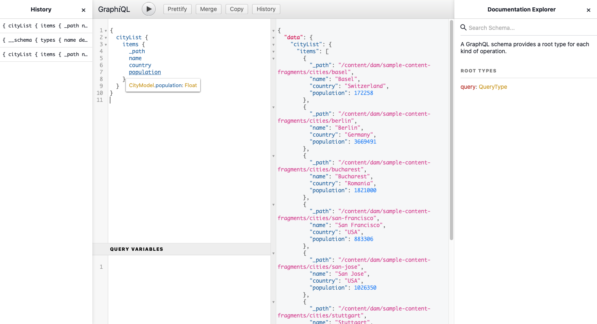

# AEM配信APIを使用したコンテンツへのアクセス方法{#access-your-content}

>[!CAUTION]
>
>作業中 — このドキュメントの作成は現在進行中で、完全なもの、最終的なもの、または実稼働目的で使用するものとして理解してはなりません。

[AEMヘッドレス開発者ジャーニーのこの部分では、](overview.md)GraphQLクエリを使用してコンテンツフラグメントのコンテンツにアクセスし、アプリに送る方法(ヘッドレス配信)を学習できます。

## {#story-so-far}

以前のドキュメントのAEMヘッドレスジャーニー[How to Model Your Content](model-your-content.md)では、AEMでコンテンツモデリングの基本を学習したので、コンテンツ構造のモデル化方法を理解し、AEMコンテンツフラグメントモデルとコンテンツフラグメントを使用してこの構造を実現する必要があります。

* コンテンツのモデリングに関連する概念と用語を認識します。
* ヘッドレスコンテンツ配信にコンテンツモデリングが必要な理由を理解します。
* AEMコンテンツフラグメントモデルを使用して(およびコンテンツフラグメントを使用してコンテンツを作成する方法を理解します。
* コンテンツのモデル化方法を理解する基本的なサンプルを持つ原則

この記事は、AEM GraphQL APIを使用してAEMの既存のヘッドレスコンテンツにアクセスする方法を理解するために、これらの基本事項に基づいて構築されています。

* **オーディエンス**:初心者
* **目的**:AEM GraphQLクエリを使用してコンテンツフラグメントのコンテンツにアクセスする方法を説明します。
   * GraphQLとAEM GraphQL APIの紹介。
   * AEM GraphQL APIの詳細を確認します。
   * 実際の動作を確認するには、サンプルクエリを参照してください。

## コンテンツにアクセスしたい？{#so-youd-like-to-access-your-content}

だから…（コンテンツフラグメント内に）このようなコンテンツがすべて整然と構成され、新しいアプリが提供されるのを待っています。 問題は、そこに到達する方法です。

必要なのは、特定のコンテンツをターゲットし、必要なものを選択してアプリに返し、さらに処理する方法です。

Adobe Experience Manager(AEM)をCloud Serviceとして使用すると、AEM GraphQL APIを使用して、コンテンツフラグメントに選択的にアクセスし、必要なコンテンツのみを返すことができます。 つまり、アプリケーションで使用する構造化コンテンツのヘッドレスな配信を実現できます。

>[!NOTE]
>
>AEM GraphQL APIは、標準のGraphQL API仕様に基づいてカスタマイズされた実装です。

## GraphQL — 入門{#graphql-introduction}

GraphQLは、次の機能を提供するオープンソース仕様です。

* 構造化オブジェクトから特定のコンテンツを選択できるクエリ言語。
* 構造化コンテンツでこれらのクエリを満たすランタイム。

GraphQLは&#x200B;*厳密に*&#x200B;型指定されたAPIです。 つまり、*すべての*&#x200B;コンテンツは、タイプ別に明確に構成、整理されていなければならないので、GraphQL *は、何にアクセスし、何にアクセスするかと、どのようにしてアクセスするかを理解している必要があります。*&#x200B;データフィールドはGraphQLスキーマ内で定義され、コンテンツオブジェクトの構造を定義します。

次に、GraphQLエンドポイントは、GraphQLクエリに応答するパスを提供します。

つまり、アプリをAEMで使用する場合に必要なコンテンツだけを、正確かつ信頼性の高い方法で効率的に選択できます。

>[!NOTE]
>
>*GraphQL*.orgおよび&#x200B;*GraphQL*.comを参照してください。

## AEMとGraphQL {#aem-graphql}

GraphQLはAEMのさまざまな場所で使用され、例：

* コンテンツフラグメント
   * このユースケース用にカスタマイズされたAPIが開発されました(アプリに対するヘッドレス配信)。
      * これはAEM GraphQL APIです。
* Commerce
   * AEMコマースは、GraphQLを介してコマースプラットフォームのデータを使用します。
   * AEMと様々なサードパーティのコマースソリューション間にはGraphQL統合が存在し、CIFコアコンポーネントが提供する拡張フックと共に使用されます。
      * AEM GraphQL APIは使用しません。

>[!NOTE]
>
>ヘッドレスジャーニーのこの手順は、AEM GraphQL APIとコンテンツフラグメントに関するものです。

## AEM GraphQL API {#aem-graphql-api}

AEM GraphQL APIは、標準のGraphQL API仕様に基づいてカスタマイズされたバージョンで、コンテンツフラグメントに対して（複雑な）クエリを実行できるように特別に設定されています。

コンテンツフラグメントは、コンテンツがコンテンツフラグメントのモデルに従って構造化されているので使用されます。 これは、GraphQLの基本的な要件を満たします。

* コンテンツフラグメントモデルは、1つ以上のフィールドで構成されています。
   * 各フィールドはデータ型に従って定義されます。
* コンテンツフラグメントモデルは、対応するAEM GraphQLスキーマの生成に使用されます。

AEM用のGraphQL（およびコンテンツ）に実際にアクセスするには、エンドポイントを使用してアクセスパスを提供します。

AEM GraphQL APIを介して返されたコンテンツは、アプリケーションで使用できます。

>[!NOTE]
>
>AEM GraphQL API の実装は、GraphQL Java ライブラリに基づいています。

### オーサー環境とパブリッシュ環境の使用例 {#use-cases-author-publish-environments}

AEM GraphQL APIの使用例は、Cloud Service環境としてのAEMのタイプに応じて異なります。

* パブリッシュ環境の使用目的：
   * JSアプリケーションのクエリコンテンツ（標準の使用例）

* オーサー環境の使用目的：
   * 「コンテンツ管理目的」のクエリコンテンツ：
      * AEM as a Cloud Service の GraphQL は現在読み取り専用の API です。
      * CR（U）D 操作には REST API を使用できます。

## AEM GraphQL API で使用するコンテンツフラグメント {#content-fragments-use-with-aem-graphql-api}

コンテンツフラグメントは、AEMスキーマやクエリのGraphQLの基盤として、次のように使用できます。

* ページに依存しないコンテンツをデザイン、作成、キュレーションおよび公開できます。
* これらはコンテンツフラグメントモデルに基づいています。コンテンツフラグメントモデルでは、定義済みのデータ型を使用して、結果のフラグメントの構造を事前に定義します。
* 構造の追加のレイヤーは、フラグメント参照データ型を使用して作成できます。このデータ型は、モデルの定義時に使用できます。

### コンテンツフラグメントモデル {#content-fragments-models}

コンテンツフラグメントモデルは、

* **有効**&#x200B;にされると、スキーマの生成に使用されます。

* GraphQL に必要なデータタイプとフィールドを提供します。アプリケーションが、可能なことだけを要求して期待するものを受け取るようにします。

* データタイプ&#x200B;**フラグメント参照**&#x200B;は、別のコンテンツフラグメントを参照するためにモデル内で使用できるので、構造レベルを追加します。

### フラグメント参照 {#fragment-references}

**フラグメント参照**&#x200B;は、

* は、コンテンツフラグメントモデルの定義時に使用できる特定のデータ型です。

* 特定のコンテンツフラグメントモデルに依存する別のフラグメントを参照します。

* 構造化データを作成し、取得できます。

   * **マルチフィード**&#x200B;として定義した場合、複数のサブフラグメントをプライムフラグメントで参照（取得）できます。

### JSON プレビュー {#json-preview}

コンテンツフラグメントモデルの設計と開発に役立つように、コンテンツフラグメントエディターでJSON出力をプレビューできます。

## コンテンツフラグメントからのGraphQLスキーマ生成{#graphql-schema-generation-content-fragments}

GraphQLは、厳密に型指定されたAPIです。つまり、コンテンツは型別に明確に構造化、整理する必要があります。 GraphQLの仕様には、特定のインスタンスのコンテンツを調査するための堅牢なAPIの作成方法に関する一連のガイドラインが記載されています。 そのタスクをおこなうには、クライアントはスキーマを取得する必要があります。この中には、クエリに必要なすべての型が定義されています。

コンテンツフラグメントの場合、GraphQL スキーマ（構造とタイプ）は、**有効**&#x200B;なコンテンツフラグメントモデルとそれらのデータタイプに基づいています。

>[!CAUTION]
>
>（**有効**&#x200B;になっているコンテンツフラグメントモデルから派生した）すべての GraphQL スキーマは、GraphQL エンドポイントを通じて読み取り可能です。
>
>つまり、機密データがGraphQLエンドポイントを介して公開されないようにするために、機密コンテンツが利用できないことを確認する必要があります。たとえば、これにはモデル定義のフィールド名として存在する可能性のある情報が含まれます。

例えば、ユーザーが `Article` という名前のコンテンツフラグメントモデルを作成した場合、AEMは `ArticleModel` 型のオブジェクト `article` を生成します。この型に含まれるフィールドは、モデルで定義されているフィールドとデータ型に対応しています。

1. コンテンツフラグメントモデル：

   

1. 対応するGraphQLスキーマ（GraphiQLの自動ドキュメントからの出力）:
   

   この図では、生成された型 `ArticleModel` に複数の[フィールド](#fields)が含まれていることがわかります。

   * そのうちの 3 つ（`author`、`main`、`referencearticle`）は、ユーザーが管理しています。

   * その他のフィールド（この例では `_path`、`_metadata`、`_variations`）は AEM によって自動的に追加されたもので、特定のコンテンツフラグメントに関する情報を提供する便利な手段となっています。これらの[ヘルパーフィールド](#helper-fields)は、ユーザーが定義したものと自動生成されたものを区別するために、前に`_`が付いています。

1. ユーザーが Article モデルに基づいてコンテンツフラグメントを作成すると、GraphQL を使用してそれをクエリできます。例については、Sampleクエリ.md#graphql-sample-クエリを参照してください（GraphQLで使用するサンプルコンテンツフラグメント構造に基づきます）。

AEM 用 GraphQL では、スキーマには柔軟性があります。つまり、コンテンツフラグメントモデルを作成、更新、削除するたびに、スキーマが自動生成されます。また、コンテンツフラグメントモデルを更新すると、データスキーマキャッシュも更新されます。

Sites GraphQL サービスは、コンテンツフラグメントモデルに対する変更を（バックグラウンドで）リッスンします。更新が検出されると、スキーマのその部分だけが再生成されます。この最適化により、時間を節約し、安定性を確保できます。

例えば、次のようになります。

1. `Content-Fragment-Model-1` と `Content-Fragment-Model-2` を含んだパッケージをインストールすると、

   1. `Model-1` と `Model-2` の GraphQL 型が生成されます。

1. 次に `Content-Fragment-Model-2` を変更すると、

   1. `Model-2` GraphQL 型だけが更新されます。

   1. 一方、`Model-1` は同じままです。

>[!NOTE]
>
>REST API を使用してコンテンツフラグメントモデルの一括更新をおこなう場合などには、この点に留意することが大切です。

スキーマは、GraphQL クエリと同じエンドポイントを通じて提供され、クライアントはスキーマが拡張子 `GQLschema` で呼び出されることに対処します。例えば、`/content/cq:graphql/global/endpoint.GQLschema` で単純な `GET` リクエストを実行すると、`text/x-graphql-schema;charset=iso-8859-1` の Content-type を持つスキーマが出力されます。

### スキーマの生成 — 未公開モデル{#schema-generation-unpublished-models}

コンテンツフラグメントがネストされている場合、親のコンテンツフラグメントモデルは発行されるが、参照されているモデルは発行されない可能性があります。

>[!NOTE]
>
>AEM UIはこのような状況を防ぎますが、プログラムやコンテンツパッケージを使用して公開する場合は、この状況が発生する可能性があります。

この場合、AEMは親コンテンツフラグメントモデルに対して&#x200B;*不完全な*&#x200B;スキーマを生成します。 これは、未公開のモデルに依存するフラグメント参照がスキーマから削除されることを意味します。

## AEM GraphQLエンドポイント{#aem-graphql-endpoints}

<!--
need details/examples
-->

エンドポイントは、AEM用のGraphQLへのアクセスに使用するパスです。 このパスを使用すると、以下が可能になります。

* GraphQLスキーマへのアクセス、
* GraphQL クエリの送信
* （GraphQL クエリに対する）応答の受信

AEMでは次のことが可能です。

* グローバルエンドポイント — すべてのサイトで使用できます。
* テナントエンドポイント — 指定したサイト/プロジェクトに固有の、設定可能なエンドポイント。

## 権限 {#permissions}

Assets へのアクセスに必要な権限です。

## AEM GraphicQL Interface {#aem-graphiql-interface}

クエリを直接入力し、テストする際に役立つように、標準のGraphiQLインターフェイスをAEM GraphQLで使用できます。 これは AEM と共にインストールできます。

構文の強調表示、オートコンプリート、オートコンプリートなどの機能と、履歴およびオンラインドキュメントが提供されます。



## AEM GraphQL APIの実際の使用{#actually-using-aem-graphiql}

コンテンツのクエリを開始する前に、次の操作を行う必要があります。

* エンドポイントを有効にする
   * ツール/サイト/GraphQLを使用

* GraphiQLのインストール（必要な場合）
   * 専用パッケージとしてインストール

AEM GraphQL APIをクエリで実際に使用するには、次の2つの非常に基本的なコンテンツフラグメントモデル構造を使用します。

* 会社情報
   * 名前
   * CEO（担当者）
   * 従業員（個人）
* Person
   * name
   * firstName

「CEO」フィールドと「従業員」フィールドは、「個人」フラグメントを参照します。

フラグメントモデルが使用されます。

* コンテンツフラグメントエディターでコンテンツを作成する場合
* クエリするGraphQLスキーマを生成するには

クエリは、GraphiciQLインターフェイスで入力できます。例えば、次のURLで入力できます。

* `http://localhost:4502/content/graphiql.html `

単刀直入なクエリは、会社スキーマ内のすべてのエントリの名前を返すことです。 ここでは、すべての会社名のリストをリクエストします。

```xml
query {
  companyList {
    items {
      name
    }
  }
}
```

もう少し複雑なクエリは、「ジョブ」という名前を持たないすべての人を選ぶことです。 これにより、ジョブという名前を持たないすべての人がフィルターされます。 これは、EQUALS_NOT演算子を使用して達成できます（その他多数あります）。

```xml
query {
  personList(filter: {
    name: {
      _expressions: [
        {
          value: "Jobs"
          _operator: EQUALS_NOT
        }
      ]
    }
  }) {
    items {
      name
      firstName
    }
  }
}
```

また、より複雑なクエリを作成することもできます。 例えば、「Smith」という名前の従業員が少なくとも1人いるすべての会社に対するクエリです。 次のクエリは、「Smith」という名前の任意の人のフィルター処理を示し、ネストされたフラグメント全体から情報を返します。

```xml
query {
  companyList(filter: {
    employees: {
      _match: {
        name: {
          _expressions: [
            {
              value: "Smith"
            }
          ]
        }
      }
    }
  }) {
    items {
      name
      ceo {
        name
        firstName
      }
      employees {
        name
        firstName
      }
    }
  }
}
```

<!-- need code / curl / cli examples-->

AEM GraphQL APIを使用し、必要な要素を設定する方法の詳細については、次を参照してください。

* AEMでのGraphQLの使用方法
* サンプルコンテンツフラグメント構造
* AEM での GraphQL の使用方法 - サンプルコンテンツとサンプルクエリ

## 次の作業{#whats-next}

AEM GraphQL APIを使用してヘッドレスコンテンツにアクセスし、クエリする方法を学んだので、[REST APIを使用してコンテンツフラグメントのコンテンツにアクセスし、更新する方法を学ぶことができます。](/help/implementing/developing/headless-journey/update-your-content.md)

## その他のリソース {#additional-resources}

* [GraphQL.org](https://graphql.org)
   * [スキーマ](https://graphql.org/learn/schema/)
   * [変数](https://graphql.org/learn/queries/#variables)
   * [GraphQL Javaライブラリ](https://graphql.org/code/#java)
* [GraphiQL](https://graphql.org/learn/serving-over-http/#graphiql)
* [AEMでのGraphQLの使用方法](/help/assets/content-fragments/graphql-api-content-fragments.md)
   * [GraphQL エンドポイントの有効化](/help/assets/content-fragments/graphql-api-content-fragments.md#enabling-graphql-endpoint)
   * [AEM GraphiQL インターフェイスのインストール](/help/assets/content-fragments/graphql-api-content-fragments.md#installing-graphiql-interface)
* [サンプルコンテンツフラグメント構造](/help/assets/content-fragments/content-fragments-graphql-samples.md#content-fragment-structure-graphql)
* [AEM での GraphQL の使用方法 - サンプルコンテンツとサンプルクエリ](/help/assets/content-fragments/content-fragments-graphql-samples.md)
   * [サンプルクエリ - 1 つの特定の都市フラグメント](/help/assets/content-fragments/content-fragments-graphql-samples.md#sample-single-specific-city-fragment)
   * [メタデータのサンプルクエリ - 「GB」という賞のメタデータのリスト](/help/assets/content-fragments/content-fragments-graphql-samples.md#sample-metadata-awards-gb)
   * [サンプルクエリ - 名前付きバリエーションを持つすべての都市](/help/assets/content-fragments/content-fragments-graphql-samples.md#sample-cities-named-variation)
* [設定ブラウザーでコンテンツフラグメント機能を有効にする](/help/assets/content-fragments/content-fragments-configuration-browser.md#enable-content-fragment-functionality-in-configuration-browser)
* [コンテンツフラグメントの操作](/help/assets/content-fragments/content-fragments.md)
   * [コンテンツフラグメントモデル](/help/assets/content-fragments/content-fragments-models.md)
   * [JSON 出力](/help/assets/content-fragments/content-fragments-json-preview.md)
* [接触チャネル間のリソース共有(CORS)について](https://experienceleague.adobe.com/docs/experience-manager-learn/foundation/security/understand-cross-origin-resource-sharing.html?lang=ja#understand-cross-origin-resource-sharing-(cors))
* [サーバー側 API のアクセストークンの生成](/help/implementing/developing/introduction/generating-access-tokens-for-server-side-apis.md)
* [AEM Headless](https://experienceleague.adobe.com/docs/experience-manager-learn/getting-started-with-aem-headless/graphql/overview.html?lang=ja)  — はじめに — コンテンツモデリングやGraphQLなど、AEM headless機能の使用方法の概要を説明する短いビデオチュートリアルシリーズです。
