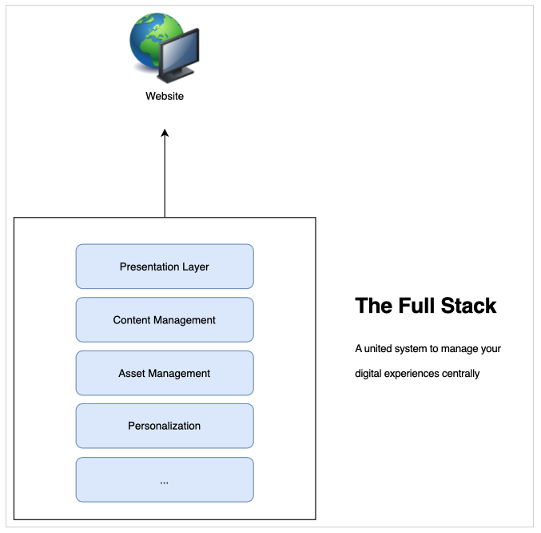

# CMSヘッドレス開発について{#learn-about}

>[!CAUTION]
>
>作業中 — このドキュメントの作成は現在進行中で、完全なもの、最終的なもの、または実稼働目的で使用するものとして理解してはなりません。

[AEMヘッドレス開発者ジャーニーのこの部分では、](#overview.md)はヘッドレス技術と使用する理由を学びます。

## 目的 {#objective}

このドキュメントは、ヘッドレスコンテンツの配信と、その使用理由を理解するのに役立ちます。 読んだ後は、次の操作を行います。

* ヘッドレスコンテンツ配信の基本概念と用語の理解
* ヘッドレスが必要な理由と時期を理解する
* ヘッドレスコンセプトの使い方とそれらの相互関係を高度に把握する

## フルスタックコンテンツ配信{#full-stack}

使いやすく大規模なコンテンツ管理システム(CMS)が登場して以来、組織はそれらをメッセージング、ブランディング、通信の管理の中心として活用してきました。 CMSを管理の中心として使用することで、異なるシステムで重複タスクを使用する必要がなくなり、効率性が向上します。

フルスタックCMSでは、コンテンツを操作する機能はすべてCMSに搭載されています。 システムの機能は、CMSスタックの様々なコンポーネントを構成します。 フルスタックソリューションには多くの利点があります。

* 管理するシステムが1つあります。
* コンテンツは一元的に管理されます。
* システムのすべてのサービスが統合されています。
* コンテンツのオーサリングはシームレスです。

したがって、新しいチャネルを追加したり、新しいタイプのエクスペリエンスをサポートしたい場合は、1つ以上の新しいコンポーネントをスタックに挿入でき、変更を行う場所は1つだけです。

スタック内の他の項目を変更に合わせて調整する必要がある場合があるので、スタック内の依存関係の複雑さはすぐに明らかになります。

## フルスタック配信の制限{#limits}

フルスタックアプローチは本質的に、すべてのエクスペリエンスが1つのシステムにランディングするサイロを作成します。 サイロのコンポーネントの変更や追加は、他のコンポーネントの変更が必要で、変更に時間がかかり、コストがかかります。

これは特に、従来のシステムではCMSとの緊密な結び付きを持つプレゼンテーションレイヤーに当てはまります。 新しいチャネルは、通常、プレゼンテーションレイヤーの更新を意味します。これは、他のすべてのチャネルに影響します。

この自然サイロの制限は、スタックのすべてのコンポーネント間で変更を調整するのに必要な労力と時間を理解することで明らかになります。

ユーザーは、プラットフォームやタッチポイントに関係なく、エクスペリエンスの提供方法に機敏性が必要であることを期待します。  このマルチチャネルアプローチはデジタルエクスペリエンスの標準であり、フルスタックアプローチは柔軟性に欠ける場合があります。

## ヘッドレスのヘッド{#the-head}

システムのヘッドは、通常、そのシステムの出力レンダラです。通常、GUIや他のグラフィカル出力の形式です。

たとえば、ヘッドレスサーバは、サーバルームのラックに設置され、モニタが取り付けられていない場合があります。 アクセスするには、リモートで接続する必要があります。 この場合、サーバの出力のレンダリングを行う際に、モニタがヘッドとなります。 サービスを利用するユーザーは、リモートから接続する際に、独自のヘッド（モニター）を提供します。

ヘッドレスCMSについて話すと、CMSはコンテンツを管理し、消費者に引き続き配信します。 ただし、**コンテンツ**&#x200B;を標準化された形式で配信するだけで、ヘッドレスCMSは最終的な出力レンダリングを省略し、コンテンツの&#x200B;**プレゼンテーション**&#x200B;は消費サービスに残ります。

消費するサービスは、ARエクスペリエンス、Webショップ、モバイルエクスペリエンス、プログレッシブWebアプリ(PWA)などであれ、ヘッドレスCMSからコンテンツを取り込み、独自のレンダリングを提供します。 彼らは自分の頭を自分の中に入れてくれるように気を配る。

ヘッドを省くと、大幅に複雑さを解消し、CMSが非常に簡単になります。 これを行うと、コンテンツのレンダリングの責任が、実際にコンテンツを必要とするサービスに移り、多くの場合はそのようなレンダリングに適しています。

## {#decoupling}を分離

ヘッドレス配信は、すべてのエクスペリエンスで利用できる堅牢で柔軟なアプリケーションプログラミングインターフェイス(API)のセットを公開することで可能です。 APIは、サービス間の共通言語として機能し、標準化されたコンテンツ配信を通じてコンテンツレベルでサービスを連結しますが、独自のソリューションを柔軟に実装できるようにします。

ヘッドレスは、コンテンツを表示から切り離す例です。 より一般的な意味では、フロントエンドとサービススタックのバックエンドを分離します。 ヘッドレス設定では、プレゼンテーションレイヤ（ヘッド）がコンテンツ管理（テール）から切り離される。 この2つは、API呼び出しを通じてのみやり取りします。

これは、コンテンツの再利用と一貫性を確保するために、API経由で配信される同じコンテンツに基づいて、各消費サービス（フロントエンド）がエクスペリエンスを構築できることを意味します。 次に、サービスを利用して独自のプレゼンテーションレイヤーを実装し、コンテンツ管理スタック（バックエンド）を容易に水平方向に拡大できます。

## 技術的基礎{#technology}

ヘッドレスアプローチを使用すると、将来のデジタルエクスペリエンスのニーズに簡単かつ迅速に対応できるテクノロジスタックを構築できます。

以前のCMS用のAPIは、通常RESTベースでした。 Representational State Transfer(REST)は、ステートレス方式のテキストとしてリソースを提供します。 これにより、あらかじめ定義された一連の操作でリソースの読み取りと変更を行うことができます。 RESTを使用すると、コンテンツのステートレス表現を確保することで、Web上のサービス間の優れた相互運用が可能です。

また、堅牢なREST APIはまだ必要です。 ただし、REST要求は大きく、冗長にすることができます。 すべてのチャネルに対してRESTコールを行う複数のコンシューマが存在する場合は、この冗長性の組み合わせやパフォーマンスに影響を及ぼす可能性があります。

ヘッドレスコンテンツの配信では、多くの場合GraphQL APIを使用します。 GraphQLでは、ステートレス転送と同様の処理が可能ですが、ターゲットクエリをより多く設定でき、必要なクエリの総数を削減し、パフォーマンスを向上できます。 解決策は、RESTとGraphQLの組み合わせを使用し、基本的には目の前のジョブに最適なツールを選択するのが一般的です。

選択したAPIが何であれ、共通のAPIに基づいてヘッドレスシステムを定義することで、最新のブラウザーや、プログレッシブWebアプリ(PWA)などの他のWebテクノロジーを利用できます。 APIは、拡張性と適応性に優れた標準インターフェイスを作成します。

通常、コンテンツはクライアント側でレンダリングされます。 これは通常、誰かがモバイルデバイスでコンテンツを呼び出し、CMS配信でコンテンツを呼び出し、その後モバイルデバイス（クライアント）が提供したコンテンツのレンダリングを行うことを意味します。 デバイスの動作が古い場合や動作が遅い場合は、同様にデジタルの動作が遅くなります。

コンテンツとプレゼンテーションを分離することは、クライアント側のパフォーマンス上の問題をより詳細に制御できることを意味します。 サーバー側レンダリング(SSR)は、コンテンツのレンダリングをクライアントのブラウザーからサーバーに転送します。 これにより、コンテンツのプロバイダーは、必要に応じてオーディエンスに保証されたパフォーマンスを一定レベルオファーできます。

## 組織の課題{#organization}

ヘッドレスは、デジタルエクスペリエンスを柔軟に配信できる世界を開きます。 しかし、この柔軟性は、独自の課題も提示できます。

多くの異なるチャネルを持つと、それぞれが独自のプレゼンテーションシステムを持つという意味になり得ます。 同じAPIを通じて同じコンテンツを使用する場合でも、プレゼンテーションが異なるので、エクスペリエンスが異なる場合があります。 顧客体験の一貫性を確保するためには、注意と注意が必要です。

注意深いデザインシステムを実装し、パターンライブラリを共有し、確立されたオープンなクライアント側のフレームワークと再利用可能なデザインコンポーネントを活用することで、一貫性のあるエクスペリエンスを確保できますが、この計画は必須です。

## 未来はヘッドレスで未来は今{#future}

デジタルエクスペリエンスでは、ブランドと顧客との関わり方は引き続き定義されます。 ヘッドレス設計の面白い点は、お客様の期待の高まりに応える柔軟性です。

未来を予測するのは不可能ですが、将来がもたらすものに対して、頭を持たない人は敏捷性を与えます。

## AEMとヘッドレス{#aem-and-headless}

この開発者向けジャーニーを進めながら、AEMのフルスタック配信機能に加えて、ヘッドレス配信をサポートする方法を学習します。

デジタルエクスペリエンス管理の業界トップとして、Adobeは、エクスペリエンス制作者が直面する真の課題に対する理想的なソリューションが二項選択であることを認識しています。 そのため、AEMは両方のモデルをサポートするだけでなく、2つのモデルをシームレスにハイブリッドに組み合わせることで、コンテンツ利用者に最適なサービスを提供できます。 どこにいても。

このジャーニーでは、ヘッドレスのみのコンテンツ配信のモデルに焦点を当てます。 しかし、この知識の基盤を築き上げれば、両方のモデルの力をどのように活用するかをさらに検討できます。

## 次の作業{#what-is-next}

AEMヘッドレスジャーニーを使い始めてくれてありがとう！ このドキュメントを読んだら、次の操作を行う必要があります。

* ヘッドレスコンテンツ配信の基本的な概念と用語を理解します。
* ヘッドレスが必要な理由と時期を理解する。
* ヘッドレスコンセプトの使い方とその相互関係を高度に把握する。

この知識に基づき、次に「[AEM Headless使用の手引き](getting-started.md)」のドキュメントを確認し、必要なツールの設定方法とAEMがheadlessコンテンツ配信とその前提条件についての考え方を学びます。

## その他のリソース {#additional-resources}

「[AEM HeadlessをCloud Serviceとして使い始める前に」のドキュメントを見て、ヘッドレス開発ジャーニーの次の部分に進むことをお勧めしますが、](getting-started.md)以下は、このドキュメントで取り上げた概念をより深く掘り下げる追加のオプションリソースです。

* [Adobe Experience Manager建築をCloud Service](/help/core-concepts/architecture.md) -AEMをCloud Serviceの構造として理解
* [AEMヘッドレスTutorials](https://experienceleague.adobe.com/docs/experience-manager-learn/getting-started-with-aem-headless/overview.html?lang=ja)  — これらの実践的なチュートリアルを使用して、AEMのヘッドレスエンドポイントにコンテンツを配信する様々なオプションの使用方法を学び、最適なオプションを選択します。
