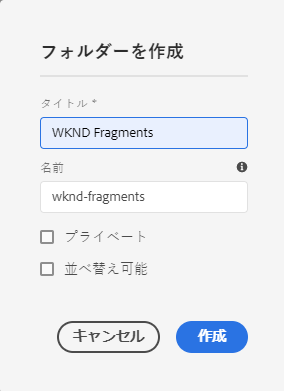
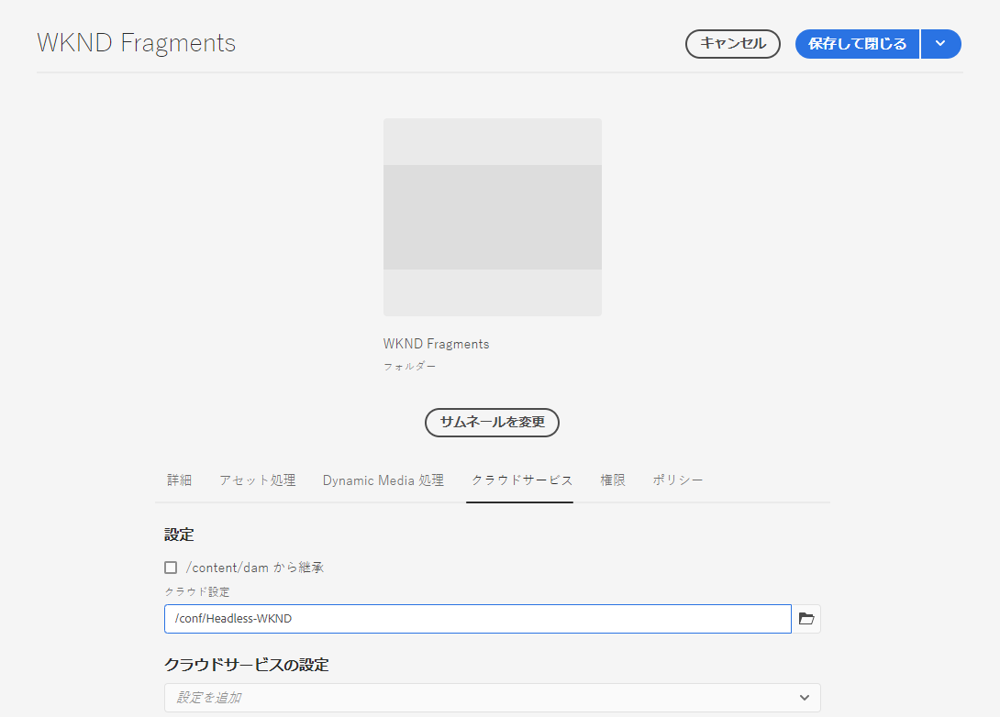
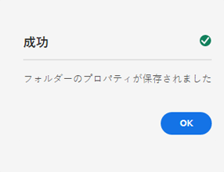

# アセットフォルダーのヘッドレスクイック開始ガイドの作成{#creating-an-assets-folder}

コンテンツフラグメントモデルは、コンテンツフラグメントの構造を定義します。 次に、コンテンツフラグメントはアセットフォルダーに保存されます。

##  アセットフォルダとは{#what-is-an-assets-folder}

[これで、今後のコンテンツフラグメントに必要な構造を定義するコンテンツフラグメント](create-content-model.md) モデルを作成できたので、いくつかのフラグメントを作成できると思われます。

ただし、まず、アセットを保存するアセットフォルダを作成する必要があります。

アセットフォルダーは、画像やビデオなど、従来のコンテンツアセット](/help/assets/manage-digital-assets.md)やコンテンツフラグメントを[整理するために使用されます。

## アセットフォルダの作成方法{#how-to-create-an-assets-folder}

管理者は、フォルダーを作成するだけで、コンテンツの作成時にフォルダーを整理できます。 この入門ガイドの目的上、フォルダーを1つ作成するだけで済みます。

1. AEMにCloud Serviceとしてログインし、メインメニューで&#x200B;**ナビゲーション —>アセット —>ファイル**&#x200B;を選択します。
1. 「**作成 —>フォルダー**」をタップまたはクリックします。
1. フォルダーの&#x200B;**タイトル**&#x200B;と&#x200B;**名前**&#x200B;を指定します。
   * **タイトル**&#x200B;は説明的にします。
   * **Name**&#x200B;がリポジトリのノード名になります。
      * タイトルに基づいて自動的に生成され、[AEMの命名規則に従って調整されます。](/help/implementing/developing/introduction/naming-conventions.md)
      * 必要に応じて調整できます。

   
1. 先ほど作成したフォルダーを選択し、ツールバーから「**プロパティ**」を選択します（または、`p` [キーボードショートカットを使用します。](/help/sites-cloud/authoring/getting-started/keyboard-shortcuts.md)）
1. **プロパティ**&#x200B;ウィンドウで、**Cloud Services**&#x200B;タブを選択します。
1. **クラウドの設定**&#x200B;に対して、以前に作成した[設定を選択します。](create-configuration.md)

   
1. 「**保存して閉じる**」をタップまたはクリックします。
1. 確認ウィンドウで「**OK**」をタップまたはクリックします。

   

先ほど作成したフォルダー内に、追加のサブフォルダーを作成できます。 サブフォルダーは、親フォルダーの&#x200B;**Cloud Configuration**&#x200B;を継承します。 別の設定のモデルを使用する場合は、この設定を上書きできます。

ローカライズされたサイト構造を使用している場合は、新しいフォルダーの下に[言語ルート](/help/assets/translate-assets.md)を作成できます。

## 次の手順 {#next-steps}

コンテンツフラグメント用のフォルダーを作成したら、はじめにガイドの4番目の部分に進み、[コンテンツフラグメントを作成します。](create-content-fragment.md)

>[!TIP]
>
>コンテンツフラグメントの管理について詳しくは、[コンテンツフラグメントのドキュメント](/help/assets/content-fragments/content-fragments.md)を参照してください
