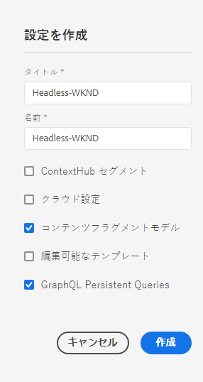

# 構成ヘッドレスクイック開始ガイドの作成{#creating-configuration}

Cloud ServiceとしてAEMでヘッドレス機能を使い始める最初の手順として、設定を作成する必要があります。

## 設定とは{#what-is-a-configuration}

設定ブラウザーには、AEMの設定用の汎用設定API、コンテンツ構造、解決メカニズムが用意されています。

AEMのヘッドレスなコンテンツ管理に関しては、AEM内でコンテンツモデルを作成できる職場として設定を考えてみてください。これにより、将来のコンテンツとコンテンツフラグメントの構造を定義できます。 複数の設定を持ち、これらのモデルを分離できます。

フルスタックAEMの[ページテンプレートに詳しい場合、](/help/sites-cloud/authoring/features/templates.md)コンテンツモデルの管理での設定の使用方法は似ています。

## 構成の作成方法{#how-to-create-a-configuration}

管理者は、設定を1回だけ作成する必要があります。また、コンテンツモデルを編成するために新しいワークスペースが必要な場合には非常に自由に作成する必要があります。 この入門ガイドの目的上、設定を1つ作成するだけで済みます。

1. AEMにCloud Serviceとしてログインし、メインメニューで&#x200B;**ツール/一般/設定ブラウザ**&#x200B;を選択します。
1. 設定に&#x200B;**タイトル**&#x200B;と&#x200B;**名前**&#x200B;を指定します。
   * **タイトル**&#x200B;は説明的にします。
   * **Name**&#x200B;がリポジトリのノード名になります。
      * タイトルに基づいて自動的に生成され、[AEMの命名規則に従って調整されます。](/help/implementing/developing/introduction/naming-conventions.md)
      * 必要に応じて調整できます。
1. 次のオプションを確認します。
   * **コンテンツフラグメントモデル**
   * **GraphQLの永続的なクエリ**

   

1. **「作成**」をタップまたはクリックします

必要に応じて、複数の設定を作成できます。 設定は入れ子にすることもできます。

>!![NOTE]
導入要件に応じて、**コンテンツフラグメントモデル**&#x200B;および&#x200B;**GraphQLの永続的なクエリ**&#x200B;に加えて、設定オプションが必要になる場合があります。

## 次の手順 {#next-steps}

この設定を使用すると、はじめにガイドの2番目の部分に進み、[コンテンツフラグメントモデルを作成します。](create-content-model.md)

>!![TIP]
構成ブラウザーの詳細については、[構成ブラウザーのドキュメントを参照してください。](/help/implementing/developing/introduction/configurations.md)
