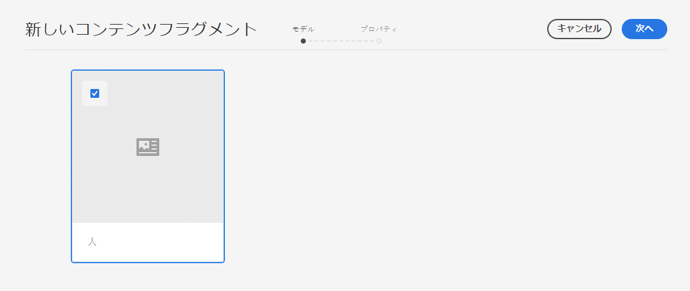
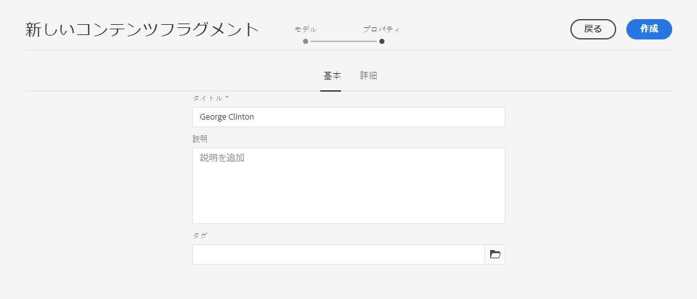
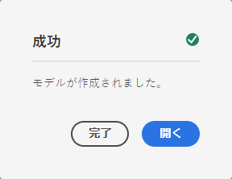
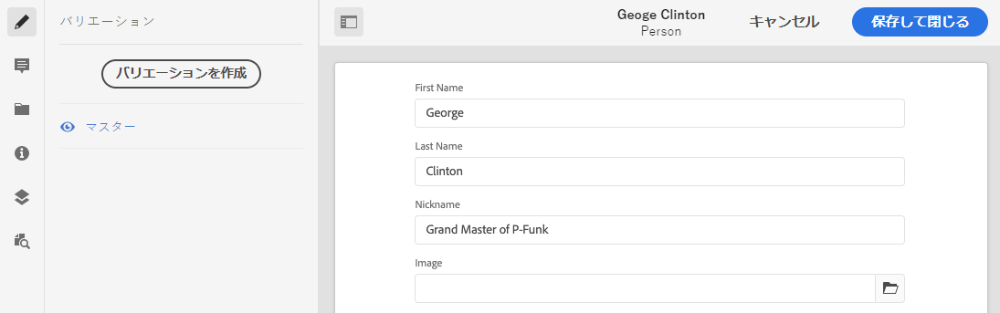

# コンテンツフラグメントの作成ヘッドレスクイック開始ガイド{#creating-content-fragments}

コンテンツフラグメントを使用すると、AEMでヘッドレスに配信できるページに依存しないコンテンツをデザイン、作成、キュレーションおよび使用できます。

## コンテンツフラグメントとは{#what-are-content-fragments}

[コンテンツフラグメントを保存できるアセット](create-assets-folder.md) フォルダーを作成できたら、フラグメントを作成できます。

コンテンツフラグメントを使用すると、ページに依存しないコンテンツをデザイン、作成、キュレーションおよび公開できます。 複数の場所や複数のチャネルで使用できる状態でコンテンツを準備できます。

コンテンツフラグメントには構造化されたコンテンツが含まれ、JSON形式で配信できます。

## コンテンツフラグメントの作成方法{#how-to-create-a-content-fragment}

コンテンツ作成者は、作成したコンテンツを表す任意の数のコンテンツフラグメントを作成します。 これがAEMの主なタスクとなります。 この入門ガイドの目的上、作成する必要があるのは1つだけです。

1. AEMにCloud Serviceとしてログインし、メインメニューで&#x200B;**ナビゲーション —>アセット**&#x200B;を選択します。
1. 前に作成した[フォルダーをタップまたはクリックします。](create-assets-folder.md)
1. 「**作成 —>コンテンツフラグメント**」をタップまたはクリックします。
1. コンテンツフラグメントの作成は、2つの手順でウィザードとして表示されます。 まず、コンテンツフラグメントの作成に使用するモデルを選択し、**次へ**&#x200B;をタップまたはクリックします。
   * 使用できるモデルは、コンテンツフラグメントを作成するアセットフォルダー](create-assets-folder.md)に対して定義した&#x200B;[**クラウド設定**&#x200B;によって異なります。
   * `We could not find any models`というメッセージが表示された場合は、アセットフォルダーの設定を確認してください。

   
1. 必要に応じて&#x200B;**タイトル**、**説明**、**タグ**&#x200B;を指定し、「**作成**」をタップまたはクリックします。

   
1. 確認ウィンドウで「**開く**」をタップまたはクリックします。

   
1. コンテンツフラグメントエディターで、コンテンツフラグメントの詳細を指定します。

   
1. 「**保存**」をタップまたはクリックします。

コンテンツフラグメントは他のコンテンツフラグメントを参照でき、必要に応じてネストされたコンテンツ構造を作成できます。

コンテンツフラグメントは、AEM内の他のアセットを参照することもできます。 [これらのアセットは、参照するコンテンツフラグメントを作成する前に、](/help/assets/manage-digital-assets.md) AEMに保存する必要があります。

## 次の手順 {#next-steps}

コンテンツフラグメントを作成したら、はじめにガイドの最後の部分に進み、[コンテンツフラグメントにアクセスして配信するためのAPIリクエストを作成できます。](create-api-request.md)

>[!TIP]
>
>コンテンツフラグメントの管理について詳しくは、[コンテンツフラグメントのドキュメント](/help/assets/content-fragments/content-fragments.md)を参照してください
