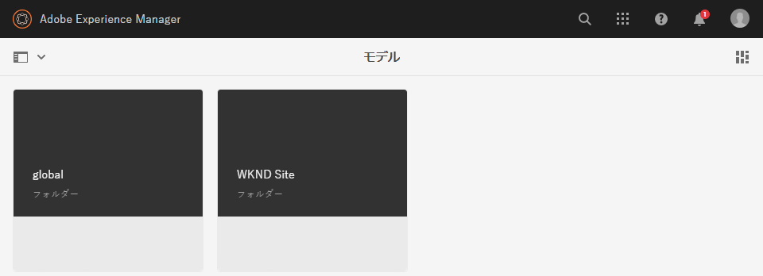
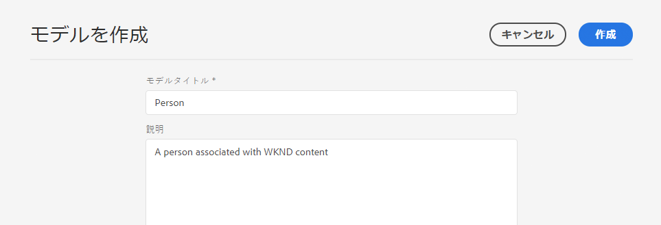
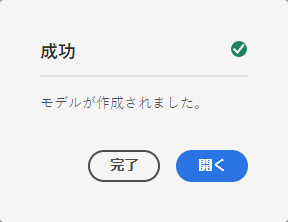
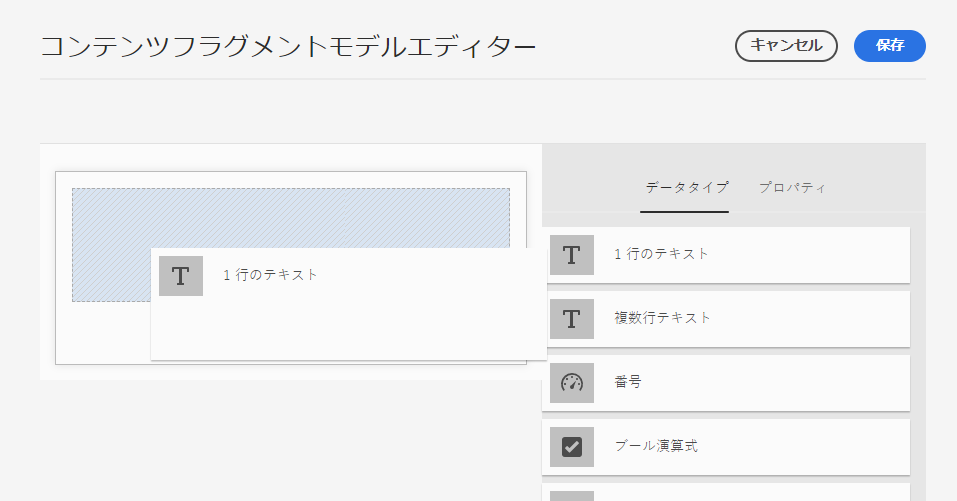
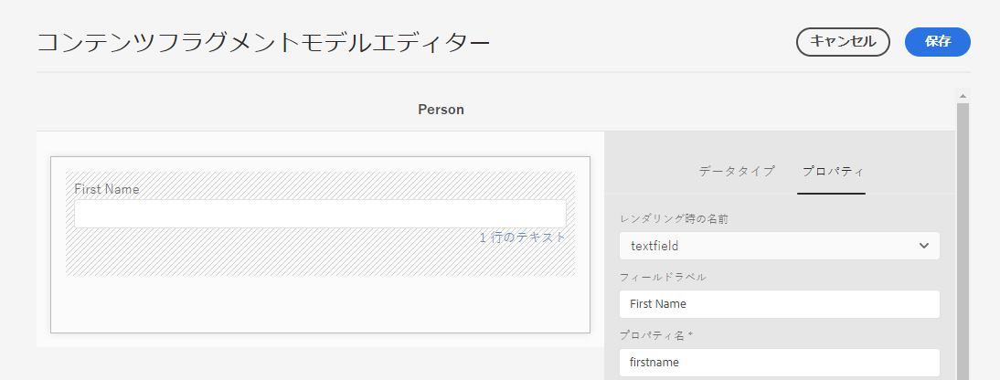
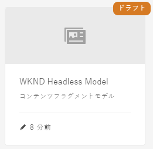
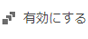
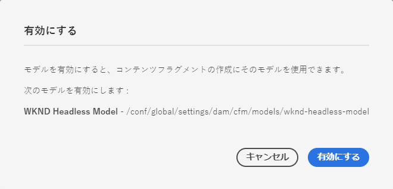

# コンテンツフラグメントモデルの作成ヘッドレスクイック開始ガイド{#creating-content-fragment-models}

コンテンツフラグメントモデルは、AEMのヘッドレス機能を使用して作成および提供するコンテンツの構造を定義します。

## コンテンツフラグメントモデルとは{#what-are-content-fragment-models}

[これで設定が作成されたので、こ](create-configuration.md) の設定を使用してコンテンツフラグメントモデルを作成できます。

コンテンツフラグメントモデルは、AEMで作成および管理するデータとコンテンツの構造を定義します。 コンテンツの足場の一種として機能します。 コンテンツの作成を選択すると、作成者は定義したコンテンツフラグメントモデルから選択し、コンテンツの作成をガイドします。

## コンテンツフラグメントモデルの作成方法{#how-to-create-a-content-fragment-model}

新しいモデルが必要な場合、情報アーキテクトは散発的にこれらのタスクを実行します。 この入門ガイドの目的上、モデルを1つ作成するだけで済みます。

1. AEMにCloud Serviceとしてログインし、メインメニューで&#x200B;**ツール/アセット/コンテンツフラグメントモデル**&#x200B;を選択します。
1. 設定を作成したフォルダーをタップまたはクリックします。

   
1. 「**作成**」をタップまたはクリックします。
1. **モデルタイトル**&#x200B;と&#x200B;**説明**&#x200B;を入力します。

   
1. 確認ウィンドウで、**「**&#x200B;を開く」をタップまたはクリックして、モデルを設定します。

   
1. **コンテンツフラグメントモデルエディター**&#x200B;を使用して、**データタイプ**&#x200B;列からフィールドをドラッグ&amp;ドロップして、コンテンツフラグメントモデルを作成します。

   

1. フィールドを配置した後、そのプロパティを設定する必要があります。 エディターは、追加されたフィールドの「**プロパティ**」タブに自動的に切り替わります。このタブで、必須フィールドを指定できます。

   
1. モデルの構築が完了したら、をタップまたはクリックして、「**保存**」をクリックします。 新しく作成したモデルは、**ドラフト**&#x200B;モードに保存されます。

   
1. モデルを使用するには、モデルを有効にする必要があります。 作成したモデルを選択し、**有効**&#x200B;をタップまたはクリックします。

   
1. 確認ダイアログで「**有効にする**」をタップまたはクリックして、モデルの有効化を確認します。

   
1. モデルが有効になり、使用できる状態になります。

   

**コンテンツフラグメントモデルエディター**&#x200B;は、単純なテキストフィールド、アセット参照、他のモデルへの参照、JSONデータなど、様々なデータタイプをサポートしています。

複数のモデルを作成できます。 モデルは他のコンテンツフラグメントを参照できます。 [設定](create-configuration.md)を使用して、モデルを整理します。

## 次の手順 {#next-steps}

モデルを作成してコンテンツフラグメントの構造を定義したら、はじめにガイドの3番目の部分に進み、フラグメント自体を保存するフォルダーを[作成します。](create-assets-folder.md)

>!![TIP]
コンテンツフラグメントモデルについて詳しくは、[コンテンツフラグメントモデルのドキュメント](/help/assets/content-fragments/content-fragments-models.md)を参照してください
