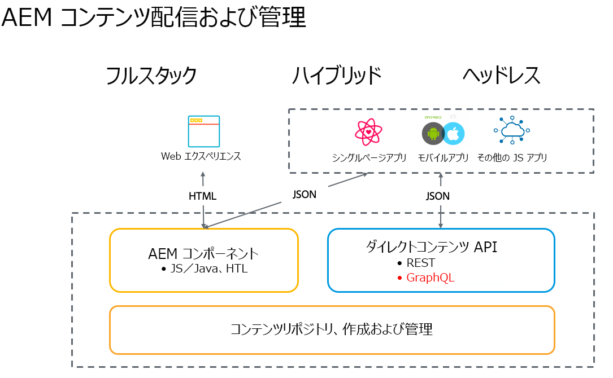

# Cloud ServiceとしてのAEM Sites向けヘッドレス開発{#headless-development}

コンテンツモデル、コンテンツフラグメント、GraphQL APIなどの強力な機能をCloud Serviceとして使用すると、AEMを使用してエクスペリエンスを一元的に管理し、チャネル全体に提供できます。

## 概要 {#overview}

ヘッドレス実装は、チャネルに関係なく、どこにいても、オーディエンスにエクスペリエンスを提供する上で、ますます重要になっています。

ヘッドレス実装は、フルスタックおよびハイブリッドソリューションに従来のようにページやコンポーネントの管理に向けられ、チャネル中立で再利用可能なコンテンツのフラグメントとそのクロスチャネル配信の作成に重点を置いています。 これは、Webエクスペリエンスを実装するための最新の動的な開発パターンです。

## CLOUD SERVICEとしてのAEMおよびヘッドレス{#aem-headless}

AEM asCloud Serviceは、次の3つの強力なサービスを提供することで、ヘッドレス実装モデルの柔軟なツールです。

1. コンテンツモデル
   * コンテンツモデルは、コンテンツの構造化表現です。
   * これらは、AEMコンテンツフラグメントモデルエディターの情報アーキテクトによって定義されます。
   * コンテンツモデルは、コンテンツフラグメントの基盤となります。
1. コンテンツフラグメント
   * コンテンツフラグメントは、コンテンツモデルのインスタンス化です。
   * これらは、AEMコンテンツフラグメントエディターを使用してコンテンツ作成者が作成します。
   * これらはAEM Assetsに保存され、アセット管理UIで管理されます。
1. 配信用コンテンツAPI
   * AEM GraphQL APIは、コンテンツフラグメント配信をサポートします。
   * AEM AssetsのREST APIは、コンテンツフラグメントCRUD操作をサポートしています。
   * [コンテンツフラグメントコアコンポーネントのJSONエクスポートを使用して、直接コンテンツ配信も可能です。](https://docs.adobe.com/content/help/ja-JP/experience-manager-core-components/using/components/content-fragment-component.html)

## ヘッドレスな入門ガイド{#getting-started}

ヘッドレス入門ガイドでは、AEMをCloud Serviceとして使用したエクスペリエンスを作成、管理、配信するための簡単なパスを5つの手順で説明します。 各ガイドは前述のものを基にしているので、十分に調査して順番に検討することをお勧めします。

1. [設定の作成](getting-started/create-configuration.md)
1. [コンテンツフラグメントモデルの作成](getting-started/create-content-model.md)
1. [アセットフォルダの作成](getting-started/create-assets-folder.md)
1. [コンテンツフラグメントの作成](getting-started/create-content-fragment.md)
1. [コンテンツフラグメントへのアクセスと配信](getting-started/create-api-request.md)

## Audience {#audience}

『[ヘッドレスはじめに](#getting-started)』で説明されているタスクは、AEMヘッドレス機能の基本的なエンドツーエンドのデモに必要です。 テストAEMインスタンスに管理者アクセス権を持つユーザーはだれでも、これらのガイドに従ってAEMのヘッドレスな配信を理解できますが、開発者の経験を持つユーザーは最適です。

ただし、実稼働環境では、タスクは様々な回数で異なる人物によって実行されます。 次に例を示します。

* **** 管理者は、通常は1回または散発的にのみ、コンテンツの初期設定とフォルダー構造を設定する必要があります。
* **情報** アーキテクチャは、通常、組織のニーズの発展に応じて新しいモデルを追加します。
* **コンテンツ** 作成者は、アーキテクトが定義したモデルに基づいて、新しいコンテンツをコンテンツフラグメントとして継続的に作成します。

ヘッドレス入門ガイドでは、一般に誰が説明したタスクを実行し、どの程度の頻度で実行するかを指摘します。

## 次のステップ {#next-step}

詳しくは、 その後、『Headless Getting Started Guide』の最初の部分を読んで始めます。[構成の作成。](getting-started/create-configuration.md)
