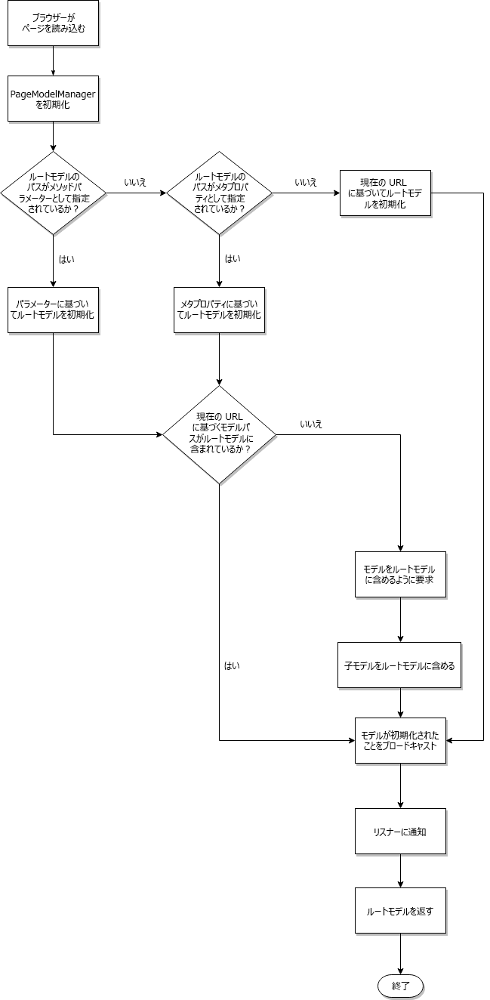

# SPA ブループリント {#spa-blueprint}

作成者が AEM SPA エディターを使用して SPA のコンテンツを編集できるようにするには、SPA が満たすべき要件があります。

## 概要 {#introduction}

このドキュメントでは、AEM 内に編集可能な SPA コンポーネントを実装するために SPA フレームワークが満たす必要がある一般的な契約（AEM サポートレイヤーの種類など）について説明します。

作成者が、AEM ページエディターを使用して単一ページアプリケーションのフレームワークで公開されるデータを編集できるようにするには、プロジェクトが、AEM リポジトリ内のアプリケーション用に保存されたデータのセマンティックを表すモデル構造を解釈できる必要があります。この目標を達成するために、フレームワークに依存しない、`PageModelManager` と `ComponentMapping` の 2 つのライブラリが用意されています。

>[!NOTE]
>
>以下の要件は、フレームワークには依存しません。要件が満たされると、（モジュール、コンポーネントおよびサービスで構成された）フレームワーク固有のレイヤーが提供されます。
>
>**AEM の React フレームワークと Angular フレームワークでは、これらの要件は既に満たされています。**&#x200B;このブループリントの要件は、AEM で別のフレームワークを実装して使用する場合にのみ適用されます。

>[!CAUTION]
>
>AEM の SPA 機能はフレームワークに依存しませんが、現時点では、React および Angular フレームワークのみに対応しています。

## PageModelManager {#pagemodelmanager}

この `PageModelManager` ライブラリは、SPA プロジェクトで使用する NPM パッケージとして提供されます。SPA に付属し、データモデルマネージャーとして機能します。

SPA に代わり、実際のコンテンツ構造を表す JSON 構造の取得および管理を抽象化します。SPA との同期も処理し、コンポーネントの再レンダリングが必要なタイミングを通知します。

NPM パッケージ [@adobe/aem-spa-model-manager](https://www.npmjs.com/package/@adobe/aem-spa-model-manager) を参照してください。

`PageModelManager` を初期化するとき、ライブラリは最初に、指定されたアプリケーションのルートモデルを読み込みます（パラメーター、メタプロパティまたは現在の URL を使用）。ライブラリが、現在のページのモデルが取得するルートモデルの一部でないことを識別した場合、ライブラリはそれを子ページのモデルとして取得して含めます。



### ComponentMapping {#componentmapping}

`ComponentMapping` モジュールは、プロントエンドプロジェクトに NPM パッケージとして提供されます。このモジュールは、フロントエンドコンポーネントを格納し、SPA がフロントエンドコンポーネントを AEM リソースタイプにマッピングする方法を提供します。これにより、アプリケーションの JSON モデルを構文解析する際に、コンポーネントの動的な解決が可能になります。

モデル内の各項目には、AEM リソースタイプを表示する `:type` フィールドが含まれます。フロントエンドコンポーネントは、マウントされると、基になるライブラリから受け取ったモデルのフラグメントを使用して自分自身をレンダリングできます。

#### コンポーネントマッピングの動的モデル {#dynamic-model-to-component-mapping}

コンポーネントマッピングの動的モデルが AEM 用の Javascript SPA SDK でどのようにおこなわれるかについて詳しくは、SPA の「[コンポーネントマッピングの動的モデル」の記事を参照してください](model-to-component-mapping.md)。

### フレームワーク固有のレイヤー {#framework-specific-layer}

フロントエンドフレームワークごとに第 3 のレイヤーを実装する必要があります。この 3 つ目のライブラリは、基礎となるライブラリとのインタラクションを担当し、データモデルとやり取りするための、統合された使いやすい一連のエントリーポイントを提供します。

このドキュメントの残りの部分では、この中間フレームワーク固有のレイヤーの要件を説明し、フレームワークに依存しないことを示すこととします。次の要件に従うことで、フレームワーク固有のレイヤーを提供でき、プロジェクトコンポーネントとデータモデル管理を担う基礎となるライブラリとのやり取りが可能になります。

## 一般的な概念 {#general-concepts}

### ページモデル {#page-model}

ページのコンテンツ構造は AEM に保存されます。ページのモデルは、SPA コンポーネントのマッピングとインスタンス化に使用されます。SPA の開発者は、SPA コンポーネントを作成して、AEM コンポーネントにマッピングします。これをおこなうには、リソースタイプ（または AEM コンポーネントへのパス）を一意のキーとして使用します。

SPAコンポーネントは、ページモデルと同期し、それに応じてコンテンツに変更を加えて更新する必要があります。 指定のページモデル構造に従って、コンポーネントをその場でインスタンス化するには、動的コンポーネントを利用したパターンを使用する必要があります。

### メタフィールド  {#meta-fields}

ページモデルでは、[Sling Model](https://sling.apache.org/documentation/bundles/models.html) API に基づく JSON Model Exporter を利用します。この書き出し可能な Sling モデルは、基になるライブラリがデータモデルを解釈できるように、次のフィールドのリストを公開します。

* `:type`：AEM リソースのタイプ（デフォルト = リソースタイプ）
* `:children`：現在のリソースの階層の子。子は現在のリソースの内部コンテンツに含まれていません（ページを表す項目に含まれています）
* `:hierarchyType`：リソースの階層タイプ。`PageModelManager` は現在、ページタイプをサポートしています

* `:items`：現在のリソースの子コンテンツリソース（ネストされた構造、コンテナにのみ存在）
* `:itemsOrder`：子の順番付きリスト。JSON マップオブジェクトでは、フィールドの順番は保証されません。マップと現在の配列の両方を利用することで、API の利用者は両方の構造のメリットが得られます
* `:path`：項目のコンテンツパス（ページを表す項目に存在）

[AEM コンテンツサービスの利用](https://docs.adobe.com/content/help/ja-JP/experience-manager-learn/getting-started-with-aem-headless/overview.html)も参照してください。

### フレームワーク固有のモジュール {#framework-specific-module}

懸念を分けることで、プロジェクトの実装を容易にすることができます。したがって、npm 固有のパッケージを提供する必要があります。このパッケージは、基本モジュール、サービス、コンポーネントの集計と公開を担当します。これらのコンポーネントは、データモデルの管理ロジックをカプセル化し、プロジェクトのコンポーネントが予期するデータへのアクセスを提供する必要があります。このモジュールは、基になるライブラリの有用なエントリーポイントを移行的に公開する役割も果たします。

ライブラリの相互運用性を高めるために、アドビはフレームワーク固有のモジュールに対し、以下のライブラリをバンドルするよう推奨しています。必要に応じて、レイヤーは基になる API をカプセル化して調整してから、プロジェクトに公開できます。

* [@adobe/aem-spa-model-manager](https://www.npmjs.com/package/@adobe/aem-spa-model-manager)
* [@adobe/aem-spa-component-mapping](https://www.npmjs.com/package/@adobe/aem-spa-component-mapping)

#### 実装 {#implementations}

#### React {#react}

npm モジュール：[@adobe/aem-react-editable-components](https://www.npmjs.com/package/@adobe/aem-react-editable-components)

#### Angular {#angular}

npm モジュール：[@adobe/aem-angular-editable-components](https://www.npmjs.com/package/@adobe/aem-angular-editable-components)

## メインサービスとコンポーネント {#main-services-and-components}

次のエンティティは、各フレームワークに固有のガイドラインに従って実装する必要があります。フレームワークのアーキテクチャに基づいて、実装は大きく異なる場合がありますが、説明する機能を提供する必要があります。

### モデルプロバイダー {#the-model-provider}

プロジェクトコンポーネントは、モデルのフラグメントへのアクセスをモデルプロバイダーに委任する必要があります。次に、モデルプロバイダーは、モデルの指定したフラグメントに対する変更をリッスンし、更新されたモデルを委任コンポーネントに返します。

これをおこなうには、モデルプロバイダーを [`PageModelManager`](#pagemodelmanager) に登録する必要があります。次に、変更が発生すると、その変更を受け取り、更新されたデータが委任コンポーネントに渡されます。慣例により、モデルのフラグメントを伝達する委任コンポーネントで使用可能になるプロパティは、`cqModel` という名前が付けられます。このプロパティはコンポーネントに自由に提供できますが、フレームワークアーキテクチャとの統合、検出可能性、使いやすさなどの側面を考慮する必要があります。

### コンポーネントの HTML デコレーター {#the-component-html-decorator}

コンポーネントデコレーターは、各コンポーネントインスタンスの要素の外側の HTML を、ページエディターで予想される一連のデータ属性とクラス名で修飾する役割を持ちます。

#### コンポーネントの宣言 {#component-declaration}

プロジェクトのコンポーネントによって生成される外側の HTML 要素に、次のメタデータを追加する必要があります。ページエディターで対応する編集設定を取得できるようになります。

* `data-cq-data-path`：`jcr:content` に関連したリソースへのパス。

#### 機能の宣言とプレースホルダの編集 {#editing-capability-declaration-and-placeholder}

プロジェクトのコンポーネントによって生成される外側の HTML 要素に、次のメタデータとクラス名を追加する必要があります。ページエディターでオファー関連の機能が有効になります。

* `cq-placeholder`：空のコンポーネントのプレースホルダーを識別するクラス名
* `data-emptytext`：コンポーネントインスタンスが空の場合にオーバーレイによって表示されるラベル

**空のコンポーネントのプレースホルダー**

各コンポーネントは、外側の HTML 要素を修飾する機能を使用して拡張する必要があります。この機能は、コンポーネントが空であると識別された場合に、プレースホルダーと関連オーバーレイに固有のデータ属性とクラス名を使用して実行されます。

**空のコンポーネントについて**

* コンポーネントは論理的に空ですか？
* コンポーネントが空の場合、オーバーレイに表示されるラベルは何ですか？

### コンテナ {#container}

コンテナは、子コンポーネントを内包してレンダリングするためのコンポーネントです。これをおこなうには、コンテナはモデルの `:itemsOrder`、`:items` および `:children` プロパティを反復します。

コンテナは、[`ComponentMapping`](#componentmapping) ライブラリのストアから子コンポーネントを動的に取得します。次に、コンテナは、モデルプロバイダー機能で子コンポーネントを拡張し、最後にインスタンス化します。

### ページ {#page}

`Page` コンポーネントは `Container` コンポーネントを拡張します。コンテナは、子ページを含めた子コンポーネントを内包してレンダリングするためのコンポーネントです。これをおこなうには、コンテナはモデルの `:itemsOrder`、`:items`、および `:children` プロパティを反復します。`Page` コンポーネントは、[`ComponentMapping`](#componentmapping) ライブラリのストアから子コンポーネントを動的に取得します。子コンポーネントのインスタンス化は、`Page` が担当します。

### レスポンシブグリッド {#responsive-grid}

レスポンシブグリッドコンポーネントは、コンテナです。列を表すモデルプロバイダーの特定のバリアントが含まれます。レスポンシブグリッドとその列は、モデルに含まれる特定のクラス名で、プロジェクトのコンポーネントの外側の HTML 要素を修飾する役割を持ちます。

レスポンシブグリッドコンポーネントは、AEM の対応するコンポーネントに事前にマッピングされている必要があります。このコンポーネントは複雑で、カスタマイズされることはほとんどありません。

#### 特定のモデルフィールド {#specific-model-fields}

* `gridClassNames:` レスポンシブグリッドに提供されたクラス名
* `columnClassNames:` レスポンシブ列に提供されたクラス名

npm リソース [@adobe/aem-react-editable-components](https://www.npmjs.com/package/@adobe/aem-react-editable-components) も参照してください。

#### レスポンシブグリッドのプレースホルダー {#placeholder-of-the-responsive-grid}

SPA コンポーネントは、レスポンシブグリッドなどのグラフィックコンテナにマッピングされるので、コンテンツのオーサリング時に仮想子プレースホルダーを追加する必要があります。ページエディターによって SPA のコンテンツのオーサリングがおこなわれると、該当のコンテンツが iframe によってエディターに埋め込まれ、`data-cq-editor` 属性がそのコンテンツのドキュメントノードに追加されます。`data-cq-editor` 属性が存在する場合、ページに新しいコンポーネントを挿入する際に作成者が操作する領域を表す HTMLElement をコンテナに含める必要があります。

次に例を示します。

```html
<div data-cq-data-path={"path/to/the/responsivegrid/*"} className="new section aem-Grid-newComponent"/>
```

>[!NOTE]
>
>この例で使用されているクラス名は、現時点ではページエディターで必須です。
>
>* `"new section"`：現在の要素がコンテナのプレースホルダーであることを示します
>* `"aem-Grid-newComponent"`：レイアウトのオーサリング用にコンポーネントを正規化します

>


#### コンポーネントのマッピング {#component-mapping}

基になる [`Component Mapping`](#componentmapping) ライブラリとその `MapTo` 関数は、現在のコンポーネントクラスと共に提供される編集設定に関連した機能を提供するために、カプセル化して拡張できます。

```javascript
const EditConfig = {

    emptyLabel: 'My Component',

    isEmpty: function() {
        return !this.props || !this.props.cqModel || this.props.cqModel.isEmpty;
    }
};

class MyComponent extends Component {

    render() {
        return <div className={'my-component'}></div>;
    }
}

MapTo('component/resource/path')(MyComponent, EditConfig);
```

上記の実装では、プロジェクトコンポーネントは、[コンポーネントマッピング](#componentmapping)ストアに実際に登録される前に、空機能で拡張されます。これは、[`ComponentMapping`](#componentmapping) ライブラリをカプセル化して拡張し、`EditConfig` 設定オブジェクトのサポートを導入することでおこなわれます。

```javascript
/**
 * Configuration object in charge of providing the necessary data expected by the page editor to initiate the authoring. The provided data will be decorating the associated component
 *
 * @typedef {{}} EditConfig
 * @property {String} [dragDropName]       If defined, adds a specific class name enabling the drag and drop functionality
 * @property {String} emptyLabel           Label to be displayed by the placeholder when the component is empty. Optionally returns an empty text value
 * @property {function} isEmpty            Should the component be considered empty. The function is called using the context of the wrapper component giving you access to the component model
 */

/**
 * Map a React component with the given resource types. If an {@link EditConfig} is provided the <i>clazz</i> is wrapped to provide edition capabilities on the AEM Page Editor
 *
 * @param {string[]} resourceTypes                      - List of resource types for which to use the given <i>clazz</i>
 * @param {class} clazz                                 - Class to be instantiated for the given resource types
 * @param {EditConfig} [editConfig]                     - Configuration object for enabling the edition capabilities
 * @returns {class}                                     - The resulting decorated Class
 */
ComponentMapping.map = function map (resourceTypes, clazz, editConfig) {};
```

## ページエディターとの契約 {#contract-with-the-page-editor}

プロジェクトコンポーネントでは、エディターによる操作を可能にするために、少なくとも次のデータ属性を生成する必要があります。

* `data-cq-data-path`：`PageModel` によって指定されたコンポーネントの相対パス（`"root/responsivegrid/image"` など）。この属性はページには追加しないでください。

要約すると、エディターによって編集可能と認識されるためには、プロジェクトコンポーネントは次の契約に準拠する必要があります。

* フロントエンドコンポーネントインスタンスを AEM リソースに関連付けるために、必要な属性を指定します。
* 空のプレースホルダーを作成できるようにする適切な属性とクラス名のセットを指定します。
* アセットのドラッグ＆ドロップを有効にする適切なクラス名を指定します。

### 代表的な HTML 要素の構造 {#typical-html-element-structure}

次のフラグメントは、ページコンテンツ構造の代表的な HTML 表現です。重要なポイントをいくつか示します。

* レスポンシブグリッド要素には、`aem-Grid--` というプレフィックスが付いたクラス名が含まれます
* レスポンシブ列要素には、`aem-GridColumn--` というプレフィックスが付いたクラス名が含まれます
* 親グリッドの列でもあるレスポンシブグリッドは前述の 2 つのプレフィックスが同一の要素上に表示されないようにラップされます
* 編集可能リソースに対応する要素には、`data-cq-data-path` プロパティが含まれます。このドキュメントの[ページエディターとの契約](#contract-with-the-page-editor)の節を参照してください。

```javascript
<div data-cq-data-path="/content/page">
    <div class="aem-Grid aem-Grid--12 aem-Grid--default--12">
        <div class="aem-container aem-GridColumn aem-GridColumn--default--12" data-cq-data-path="/content/page/jcr:content/root/responsivegrid">
            <div class="aem-Grid aem-Grid--12 aem-Grid--default--12">
                <div class="cmp-image cq-dd-image aem-GridColumn aem-GridColumn--default--12" data-cq-data-path="/root/responsivegrid/image">
                    
                </div>
            </div>
        </div>
    </div>
</div>
```

## ナビゲーションとルーティング {#navigation-and-routing}

アプリはルーティングを所有しています。フロントエンド開発者は、まず、ナビゲーションコンポーネント（AEM ナビゲーションコンポーネントにマッピング）を実装する必要があります。このコンポーネントは、コンテンツのフラグメントを表示または非表示にする一連のルートと組み合わせて使用する URL リンクをレンダリングします。

基になる [`PageModelManager`](#pagemodelmanager) ライブラリとその [`ModelRouter`](routing.md) モジュール（デフォルトで有効）は、特定のリソースパスに関連付けられたモデルに対して、プリフェッチおよびアクセスを提供する役割を持ちます。

2 つのエンティティはルーティングの概念に関連していますが、[`ModelRouter`](routing.md) は、現在のアプリケーションの状態と同期して構成されたデータモデルを使用して、[`PageModelManager`](#pagemodelmanager) を読み込む役割のみ担当します。

詳しくは、[SPA モデルのルーティング](routing.md)を参照してください。

## SPA の動作 {#spa-in-action}

次のドキュメントを参照して、簡単な SPA の動作方法を確認し、自身の SPA を体験してください。

* [React を使用した AEM での SPA の概要](getting-started-react.md)。
* [Angular を使用した AEM での SPA の概要](getting-started-angular.md)。

## 参考情報 {#further-reading}

AEM での SPA について詳しくは、次のドキュメントを参照してください。

* [SPA エディターの概要](editor-overview.md)：AEM での SPA と通信モデルの概要
