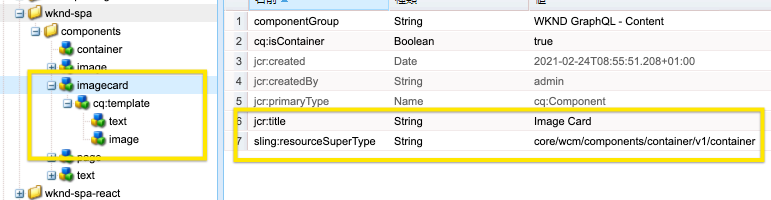

# SPA の複合コンポーネント {#composite-components-in-spas}

複合コンポーネントは、複数のベースコンポーネントを 1 つのコンポーネントに組み合わせることで、AEM コンポーネントのモジュラー性を活用します。一般的な複合コンポーネントの使用例は、画像コンポーネントとテキストコンポーネントの組み合わせで構成されるカードコンポーネントです。

複合コンポーネントが AEM 単一ページアプリケーション（SPA）エディターフレームワーク内で適切に実装されている場合、コンテンツ作成者は、そのようなコンポーネントを他のコンポーネントと同様にドラッグ＆ドロップできる一方で、複合コンポーネントを構成する各コンポーネントを個別に編集することもできます。

この記事では、AEM SPA エディターとシームレスに連携する複合コンポーネントを、単一ページアプリケーションに追加する方法について説明します。

{{ue-over-spa}}

## ユースケース {#use-case}

この記事では、一般的なカードコンポーネントをユースケースとして使用します。カードは、多くのデジタルエクスペリエンスに共通の UI 要素で、通常は画像と関連するテキストまたはキャプションで構成されます。ある作成者は、カード全体をドラッグ＆ドロップできるようにしながら、カードの画像を個別に編集したり、関連するテキストをカスタマイズきるようにしたいと考えています。

## 前提条件 {#prerequisites}

複合コンポーネントのユースケースをサポートするモデルには、次の前提条件があります。

* AEM 開発インスタンスは、サンプルプロジェクトを使用して、ポート 4502 上でローカルに実行されている。
* [AEM で編集可能な](editing-external-spa.md)、動作する外部 React アプリがある。
* React アプリは、[RemotePage コンポーネントを使用](remote-page.md)して AEM エディターに読み込まれている。

## 複合コンポーネントを SPA に追加する {#adding-composite-components}

AEM 内の SPA 実装に応じて、複合コンポーネントを実装するためのモデルは 3 つあります。

* [コンポーネントが AEM プロジェクトに存在しない](#component-does-not-exist)。
* [コンポーネントは AEM プロジェクトに存在するが、必要なコンテンツが存在しない](#content-does-not-exist)。
* [コンポーネントと必要なコンテンツが両方とも AEM プロジェクトに存在する](#both-exist)。

次の節では、カードコンポーネントを使用して各ケースを実装する例を示します。

### コンポーネントが AEM プロジェクトに存在しない。 {#component-does-not-exist}

まず、合成コンポーネントを構成するコンポーネント（画像コンポーネントとテキストコンポーネント）を作成します。

1. AEM プロジェクトにテキストコンポーネントを作成します。
1. 対応する `resourceType` をコンポーネントの `editConfig` ノードのプロジェクトから追加します。

   ```text
    resourceType: 'wknd-spa/components/text' 
   ```

1. `withMappable` ヘルパーを使用して、コンポーネントの編集を有効にします。

   ```text
   export const AEMText = withMappable(Text, TextEditConfig); 
   ```

テキストコンポーネントは次のようになります。

```javascript
import React from 'react';
import { withMappable } from '@adobe/aem-react-editable-components';

export const TextEditConfig = {
  emptyLabel: 'Text',
  isEmpty: function(props) {
    return !props || !props.text || props.text.trim().length < 1;
  },
  resourceType: 'wknd-spa/components/text'
};

export const Text = ({ cqPath, richText, text }) => {
  const richTextContent = () => (
    <div className="aem_text"
      id={cqPath.substr(cqPath.lastIndexOf('/') + 1)}
      data-rte-editelement
      dangerouslySetInnerHTML={{__html: text}} />
  );
  return richText ? richTextContent() : (
     <div className="aem_text">{text}</div>
  );
};

export const AEMText = withMappable(Text, TextEditConfig);
```

同様の方法で画像コンポーネントを作成したら、画像コンポーネントとテキストコンポーネントを子として使用し、`AEMText` コンポーネントと組み合わせて新しいカードコンポーネントにすることができます。

```javascript
import React from 'react';
import { AEMText } from './AEMText';
import { AEMImage } from './AEMImage';

export const AEMCard = ({ pagePath, itemPath}) => (
  <div>
    <AEMText
       pagePath={pagePath}
       itemPath={`text`} />
    <AEMImage
       pagePath={pagePath}
       itemPath={`image`} />
   </div>
);
```

この合成コンポーネントは、アプリ内の任意の場所に配置でき、SPA エディターでテキストと画像コンポーネントのプレースホルダーが追加されます。以下のサンプルでは、カードコンポーネントがタイトルの下のホームコンポーネントに追加されています。

```javascript
function Home() {
  return (
    <div className="Home">
      <h2>Current Adventures</h2>
      <AEMCard
        pagePath='/content/wknd-spa/home' />
    </div>
  );
}
```

これにより、エディターでテキストと画像の空のプレースホルダーが表示されます。エディターを使用してこれらの値を入力すると、指定されたページパス（ルートレベルの `/content/wknd-spa/home`）に、`itemPath` で指定された名前で格納されます。


### コンポーネントは AEM プロジェクトに存在するが、必要なコンテンツが存在しない。 {#content-does-not-exist}

この場合、カードコンポーネントは、タイトルと画像ノードを含む AEM プロジェクトに作成済みです。子ノード（テキストと画像）は、対応するリソースタイプを持っています。



次に、それを SPA に追加して、そのコンテンツを取得します。

1. これに対応するコンポーネントを SPA に作成します。子コンポーネントが、SPA プロジェクト内の対応する AEM リソースタイプにマッピングされていることを確認します。この例では、[前のケース](#component-does-not-exist)で説明したのと同じ `AEMText` コンポーネントと `AEMImage` コンポーネントを使用します。

   ```javascript
   import React from 'react';
   import { Container, withMappable, MapTo } from '@adobe/aem-react-editable-components';
   import { Text, TextEditConfig } from './AEMText';
   import Image, { ImageEditConfig } from './AEMImage';
   
   export const AEMCard = withMappable(Container, {
     resourceType: 'wknd-spa/components/imagecard'
   });
   
   MapTo('wknd-spa/components/text')(Text, TextEditConfig);
   MapTo('wknd-spa/components/image')(Image, ImageEditConfig);
   ```

1. `imagecard` コンポーネントにはコンテンツがないので、ページにカードを追加します。AEM の既存のコンテナを SPA に含めます。
   * AEM プロジェクトに既にコンテナが存在する場合は、SPA にコンテナを含め、AEM からコンテナにコンポーネントを追加できます。
   * カードコンポーネントが、SPA の対応するリソースタイプにマッピングされていることを確認します。

   ```javascript
   <ResponsiveGrid
    pagePath='/content/wknd-spa/home'
    itemPath='root/responsivegrid' />
   ```

1. 作成した `wknd-spa/components/imagecard` コンポーネントを、[ページテンプレート](/help/sites-cloud/authoring/page-editor/templates.md)内のコンテナコンポーネントに使用できるコンポーネントに追加します。

これで、`imagecard` コンポーネントを AEM エディターでコンテナに直接追加できます。


### コンポーネントと必要なコンテンツが両方とも AEM プロジェクトに存在する。 {#both-exist}

コンテンツが AEM に存在する場合は、コンテンツへのパスを指定して、SPA に直接含めることができます。

```javascript
<AEMCard
    pagePath='/content/wknd-spa/home'
    itemPath='root/responsivegrid/imagecard' />
```


`AEMCard` コンポーネントは、[前のユースケース](#content-does-not-exist)で定義したものと同じです。ここでは、AEM プロジェクトの上記の場所で定義されたコンテンツが SPA に含まれています。
