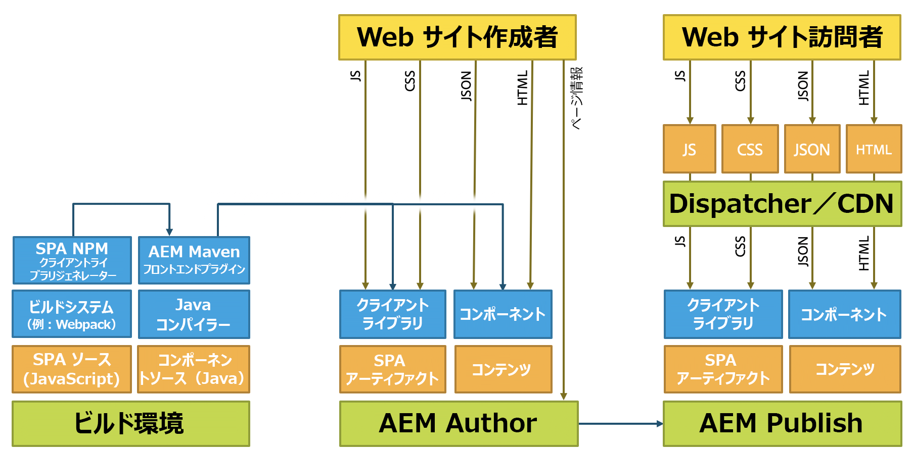

# AEM 向け SPA の開発 {#developing-spas-for-aem}

単一ページアプリケーション（SPA）により、Web サイトのユーザーに魅力的なエクスペリエンスを提供することができます。開発者はSPAフレームワークを使用してサイトを構築できるようにしたいと考え、作成者は、そのようなフレームワークを使用して構築されたサイトのコンテンツをAEM内でシームレスに編集したいと考えています。

この記事では、フロントエンド開発者がAEM向けのSPAを開発する際に考慮すべき重要な質問を紹介し、AEMへのSPAのデプロイに関するAEMのアーキテクチャの概要を説明します。

## AEM 向け SPA 開発原則 {#spa-development-principles-for-aem}

AEM で単一ページアプリケーションを開発する場合、フロントエンド開発者は SPA を作成する際に標準的なベストプラクティスを順守するものと想定します。次の一般的なベストプラクティスとAEM固有の原則に従うフロントエンド開発者は、SPAを使用して機能します。 [AEMとそのコンテンツオーサリング機能](introduction.md#content-editing-experience-with-spa).

* **[移動可能](#portability)** - その他のあらゆるコンポーネントと同様に、コンポーネントは可能な限り移動可能な状態で構築する必要があります。SPA は、移動可能で再利用可能なコンポーネントを使用して構築する必要があります。
* **[AEM Drives サイト構造](#aem-drives-site-structure)**  — フロントエンド開発者はコンポーネントを作成し、内部構造を所有しますが、AEMを利用してサイトのコンテンツ構造を定義します。
* **[動的レンダリング](#dynamic-rendering)** - すべてのレンダリングは動的である必要があります。
* **[動的ルーティング](#dynamic-routing)** - SPA がルーティングを担当し、AEM がリッスンしてそれに基づいて取得します。どのルーティングも動的である必要があります。

SPAの開発時にこれらの原則を念頭に置いておくと、サポートされるすべてのAEMオーサリング機能を有効にしながら、できる限り柔軟かつ将来の証拠になります。

AEMオーサリング機能をサポートする必要がない場合は、 [SPAデザインモデル](#spa-design-models).

### 移植性 {#portability}

その他のあらゆるコンポーネントを開発する場合と同様に、コンポーネントの移植性を最大限に高めるように設計する必要があります。互換性、柔軟性、保守性を今後も保証するために、コンポーネントの移植性や再利用性に反するパターンは避ける必要があります。

作成する SPA は、移植性が高く、再利用可能なコンポーネントを使用して構築する必要があります。

### AEM を主軸にしたサイト構築 {#aem-drives-site-structure}

フロントエンド開発者は、アプリの構築に使用されるSPAコンポーネントのライブラリの作成を自分たちが担当していると考える必要があります。 フロントエンド開発者は、コンポーネントの内部構造を完全に制御できます。 [ただし、AEMは常にサイトの構造を所有しています](editor-overview.md).

この制御は、フロントエンド開発者がコンポーネントのエントリポイントの前後に顧客コンテンツを追加できることと、コンポーネント内でサードパーティ呼び出しをおこなうこともできることを意味します。 ただし、フロントエンド開発者は、例えばコンポーネントのネスト方法を完全に制御するわけではありません。

### 動的レンダリング {#dynamic-rendering}

SPA では、コンテンツの動的レンダリングのみに依存する必要があります。AEMがコンテンツ構造のすべての子を取得してレンダリングするデフォルトは、この点に留意してください。

特定のコンテンツを指す明示的なレンダリングは、静的レンダリングと見なされ、サポートされていますが、AEMコンテンツオーサリング機能との互換性があります。 また、～の原理に反する [移植性](#portability).

### 動的ルーティング {#dynamic-routing}

レンダリングと同様に、すべてのルーティングも動的である必要があります。AEM では、[SPA が常にルーティングを所有](routing.md)し、AEM がリッスンしてそれに基づいてコンテンツを取得します。

静的なルーティングは[移植性の原則](#portability)に反し、AEM のコンテンツオーサリング機能との互換性がないことから、作成者を制限することになります。例えば、静的ルーティングの場合、コンテンツ作成者がルートの変更やページの変更を希望する場合は、フロントエンド開発者に依頼する必要があります。

## AEM プロジェクトアーキタイプ {#aem-project-archetype}

任意のAEMプロジェクトでは、 [AEM Project Archetype](https://experienceleague.adobe.com/docs/experience-manager-core-components/using/developing/archetype/overview.html?lang=ja):React またはAngularを使用したSPAプロジェクトをサポートし、SPA SDK を使用します。

## SPA デザインモデル {#spa-design-models}

この [AEMでのSPA開発の原則](#spa-development-principles-for-aem) その後、SPAは、サポートされるすべてのAEMコンテンツオーサリング機能と共に機能します。

ただし、この機能が完全に必要でない場合もあります。 次の表に、様々なデザインモデルの長所と短所の概要を示します。

<table>
 <tbody>
  <tr>
   <th><strong>設計モデル  </strong></th>
   <th><strong>メリット</strong></th>
   <th><strong>デメリット</strong></th>
  </tr>
  <tr>
   <td>AEM は、<a href="/help/implementing/developing/hybrid/reference-materials.md">SPA エディター SDK フレームワークを使用せずにヘッドレスな CMS として使用されます。</a></td>
   <td>フロントエンド開発者は、アプリを完全に制御できます。</td>
   <td>
コンテンツ作成者は、AEMコンテンツオーサリングエクスペリエンスを使用できません。
 
コードに静的な参照またはルーティングが含まれる場合、移動や再利用はできません。
 
テンプレートエディターの使用を許可しないので、フロントエンド開発者は JCR を介して編集可能なテンプレートを維持する必要があります。
 </td>
  </tr>
  <tr>
   <td>フロントエンド開発者はSPA Editor SDK フレームワークを使用しますが、コンテンツ作成者に対して一部の領域のみを開きます。</td>
   <td>開発者は、アプリの制限された領域でのみオーサリングを有効にすることで、アプリを管理し続けます。</td>
   <td>
コンテンツ作成者は、AEM コンテンツオーサリングエクスペリエンスの限られたセットに制限されます。
 
コードに静的な参照またはルーティングが含まれる場合、移動や再利用ができないリスクがあります。
 
テンプレートエディターの使用を許可しないので、フロントエンド開発者は JCR を介して編集可能なテンプレートを維持する必要があります。
 </td>
  </tr>
  <tr>
   <td>プロジェクトはSPA Editor SDK を完全に使用し、フロントエンドコンポーネントはライブラリとして開発され、アプリのコンテンツ構造はAEMに委任されます。</td>
   <td>
アプリは再利用可能で移動可能です。
 
コンテンツ作成者は、AEM コンテンツオーサリングエクスペリエンスを使用してアプリを編集できます。  
 
SPA は、テンプレートエディターと互換性があります。
 </td>
   <td>
開発者は、アプリの構造と AEM に委任されたコンテンツを管理できません。
 
ただし、開発者は、AEM で作成する予定ではないコンテンツ用にアプリの領域を予約できます。
 </td>
  </tr>
 </tbody>
</table>

>[!NOTE]
>
>AEMではすべてのモデルがサポートされていますが、3 番目のモデルを実装する ( および推奨される [SPA開発原則](#spa-development-principles-for-aem)) は、AEMのSPAのコンテンツを操作および編集できるコンテンツ作成者です。

## 既存の SPA から AEM への移行 {#migrating-existing-spas-to-aem}

通常、SPAが [AEMのSPA開発原則](#spa-development-principles-for-aem)その場合、SPAはAEMで動作し、AEM SPAエディターを使用して編集できます。

既存のSPAをAEMで使用する準備を整えるには、次の手順に従います。

1. **JS コンポーネントをモジュラー化します。**  — 任意の順序、位置、サイズでレンダリングできるようにします。
1. **SDK が提供するコンテナを使用して、コンポーネントを画面に配置します。** - AEM は、使用するページと段落のシステムコンポーネントを提供します。
1. **各 JS コンポーネントに AEM コンポーネントを作成します。** - AEMコンポーネントは、ダイアログボックスと JSON 出力を定義します。

## フロントエンド開発者向けの説明 {#instructions-for-front-end-developers}

フロントエンド開発者が AEM 用の SPA を作成する際の主な役割は、コンポーネントとその JSON モデルについて合意することです。

SPA for AEMを開発する際にフロントエンド開発者が従う必要のある手順の概要を次に示します。

1. **コンポーネントと JSON モデルに合意する**

   フロントエンド開発者とバックエンドAEM開発者は、必要なコンポーネントとモデルについて合意し、SPAコンポーネントからバックエンドコンポーネントに 1 対 1 で一致させる必要があります。

   AEM コンポーネントは、主に編集ダイアログを提供し、コンポーネントモデルを書き出すためにも必要です。

1. **React コンポーネントでは、`this.props.cqModel`** を介してアクセスする

   コンポーネントについて合意が取れ、JSON モデルが設定されると、フロントエンド開発者は SPA を自由に開発でき、`this.props.cqModel` を介して JSON モデルに簡単にアクセスできます。

1. **コンポーネントの `render()` メソッド**

   フロントエンド開発者は、自由に `render()` メソッドを実装し、`cqModel` プロパティのフィールドを使用できます。このメソッドは、DOM と、ページに挿入されたHTMLフラグメントを出力します。 また、この方法は、React でアプリを作成する標準的な方法でもあります。

1. **`MapTo()`** を使用してコンポーネントを AEM リソースタイプにマッピングする

   マッピングはコンポーネントクラスを格納し、`Container` コンポーネントによって内部的に使用され、提供されたリソースタイプに基づいてコンポーネントを取得して動的にインスタンス化します。

   このマップは、フロントエンドとバックエンドの間の「接着剤」の役割を果たすので、エディターは、React コンポーネントがどのコンポーネントに対応するかを把握できます。

   `Page` と `ResponsiveGrid` は、基本 `Container` を拡張するクラスの好例です。

1. **コンポーネントの `EditConfig` のパラメータとして`MapTo()`**

   このパラメーターは、コンポーネントがまだレンダリングされていないか、レンダリングするコンテンツがない場合に、コンポーネントの名前をどのように付けるかをエディターに指示するために必要です。

1. **ページとコンテナに提供されている `Container` クラスを拡張する**

   ページと段落システムは、内部コンポーネントへの委任が期待どおりに機能するように、このクラスを拡張する必要があります。

1. **HTML5 `History` API を使用したルーティングソリューションを実装する。**

   次の場合に `ModelRouter` が有効な場合、 `pushState` および `replaceState` 関数トリガーリクエストを `PageModelManager` をクリックして、モデルの欠落しているフラグメントを取得します。

   の現在のバージョン `ModelRouter` は、Sling Model エントリポイントの実際のリソースパスを指す URL のみを使用できます。 バニティー URL やエイリアスの使用はサポートされていません。

   `ModelRouter` は、無効にしたり、正規表現のリストを無視するように設定したりできます。

## AEM 非依存 {#aem-agnostic}

これらのコードブロックは、React および Angular コンポーネントが、Adobe や AEM に固有のものを必要としていないことを示してします。

* JavaScript コンポーネント内にあるものはすべて、AEM 非依存です。
* ただし、AEMに固有の点は、JS コンポーネントを MapTo ヘルパーを使用してAEMコンポーネントにマッピングする必要がある点です。

`MapTo` ヘルパーは、バックエンドとフロントエンドのコンポーネントを一致させる「接着剤」です。

* これは、JS コンテナ（または JS 段落システム）に、JSON に存在する各コンポーネントのレンダリングは、どの JS コンポーネントが関与するのかを伝えるものです。
* JS コンポーネントでレンダリングされる HTML に HTML データ属性が追加されるので、SPA エディターは、コンポーネントの編集時に作成者に表示するダイアログボックスを把握できます。

`MapTo` の使用法と AEM 向け SPA の構築の概要について詳しくは、選択したフレームワークの概要を参照してください。

* [React を使用した AEM での SPA の概要](getting-started-react.md)
* [Angular を使用した AEM での SPA の概要](getting-started-angular.md)

## AEM のアーキテクチャと SPA {#aem-architecture-and-spas}

開発、オーサリング、公開環境を含む AEM の一般的なアーキテクチャは、SPA を使用する場合でも変更されません。ただし、SPA 開発がこのアーキテクチャにどのように適合しているかを理解することに役立ちます。

* **ビルド環境**

  この環境では、SPAアプリケーションおよびコンポーネントソースのソースがチェックアウトされます。

   * NPM clientlib ジェネレーターは、SPA プロジェクトからクライアントライブラリを作成します。
   * このライブラリは Maven によって取得され、AEM オーサーのコンポーネントと共に、Maven Build プラグインによってデプロイされます。

* **AEM オーサー**

  コンテンツは、AEM オーサー（オーサリング SPA を含む）で作成されます。

  オーサリング環境で SPA エディターを使用して SPA を編集する場合の流れは次の通りです。

   1. SPA は外部の HTML をリクエストします。
   1. CSS が読み込まれます。
   1. SPAアプリケーションの JavaScript が読み込まれます。
   1. SPA アプリケーションを実行すると、JSON がリクエストされ、アプリが `cq-data` 属性を含むページの DOM を構築できるようになります。
   1. この `cq-data` 属性を使用すると、エディターが追加のページ情報を読み込んで、コンポーネントで使用できる編集設定を把握できるようになります。

* **AEM パブリッシュ**

  SPAアプリケーションアーティファクト、クライアントライブラリ、コンポーネントを含むオーサリング済みコンテンツおよびコンパイル済みライブラリが、一般向けに公開される場所。

* **Dispatcher／CDN**

  Dispatcher は、サイトへの訪問者のAEMのキャッシュレイヤーとして機能します。
   * リクエストは、AEM オーサーでの処理と同様に処理されます。 ただし、ページ情報はエディターでのみ必要なので、要求はありません。
   * JavaScript、CSS、JSON およびHTMLがキャッシュされ、配信が高速になるようにページが最適化されます。

>[!NOTE]
>
>AEM内では、JavaScript のビルドメカニズムを実行したり、JavaScript 自体を実行したりする必要はありません。 AEM は、SPA アプリケーションからコンパイルされたアーティファクトのみをホストします。

## 次の手順 {#next-steps}

* [React を使用した AEM での SPA の概要](getting-started-react.md)では、SPA エディターで動作する基本的な SPA の構築方法を示しています。
* 「[Angular を使用した AEM での SPA の使用の手引き ](getting-started-angular.md)」は、Angular を使用して SPA エディターで動作する基本 SPA を構築する方法を示します。
* 「[SPA エディターの概要](editor-overview.md)」では、AEM と SPA 間の通信モデルをより深く分析しています。
* [WKND SPA プロジェクト](wknd-tutorial.md)は、AEM で簡単な SPA プロジェクトを実装するための、手順を追ったチュートリアルです。
* [SPA の動的モデルからコンポーネントへのマッピング](model-to-component-mapping.md)では、動的モデルとコンポーネントのマッピング、および AEM の SPA 内での動作方法について説明しています。
* [SPA Blueprint](blueprint.md) は、AEMで React やAngular以外のフレームワーク用にSPAを実装する場合に、AEM用SPA SDK の仕組みについて詳しく説明します。 または、単により深い理解を望むだけです。
