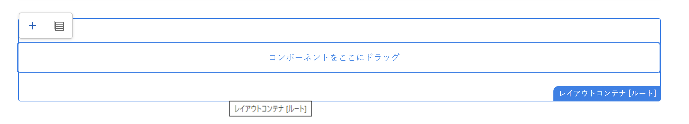
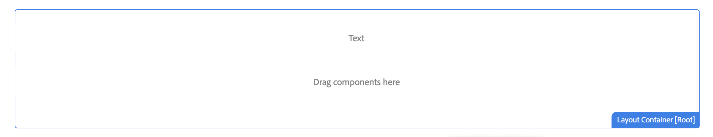

# AEM 内での外部 SPA の編集 {#editing-external-spa-within-aem}

決定時 [統合のレベル](/help/implementing/developing/headful-headless.md) 外部SPAとAEMの間にを配置する場合は、AEM内でSPAを編集および表示できる必要があると考えます。

## 概要 {#overview}

このドキュメントでは、スタンドアロン SPA を AEM インスタンスにアップロードし、編集可能なコンテンツのセクションを追加し、オーサリングを有効にするための推奨手順について説明します。

## 前提条件 {#prerequisites}

前提条件はシンプルです。

* AEMのインスタンスがローカルで実行されていることを確認します。
* を使用して基本AEM SPAプロジェクトを作成する [AEMプロジェクトアーキタイプ](https://experienceleague.adobe.com/docs/experience-manager-core-components/using/developing/archetype/overview.html?lang=ja?#available-properties).
   * FormsはAEMプロジェクトの基盤を更新し、外部SPAを含めます。
   * このドキュメントのサンプルの場合、Adobeは [WKND SPAプロジェクト](https://experienceleague.adobe.com/docs/experience-manager-learn/sites/spa-editor/spa-editor-framework-feature-video-use.html?lang=ja#spa-editor).
* 統合したい外部の React SPA を用意します。

## SPA を AEM プロジェクトにアップロードする {#upload-spa-to-aem-project}

まず、外部SPAをAEMプロジェクトにアップロードする必要があります。

1. `/ui.frontend` プロジェクトフォルダー内の `src` を、React アプリケーションの `src` フォルダーに置き換えます。
1. アプリの `package.json` に追加の依存関係があれば `/ui.frontend/package.json` に含めます。
   * SPA SDK の依存関係が [推奨バージョン](/help/implementing/developing/hybrid/getting-started-react.md#dependencies).
1. `/public` フォルダーにカスタマイズを含めます。
1. 追加されたインラインスクリプトまたはスタイルをすべて `/public/index.html` ファイルに含めます。

## リモート SPA を設定する {#configure-remote-spa}

外部SPAがAEMプロジェクトに含まれるようになったので、AEM内で設定する必要があります。

### Adobe SPA SDK パッケージを含める {#include-spa-sdk-packages}

AEM SPA 機能の利用は、次の 3 つのパッケージに依存しています。

* [`@adobe/aem-react-editable-components`](https://github.com/adobe/aem-react-editable-components)
* [`@adobe/aem-spa-component-mapping`](https://www.npmjs.com/package/@adobe/aem-spa-component-mapping)
* [`@adobe/aem-spa-page-model-manager`](https://www.npmjs.com/login?next=/package/@adobe/aem-spa-model-manager)

The `@adobe/aem-spa-page-model-manager` パッケージには、Model Manager を初期化し、AEMインスタンスからモデルを取得するための API が用意されています。 その後、このモデルを使用して、`@adobe/aem-react-editable-components` と `@adobe/aem-spa-component-mapping` の API を使用して AEM コンポーネントをレンダリングできます。

#### インストール {#installation}

次を実行します。 `npm` コマンドを使用して、必要なパッケージをインストールできます。

```shell
npm install --save @adobe/aem-spa-component-mapping @adobe/aem-spa-page-model-manager @adobe/aem-react-editable-components
```

### ModelManager の初期化 {#model-manager-initialization}

アプリがレンダリングされる前に、 [`ModelManager`](/help/implementing/developing/hybrid/blueprint.md#pagemodelmanager) AEMの作成を処理するには初期化する必要があります `ModelStore`.

この初期化は、 `src/index.js` ファイルに含める必要があります。

この初期化を行うには、 `initializationAsync` で提供される API `ModelManager`.

次のスクリーンショットは、単純な React アプリケーションで `ModelManager` の初期化を有効にする方法を示しています。唯一の制約は `initializationAsync` は、の前に呼び出す必要があります `ReactDOM.render()`.


この例では、`ModelManager` が初期化され、空の `ModelStore` が作成されます。

The `initializationAsync` 必要に応じて、を受け入れることができます。 `options` オブジェクトを次のパラメーターとして指定します。

* `path` - 初期化時に、定義されたパスのモデルが取得され、`ModelStore` に保存されます。このパスは、 `rootModel` 必要に応じて、初期化時に。
* `modelClient` - モデルの取得を担当するカスタムクライアントを提供できます。
* `model` - A `model` 通常、 [SSR の使用](/help/implementing/developing/hybrid/ssr.md).

### AEM 認証可能なリーフコンポーネント {#authorable-leaf-components}

1. オーサリング可能な React コンポーネントを作成するAEMコンポーネントを作成または識別します。 この例では、WKND プロジェクトのテキストコンポーネントを使用しています。

   

1. SPA で単純な React テキストコンポーネントを作成します。この例では、次の内容の新しいファイル `Text.js` が作成されています。

   

1. 設定オブジェクトを作成して、AEMの編集を有効にするために必要な属性を指定できます。

   

   * `resourceType` は、React コンポーネントをAEMコンポーネントにマッピングし、AEM Editor で開く際に編集を有効にするために必須です。

1. ラッパー関数 `withMappable` を使用します。

   

   このラッパー関数は、React コンポーネントをAEMにマッピングします。 `resourceType` 設定で指定され、AEMエディターで開いたときに編集機能を有効にします。 スタンドアロンコンポーネントの場合は、特定のノードのモデルコンテンツも取得します。

   >[!NOTE]
   >
   >この例では、AEMのラップされた React コンポーネントとアンラップされた React コンポーネントの 2 つのバージョンが、コンポーネントに別々に存在します。 コンポーネントを明示的に使用する場合は、ラップされたバージョンを使用する必要があります。 コンポーネントがページの一部になっている場合は、SPA エディターで現在行われているように、デフォルトのコンポーネントを引き続き使用することができます。

1. コンポーネント内のコンテンツをレンダリングします。

   テキストコンポーネントの JCR プロパティは、AEM では次のように表示されます。

   

   これらの値は、新しく作成された `AEMText` React コンポーネントにプロパティとして渡され、コンテンツのレンダリングに使用できます。

   ```javascript
   import React from 'react';
   import { withMappable } from '@adobe/aem-react-editable-components';
   
   export const TextEditConfig = {
       // Empty component placeholder label
       emptyLabel:'Text', 
       isEmpty:function(props) {
          return !props || !props.text || props.text.trim().length < 1;
       },
       // resourcetype of the AEM counterpart component
       resourceType:'wknd-spa-react/components/text'
   };
   
   const Text = ({ text }) => (<div>{text}</div>);
   
   export default Text;
   
   export const AEMText = withMappable(Text, TextEditConfig);
   ```

   AEMの設定が完了すると、次のようにコンポーネントが表示されます。

   ```javascript
   const Text = ({ cqPath, richText, text }) => {
      const richTextContent = () => (
         <div className="aem_text" id={cqPath.substr(cqPath.lastIndexOf('/') + 1)} data-rte-editelement dangerouslySetInnerHTML={{__html: text}}/>
      );
      return richText ? richTextContent() : (<div className="aem_text">{text}</div>);
   };
   ```

   >[!NOTE]
   >
   >この例では、既存のテキストコンポーネントに合わせて、レンダリングされたコンポーネントをさらにカスタマイズしています。 AEMでのオーサリングとは関係ありません。

#### 認証可能コンポーネントをページに追加する {#add-authorable-component-to-page}

オーサリング可能な React コンポーネントを作成したら、アプリケーション全体で使用できます。

WKND SPAプロジェクトからテキストを追加する必要がある場合の例を見てみましょう。 この例では、「Hello World!」というテキストを表示します。 `/content/wknd-spa-react/us/en/home.html` に表示します。

1. 表示するノードのパスを指定します。

   * `pagePath`：ノードを含むページ（この例では） `/content/wknd-spa-react/us/en/home`
   * `itemPath`：ページ内のノードのパス（この例では） `root/responsivegrid/text`
      * ページ上の含まれる項目の名前で構成されます。

   

1. コンポーネントをページ内の必要な位置に追加します。

   

   `AEMText`コンポーネントは、`pagePath` 値と `itemPath` 値をプロパティとして設定して、ページ内の必要な位置に追加できます。`pagePath` は必須プロパティです。

#### AEM でのテキストコンテンツの編集の確認 {#verify-text-edit}

次に、実行中のAEMインスタンスでコンポーネントをテストします。

1. 次の Maven コマンドを `aem-guides-wknd-spa` プロジェクトを構築してAEMにデプロイできるディレクトリ。

```shell
mvn clean install -PautoInstallSinglePackage
```

1. AEM インスタンスで、`http://<host>:<port>/editor.html/content/wknd-spa-react/us/en/home.html`に移動します。


`AEMText` コンポーネントが、AEM 上で認証できるようになりました。

### AEM 認証可能なページ {#aem-authorable-pages}

1. SPA でのオーサリング用に追加するページを指定します。この例では `/content/wknd-spa-react/us/en/home.html` を使用しています。
1. ファイルを作成します ( 例： `Page.js`) をクリックします。 で提供されるページコンポーネントを使用します。 `@adobe/cq-react-editable-components`.
1. セクションで手順 4 を繰り返します。 [AEMオーサリング可能なリーフコンポーネント](#authorable-leaf-components).  コンポーネントで `withMappable` ラッパー関数を使用します。
1. 前に行ったように、ページ内のすべての子コンポーネントの AEM リソースタイプに `MapTo` を適用します。

   ```javascript
   import { Page, MapTo, withMappable } from '@adobe/aem-react-editable-components';
   import Text, { TextEditConfig } from './Text';
   
   export default withMappable(Page);
   
   MapTo('wknd-spa-react/components/text')(Text, TextEditConfig);
   ```

   >[!NOTE]
   >
   >この例では、ラップされた React テキストの代わりに、ラップされていない React テキストコンポーネントが使用されます `AEMText` 作成済み。 これは、コンポーネントがページ/コンテナの一部で、単独ではない場合、コンテナはコンポーネントの再帰的なマッピングを処理するからです。 また、オーサリング機能を有効にしたり、追加のラッパーを子ごとに使用する必要はありません。

1. SPAにオーサリング可能なページを追加するには、「 」セクションの同じ手順に従います。 [オーサリング可能なコンポーネントをページに追加する](#add-authorable-component-to-page). ここでは、 `itemPath` プロパティ。

#### AEM でのページコンテンツの確認 {#verify-page-content}

ページが編集できることを確認するには、「 」セクションの同じ手順に従います [AEMでのテキストコンテンツの編集の検証](#verify-text-edit).


レイアウトコンテナと子テキストコンポーネントを持つ AEM でページを編集できるようになりました。

### 仮想リーフコンポーネント {#virtual-leaf-components}

前の例では、既存のAEMコンテンツを含むSPAにコンポーネントを追加しました。 ただし、AEMでコンテンツをまだ作成していないのに、後でコンテンツ作成者が追加する必要がある場合もあります。 このシナリオに対応するために、フロントエンド開発者はSPA内の適切な場所にコンポーネントを追加できます。 これらのコンポーネントは、AEMのエディターで開くとプレースホルダーを表示します。 コンテンツ作成者がこれらのプレースホルダー内にコンテンツを追加すると、ノードが JCR 構造内に作成され、コンテンツが保持されます。 作成したコンポーネントは、スタンドアロンのリーフコンポーネントと同じ操作のセットを許可します。

この例では、 `AEMText` 以前に作成されたコンポーネント。 WKND ホームページ上の既存のテキストコンポーネントの下に新しいテキストを追加する場合。 コンポーネントの追加は、通常のリーフコンポーネントの場合と同じです。ただし、 `itemPath` は、新しいコンポーネントを追加する必要があるパスに更新できます。

新しいコンポーネントは既存のテキストの下に追加する必要があるので、 `root/responsivegrid/text`に設定した場合、新しいパスは `root/responsivegrid/{itemName}`.

```html
<AEMText
 pagePath='/content/wknd-spa-react/us/en/home'
 itemPath='root/responsivegrid/text_20' />
```

`TestPage` コンポーネントは、仮想コンポーネントを追加すると次のようになります。


>[!NOTE]
>
>次を確認します。 `AEMText` コンポーネントには、 `resourceType` を設定して、この機能を有効にできます。

これで、「 」セクションの手順に従って、AEMに変更をデプロイできます。 [AEMでのテキストコンテンツの編集の検証](#verify-text-edit). 現在存在しないプレースホルダーが表示されます `text_20` ノード。


コンテンツ作成者がこのコンポーネントを更新すると、新しい `text_20` ノードが `/content/wknd-spa-react/us/en/home` の `root/responsivegrid/text_20` に作成されます。


#### 要件と制限 {#limitations}

仮想リーフコンポーネントを追加するには、いくつかの要件といくつかの制限があります。

* `pagePath` プロパティは、仮想コンポーネントを作成する場合に必須です。
* `pagePath` のパスに指定されたページノードは、AEM プロジェクト内に存在する必要があります。
* 作成するノードの名前は、`itemPath` で指定する必要があります。
* コンポーネントは任意のレベルで作成できます。
   * 次の項目を指定した場合、 `itemPath='text_20'` 前の例では、新しいノードはページの直下 ( つまり、 `/content/wknd-spa-react/us/en/home/jcr:content/text_20`
* 新しいノードが作成されるノードへのパスは、`itemPath` 経由で提供された場合に有効である必要があります。
   * この例では、新しいノード `text_20` を作成できるように、`root/responsivegrid` が存在する必要があります。
* リーフコンポーネントの作成のみがサポートされます。仮想コンテナと仮想ページは、今後のバージョンでサポートされる予定です。

### 仮想コンテナ {#virtual-containers}

対応するコンテナが AEM に作成されていない場合でも、コンテナを追加する機能はサポートされます。概念とアプローチは、 [仮想リーフコンポーネント](#virtual-leaf-components).

フロントエンド開発者は、SPA内の適切な場所にコンテナコンポーネントを追加でき、これらのコンポーネントをAEMのエディターで開くと、プレースホルダーが表示されます。 作成者は、必要なノードを JCR 構造に作成するコンテナに、コンポーネントとそのコンテンツを追加できます。

例えば、次の場所にコンテナが存在する場合、 `/root/responsivegrid`で、開発者が子コンテナを追加しようとしています。


The `newContainer` は、まだAEMに存在しません。

このコンポーネントを含んだページを AEM で編集すると、コンテナの空のプレースホルダーが表示され、作成者はこのプレースホルダーにコンテンツを追加できます。




作成者がコンテナに子コンポーネントを追加すると、新しいコンテナノードが、対応する名前で JCR 構造内に作成されます。




作成者が必要に応じて、変更が保持されるので、コンポーネントとコンテンツを今すぐコンテナに追加できます。

#### 要件と制限事項 {#container-limitations}

仮想コンテナを追加する場合は、いくつかの要件といくつかの制限があります。

* 追加できるコンポーネントを決定するポリシーは、親コンテナから継承されます。
* 作成するコンテナの直近の親がAEMに存在する必要があります。
   * コンテナの場合 `root/responsivegrid` がAEMコンテナに存在する場合は、パス `root/responsivegrid/newContainer`.
   * ただし、 `root/responsivegrid/newContainer/secondNewContainer` は使用できません。
* 一度に 1 つの新しいレベルのコンポーネントのみを作成できます。

## 追加のカスタマイズ {#additional-customizations}

前の例に従った場合、外部 SPA は AEM 内で編集できるようになります。ただし、外部 SPA には、他にもカスタマイズできる要素があります。

### ルートノード ID {#root-node-id}

デフォルトでは、React アプリケーションが `div` 要素 ID の `spa-root`. 必要に応じて、この構文をカスタマイズできます。

例えば、アプリケーションがSPA内で `div` 要素 ID の `root`. この構文は、3 つのファイルに反映する必要があります。

1. React アプリケーションの `index.js` 内（または `ReactDOM.render()` が呼び出される場所）

   

1. React アプリケーションの `index.html` 内

   

1. AEM アプリケーションのページコンポーネント本体では、次の 2 つの手順に従います。

   1. の作成 `body.html` ページコンポーネント用。

   

   1. 新しい `body.html` ファイル。

   

### ルーティングを使用したリアクション SPA の編集  {#editing-react-spa-with-routing}

外部 React SPAアプリケーションに複数のページがある場合、 [ルーティングを使用して、レンダリングするページやコンポーネントを決定できます。](/help/implementing/developing/hybrid/routing.md). 基本的な使用例は、現在アクティブな URL とルートに指定されたパスを一致させることです。このようなルーティング対応アプリケーションで編集を有効にするには、AEM固有の情報に合わせて、照合対象のパスを変換する必要があります。

次の例では、2 つのページを持つ単純な React アプリケーションがあります。 レンダリングするページは、ルーターに提供されるパスとアクティブな URL とを一致させることで決定されます。例えば、 `mydomain.com/test`, `TestPage` がレンダリングされます。


この SPA の例で AEM 内での編集を有効にするには、次の手順が必要です。

1. AEM のルートとなるレベルを特定します。

   * サンプルでは、 wknd-spa-react/us/en をSPAのルートとして考えてみましょう。 このルートは、そのパスより前の部分がすべてAEMのページ/コンテンツのみであることを意味します。

1. 必要なレベルでページを作成します。

   * この例では、編集するページは `mydomain.com/test` です。`test` がアプリのルートパスにあります。このルートパスは、AEMでページを作成する際にも保持する必要があります。 したがって、前の手順で定義したルートレベルにページを作成できます。
   * 新しく作成するページは、編集するページと同じ名前にする必要があります。この例では、 `mydomain.com/test`新しく作成されたページは、 `/path/to/aem/root/test`.

1. SPA ルーティング内のヘルパーを追加します。

   * 新しく作成されたページは、AEMで期待されたコンテンツをまだレンダリングできません。 この理由は、ルータが次のパスを想定しているためです。 `/test` 一方、AEMのアクティブパスは `/wknd-spa-react/us/en/test`. URL のAEM固有の部分に対応するには、SPA側にヘルパーを追加する必要があります。

   

   * The `toAEMPath` ～が提供するヘルパー `@adobe/cq-spa-page-model-manager` を使用できます。 アプリケーションが AEM インスタンスで開かれる場合に、ルーティング用に指定されたパスを AEM 固有の部分を含めるように変換します。次のパラメーターを受け取ります。
      * ルーティングに必要なパス
      * SPA が編集される AEM インスタンスのオリジン URL
      * 最初の手順で決定した AEM のプロジェクトルート

   * これらの値は、環境変数として設定でき、より柔軟に設定できます。

1. AEM でのページの編集を確認します。

   * プロジェクトをAEMにデプロイし、新しく作成した `test` ページに貼り付けます。 これで、ページコンテンツがレンダリングされ、AEM コンポーネントが編集可能になります。

## フレームワークの制限 {#framework-limitations}

RemotePage コンポーネントは、実装がアセットマニフェストのようなアセットマニフェストを提供することを想定しています [ここにある](https://github.com/shellscape/webpack-manifest-plugin). ただし、RemotePage コンポーネントは、（remote-page-next コンポーネントを介して）React フレームワークと連携することをテストされただけなので、Angularなど他のフレームワークからのアプリケーションのリモート読み込みはサポートされていません。

## その他のリソース {#additional-resources}

AEM のコンテキストで SPA を理解するには、次の参照資料が役立ちます。

* [AEM におけるヘッドフルとヘッドレス](/help/implementing/developing/headful-headless.md)
* [AEM プロジェクトのアーキタイプ](https://experienceleague.adobe.com/docs/experience-manager-core-components/using/developing/archetype/overview.html?lang=ja)
* [WKND SPA プロジェクト](https://experienceleague.adobe.com/docs/experience-manager-learn/sites/spa-editor/spa-editor-framework-feature-video-use.html?lang=ja)
* [React を使用した AEM での SPA の概要](/help/implementing/developing/hybrid/getting-started-react.md)
* [SPA リファレンス資料（API リファレンス）](/help/implementing/developing/hybrid/reference-materials.md)
* [SPA 青写真と PageModelManager](/help/implementing/developing/hybrid/blueprint.md#pagemodelmanager)
* [SPA モデルルーティング](/help/implementing/developing/hybrid/routing.md)
* [SPA およびサーバーサイドレンダリング ](/help/implementing/developing/hybrid/ssr.md)
