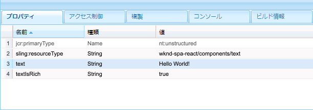
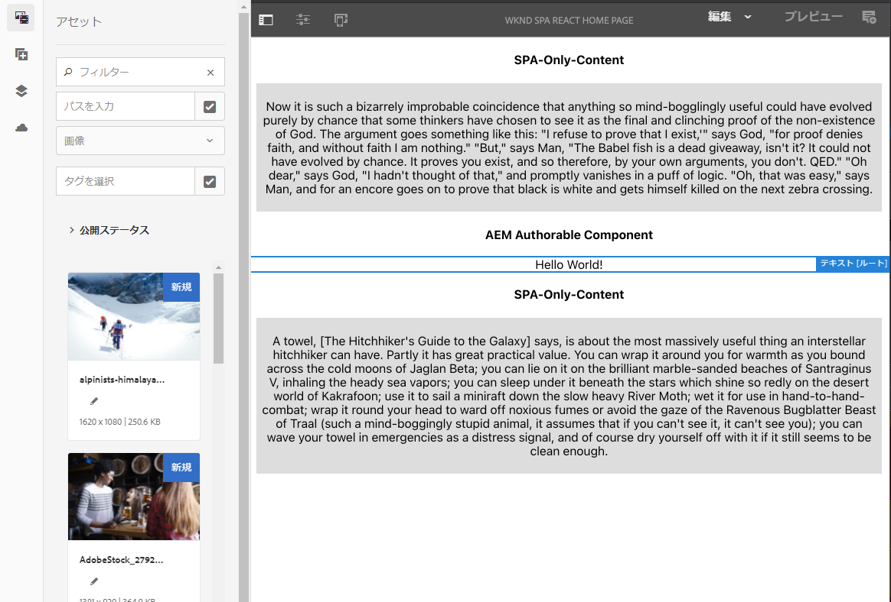
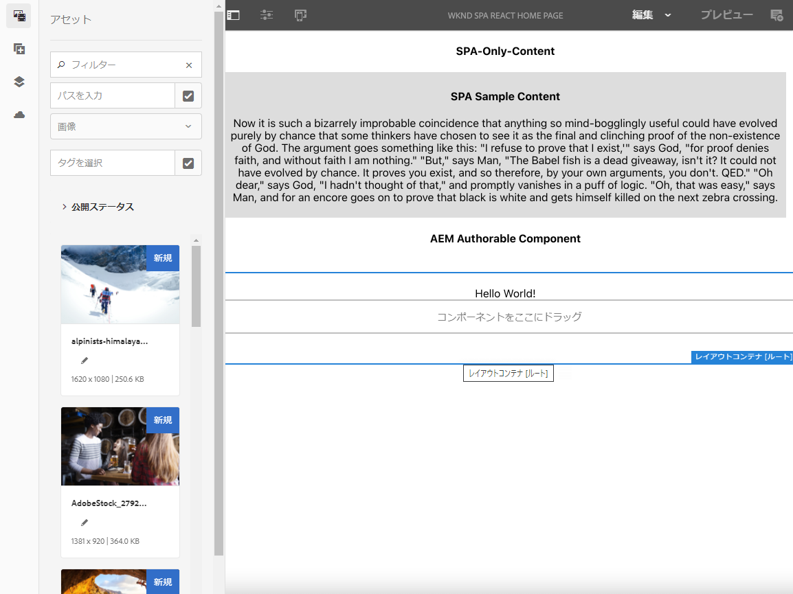
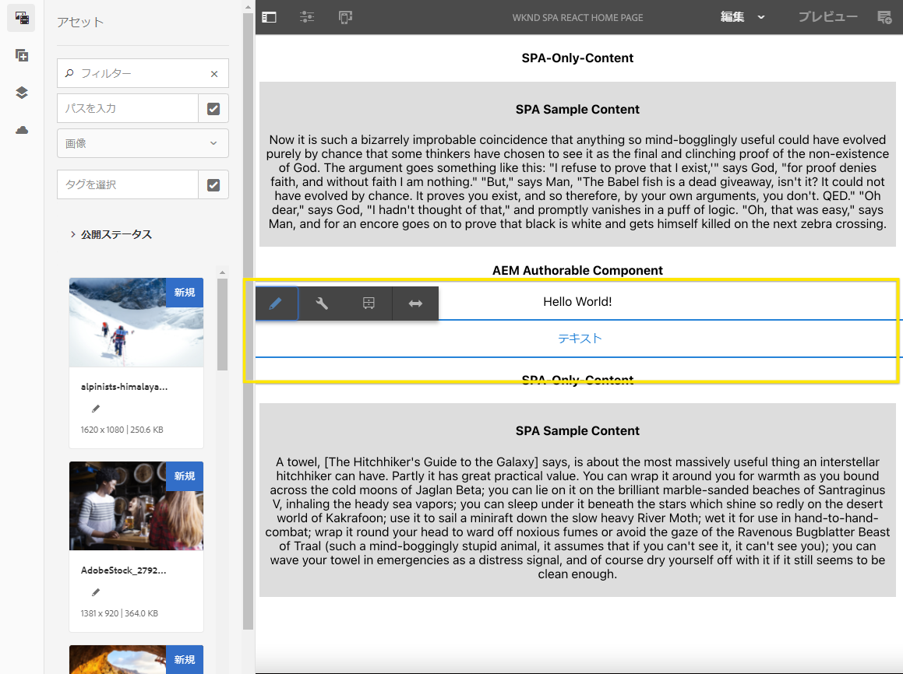
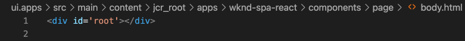

# AEM 内での外部 SPA の編集 {#editing-external-spa-within-aem}

外部 SPA と AEM の間で[どのレベルの統合](/help/implementing/developing/headful-headless.md)をおこなうかを決める際に、AEM 内で SPA を表示するだけでなく、編集も必要になることがあります。

## 概要 {#overview}

このドキュメントでは、スタンドアロン SPA を AEM インスタンスにアップロードし、編集可能なコンテンツのセクションを追加し、オーサリングを有効にするための推奨手順について説明します。

## 前提条件 {#prerequisites}

前提条件はシンプルです。

* AEM のインスタンスがローカルで実行されていることを確認します。
* [AEM プロジェクトのアーキタイプ](https://experienceleague.adobe.com/docs/experience-manager-core-components/using/developing/archetype/overview.html?lang=ja?#available-properties)を使用して、基本 AEM SPA プロジェクトを作成します。
   * これは AEM プロジェクトの基盤となり、外部 SPA を含むように更新されます。
   * このドキュメントの例では、[WKND SPA プロジェクト](https://experienceleague.adobe.com/docs/experience-manager-learn/sites/spa-editor/spa-editor-framework-feature-video-use.html?lang=ja#spa-editor)の開始点を使用しています。
* 統合したい外部の React SPA を用意します。

## SPA を AEM プロジェクトにアップロードする {#upload-spa-to-aem-project}

まず、外部 SPA を AEM プロジェクトにアップロードする必要があります。

1. `/ui.frontend` プロジェクトフォルダー内の `src` を、React アプリケーションの `src` フォルダーに置き換えます。
1. アプリの `package.json` に追加の依存関係があれば `/ui.frontend/package.json` に含めます。
   * SPA SDK の依存関係が[推奨バージョン](/help/implementing/developing/hybrid/getting-started-react.md#dependencies)であることを確認します。
1. `/public` フォルダーにカスタマイズを含めます。
1. 追加されたインラインスクリプトまたはスタイルをすべて `/public/index.html` ファイルに含めます。

## リモート SPA を設定する {#configure-remote-spa}

これで外部 SPA が AEM プロジェクトの一部になったので、AEM 内で設定する必要があります。

### Adobe SPA SDK パッケージを含める {#include-spa-sdk-packages}

AEM SPA 機能の利用は、次の 3 つのパッケージに依存しています。

* [`@adobe/aem-react-editable-components`](https://github.com/adobe/aem-react-editable-components)
* [`@adobe/aem-spa-component-mapping`](https://www.npmjs.com/package/@adobe/aem-spa-component-mapping)
* [`@adobe/aem-spa-page-model-manager`](https://www.npmjs.com/package/@adobe/aem-spa-model-manager)

`@adobe/aem-spa-page-model-manager` は、Model Manager を初期化し、AEM インスタンスからモデルを取得する API を提供します。その後、このモデルを使用して、`@adobe/aem-react-editable-components` と `@adobe/aem-spa-component-mapping` の API を使用して AEM コンポーネントをレンダリングできます。

#### インストール {#installation}

次の npm コマンドを実行して、必要なパッケージをインストールします。

```shell
npm install --save @adobe/aem-spa-component-mapping @adobe/aem-spa-page-model-manager @adobe/aem-react-editable-components
```

### ModelManager の初期化 {#model-manager-initialization}

アプリケーションがレンダリングされる前に、 [`ModelManager`](/help/implementing/developing/hybrid/blueprint.md#pagemodelmanager) を初期化して AEM `ModelStore` の作成を処理する必要があります。

これは、アプリケーションの `src/index.js` ファイル内、またはアプリケーションのルートがレンダリングされる場所でおこなう必要があります。

このためには、`ModelManager` が提供する `initializationAsync` API を使用できます。

次のスクリーンショットは、単純な React アプリケーションで `ModelManager` の初期化を有効にする方法を示しています。唯一の制約は、`initializationAsync` を `ReactDOM.render()` の前に呼び出す必要があることです。


この例では、`ModelManager` が初期化され、空の `ModelStore` が作成されます。

`initializationAsync` は、必要に応じて、 `options` オブジェクトをパラメーターとして受け入れることができます。

* `path` - 初期化時に、定義されたパスのモデルが取得され、`ModelStore` に保存されます。これは、必要に応じて初期化時に `rootModel` を取得するのに使用できます。
* `modelClient` - モデルの取得を担当するカスタムクライアントを提供できます。
* `model` - 通常、[SSR を使用](/help/implementing/developing/hybrid/ssr.md)する場合に入力されるパラメーターとして渡される `model` オブジェクト。

### AEM 認証可能なリーフコンポーネント {#authorable-leaf-components}

1. 認証可能な React コンポーネントが作成される AEM コンポーネントを作成または識別します。この例では、WKND プロジェクトのテキストコンポーネントを使用しています。

   

1. SPA で単純な React テキストコンポーネントを作成します。この例では、次の内容の新しいファイル `Text.js` が作成されています。

   

1. AEM の編集を有効にするために必要な属性を指定する設定オブジェクトを作成します。

   

   * `resourceType` は、React コンポーネントを AEM コンポーネントにマップし、AEM エディターで開いたときに編集を有効にする場合に必須です。

1. ラッパー関数 `withMappable` を使用します。

   

   このラッパー関数は、React コンポーネントを config で指定された AEM `resourceType` にマッピングし、AEM エディターで開いたときの編集機能を有効にします。スタンドアロンコンポーネントの場合は、特定のノードのモデルコンテンツも取得されます。

   >[!NOTE]
   >
   >この例では、コンポーネントに異なるバージョン（AEM でラップされた React コンポーネントとアンラップされていないコンポーネント）があります。コンポーネントを明示的に使用する場合は、ラップされたバージョンを使用する必要があります。コンポーネントがページの一部になっている場合は、SPA エディターでおこなったとおりに、デフォルトのコンポーネントを使用し続けることができます。

1. コンポーネント内のコンテンツをレンダリングします。

   テキストコンポーネントの JCR プロパティは、AEM では次のように表示されます。

   

   これらの値は、新しく作成された `AEMText` React コンポーネントにプロパティとして渡され、コンテンツのレンダリングに使用できます。

   ```javascript
   import React from 'react';
   import { withMappable } from '@adobe/aem-react-editable-components';
   
   export const TextEditConfig = {
       // Empty component placeholder label
       emptyLabel:'Text', 
       isEmpty:function(props) {
          return !props || !props.text || props.text.trim().length < 1;
       },
       // resourcetype of the AEM counterpart component
       resourceType:'wknd-spa-react/components/text'
   };
   
   const Text = ({ text }) => (<div>{text}</div>);
   
   export default Text;
   
   export const AEMText = withMappable(Text, TextEditConfig);
   ```

   AEM の設定が完了すると、このようにコンポーネントが表示されます。

   ```javascript
   const Text = ({ cqPath, richText, text }) => {
      const richTextContent = () => (
         <div className="aem_text" id={cqPath.substr(cqPath.lastIndexOf('/') + 1)} data-rte-editelement dangerouslySetInnerHTML={{__html: text}}/>
      );
      return richText ? richTextContent() : (<div className="aem_text">{text}</div>);
   };
   ```

   >[!NOTE]
   >
   >この例では、既存のテキストコンポーネントに合わせて、レンダリングされたコンポーネントをさらにカスタマイズしました。ただし、これは AEM でのオーサリングとは関係ありません。

#### 認証可能コンポーネントをページに追加する {#add-authorable-component-to-page}

認証可能な React コンポーネントが作成されたら、アプリケーション全体で使用できます。

WKND SPA プロジェクトからテキストを追加する必要があるページの例を見てみましょう。この例では、「Hello World!」というテキストを`/content/wknd-spa-react/us/en/home.html` に表示します。

1. 表示するノードのパスを指定します。

   * `pagePath`：ノードを含むページ（この例では `/content/wknd-spa-react/us/en/home`）
   * `itemPath`：ページ内のノードへのパス（この例では `root/responsivegrid/text`）
      * これは、ページに含まれる項目の名前で構成されます。

   

1. コンポーネントをページ内の必要な位置に追加します。

   

   `AEMText`コンポーネントは、`pagePath` 値と `itemPath` 値をプロパティとして設定して、ページ内の必要な位置に追加できます。`pagePath` は必須プロパティです。

#### AEM でのテキストコンテンツの編集の確認 {#verify-text-edit}

これで、実行中の AEM インスタンスでコンポーネントをテストできます。

1. `aem-guides-wknd-spa` ディレクトリから次の Maven コマンドを実行し、プロジェクトを構築して AEM にデプロイします。

```shell
mvn clean install -PautoInstallSinglePackage
```

1. AEM インスタンスで、`http://<host>:<port>/editor.html/content/wknd-spa-react/us/en/home.html`に移動します。



`AEMText` コンポーネントが、AEM 上で認証できるようになりました。

### AEM 認証可能なページ {#aem-authorable-pages}

1. SPA でのオーサリング用に追加するページを指定します。この例では `/content/wknd-spa-react/us/en/home.html` を使用しています。
1. 新しいファイル（`Page.js`）を認証可能なページコンポーネントに置き換えます。ここでは、`@adobe/cq-react-editable-components` で提供されるページコンポーネントを再利用できます。
1. [ AEM 認証可能なリーフコンポーネントのセクションで手順 4 を繰り返します。](#authorable-leaf-components) コンポーネントで `withMappable` ラッパー関数を使用します。
1. 前に行ったように、ページ内のすべての子コンポーネントの AEM リソースタイプに `MapTo` を適用します。

   ```javascript
   import { Page, MapTo, withMappable } from '@adobe/aem-react-editable-components';
   import Text, { TextEditConfig } from './Text';
   
   export default withMappable(Page);
   
   MapTo('wknd-spa-react/components/text')(Text, TextEditConfig);
   ```

   >[!NOTE]
   >
   >この例では、前に作成したラップされた `AEMText` を含める代わりに、ラップされていない React テキストコンポーネントを使用しています。これは、コンポーネントがページ／コンテナの一部であってスタンドアローンではない場合、コンテナがコンポーネントのマッピングを再帰的におこない、オーサリング機能を有効にし、子ごとに追加のラッパーを必要としないためです。

1. SPA で認証可能なページを追加するには、「[認証可能なコンポーネントをページに追加](#add-authorable-component-to-page)」節を同じ手順に従います。 ただし、ここでは、`itemPath` プロパティをスキップできます。

#### AEM でのページコンテンツの確認 {#verify-page-content}

ページが編集可能であることを確認するには、「[AEM でのテキストコンテンツの編集の確認](#verify-text-edit)」節と同じ手順に従います。



レイアウトコンテナと子テキストコンポーネントを持つ AEM でページを編集できるようになりました。

### 仮想リーフコンポーネント {#virtual-leaf-components}

前の例では、既存の AEM コンテンツを持つ SPA にコンポーネントを追加しました。一方で、AEM でコンテンツは未作成だが、コンテンツの作成者が後から追加する必要がある場合もあります。これに対応するために、フロントエンド開発者は SPA 内の適切な場所にコンポーネントを追加できます。これらのコンポーネントは、AEM のエディターで開くとプレースホルダーを表示します。コンテンツの作成者がこれらのプレースホルダー内にコンテンツを追加すると、ノードが JCR 構造に作成され、コンテンツが保持されます。作成したコンポーネントでは、スタンドアロンのリーフコンポーネントと同じ操作のセットを使用できます。

この例では、以前に作成した `AEMText` コンポーネントを再利用しています。WKND ホームページの既存のテキストコンポーネントの下に新しいテキストを追加します。コンポーネントの追加は、通常のリーフコンポーネントの場合と同じです。ただし、`itemPath` は、新しいコンポーネントを追加する必要があるパスに更新できます。

新しいコンポーネントは、`root/responsivegrid/text` にある既存のテキストの下に追加する必要があるので、新しいパスは `root/responsivegrid/{itemName}` になります。

```html
<AEMText
 pagePath='/content/wknd-spa-react/us/en/home'
 itemPath='root/responsivegrid/text_20' />
```

`TestPage` コンポーネントは、仮想コンポーネントを追加すると次のようになります。


>[!NOTE]
>
>この機能を有効にするには、`AEMText` コンポーネントの `resourceType` が構成内に設定されていることを確認します。

「[AEM でのテキストコンテンツの編集の確認](#verify-text-edit)」節の手順に従って、AEM に変更をデプロイできるようになりました。現在は存在しない `text_20` ノードに対してプレースホルダーが表示されます。



コンテンツ作成者がこのコンポーネントを更新すると、新しい `text_20` ノードが `/content/wknd-spa-react/us/en/home` の `root/responsivegrid/text_20` に作成されます。


#### 要件と制限 {#limitations}

仮想リーフコンポーネントを追加するための要件はいくつかあり、制限もいくつかあります。

* `pagePath` プロパティは、仮想コンポーネントを作成する場合に必須です。
* `pagePath` のパスに指定されたページノードは、AEM プロジェクト内に存在する必要があります。
* 作成するノードの名前は、`itemPath` で指定する必要があります。
* コンポーネントは任意のレベルで作成できます。
   * 前の例で `itemPath='text_20'` を提供すると、新しいノードはページのすぐ下（`/content/wknd-spa-react/us/en/home/jcr:content/text_20`）に作成されます。
* 新しいノードが作成されるノードへのパスは、`itemPath` 経由で提供された場合に有効である必要があります。
   * この例では、新しいノード `text_20` を作成できるように、`root/responsivegrid` が存在する必要があります。
* リーフコンポーネントの作成のみがサポートされます。仮想コンテナと仮想ページは、今後のバージョンでサポートされる予定です。

## 追加のカスタマイズ {#additional-customizations}

前の例に従った場合、外部 SPA は AEM 内で編集できるようになります。ただし、外部 SPA には、他にもカスタマイズできる要素があります。

### ルートノード ID {#root-node-id}

デフォルトでは、React アプリケーションが要素 ID `spa-root` の `div` 内でレンダリングされると想定しています。必要に応じて、これをカスタマイズできます。

例えば、要素 ID `root` の `div` 内部にアプリケーションがレンダリングされる SPA があるとします。これは、3 つのファイルに反映する必要があります。

1. React アプリケーションの `index.js` 内（または `ReactDOM.render()` が呼び出される場所）

   

1. React アプリケーションの `index.html` 内

   

1. AEM アプリケーションのページコンポーネント本体では、次の 2 つの手順に従います。

   1. ページコンポーネント用に新しい `body.html` を作成します。

   

   1. 新しい `body.html` ファイルの新しいルート要素を追加します。

   

### ルーティングを使用したリアクション SPA の編集 {#editing-react-spa-with-routing} 

外部 React SPA アプリケーションに複数のページがある場合、[レンダリングするページ／コンポーネントを決定する際にルーティングを使用できます。](/help/implementing/developing/hybrid/routing.md)基本的な使用例は、現在アクティブな URL とルートに指定されたパスを一致させることです。このようなルーティング対応アプリケーションでの編集を可能にするには、対応するパスを AEM 固有の情報に合わせて変換する必要があります。

次の例では、2 つのページを含む単純な React アプリケーションを示します。レンダリングするページは、ルーターに提供されるパスとアクティブな URL とを一致させることで決定されます。例えば、`mydomain.com/test` 上にある場合、`TestPage` がレンダリングされます。


この SPA の例で AEM 内での編集を有効にするには、次の手順が必要です。

1. AEM のルートとなるレベルを特定します。

   * この例では、wknd-spa-react/us/en を SPA のルートとしています。つまり、そのパスより前のものはすべて AEM のページ／コンテンツのみです。

1. 必要なレベルで新しいページを作成します。

   * この例では、編集するページは `mydomain.com/test` です。`test` がアプリのルートパスにあります。これは、AEM でページを作成する場合にも保持する必要があります。したがって、前の手順で定義したルートレベルで新しいページを作成できます。
   * 新しく作成するページは、編集するページと同じ名前にする必要があります。この `mydomain.com/test` の例では、新しく作成するページは `/path/to/aem/root/test` にする必要があります。

1. SPA ルーティング内のヘルパーを追加します。

   * 新しく作成されたページは、AEM では、まだ期待されたコンテンツをレンダリングしません。これは、ルーターが `/test` のパスを想定しているのに対し、AEM のアクティブパスは `/wknd-spa-react/us/en/test` であるからです。AEM 固有の URL 部分を受け入れるには、SPA 側にヘルパーを追加する必要があります。

   

   * `@adobe/cq-spa-page-model-manager` が提供する `toAEMPath` ヘルパーを使用できます。アプリケーションが AEM インスタンスで開かれる場合に、ルーティング用に指定されたパスを AEM 固有の部分を含めるように変換します。次のパラメーターを受け取ります。
      * ルーティングに必要なパス
      * SPA が編集される AEM インスタンスのオリジン URL
      * 最初の手順で決定した AEM のプロジェクトルート
   * これらの値は、環境変数として設定でき、より柔軟に設定できます。


1. AEM でのページの編集を確認します。

   * プロジェクトを AEM にデプロイし、新しく作成した `test` ページに移動します。これで、ページコンテンツがレンダリングされ、AEM コンポーネントが編集可能になります。

## その他のリソース {#additional-resources}

AEM のコンテキストで SPA を理解するには、次の参照資料が役立ちます。

* [AEM におけるヘッドフルとヘッドレス](/help/implementing/developing/headful-headless.md)
* [AEM プロジェクトのアーキタイプ](https://experienceleague.adobe.com/docs/experience-manager-core-components/using/developing/archetype/overview.html?lang=ja)
* [WKND SPA プロジェクト](https://experienceleague.adobe.com/docs/experience-manager-learn/sites/spa-editor/spa-editor-framework-feature-video-use.html?lang=ja)
* [React を使用した AEM での SPA の概要](/help/implementing/developing/hybrid/getting-started-react.md)
* [SPA リファレンス資料（API リファレンス）](/help/implementing/developing/hybrid/reference-materials.md)
* [SPA 青写真と PageModelManager](/help/implementing/developing/hybrid/blueprint.md#pagemodelmanager)
* [SPA モデルルーティング](/help/implementing/developing/hybrid/routing.md)
* [SPA およびサーバーサイドレンダリング](/help/implementing/developing/hybrid/ssr.md)
