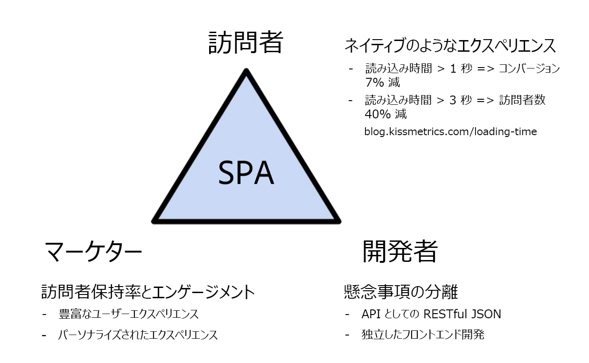
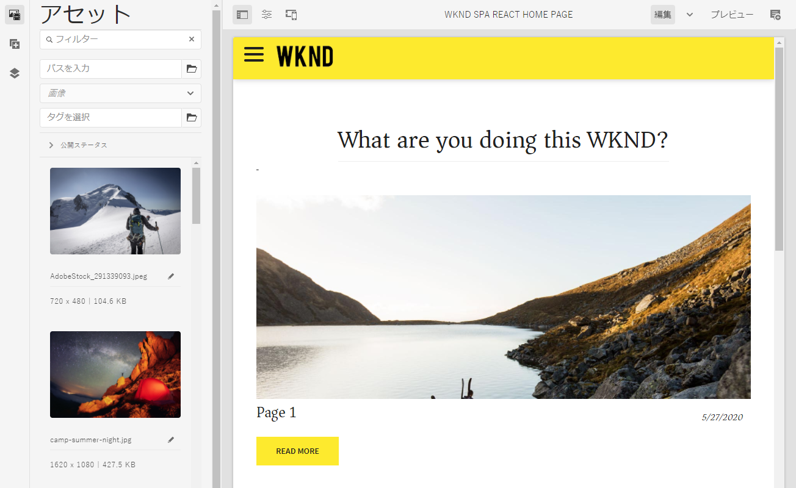
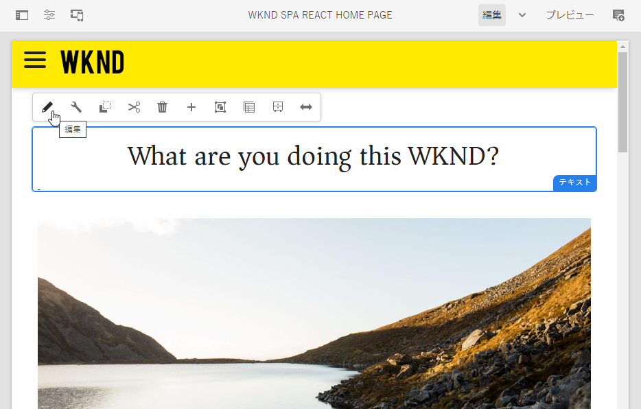
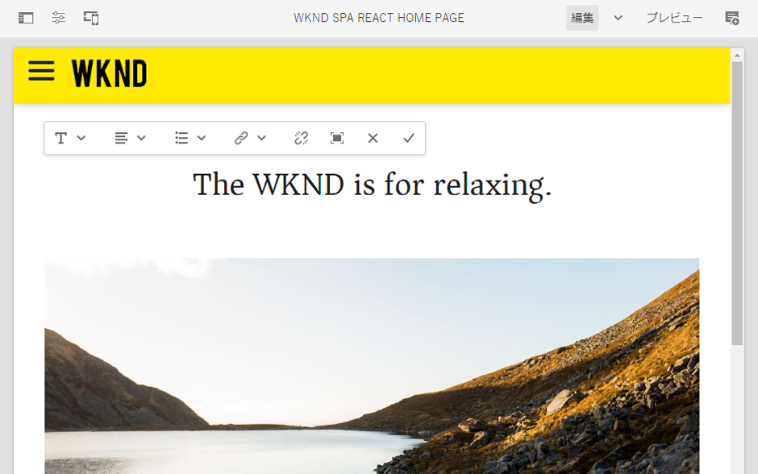
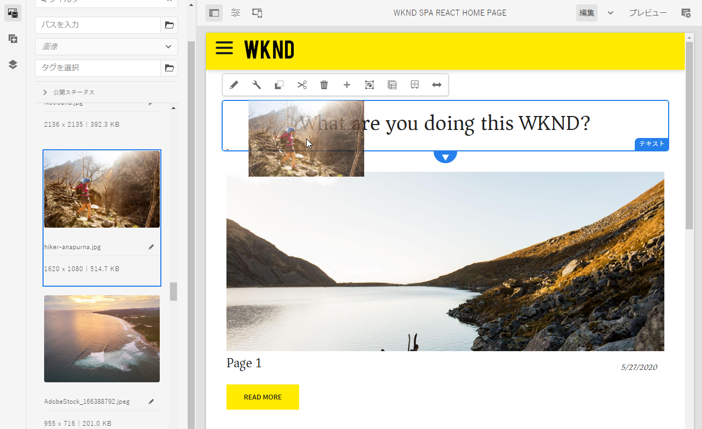
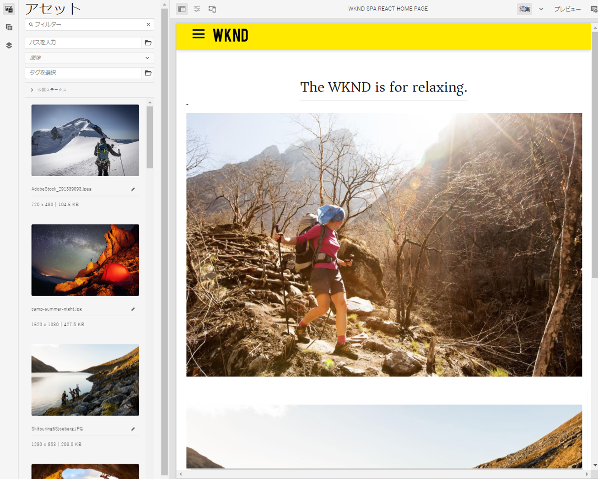
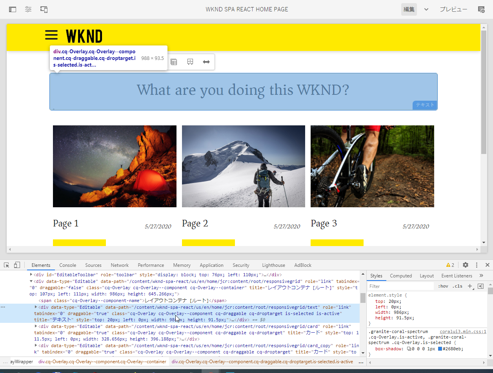

# SPA の概要およびガイド {#spa-introduction}

単一ページアプリケーション（SPA）により、Web サイトのユーザーに魅力的なエクスペリエンスを提供することができます。開発者は SPA フレームワークを使用してサイトを構築したいと考え、作成者はそうして構築されたサイトのコンテンツを AEM 内でシームレスに編集したいと考えています。

SPA エディターには、AEM 内で SPA をサポートするための包括的なソリューションが用意されています。この記事では、基本的な SPA アプリケーションを使用したオーサリングの手順を説明し、基礎となる AEM SPA エディターとの関連を示します。

## 概要 {#introduction}

### 記事の目的 {#article-objective}

この記事では、SPA エディターのガイドに進む前に、簡単な SPA アプリケーションを使用して基本的なコンテンツ編集のデモをおこなうことで、SPA の基本的な概念について説明します。次に、ページの構築、SPA アプリケーションと AEM SPA エディターとの関連とやり取りの仕組みについて説明します。

この概要とガイドの目標は、SPA が注目される理由、その一般的な動作、AEM エディターでの SPA の処理方法、標準の AEM アプリケーションとの違いを AEM 開発者に示すことです。

このガイドは、標準的な AEM 機能と、サンプルの WKND SPA Project アプリに基づいています。続行するには、[サンプルの WKND SPA Project アプリを GitHub からダウンロードしてインストール](https://github.com/adobe/aem-guides-wknd-spa)してください。

>[!CAUTION]
>
>このドキュメントでは、[WKND SPA Project アプリ](https://github.com/adobe/aem-guides-wknd-spa)をデモ目的でのみ使用します。どのプロジェクト作業にも使用しないでください。

>[!TIP]
>
>AEM プロジェクトでは、 [AEM プロジェクトアーキタイプ](https://docs.adobe.com/content/help/ja-JP/experience-manager-core-components/using/developing/archetype/overview.html)を活用します。このアーキタイプは、React または Angular を使用する SPA プロジェクトをサポートし、SPA SDK を活用します。

### SPA について {#what-is-a-spa}

単一ページアプリケーション（SPA）は、クライアントサイドでレンダリングされ、主に JavaScript 主導であり、Ajax 呼び出しに依存してデータを読み込み、ページを動的に更新する点で、従来のページとは異なります。ほぼすべてのコンテンツは、1 回のページ読み込みで 1 回取得され、ユーザーによるページとのやり取りに基づいて、必要に応じて追加のリソースが非同期に読み込まれます。

これにより、ページを更新する必要が減り、シームレスで高速な、ネイティブアプリのエクスペリエンスに近いものををユーザーに提供できます。

AEM SPA エディターを使用すると、フロントエンド開発者は AEM のサイトに統合できる SPA を作成でき、コンテンツ作成者は SPA コンテンツを他の AEM コンテンツと同様に簡単に編集できます。

### SPA が注目される理由 {#why-a-spa}

より速く、流動的で、よりネイティブアプリケーションに近い SPA は、Web ページの訪問者だけでなく、SPA の仕組みの性質上、マーケターや開発者にとっても非常に魅力的なエクスペリエンスとなります。



#### 訪問者数 {#visitors}

* 訪問者は、コンテンツとのやり取りでネイティブなエクスペリエンスを求めています。
* ページが速くなればなるほど、コンバージョンが発生する可能性が高いという明確なデータがあります。

#### マーケター {#marketers}

* マーケターは、リッチでネイティブに近いエクスペリエンスをオファーして、訪問者のコンテンツに対する十分なエンゲージを獲得したいと考えています。
* パーソナライゼーションは、これらのエクスペリエンスをさらに魅力的にします。

#### 開発者向け {#developers}

* 開発者は、コンテンツとプレゼンテーションの間の懸念事項を明確に分けておきたいと考えています。
* 明確に分離することにより、システムの拡張性が向上し、フロントエンドの独立開発も可能になります。

### SPA の仕組み {#how-does-a-spa-work}

SPA の背後にある主な考え方は、SPA がネイティブアプリケーションの応答性に近づくように、サーバーに起因する遅延を最小限に抑えるために、サーバーへの呼び出しと依存性を低減することです。

従来のシーケンシャルな Web ページでは、そのページに必要なデータのみが読み込まれます。つまり、訪問者が別のページに移動すると、サーバーが追加のリソースを呼び出します。訪問者がページ上の要素を操作する際に、追加の呼び出しが必要になる場合があります。これらの複数の呼び出しでは、ページが訪問者のリクエストに追いつく必要があるので、遅いという感覚を与える可能性があります。


訪問者がモバイルやネイティブアプリから期待する動作に近い、より流動的なエクスペリエンスを実現するために、SPA は、最初の読み込み時に訪問者に必要なすべてのデータを読み込みます。最初は少し時間がかかる場合がありますが、その後はサーバーコールを追加する必要はありません。

クライアントサイドでレンダリングすると、ページ要素の反応が速くなり、訪問者によるページとのやり取りが即時におこなわれます。ページの速度を最大化するために、必要になる可能性のある追加データはすべて非同期で呼び出されます。

>[!TIP]
>
>AEM での SPA の動作方法に関する技術的な詳細は、次の記事を参照してください。
>* [React を使用した AEM での SPA の概要](getting-started-react.md)
>* [Angular を使用した AEM での SPA の概要](getting-started-angular.md)

>
>
SPA エディターのデザイン、アーキテクチャ、技術的なワークフローについて詳しくは、次の記事を参照してください。
>* [SPA エディターの概要](editor-overview.md).


## SPA でのコンテンツ編集エクスペリエンス {#content-editing-experience-with-spa}

AEM SPA エディターを活用する SPA が構築されている場合、コンテンツ作成者はコンテンツの編集と作成の際に違いを認識しません。共通の AEM 機能を利用でき、作成者のワークフローに変更を加える必要はありません。

1. AEM で WKND SPA Project アプリを編集します。

   `http://localhost:4502/editor.html/content/wknd-spa-react/us/en/home.html`

   

1. テキストコンポーネントを選択すると、他のコンポーネントと同様にツールバーが表示されます。「**編集**」を選択します。

   

1. AEM 内でコンテンツを通常どおりに編集します。変更内容が保持されることに注意してください。

   

1. アセットブラウザーを使用して、新しい画像を画像コンポーネントにドラッグ＆ドロップします。

   

1. 変更が保持されます。

   

追加のコンポーネントをページにドラッグ＆ドロップしたり、コンポーネントを並べ替えたり、レイアウトを変更したりするなどのオーサリングツールは、SPA 以外のどの AEM アプリケーションでもサポートされます。

>[!NOTE]
>
>SPA エディターは、アプリケーションの DOM を変更しません。SPA 自体が DOM を管理します。
>
>この機能を確認するには、この記事の次の節、[SPA アプリと AEM SPA エディター](#spa-apps-and-the-aem-spa-editor)に進みます。

## SPA アプリと AEM SPA エディター {#spa-apps-and-the-aem-spa-editor}

エンドユーザーが SPA を動作させ、SPA ページを調査すると、SAP アプリが AEM の SPA エディターと連携する仕組みをより深く理解できます。

### SPA アプリケーションの使用 {#using-an-spa-application}

1. WKND SPA Project アプリを公開サーバーで読み込むか、ページエディターの&#x200B;**ページ情報**&#x200B;メニューから「**公開済みとして表示**」オプションを使用して読み込みます。

   `http://<host>:<port>/content/wknd-spa-react/us/en/home.html`

   

   子ページへのナビゲーション、メニュー、記事カードなど、ページ構造をメモしておきます。

1. メニューを使用して子ページに移動し、ページが読み込まれるのを確認します。更新は必要ありません。

   

1. ブラウザーに組み込まれている開発者ツールを開き、子ページを移動しながらネットワークアクティビティを監視します。

   

   アプリ内でページ間を移動する際のトラフィック量は非常に少なくなります。ページのリロードはおこなわれず、新しい画像のみが要求されます。

   SPA はコンテンツとルーティングを完全にクライアントサイドで管理します。

子ページをナビゲートする際にページがリロードされないとすると、どのように読み込まれるのでしょうか。

次の節 [SPA アプリケーションの読み込み](#loading-a-spa-application)では、SPA の読み込みの仕組みと、コンテンツの同期および非同の読み込み方法を詳しく説明します。

### SPA アプリケーションの読み込み {#loading-a-spa-application}

1. まだ読み込まれていない場合は、WKND SPA Projectアプリをパブリッシュサーバーに読み込むか、ページエディターの&#x200B;**ページ情報**&#x200B;メニューから&#x200B;**表示を発行済み**&#x200B;として読み込みます。

   `http://<host>:<port>/content/wknd-spa-react/us/en/home.html`

   

1. ブラウザーの組み込みツールを使用して、ページのソースを表示します。
1. ソースのコンテンツは制限されます。

   ```html
    <!DOCTYPE html>
    <html lang="en">
    <head>
        <meta charset="UTF-8"/>
        <title>WKND SPA React Home Page</title>
   
        <meta name="template" content="spa-page-template"/>
        <meta name="viewport" content="width=device-width, initial-scale=1"/>
   
    <link rel="stylesheet" href="/etc.clientlibs/wknd-spa-react/clientlibs/clientlib-base.min.css" type="text/css">
   
    <meta name="theme-color" content="#000000"/>
    <link rel="icon" href="/etc.clientlibs/wknd-spa-react/clientlibs/clientlib-react/resources/favicon.ico"/>
    <link rel="apple-touch-icon" href="/etc.clientlibs/wknd-spa-react/clientlibs/clientlib-react/resources/logo192.png"/>
    <link rel="manifest" href="/etc.clientlibs/wknd-spa-react/clientlibs/clientlib-react/resources/manifest.json"/>
   
    <!-- AEM page model -->
    <meta property="cq:pagemodel_root_url" content="/content/wknd-spa-react/us/en.model.json"/>
    <link href="//fonts.googleapis.com/css?family=Source+Sans+Pro:400,600|Asar&display=swap" rel="stylesheet"/>
    <meta property="cq:datatype" content="JSON"/>
    <meta property="cq:wcmmode" content="edit"/>
   
    <link rel="stylesheet" href="/libs/cq/gui/components/authoring/editors/clientlibs/internal/page.min.css" type="text/css">
    <link rel="stylesheet" href="/etc.clientlibs/wcm/foundation/clientlibs/main.min.css" type="text/css">
    <script type="text/javascript" src="/libs/cq/gui/components/authoring/editors/clientlibs/internal/messaging.min.js"></script>
    <script type="text/javascript" src="/libs/cq/gui/components/authoring/editors/clientlibs/utils.min.js"></script>
    <script type="text/javascript" src="/libs/granite/author/deviceemulator/clientlibs.min.js"></script>
    <script type="text/javascript" src="/libs/cq/gui/components/authoring/editors/clientlibs/internal/page.min.js"></script>
    <script type="text/javascript" src="/etc.clientlibs/wcm/foundation/clientlibs/main.min.js"></script>
    <script type="text/javascript" src="/etc.clientlibs/clientlibs/granite/jquery.min.js"></script>
    <script type="text/javascript" src="/etc.clientlibs/clientlibs/granite/utils.min.js"></script>
    <script type="text/javascript" src="/etc.clientlibs/clientlibs/granite/jquery/granite.min.js"></script>
    <script type="text/javascript" src="/etc.clientlibs/foundation/clientlibs/jquery.min.js"></script>
    <script type="text/javascript" src="/etc.clientlibs/foundation/clientlibs/shared.min.js"></script>
   
    <!--cq{"decorated":false,"type":"cq/cloudconfig/components/scripttags/header","path":"/content/wknd-spa-react/us/en/home/jcr:content/cloudconfig-header","structurePath":"/content/wknd-spa-react/us/en/home/jcr:content/cloudconfig-header","selectors":null,"servlet":"Script /libs/cq/cloudconfig/components/scripttags/header/header.html","totalTime":2,"selfTime":2}-->
   
    <link rel="stylesheet" href="/etc.clientlibs/wknd-spa-react/clientlibs/clientlib-react.min.css" type="text/css">
   
    </head>
   
    <body class="page basicpage">
        <noscript>You need to enable JavaScript to run this app.</noscript>
    <div id="spa-root"></div>
   
    <script type="text/javascript" src="/etc.clientlibs/wknd-spa-react/clientlibs/clientlib-react.min.js"></script>
   
    <script type="text/javascript" src="/etc.clientlibs/core/wcm/components/commons/site/clientlibs/container.min.js"></script>
    <script type="text/javascript" src="/etc.clientlibs/wknd-spa-react/clientlibs/clientlib-base.min.js"></script>
   
    <script type="text/javascript" src="/libs/cq/gui/components/authoring/editors/clientlibs/internal/pagemodel/messaging.min.js"></script>
   
    <link rel="stylesheet" href="/etc.clientlibs/wknd-spa-react/clientlibs/clientlib-author.min.css" type="text/css">
   
    <!--cq{"decorated":true,"type":"cq/cloudserviceconfigs/components/servicecomponents","path":"/content/wknd-spa-react/us/en/home/jcr:content/cloudservices","selectors":null,"servlet":"Script /libs/cq/cloudserviceconfigs/components/servicecomponents/servicecomponents.jsp","totalTime":2,"selfTime":2}-->
   
    <!--cq{"decorated":false,"type":"cq/cloudconfig/components/scripttags/footer","path":"/content/wknd-spa-react/us/en/home/jcr:content/cloudconfig-footer","structurePath":"/content/wknd-spa-react/us/en/home/jcr:content/cloudconfig-footer","selectors":null,"servlet":"Script /libs/cq/cloudconfig/components/scripttags/footer/footer.html","totalTime":2,"selfTime":2}-->
   
    </body>
    </html>
    <!--cq{"decorated":false,"type":"wknd-spa-react/components/page","path":"/content/wknd-spa-react/us/en/home/jcr:content","selectors":null,"servlet":"Script /apps/spa-project-core/components/page/page.html","totalTime":39,"selfTime":33}-->
   ```

   ページの本文にはコンテンツが含まれていません。ページは主に、スタイルシートと、`clientlib-react.min.js` などの様々なスクリプトの呼び出しで構成されます。

   これらのスクリプトは、このアプリケーションのプライマリドライバーであり、すべてのコンテンツのレンダリングを担当します。

1. ブラウザーに組み込まれているツールを使用して、ページを調べます。完全に読み込まれた DOM のコンテンツを表示します。

   

1. インスペクターの「ネットワーク」タブに切り替えて、ページを再読み込みします。

   イメージリクエストを無視した場合、ページに対して読み込まれるプライマリリソースは、ページ、CSS、React Javascript、その依存関係、およびページの JSON データです。

   

1. `home.model.json` を新しいタブに読み込みます。

   `http://<host>:<port>/content/wknd-spa-react/us/en/home.model.json`

   

   AEM SPA エディターは、[AEM コンテンツサービス](/help/assets/content-fragments/content-fragments.md)を利用して、ページのコンテンツ全体を JSON モデルとして配信します。

   特定のインターフェイスを実装することで、Sling Model は SPA に必要な情報を提供します。JSON データの配信は、各コンポーネント（ページから段落、コンポーネントなど）に下方向に委任されます。

   各コンポーネントは、表示内容とレンダリング方法を選択します（HTL を使用するサーバーサイド、または React や Angular を使用するクライアントサイド）。この記事では、React を使用したクライアントサイドのレンダリングについて説明します。

1. このモデルでは、ページを同期して読み込むように複数のページをグループ化できるので、必要なページ再読み込み数を減らせます。

   WKND SPAプロジェクトアプリの例では、訪問者は一般的にこれらのすべてのページを訪問するので、`home`、`page-1`、`page-2`、`page-3`の各ページは同期的に読み込まれます。

   この動作は必須ではなく、完全に定義可能です。

   

1. この動作の違いを表示するには、`home` ページを再読み込みし、インスペクターのネットワークアクティビティをクリアします。ページメニューの `page-1` に移動し、`page-1` のイメージのリクエストが唯一のネットワークアクティビティであることを確認します。`page-1` 自体は読み込む必要はありません。

   

### SPA エディターとのインタラクション {#interaction-with-the-spa-editor}

サンプルの WKND SPA Project アプリケーションを使用すると、JSON コンテンツ配信のコンテンツサービスやリソースの非同期読み込みを活用し、アプリケーションの動作と公開時の読み込み方法が明確になります。

また、コンテンツ作成者は、SPA エディターを使用したコンテンツを AEM 内でシームレスに作成できます。

次の節では、SPA エディターが SPA 内のコンポーネントを AEM コンポーネントに関連付け、このシームレスな編集操作を実現できるようにする契約を検討します。

1. エディターで WKND SPA Project アプリケーションを読み込み、**プレビュー**&#x200B;モードに切り替えます。

   `http://<host>:<port>/editor.html/content/wknd-spa-react/us/en/home.html`

1. ブラウザーに組み込まれている開発者ツールを使用して、ページのコンテンツを調べます。選択ツールを使用して、ページ上の編集可能なコンポーネントを選択し、表示の詳細を要素に選択します。

   コンポーネントには新しいデータ属性 `data-cq-data-path` があります。

   

   例：

   `data-cq-data-path="/content/wknd-spa-react/us/en/home/jcr:content/root/responsivegrid/text`

   このパスは、各コンポーネントの編集コンテキスト設定オブジェクトの取得と関連付けを可能にします。

   これは、SPA 内の編集可能なコンポーネントとして、エディターが認識するために必要なマークアップ属性です。この属性に基づいて、SPA エディターは、どの編集可能な設定がコンポーネントに関連付けられているかを判断し、正しいフレームやツールバーなどが読み込まれます。

   また、プレースホルダのマーキングやアセットのドラッグ＆ドロップ機能用に、いくつかの特定のクラス名が追加されています。

   >[!NOTE]
   >
   >この動作は、編集可能な各コンポーネントに `cq` 要素が挿入される AEM のサーバーサイドレンダリングページとは異なります。
   >
   >SPA エディターのこの手法により、カスタム要素を挿入する必要がなくなり、依存するのは追加のデータ属性のみなので、フロントエンド開発者にとってマークアップが簡単になります。

## 次の手順 {#next-steps}

AEM での SPA の編集エクスペリエンスと、SPA と SPA エディターとの関係を理解したら、SPA の構築方法を深く掘り下げます。

* [React を使用した AEM での SPA の概要](getting-started-react.md)では、SPA エディターで動作する基本的な SPA の構築方法を示しています
* [Angular を使用した AEM での SPA の概要](getting-started-angular.md)では、Angular を使用して SPA エディターで動作する基本的な SPA の構築方法を示しています
* 「[SPA エディターの概要](editor-overview.md)」では、AEM と SPA 間の通信モデルをより深く分析しています。
* [AEM 向け SPA の開発](developing.md)では、フロントエンド開発者を AEM 向け SPA の開発に関与させる方法、および SPA と AEM アーキテクチャとのやり取りについて説明しています。
